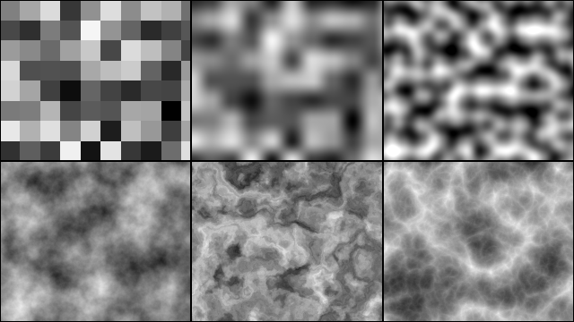
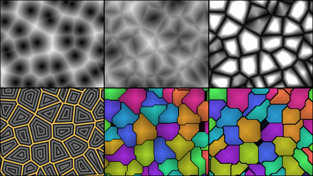
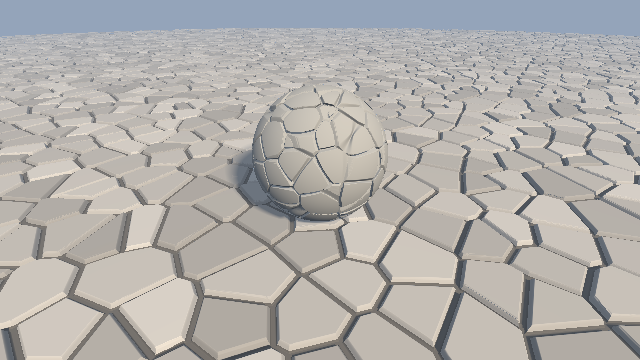
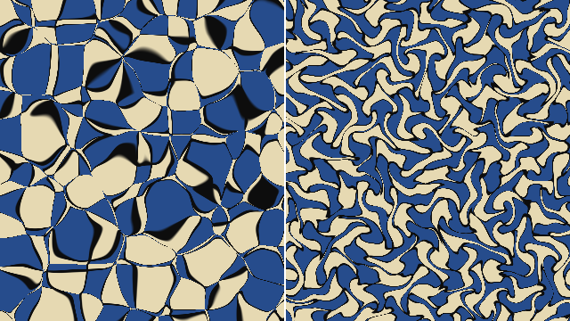
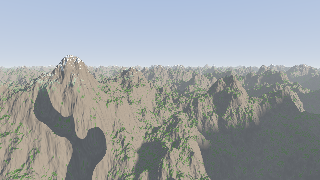
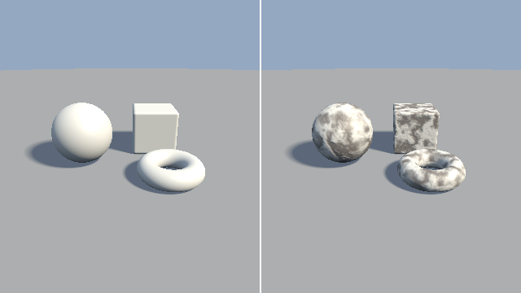
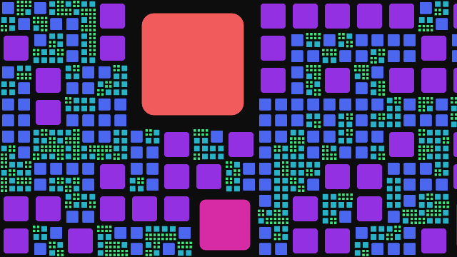

########################################################
第 10 章 ハッシュとノイズ
########################################################

本編で扱った形状は、いずれも数式で表せる規則的な形状であった。岩肌、地形、雲のような自然物を表すには、不規則でありながら滑らかに変化する値が必要になる。この章では、その基礎となるハッシュ関数とノイズ関数を説明し、ノイズを使って地形をレイマーチングで描く。ここで作るハッシュとノイズは、第 16 章のボリュームレンダリングと第 17 章のパストレーシングでも使う。

   10_noise2d.frag の実行結果。上段は左からハッシュ、値ノイズ、勾配ノイズ、下段は左から fBm、ドメインワーピング、リッジノイズである。

.. rst-class:: example-links

:download:`10_noise2d.frag をダウンロード <../examples/shaders/10_noise2d.frag>` ｜ `ブラウザで実行 <demos/10_noise2d.html>`__

ハッシュ関数
============

GPU での乱数
------------

CPU のプログラムでは、乱数生成器が内部の状態を更新しながら乱数の列を作る。フラグメントシェーダーでは、各ピクセルが独立に並列実行され、ピクセル間で状態を共有できないため、この方法をそのまま使えない。そこで、座標などの入力から乱数のように見える値を計算する関数を使う。この関数を :term:`ハッシュ関数` と呼ぶ。

ハッシュ関数は、同じ入力に対して常に同じ値を返し、入力がわずかに違うだけで出力が大きく変わる。例えば整数の格子点を入力とすれば、格子ごとに無関係な値を割り当てられる。上の図の左上は、各格子に割り当てた値をそのまま明るさとして表示したものである。

sin を使うハッシュの問題点
--------------------------

シェーダーのサンプルでは、次のような 1 行のハッシュ関数がよく使われている。

.. code-block:: glsl
   :linenos:

   // よく見かけるが、推奨しないハッシュ関数
   float hashSin(vec2 p)
   {
       return fract(sin(dot(p, vec2(12.9898, 78.233))) * 43758.5453);
   }

この関数は、``sin`` の値を大きな数で拡大し、小数部だけを取り出すことで、入力の小さな変化を大きな変化に変えている。短く書けるが、次の問題がある。

* GLSL の仕様では、``sin`` の精度が規定されていない。引数が大きくなると GPU ごとに結果が異なり、特定の GPU で縞模様や規則的なパターンが現れることがある。
* 小数部を取り出す前の値が 32 ビット浮動小数点数の精度を使い切っているため、入力の範囲によっては値の分布が偏る。

整数ハッシュ
------------

GLSL ES 3.00 では、32 ビットの符号なし整数 ``uint`` を使える。``uint`` の演算は :math:`2^{32}` を法とする剰余演算として仕様で定められているため、どの GPU でも同じ結果になる。本資料では、GPU 向けに設計された PCG ハッシュ（Jarzynski and Olano, 2020）を使う。

.. literalinclude:: ../examples/shaders/10_noise2d.frag
   :language: glsl
   :linenos:
   :lineno-match:
   :lines: {glsl:10_noise2d.frag:pcgHash..hash21}
   :caption: 10_noise2d.frag（抜粋）

``pcgHash`` は、線形合同法で 1 回状態を進めてから、ビットシフトと排他的論理和で上位と下位のビットを混ぜ合わせる。2 次元の格子点に対しては、一方の座標のハッシュ値にもう一方の座標を加えて、もう一度ハッシュ関数に通す。最後に :math:`2^{32}` で割り、0 以上 1 未満の浮動小数点数にする。負の座標は ``ivec2`` から ``uvec2`` に変換すると 2 の補数表現のまま符号なし整数として扱われるので、原点をまたいでも問題なく使える。

ハッシュとノイズの違い
----------------------

ハッシュ関数の値は、隣り合う格子点の間でも無関係に変化する。このような値の並びを白色ノイズと呼ぶ。白色ノイズは、ピクセルごとの乱数（第 16 章のジッター、第 17 章のサンプリング）には適しているが、自然物の形状には使えない。自然物の表面は、近い点ほど似た値をとり、離れるにつれて無関係になる。この性質を持つ関数を作るのが、次に説明するノイズ関数である。

値ノイズ
========

最も簡単なノイズ関数は、格子点にハッシュ関数で値を割り当て、その間を補間するものである。これを値ノイズと呼ぶ。点 :math:`\mathbf{p}` を含む格子の左下の点を :math:`\mathbf{i} = \lfloor \mathbf{p} \rfloor`、格子内の位置を :math:`\mathbf{f} = \mathbf{p} - \mathbf{i}` とすると、2 次元の値ノイズは 4 つの格子点の値 :math:`a, b, c, d` の双線形補間で表される。

.. math::

   n(\mathbf{p}) = \operatorname{mix}\bigl(\operatorname{mix}(a, b, u_x),\ \operatorname{mix}(c, d, u_x),\ u_y\bigr)

補間の係数 :math:`\mathbf{u}` に :math:`\mathbf{f}` をそのまま使うと、格子の境界で傾きが不連続になり、格子の形が目立つ。そこで、:math:`\mathbf{f}` を次の多項式で変換してから使う。

.. list-table::
   :header-rows: 1
   :widths: 25 35 40

   * - 補間
     - 式
     - 格子の境界での連続性
   * - 3 次のエルミート補間
     - :math:`u = 3f^2 - 2f^3`
     - 1 階微分まで連続。``smoothstep`` と同じ式である。
   * - 5 次の補間
     - :math:`u = 6f^5 - 15f^4 + 10f^3`
     - 2 階微分まで連続

ノイズで形状を変形させると、ノイズの 1 階微分が法線に、2 階微分が法線の変化（陰影の変化）に現れる。3 次の補間では 2 階微分が格子の境界で不連続になり、陰影に格子の線が見えることがある。陰影を付ける用途では 5 次の補間を使うとよい。

.. literalinclude:: ../examples/shaders/10_noise2d.frag
   :language: glsl
   :linenos:
   :lineno-match:
   :lines: {glsl:10_noise2d.frag:valueNoise}
   :caption: 10_noise2d.frag（抜粋）

値ノイズは計算が軽いが、値の山と谷が格子点に揃うため、格子の構造が見えやすい（図の上段中央）。

勾配ノイズ
==========

Perlin（1985）は、格子点に値ではなく、ランダムな向きの単位ベクトルである勾配 :math:`\mathbf{g}` を割り当てる方法を考案した。これを勾配ノイズ、または Perlin ノイズと呼ぶ。各格子点 :math:`\mathbf{i}_k` の寄与は、勾配と「格子点から :math:`\mathbf{p}` へのベクトル」の内積で与える。

.. math::

   w_k = \mathbf{g}(\mathbf{i}_k) \cdot (\mathbf{p} - \mathbf{i}_k)

これらを値ノイズと同じく補間したものが勾配ノイズである。各格子点では寄与が 0 になり、勾配の向きに値が増加する。そのため値の山と谷が格子点からずれ、値ノイズより格子の構造が目立たない（図の上段右）。2 次元の勾配ノイズの値は、およそ :math:`-0.7` 〜 :math:`0.7` （:math:`\pm\sqrt{2}/2`）の範囲をとる。

.. literalinclude:: ../examples/shaders/10_noise2d.frag
   :language: glsl
   :linenos:
   :lineno-match:
   :lines: {glsl:10_noise2d.frag:gradientAt..gradientNoise}
   :caption: 10_noise2d.frag（抜粋）

Perlin は後に、補間を 5 次の多項式に変えるなどの改良を発表した（Perlin, 2002）。サンプルの補間もこれに従っている。勾配を格子点ごとに角度で決めているのは簡単のためで、Perlin の実装では、あらかじめ用意した少数の方向から選ぶことで計算を軽くしている。

勾配ノイズの改良として、:term:`シンプレックスノイズ` もよく使われる（Perlin, 2001）。正方形（3 次元では立方体）の格子の代わりに、三角形（3 次元では四面体）を敷き詰めた格子を使い、各点で寄与を計算する格子点の数を、:math:`n` 次元で :math:`2^n` 個から :math:`n + 1` 個に減らしたものである。高い次元ほど計算量の差が大きく、軸の方向に沿った模様の偏りも少ない。実装は勾配ノイズより複雑になるが、考え方（格子点の勾配と、格子点からのベクトルの内積を足し合わせる）は同じである。Gustavson による解説が詳しい。

セルラーノイズ
==============

値ノイズと勾配ノイズは、どちらも滑らかにうねる模様を作る。これに対して、空間をいくつかの区画に分けたような模様（石畳、鱗、細胞、ひび割れ、泡など）を作るのが :term:`セルラーノイズ` である。

   10_cellular.frag の実行結果。上段は左から :math:`F_1`、:math:`F_2`、:math:`F_2 - F_1`、下段は左から境界までの距離、マンハッタン距離のセル、チェビシェフ距離のセルである。

.. rst-class:: example-links

:download:`10_cellular.frag をダウンロード <../examples/shaders/10_cellular.frag>` ｜ `ブラウザーで実行 <demos/10_cellular.html>`__

ボロノイ図とセルラーノイズ
--------------------------

空間にいくつかの点（母点）を散らばらせ、空間の各位置を、最も近い母点ごとの領域に分割したものを :term:`ボロノイ図` と呼ぶ。Worley（1996）は、母点までの距離そのものをノイズの値として使う方法を考案した。これをセルラーノイズ、または Worley ノイズと呼ぶ。位置 :math:`\mathbf{x}` から最も近い母点までの距離を :math:`F_1`、2 番目に近い母点までの距離を :math:`F_2` とすると、次のような模様が得られる。

.. list-table::
   :header-rows: 1
   :widths: 20 80

   * - 値
     - 模様
   * - :math:`F_1`
     - 母点を中心に明るくなる丸い模様（図の上段左）。泡や斑点に使う。
   * - :math:`F_2`
     - 母点から離れた位置で明るくなる網目の模様（上段中央）
   * - :math:`F_2 - F_1`
     - ボロノイの境界で 0 になり、区画の内部で大きくなる（上段右）。区画とひび割れに使う。

:math:`F_1` は「最も近い母点までの距離」なので、母点の集合の SDF そのものである。また、:math:`F_2 - F_1` が 0 になる場所は、2 つの母点から等距離の位置、すなわちボロノイ図の境界である。

実装
----

母点を空間に無作為に置くと、最も近い母点を探すのに時間がかかる。そこで、1 辺 1 の格子の各セルに母点を 1 つずつ置き、その位置をセルの番号のハッシュ値で決める。母点は自分のセルの中にあるので、最も近い母点は、自分のセルと周囲の 8 つのセル（3 × 3）の中にある。これは、第 4 章の空間の繰り返しで述べた「隣接するセルの形状も評価して最小値をとる」対策と同じ考え方である。

.. literalinclude:: ../examples/shaders/10_cellular.frag
   :language: glsl
   :linenos:
   :lineno-match:
   :lines: {glsl:10_cellular.frag:featurePoint..cellular}
   :caption: 10_cellular.frag（抜粋）

:math:`F_1` は 3 × 3 のセルの探索で必ず正しく求まる。:math:`F_2` は、母点の配置によってはまれに 3 × 3 の外の母点になることがあるが、見た目の上ではほとんど問題にならない。厳密に求めるには、より広い範囲を探索する。

境界までの距離
--------------

:math:`F_2 - F_1` は境界で 0 になるが、境界までの距離そのものではない。境界付近の値の増え方は場所によって異なるため、:math:`F_2 - F_1` に閾値を設けて境界線を描くと、線の太さが不均一になる。

境界までの正確な距離は、次の 2 段階の探索で求められる（Quilez の方法）。まず 1 回目の探索で、最も近い母点 :math:`\mathbf{a}` を求める。次に 2 回目の探索で、:math:`\mathbf{a}` と他の各母点 :math:`\mathbf{b}` の間の境界（2 点の垂直二等分線）までの距離を計算し、その最小値をとる。位置 :math:`\mathbf{x}` から見た 2 点へのベクトルを :math:`\mathbf{r}_a, \mathbf{r}_b` とすると、垂直二等分線までの距離は次のようになる。

.. math::

   d = \frac{\mathbf{r}_a + \mathbf{r}_b}{2} \cdot \frac{\mathbf{r}_b - \mathbf{r}_a}{|\mathbf{r}_b - \mathbf{r}_a|}

.. literalinclude:: ../examples/shaders/10_cellular.frag
   :language: glsl
   :linenos:
   :lineno-match:
   :lines: {glsl:10_cellular.frag:voronoiBorder}
   :caption: 10_cellular.frag（抜粋）

図の下段左では、境界までの距離に応じた縞と、一定の太さの境界線を描いている。縞の間隔が一定であることから、正確な距離が得られていることがわかる。2 回目の探索は、最も近い母点のセルを中心に 5 × 5 の範囲で行っている。

ミンコフスキー距離
------------------

ここまでは、距離としてユークリッド距離を使ってきた。距離の測り方を変えると、セルの形が変わる。代表的なものに、次の :term:`ミンコフスキー距離` （:math:`L^p` 距離）の一族がある。

.. math::

   \|\mathbf{x}\|_p = \Bigl(\sum_i |x_i|^p\Bigr)^{1/p}

.. list-table::
   :header-rows: 1
   :widths: 25 35 40

   * - :math:`p`
     - 名前と式（2 次元）
     - 距離が一定の点の集合
   * - 1
     - マンハッタン距離 :math:`|x| + |y|`
     - 菱形
   * - 2
     - ユークリッド距離 :math:`\sqrt{x^2 + y^2}`
     - 円
   * - :math:`\infty`
     - チェビシェフ距離 :math:`\max(|x|, |y|)`
     - 正方形

セルラーノイズの距離をマンハッタン距離にすると、境界が軸に対して 45° や 0°、90° の方向に揃い、菱形に近いセルになる（図の下段中央）。チェビシェフ距離にすると、四角に近いセルになる（下段右）。ユークリッド距離以外では、2 つの母点から等距離の点の集合が線にならず、面積を持つ領域になることがある。図で黒く塗られた小さな領域がそれにあたる。

.. literalinclude:: ../examples/shaders/10_cellular.frag
   :language: glsl
   :linenos:
   :lineno-match:
   :lines: {glsl:10_cellular.frag:distanceOf}
   :caption: 10_cellular.frag（抜粋）

ミンコフスキー距離は、SDF とも深く関わる。第 3 章の箱の SDF の内側の項 :math:`\max(q_x, q_y, q_z)` はチェビシェフ距離である。また、:math:`\|\mathbf{p}\|_p - r` は、:math:`p = 2` で球、:math:`p` を大きくすると角の丸い立方体に近づく形状（超楕円体）になる。

ただし、:math:`p \ne 2` のミンコフスキー距離は、ユークリッド距離とは一致しない。そのため、SDF として使うときは注意が必要である。3 次元では次の関係が成り立つ。

.. math::

   \|\mathbf{x}\|_\infty \le \|\mathbf{x}\|_2 \le \|\mathbf{x}\|_1 \le \sqrt{3}\, \|\mathbf{x}\|_2

:math:`p > 2` のノルムで作った SDF は、ユークリッド距離を過小評価するので、そのままスフィアトレーシングに使える。一方、:math:`p < 2` のノルムで作った SDF は、ユークリッド距離を過大評価することがあるので、第 9 章で説明したように歩幅を小さくする。例えば :math:`p = 1` の場合は、:math:`1/\sqrt{3}` を掛ければ安全である。

3 次元への応用
--------------

セルラーノイズは 3 次元にも拡張できる。探索の範囲は 3 × 3 × 3 = 27 個のセルになる。次のサンプルでは、2 次元のボロノイで地面を区切って石畳にし、3 次元のセルラーノイズで岩の表面をひび割れさせている。

.. literalinclude:: ../examples/shaders/10_cracks.frag
   :language: glsl
   :linenos:
   :lineno-match:
   :lines: {glsl:10_cracks.frag:sdPaving..sdRock}
   :caption: 10_cracks.frag（抜粋）

.. rst-class:: example-links

:download:`10_cracks.frag をダウンロード <../examples/shaders/10_cracks.frag>` ｜ `ブラウザーで実行 <demos/10_cracks.html>`__

   10_cracks.frag の実行結果

石畳は、境界までの距離に応じて石の高さを決めた高さの関数（後述の「ノイズによる地形」と同じ考え方）である。境界の近くでは高さを 0 にして目地にし、少し離れた位置で角を丸めながら石の高さまで上げている。石の高さと色は、セルの番号のハッシュ値で少しずつ変えている。岩は、球の SDF に、:math:`F_2 - F_1` が 0 に近い場所だけをくぼませる項を加えている。どちらも SDF の性質を崩す変形なので、歩幅を 0.6 倍にしている。また、セルラーノイズの計算は重いので、岩の近く以外ではノイズの評価を省いている（第 9 章のバウンディングボリューム）。

fBm
===

自然の地形や雲は、大きなうねりの上に中くらいの起伏が重なり、さらにその上に細かい凹凸が重なった構造をしている。この構造は、周波数を上げながら振幅を下げたノイズを何層も重ねることで表せる。これを :term:`fBm` （fractional Brownian motion、フラクタルブラウン運動）と呼ぶ。

.. math::

   \operatorname{fbm}(\mathbf{p}) = \sum_{k=0}^{K-1} g^k\, n\bigl(\lambda^k \mathbf{p}\bigr)

各層をオクターブと呼び、:math:`K` をオクターブ数、:math:`\lambda` を周波数の倍率（ラクナリティ）、:math:`g` を振幅の減衰率（ゲイン）と呼ぶ。一般的な値は :math:`\lambda = 2`、:math:`g = 0.5` である。:math:`g` を大きくすると細かい凹凸が強調されて粗い表面になり、小さくすると滑らかな表面になる。

.. literalinclude:: ../examples/shaders/10_noise2d.frag
   :language: glsl
   :linenos:
   :lineno-match:
   :lines: {glsl:10_noise2d.frag:OCTAVE_ROT..fbm}
   :caption: 10_noise2d.frag（抜粋）

周波数をちょうど 2 倍にすると、すべてのオクターブの格子点が同じ位置に揃い、格子の構造が強調される。サンプルでは、オクターブごとに座標を回転させてこれを防いでいる（``OCTAVE_ROT`` は約 37° の回転行列である）。第 16 章の雲のように、倍率を 2.02 のように 2 からわずかにずらす方法もある。

fBm の応用
==========

ドメインワーピング
------------------

第 4 章では、SDF を評価する前に座標を変換して形状を変形させた。同じ考え方をノイズに適用し、ノイズを評価する前に座標をノイズでゆがめる手法をドメインワーピングと呼ぶ。

.. math::

   f(\mathbf{p}) = \operatorname{fbm}\bigl(\mathbf{p} + s\,\mathbf{q}(\mathbf{p})\bigr), \qquad
   \mathbf{q}(\mathbf{p}) = \bigl(\operatorname{fbm}(\mathbf{p}),\ \operatorname{fbm}(\mathbf{p} + \mathbf{c})\bigr)

:math:`\mathbf{c}` は、2 つの成分を無関係にするための適当なずらし量、:math:`s` はゆがみの強さである。流体が渦を巻いたような模様や、地層のような模様が得られる（図の下段中央）。

.. literalinclude:: ../examples/shaders/10_noise2d.frag
   :language: glsl
   :linenos:
   :lineno-match:
   :lines: {glsl:10_noise2d.frag:warpedFbm}
   :caption: 10_noise2d.frag（抜粋）

リッジノイズ
------------

勾配ノイズの値は 0 のまわりで正負に変化する。絶対値をとって反転させた :math:`1 - |n|` は、:math:`n = 0` の線に沿って鋭い尾根を作る。これを重ねたものをリッジノイズと呼び、山脈の稜線や稲妻のような網目模様に使う（図の下段右）。

.. literalinclude:: ../examples/shaders/10_noise2d.frag
   :language: glsl
   :linenos:
   :lineno-match:
   :lines: {glsl:10_noise2d.frag:ridgedFbm}
   :caption: 10_noise2d.frag（抜粋）

カールノイズ
------------

ドメインワーピングでは、座標をノイズでずらして模様をゆがめた。ずらす量をベクトル場とみなし、そのベクトル場に沿って模様を流す（移流させる）と考えることもできる。このとき、ベクトル場の性質によって、ゆがみ方が大きく変わる。

スカラーのノイズ :math:`\psi` の勾配 :math:`\nabla\psi` をベクトル場にすると、流れは :math:`\psi` の大きい場所に集まり、小さい場所から湧き出す。そのため、模様は一部に押し縮められ、別の場所では引き伸ばされる。これに対し、勾配を 90° 回転させた次のベクトル場を考える。

.. math::

   \mathbf{v} = \left(\frac{\partial \psi}{\partial y},\ -\frac{\partial \psi}{\partial x}\right)

このベクトル場は :math:`\psi` の等高線に沿って流れ、発散（湧き出しの量）が常に 0 になる。

.. math::

   \nabla \cdot \mathbf{v} = \frac{\partial^2 \psi}{\partial x \partial y} - \frac{\partial^2 \psi}{\partial y \partial x} = 0

発散が 0 の流れでは、模様の面積が保たれるので、押し縮められたり引き伸ばされたりせず、流体が渦を巻くような自然な動きになる。このように、ノイズの回転（curl）から作るベクトル場を :term:`カールノイズ` と呼ぶ（Bridson et al., 2007）。

.. literalinclude:: ../examples/shaders/10_curl.frag
   :language: glsl
   :linenos:
   :lineno-match:
   :lines: {glsl:10_curl.frag:potentialGradient..traceBack}
   :caption: 10_curl.frag（抜粋）

サンプルでは、各ピクセルの色が、一定時間の間にどこから流れてきたかを、流れを逆向きにたどって求めている。流れてくる前の位置の市松模様の色を、そのピクセルの色とする。

.. rst-class:: example-links

:download:`10_curl.frag をダウンロード <../examples/shaders/10_curl.frag>` ｜ `ブラウザーで実行 <demos/10_curl.html>`__

   10_curl.frag の実行結果。左は勾配の場、右はカールの場に沿って市松模様を流したもの。

左では、流れが集まる場所で市松模様のマスが線状に潰れ、流れが湧き出す場所では大きく広がっている。右では、マスが渦状にねじれながらも、どのマスもほぼ同じ面積を保っている。

3 次元では、3 つの独立なノイズを成分とするベクトルポテンシャル :math:`\boldsymbol{\Psi}` の回転 :math:`\mathbf{v} = \nabla \times \boldsymbol{\Psi}` がカールノイズになる。カールノイズの主な用途は、煙や炎の粒子を流れに沿って動かすことである。レイマーチングでは、第 16 章の雲の密度をカールノイズで流すと、雲の形が潰れずに自然に変化する。粒子の位置のように、フレームごとの状態を保存する必要がある場合は、第 17 章の複数パスの描画を使う。

ノイズによる地形
================

高さの関数
----------

fBm で水平位置 :math:`(x, z)` の高さ :math:`h(x, z)` を決めると、地形を表せる。地形の表面は :math:`y = h(x, z)` を満たす点の集合なので、次の関数は地形の上で正、下で負、表面で 0 になる。

.. math::

   f(\mathbf{p}) = p_y - h(p_x, p_z)

この関数をシーンの SDF の代わりに使えば、地形をレイマーチングで描ける。

.. literalinclude:: ../examples/shaders/10_terrain.frag
   :language: glsl
   :linenos:
   :lineno-match:
   :lines: {glsl:10_terrain.frag:terrainHeight..map}
   :caption: 10_terrain.frag（抜粋）

.. rst-class:: example-links

:download:`10_terrain.frag をダウンロード <../examples/shaders/10_terrain.frag>` ｜ `ブラウザで実行 <demos/10_terrain.html>`__

   10_terrain.frag の実行結果

歩幅の調整
----------

:math:`f` は表面までの鉛直方向の距離であり、真の距離ではない。斜面の上にある点では、真の距離（斜面に垂直な方向の距離）は鉛直方向の距離より短い。そのため :math:`f` だけ進むと、表面を通り過ぎることがある。

高さの関数の勾配の大きさが :math:`|\nabla h| \le G` を満たすとき、真の距離 :math:`d` について次の関係が成り立つ。

.. math::

   \frac{f(\mathbf{p})}{\sqrt{1 + G^2}} \le d(\mathbf{p}) \le f(\mathbf{p})

したがって、:math:`f` に :math:`1/\sqrt{1 + G^2}` を掛けた距離だけ進めば安全である。これは、第 9 章で説明した歩幅の縮小の具体例になっている。サンプルでは係数を 0.5 （:math:`G \approx 1.7`、傾斜約 60° に相当）としている。

fBm の勾配は、オクターブ数とともに大きくなる点に注意が必要である。オクターブ :math:`k` の勾配の大きさは :math:`g^k \lambda^k` に比例するので、:math:`g = 0.5`、:math:`\lambda = 2` の場合は、どのオクターブも同じ大きさの勾配を持つ。つまりオクターブを増やすほど地形は急峻になり、安全な歩幅は小さくなる。

オクターブ数の使い分け
----------------------

細かいオクターブは、形状の大まかな位置にはほとんど影響せず、表面の陰影にだけ影響する。そこでサンプルでは、レイマーチングでは 5 オクターブの粗い地形を使い、法線の計算では 9 オクターブの細かい地形を使っている。レイマーチングの計算量を抑えつつ、細かな凹凸の陰影を表現できる。

.. literalinclude:: ../examples/shaders/10_terrain.frag
   :language: glsl
   :linenos:
   :lineno-match:
   :lines: {glsl:10_terrain.frag:raymarch..calcNormal}
   :caption: 10_terrain.frag（抜粋）

法線は、第 5 章と同じく勾配から求める。:math:`f = p_y - h(p_x, p_z)` の勾配は :math:`(-\partial h/\partial x,\ 1,\ -\partial h/\partial z)` なので、:math:`h` の中心差分だけで計算できる。差分の幅は、第 13 章のマンデルバルブと同じく距離に比例させ、遠くの地形の法線が乱れないようにしている。

中心差分では、1 点の法線を求めるのに高さの関数を 4 回評価する。ノイズの式を微分しておくと、ノイズの値と同時に勾配（解析的な微分）を計算でき、1 回の評価で法線が得られる。例えば値ノイズでは、補間の係数 :math:`u = 3f^2 - 2f^3` の微分 :math:`6f(1 - f)` を使って、各軸の偏微分を式で求められる。fBm では、各オクターブの勾配に周波数と振幅を掛けて足し合わせればよい。勾配を使って、急な斜面ほど細かいオクターブを弱めると、浸食されたような地形も作れる（Quilez による解説がある）。

地面の色は、法線の :math:`y` 成分（傾き）と高さで決めている。平らな場所には草を、高く平らな場所には雪を置き、急な斜面は岩肌のままにしている。

手続き的なテクスチャ
====================

ノイズは形状だけでなく、表面の模様（テクスチャ）にも使える。画像を読み込む代わりに計算で作るテクスチャを、手続き的なテクスチャと呼ぶ。

.. rst-class:: example-links

:download:`10_texture.frag をダウンロード <../examples/shaders/10_texture.frag>` ｜ `ブラウザーで実行 <demos/10_texture.html>`__

   10_texture.frag の実行結果。左はテクスチャなし、右はトライプラナーマッピングとバンプマッピングあり。

トライプラナーマッピング
------------------------

2 次元の模様を立体の表面に貼るには、表面上の点に 2 次元の座標（UV 座標）を対応させる必要がある。ポリゴンのモデルでは頂点ごとに UV 座標を持たせるが、SDF で表した形状にはそのような情報が無い。

そこで、3 つの座標平面（:math:`yz`、:math:`zx`、:math:`xy`）それぞれに模様を投影し、表面の向きに応じて混ぜ合わせる。この方法を :term:`トライプラナーマッピング` と呼ぶ。法線が :math:`x` 軸に近い面には :math:`yz` 平面に投影した模様を、:math:`y` 軸に近い面には :math:`zx` 平面の模様を主に使う。重みは法線の各成分の絶対値のべき乗で決める。

.. math::

   \mathbf{w} = \frac{|\hat{\mathbf{n}}|^k}{|n_x|^k + |n_y|^k + |n_z|^k}, \qquad
   T(\mathbf{p}) = w_x\, T_{2}(p_y, p_z) + w_y\, T_{2}(p_z, p_x) + w_z\, T_{2}(p_x, p_y)

指数 :math:`k` を大きくすると、3 つの投影の混ざる範囲が狭くなり、境目がくっきりする。サンプルでは :math:`k = 4` としている。

.. literalinclude:: ../examples/shaders/10_texture.frag
   :language: glsl
   :linenos:
   :lineno-match:
   :lines: {glsl:10_texture.frag:marble..triplanar}
   :caption: 10_texture.frag（抜粋）

模様の関数 ``marble`` は、:math:`x` 方向の縞模様を fBm でゆがめたもので、前述のドメインワーピングと同じ考え方である。トライプラナーマッピングでは模様を 3 回評価するため、計算量は 3 倍になる。2 つの平面だけを使って計算量を減らす方法も知られている（Quilez による「biplanar mapping」）。

バンプマッピング
----------------

模様の値を表面の高さとみなし、その勾配で法線を傾けると、形状を変えずに細かな凹凸の陰影だけを付けられる。この方法を :term:`バンプマッピング` と呼ぶ。高さの関数 :math:`b(\mathbf{p})` の勾配から、表面に沿った成分だけを取り出して法線から引く。

.. math::

   \mathbf{g} = \nabla b - (\hat{\mathbf{n}} \cdot \nabla b)\, \hat{\mathbf{n}}, \qquad
   \hat{\mathbf{n}}' = \frac{\hat{\mathbf{n}} - s\,\mathbf{g}}{|\hat{\mathbf{n}} - s\,\mathbf{g}|}

:math:`s` は凹凸の強さである。斜面の法線は、高さが増す方向とは逆の方向に傾くので、:math:`\mathbf{g}` を引いている。

.. literalinclude:: ../examples/shaders/10_texture.frag
   :language: glsl
   :linenos:
   :lineno-match:
   :lines: {glsl:10_texture.frag:bumpNormal}
   :caption: 10_texture.frag（抜粋）

バンプマッピングは SDF を変えないので、レイマーチングの計算量は増えず、第 9 章で述べた歩幅の問題も起こらない。一方で、物体の輪郭や影の形は滑らかなままである。輪郭まで凹凸させたい場合は、ノイズを SDF に加える（次節）。

四分木による模様
----------------

ハッシュ関数は、ノイズだけでなく、空間をどう区切るかを決めるのにも使える。正方形を 4 つの正方形に分割する操作を、ハッシュ関数で選んだ場所だけ繰り返すと、大小の正方形が混ざったタイル張りの模様ができる。このように、領域を 4 分割していく構造を :term:`四分木` と呼ぶ。

点 :math:`\mathbf{p}` が属するタイル（分割を終えた正方形。木の葉にあたる）は、根の正方形から順に、分割するかどうかの判定をたどって求める。分割する場合は、4 つの子のうち :math:`\mathbf{p}` を含むものに進む。判定に使う乱数は、正方形の位置と深さのハッシュ値なので、同じ正方形では常に同じ判定になり、木のデータを保存しておく必要がない。

.. literalinclude:: ../examples/shaders/10_quadtree_pattern.frag
   :language: glsl
   :linenos:
   :lineno-match:
   :lines: {glsl:10_quadtree_pattern.frag:quadtreeLeaf}
   :caption: 10_quadtree_pattern.frag（抜粋）

.. rst-class:: example-links

:download:`10_quadtree_pattern.frag をダウンロード <../examples/shaders/10_quadtree_pattern.frag>` ｜ `ブラウザーで実行 <demos/10_quadtree_pattern.html>`__

   10_quadtree_pattern.frag の実行結果。分割の深さごとに色を変えている。

深いほど分割する確率を下げているので、大きなタイルから小さなタイルまでが適度に混ざる。タイルの輪郭の太さを画面上で一定にするため、局所座標での太さをタイルの大きさで割っている。この四分木を 3 次元の空間に広げる方法と、レイで走査する方法は、第 15 章で説明する。

ノイズと SDF の組み合わせ
=========================

ノイズは、高さの関数だけでなく、第 4 章の変位として任意の SDF に加えられる。例えば球の SDF に fBm を加えれば、岩のような形状になる。

.. code-block:: glsl
   :linenos:

   // 球の表面を fBm で凹凸させて岩にする (3 次元の fBm を使う)
   float sdRock(vec3 p)
   {
       return sdSphere(p, 1.0) + 0.2 * fbm3(2.0 * p);
   }

この場合も、ノイズの勾配の分だけリプシッツ定数が大きくなるため、地形と同じく歩幅を小さくする必要がある。第 16 章では、SDF とノイズを組み合わせて雲の密度を定義する。
