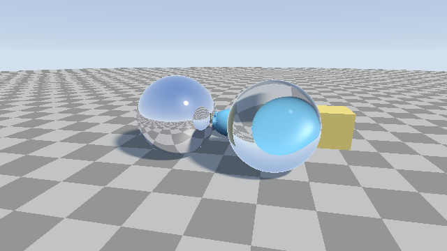

########################################################
第 11 章 反射と屈折
########################################################

本編では、レイが最初に当たった表面の色を、光源と環境光から直接計算していた。この章では、鏡のように周囲を映す反射と、ガラスのように光を曲げて透過させる屈折を扱う。どちらも、表面に当たったレイから新しいレイを作って追跡を続けることで実現する。

   11_reflection_refraction.frag の実行結果。左の球は鏡面、右の球はガラスである。

.. rst-class:: example-links

:download:`11_reflection_refraction.frag をダウンロード <../examples/shaders/11_reflection_refraction.frag>` ｜ `ブラウザーで実行 <demos/11_reflection_refraction.html>`__

反射
====

入射方向 :math:`\hat{\mathbf{i}}` のレイが法線 :math:`\hat{\mathbf{n}}` の表面で鏡面反射すると、反射方向 :math:`\hat{\mathbf{r}}` は次のようになる。

.. math::

   \hat{\mathbf{r}} = \hat{\mathbf{i}} - 2 (\hat{\mathbf{n}} \cdot \hat{\mathbf{i}})\, \hat{\mathbf{n}}

入射方向の法線成分の符号を反転させる式である。GLSL では組み込み関数 ``reflect(i, n)`` がこの計算を行う。

屈折
====

スネルの法則
------------

屈折率 :math:`\eta_1` の媒質から屈折率 :math:`\eta_2` の媒質に光が入るとき、入射角 :math:`\theta_1` と屈折角 :math:`\theta_2` の間にはスネルの法則が成り立つ。

.. math::

   \eta_1 \sin\theta_1 = \eta_2 \sin\theta_2

:math:`\eta = \eta_1 / \eta_2` とすると、屈折方向 :math:`\hat{\mathbf{t}}` は次の式で求められる。

.. math::

   c = -\hat{\mathbf{n}} \cdot \hat{\mathbf{i}}, \qquad
   k = 1 - \eta^2 (1 - c^2), \qquad
   \hat{\mathbf{t}} = \eta\, \hat{\mathbf{i}} + (\eta c - \sqrt{k})\, \hat{\mathbf{n}}

GLSL では組み込み関数 ``refract(i, n, eta)`` がこの計算を行う。このとき、法線 :math:`\hat{\mathbf{n}}` は入射方向と逆の側（:math:`\hat{\mathbf{n}} \cdot \hat{\mathbf{i}} < 0`）を向いている必要がある。ガラスの内部から外部に出るときは、外向きの法線の符号を反転させて渡す。

全反射
------

屈折率の大きい媒質から小さい媒質に光が進むとき（:math:`\eta > 1`）、入射角が大きいと :math:`k < 0` となり、屈折光が存在しなくなる。このとき光はすべて反射される。この現象を全反射と呼ぶ。``refract`` は全反射のときに零ベクトルを返すので、戻り値の長さで判定できる。

フレネル反射
------------

ガラスや水の表面では、光の一部が反射し、残りが屈折する。反射する割合は入射角によって変わり、表面を斜めから見るほど大きくなる。水面を真上から見ると水中が透けて見え、遠くの水面には空が映って見えるのはこのためである。

反射率を正確に求めるフレネルの式は複雑なので、次の Schlick の近似がよく使われる。

.. math::

   F(\theta) = F_0 + (1 - F_0)(1 - \cos\theta)^5, \qquad
   F_0 = \left(\frac{\eta_1 - \eta_2}{\eta_1 + \eta_2}\right)^2

:math:`F_0` は光が垂直に入射するときの反射率で、空気（:math:`\eta = 1`）とガラス（:math:`\eta = 1.5`）の境界では :math:`F_0 = 0.04` になる。

.. literalinclude:: ../examples/shaders/11_reflection_refraction.frag
   :language: glsl
   :linenos:
   :lineno-match:
   :lines: {glsl:11_reflection_refraction.frag:fresnelSchlick}
   :caption: 11_reflection_refraction.frag（抜粋）

ループによる経路の追跡
======================

鏡に映った物体がまた鏡であれば、反射をさらに追跡する必要がある。CPU のレイトレーサーでは関数の再帰呼び出しで実装することが多いが、GLSL では再帰呼び出しができない。そこで、ループの中でレイを更新しながら追跡する。

このとき、それまでの経路で光がどれだけ減衰したかを表す値（スループット）を保持しておく。反射や屈折のたびにスループットに反射率や透過率を掛け、最後に拡散反射面や空に到達したら、その色にスループットを掛けて結果に加える。

.. literalinclude:: ../examples/shaders/11_reflection_refraction.frag
   :language: glsl
   :linenos:
   :lineno-match:
   :lines: {glsl:11_reflection_refraction.frag:render}
   :caption: 11_reflection_refraction.frag（抜粋）

ガラスの球に当たったときは、次の順に処理する。

1. フレネル項 :math:`F` を求め、反射成分として空の色に :math:`F` を掛けて加える。スループットには :math:`1 - F` を掛ける。
2. ``refract`` で屈折方向を求め、ガラスの内部に入る。
3. ガラスの内部をレイマーチングし、出口の点を求める（後述）。
4. 出口で再び屈折させ、外に出たレイで追跡を続ける。

ループ 1 回につき 1 本のレイしか追跡できないため、ガラスの表面での反射と屈折の両方を正確に追跡することはできない。サンプルでは、屈折の経路だけを追跡し、反射成分は空の色で近似している。反射と屈折を確率的に選ぶ方法は、第 17 章のパストレーシングの考え方につながる。

物体の内部のレイマーチング
==========================

SDF は物体の内部で負の値をとり、その絶対値は表面までの距離である。したがって、SDF の符号を反転させた :math:`-f` を使えば、物体の内部からでも通常と同じようにスフィアトレーシングで表面を探せる。

.. literalinclude:: ../examples/shaders/11_reflection_refraction.frag
   :language: glsl
   :linenos:
   :lineno-match:
   :lines: {glsl:11_reflection_refraction.frag:marchInside}
   :caption: 11_reflection_refraction.frag（抜粋）

ここでは、シーン全体の ``map`` ではなく、ガラスの物体だけの SDF ``sdGlass`` を使っている。シーン全体の SDF の符号を反転させると、ガラスの外にある物体の内部も「内側」とみなされてしまうためである。

近似と限界
==========

このサンプルは、反射と屈折の基本的な仕組みを示すために、次の近似をしている。

* ガラスの表面での反射は、空の色だけで近似している。反射に映る周囲の物体は描かれない。
* ガラスの内部での反射（全反射を含む）は追跡していない。全反射が起こる場合は、反射方向で外に出るものとして近似している。
* ガラスや鏡の物体も影を落とすときは不透明な物体として扱う。実際のガラスは光を集めて明るい模様（コースティクス）を作るが、この手法では表現できない。

これらを正確に扱うには、第 17 章で説明するパストレーシングが必要になる。
