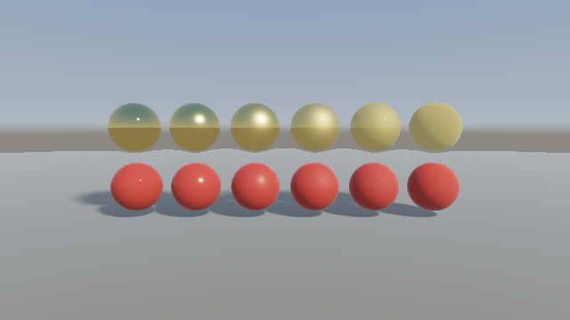
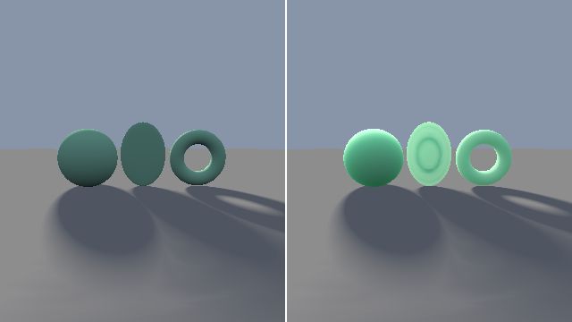

########################################################
第 12 章 物理ベースの材質
########################################################

第 5 章の照明モデルでは、鏡面反射を Blinn-Phong モデルで近似した。このモデルは計算が軽いが、金属と非金属の違いや、表面の粗さによるハイライトの広がりを、物理的に一貫した形で表せない。この章では、現在のリアルタイムレンダリングで標準的に使われている、マイクロファセット理論に基づく :term:`PBR` （physically based rendering、物理ベースレンダリング）の材質を扱う。後半では、光が物体の内部に入り込んで散乱するサブサーフェススキャッタリングの近似を説明する。

   12_pbr.frag の実行結果。上の列は金属、下の列は非金属で、左から右へ粗さを 0.05 から 1 まで大きくしている。

.. rst-class:: example-links

:download:`12_pbr.frag をダウンロード <../examples/shaders/12_pbr.frag>` ｜ `ブラウザーで実行 <demos/12_pbr.html>`__

マイクロファセット理論
======================

考え方
------

実際の表面は、顕微鏡で見ると細かな凹凸で覆われている。マイクロファセット理論では、表面を、向きがさまざまな無数の微小な鏡（マイクロファセット）の集まりとみなす。光源の方向 :math:`\hat{\mathbf{l}}` から来た光が視点の方向 :math:`\hat{\mathbf{v}}` に反射されるのは、法線がハーフベクトル :math:`\hat{\mathbf{h}}` （第 5 章）を向いているマイクロファセットだけである。滑らかな表面ではマイクロファセットの向きが揃っているので、ハイライトは小さく鋭くなる。粗い表面では向きがばらつくので、ハイライトは広がって弱くなる。

この考え方から、鏡面反射の BRDF は次の Cook-Torrance の式で表される。

.. math::

   f_{\text{spec}}(\hat{\mathbf{l}}, \hat{\mathbf{v}}) =
   \frac{D(\hat{\mathbf{h}})\, G(\hat{\mathbf{l}}, \hat{\mathbf{v}})\, F(\hat{\mathbf{v}}, \hat{\mathbf{h}})}
        {4\, (\hat{\mathbf{n}} \cdot \hat{\mathbf{l}})\, (\hat{\mathbf{n}} \cdot \hat{\mathbf{v}})}

.. list-table::
   :header-rows: 1
   :widths: 25 75

   * - 項
     - 意味
   * - :math:`D` （法線分布関数）
     - マイクロファセットの法線が :math:`\hat{\mathbf{h}}` を向いている割合。ハイライトの形と大きさを決める。
   * - :math:`G` （幾何減衰項）
     - マイクロファセット同士が光や視線を遮る割合。斜めから見たり照らしたりするときに効く。
   * - :math:`F` （フレネル項）
     - マイクロファセットで反射される光の割合（第 11 章）

法線分布関数
------------

法線分布関数には、GGX（Trowbridge-Reitz 分布、Walter et al., 2007）がよく使われる。粗さのパラメーターを :math:`\alpha` とすると、次の式で表される。

.. math::

   D(\hat{\mathbf{h}}) = \frac{\alpha^2}{\pi \bigl((\hat{\mathbf{n}} \cdot \hat{\mathbf{h}})^2 (\alpha^2 - 1) + 1\bigr)^2}

GGX は、Blinn-Phong のべき乗の分布に比べて、ハイライトの周りに長く尾を引く分布を持ち、実際の材質の測定結果によく一致する。:math:`\alpha` は、人間が指定する粗さ :math:`r \in [0, 1]` の 2 乗 :math:`\alpha = r^2` とすることが多い。こうすると、:math:`r` の変化に対して見た目の変化がほぼ均等になる（Karis, 2013）。

.. literalinclude:: ../examples/shaders/12_pbr.frag
   :language: glsl
   :linenos:
   :lineno-match:
   :lines: {glsl:12_pbr.frag:distributionGGX..fresnelSchlick}
   :caption: 12_pbr.frag（抜粋）

幾何減衰項には、Smith の方法を Schlick の式で近似したものを使っている。係数 :math:`k = (r + 1)^2 / 8` は、平行光源などの直接光に対して Karis が示した値である。フレネル項は第 11 章と同じ Schlick の近似だが、垂直入射での反射率 :math:`F_0` を RGB ごとの値にしている。

金属度と粗さ
============

材質の指定
----------

PBR では、材質を少数の直感的なパラメーターで指定する。本資料では、広く使われている次の 3 つを使う。

.. list-table::
   :header-rows: 1
   :widths: 25 75

   * - パラメーター
     - 意味
   * - ベースカラー
     - 非金属では拡散反射の色（アルベド）、金属では鏡面反射の色
   * - 金属度（metallic）
     - 0 は非金属（誘電体）、1 は金属。中間の値は、金属と非金属の境目を表すのに使う。
   * - 粗さ（roughness）
     - 0 は鏡のように滑らか、1 は非常に粗い

金属と非金属では、光の反射の仕方が大きく異なる。

* **非金属**: 表面で反射される光（鏡面反射）は少なく、垂直入射での反射率 :math:`F_0` は 0.02〜0.05 程度で、色を持たない。残りの光は内部に入って散乱し、ベースカラーの色で拡散反射される。
* **金属**: 内部に入った光はすぐに吸収されるので、拡散反射は無い。鏡面反射の反射率は高く、:math:`F_0` そのものが金属の色（金は黄、銅は赤みを帯びる）になる。

この違いを、金属度で次のように補間する。

.. math::

   F_0 = \operatorname{mix}(0.04,\ \mathbf{c}_{\text{base}},\ m), \qquad
   \mathbf{k}_d = (1 - F)(1 - m)

:math:`m` は金属度である。:math:`\mathbf{k}_d` は拡散反射に使われる光の割合で、鏡面反射された分 :math:`F` と、金属の分 :math:`m` を除いたものである。

エネルギー保存と照明の合成
--------------------------

拡散反射の BRDF は、第 5 章で省略した :math:`1/\pi` を含めて :math:`\mathbf{k}_d\, \mathbf{c}_{\text{base}} / \pi` とする。鏡面反射と合わせると、光源による表面の色は次のようになる。

.. math::

   \mathbf{L} = \left(\mathbf{k}_d \frac{\mathbf{c}_{\text{base}}}{\pi} + f_{\text{spec}}\right) \mathbf{E}\, (\hat{\mathbf{n}} \cdot \hat{\mathbf{l}})

:math:`\mathbf{E}` は光源の放射照度（光に垂直な面が受ける光の強さ）である。鏡面反射と拡散反射の割合を :math:`F` で分け合うため、表面が受けた以上の光を反射することはない（エネルギー保存）。この性質により、粗さや金属度をどのように変えても、材質の明るさが不自然にならない。

.. literalinclude:: ../examples/shaders/12_pbr.frag
   :language: glsl
   :linenos:
   :lineno-match:
   :lines: {glsl:12_pbr.frag:shadePBR}
   :caption: 12_pbr.frag（抜粋）

環境光
------

PBR では、環境からの光（空や周囲の物体からの光）の扱いが見た目を大きく左右する。特に金属は拡散反射を持たないため、周囲の映り込みが無いと暗く見える。正確には、環境の光を BRDF で重み付けして半球全体で積分する必要がある。実用的には、環境の画像をあらかじめ粗さごとにぼかしておき、反射方向の値を読み出す方法（split-sum 近似、Karis, 2013）が使われる。

サンプルでは簡単のため、反射方向の空の色を、粗さに応じて空の平均的な色に近づけることで、ぼけた映り込みを近似している（関数 ``environment``）。環境光のフレネル項には、視線と法線の角度を使っている。

図では、金属の球（上の列）は粗さが小さいと空と地面が鮮明に映り込み、粗くなるにつれて映り込みがぼけ、金色の拡散反射のような見た目に変わっていく。非金属の球（下の列）は、どの粗さでも赤い拡散反射が主で、粗さによってハイライトの大きさだけが変わる。

サブサーフェススキャッタリング
==============================

現象
----

肌、蝋、大理石、翡翠、葉、牛乳などの材質では、表面から入った光が内部で何度も散乱してから、入った点とは別の場所から出ていく。この現象を :term:`サブサーフェススキャッタリング` （subsurface scattering、SSS、表面下散乱）と呼ぶ。SSS のある材質は、柔らかく、内側から光っているように見える。特に、光源を背にした薄い部分（耳や葉など）は、光が透けて明るく見える。

物理的には、SSS は物体の内部を関与媒質とみなした光の散乱であり、第 16 章のボリュームレンダリングや第 17 章のパストレーシングで正確に扱える。ここでは、1 回の描画で済む近似を 2 つ組み合わせる。SDF は物体の内部でも表面までの距離を返すため、物体の厚みを簡単に調べられる。これは、SDF を使うレイマーチングならではの利点である。

   12_sss.frag の実行結果。左は通常の拡散反射、右は SSS の近似を加えたもの。光源は物体の奥にある。

.. rst-class:: example-links

:download:`12_sss.frag をダウンロード <../examples/shaders/12_sss.frag>` ｜ `ブラウザーで実行 <demos/12_sss.html>`__

ラップライティング
------------------

表面から入った光は内部で散乱して横に広がるため、光の当たらない側の近くまで明るくなる。この効果を、拡散反射の :math:`\hat{\mathbf{n}} \cdot \hat{\mathbf{l}}` を裏側に少し回り込ませることで近似する。これをラップライティングと呼ぶ。

.. math::

   L_{\text{wrap}} \propto \max\left(\frac{\hat{\mathbf{n}} \cdot \hat{\mathbf{l}} + w}{1 + w},\ 0\right)

:math:`w` は回り込みの量で、:math:`w = 0` のときは通常のランバート反射と一致する。

透過光
------

光源の反対側から見たときの透け感は、光が物体の中を通る距離で決まる。表面上の点から光源の方向に物体の内部を進み、反対側の表面までの距離 :math:`\ell` を求める。第 11 章のガラスと同じく、内部では SDF の符号を反転させた値が表面までの距離になるので、スフィアトレーシングで求められる。

.. literalinclude:: ../examples/shaders/12_sss.frag
   :language: glsl
   :linenos:
   :lineno-match:
   :lines: {glsl:12_sss.frag:thicknessToLight}
   :caption: 12_sss.frag（抜粋）

物体の中を距離 :math:`\ell` だけ通った光は、ランベルト・ベールの法則により :math:`e^{-\sigma \ell}` の割合で残る。消散係数 :math:`\sigma` を RGB ごとに変えると、透過光の色を決められる。サンプルでは赤を最も減衰しやすくし、翡翠のような緑がかった透過光にしている。さらに、散乱が前方に偏っていることを近似するため、視線が光源の方向に近いほど透過光を強くしている。

.. literalinclude:: ../examples/shaders/12_sss.frag
   :language: glsl
   :linenos:
   :lineno-match:
   :lines: {glsl:12_sss.frag:shade}
   :caption: 12_sss.frag（抜粋）

図の右側では、薄い葉の形の物体が最も明るく透け、厚い球はあまり透けていない。輪の形の物体は、光が通る距離が短い縁の部分が明るくなっている。

近似の限界
----------

この近似は、光源から表面の点までの直線の経路だけを考えている。実際の SSS では、光は内部で多数回散乱して曲がった経路を通るため、光源から直接見えない部分にも光が回り込む。また、物体の外にある別の物体が光を遮っても、透過光は減らない。

内部の厚みを求める別の方法として、第 6 章の AO と同じ考え方を法線の逆方向に適用し、内部の数点で SDF を評価して局所的な厚みを見積もる方法もある。光源の方向によらない厚みが得られ、計算も軽い。より正確な結果が必要な場合は、物体の内部を関与媒質とみなし、第 17 章のパストレーシングで内部の散乱を確率的に追跡する（ランダムウォーク法）。
