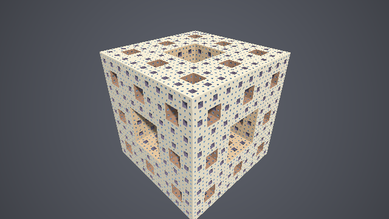
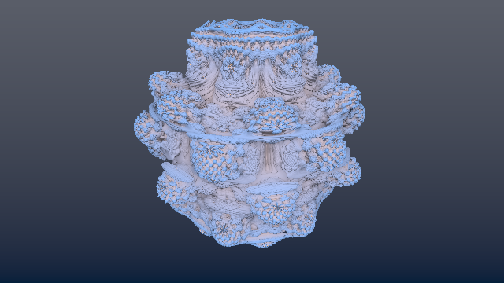
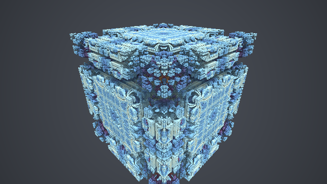
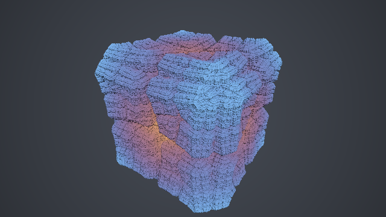

########################################################
第 13 章 フラクタル
########################################################

レイマーチングは、ポリゴンでは表現しにくい、無限に細かい構造を持つ形状（フラクタル）を描くのに向いている。フラクタルの SDF は、空間の変換を反復的に適用することで作れるものが多い。この章では、代表的なフラクタルとして、メンガーのスポンジ、マンデルバルブ、マンデルボックスを描き、最後に折り返しによってフラクタルを作る一般的な方法（KIFS）を紹介する。

メンガーのスポンジ
==================

構成
----

メンガーのスポンジは、次の操作を無限に繰り返して得られる立体である。

1. 立方体を 3 × 3 × 3 = 27 個の小さな立方体に分ける。
2. 各面の中央の 6 個と、全体の中心の 1 個の、合わせて 7 個を取り除く。
3. 残った 20 個の立方体のそれぞれに、同じ操作を施す。

2 の操作は、立方体から「3 方向に貫通する十字形の穴」をくり抜くことと同じである。そして 3 の操作は、第 4 章の空間の繰り返しを使えば、すべての小さな立方体に対して一度に適用できる。

SDF
---

次の関数は、Quilez による実装に基づくメンガーのスポンジの SDF である。

.. literalinclude:: ../examples/shaders/13_menger.frag
   :language: glsl
   :linenos:
   :lineno-match:
   :lines: {glsl:13_menger.frag:sdMenger}
   :caption: 13_menger.frag（抜粋）

最初に 1 辺 2 の立方体の SDF を ``d`` とし、ループの 1 回ごとに 1 段階細かい穴をくり抜く。``scale`` は各段階の縮尺で、1、3、9、27、…と 3 倍ずつ大きくなる。

* ``a = mod(p * scale, 2.0) - 1.0`` は、空間を 1 辺 :math:`2/\mathrm{scale}` の立方体のセルに分け、セル内の局所座標を :math:`[-1, 1)` の範囲で表したものである。``mod`` の性質から、セルの境界が :math:`a = 0`、セルの中心が :math:`|a| = 1` に対応する。
* ``r = abs(1.0 - 3.0 * abs(a))`` の各成分は、その座標がセルの中央の 1/3 にあるとき（:math:`|a| > 2/3`）に 1 より大きくなる。
* 十字形の穴は、2 つ以上の座標がセルの中央の 1/3 にある領域である。``max(r.x, r.y)`` などの 3 つの値の最小値から 1 を引いた値は、点がこの穴の内側にあるとき正、外側にあるとき負になる。これを ``scale`` で割ってワールド座標の尺度に戻したものが ``c`` である。
* ``d = max(d, c)`` は、第 4 章の積集合である。``c`` は「穴の外側」を内側とする SDF なので、積をとると穴がくり抜かれる。

ループの回数 ``ITERATIONS`` が、フラクタルの深さを決める。4 回で最も小さな穴の大きさは元の立方体の :math:`1/81` になり、画面上ではほぼ 1 ピクセルに達する。この SDF は厳密な距離ではなく距離の下界である。

.. rst-class:: example-links

:download:`13_menger.frag をダウンロード <../examples/shaders/13_menger.frag>` ｜ `ブラウザーで実行 <demos/13_menger.html>`__

   13_menger.frag の実行結果。穴の階層ごとに、第 7 章の余弦関数によるパレットで色を変えている。

フラクタルでは、表面がどこまでも細かいため、影と AO の計算が重要になる。このサンプルでは、AO の代わりに、レイマーチングの反復回数を使った簡易的な遮蔽を使っている。細い隙間の近くを通るレイは反復回数が多くなるので、反復回数が多いピクセルほど暗くしている。追加の SDF の評価が不要なので、計算の重いフラクタルに向いている。

マンデルバルブ
==============

マンデルブロ集合の 3 次元への拡張
---------------------------------

マンデルブロ集合は、複素数 :math:`c` について次の漸化式を反復したとき、:math:`|z_n|` が発散しない :math:`c` の集合である。

.. math::

   z_0 = 0, \qquad z_{n+1} = z_n^2 + c

複素数の 2 乗は、極形式で「絶対値を 2 乗し、偏角を 2 倍する」操作である。White と Nylander は、これを 3 次元の極座標に拡張し、点 :math:`\mathbf{z} = (r, \theta, \phi)` の :math:`n` 乗を次のように定義した。

.. math::

   \mathbf{z}^n = r^n \bigl(\sin(n\theta)\cos(n\phi),\ \cos(n\theta),\ \sin(n\theta)\sin(n\phi)\bigr)

ここでは :math:`y` 軸を極軸とし、:math:`\theta` を :math:`y` 軸からの角度、:math:`\phi` を :math:`xz` 平面内の角度としている。この :math:`n` 乗を使って漸化式 :math:`\mathbf{z}_{k+1} = \mathbf{z}_k^n + \mathbf{c}` を反復し、発散しない点 :math:`\mathbf{c}` の集合をマンデルバルブと呼ぶ。:math:`n = 8` のときに、最もよく知られた形になる。

距離推定関数
------------

マンデルバルブには厳密な SDF が知られていない。その代わりに、次の距離推定関数（distance estimator、DE）を使う。

.. math::

   d(\mathbf{c}) \approx \frac{1}{2} \frac{|\mathbf{z}_k| \log |\mathbf{z}_k|}{|\mathbf{z}'_k|}

:math:`\mathbf{z}'_k` は :math:`\mathbf{z}_k` の :math:`\mathbf{c}` による微分で、その大きさは漸化式 :math:`|\mathbf{z}'_{k+1}| \approx n |\mathbf{z}_k|^{n-1} |\mathbf{z}'_k| + 1` で近似できる。この式は、集合の外側で定義されるポテンシャル関数 :math:`G` について :math:`G / |\nabla G|` が集合までの距離の近似になることから導かれる（Hubbard と Douady による複素力学系の結果に基づく）。:math:`|\mathbf{z}_k|` が十分大きくなった（発散した）時点で反復を打ち切り、そのときの値から距離を推定する。

.. literalinclude:: ../examples/shaders/13_mandelbulb.frag
   :language: glsl
   :linenos:
   :lineno-match:
   :lines: {glsl:13_mandelbulb.frag:sdMandelbulb}
   :caption: 13_mandelbulb.frag（抜粋）

距離推定関数は近似なので、場所によっては真の距離を過大評価することがある。不具合が見られる場合は、第 9 章で説明したように歩幅を小さくする。

軌道トラップによる色付け
------------------------

漸化式の反復の間に :math:`\mathbf{z}_k` がたどる点の列を軌道と呼ぶ。軌道が原点や特定の図形に最も近づいたときの距離（軌道トラップ）は、表面上の場所によって複雑に変化する。サンプルでは、軌道が原点に最も近づいた距離 ``trap`` を使って色を付けている。

.. rst-class:: example-links

:download:`13_mandelbulb.frag をダウンロード <../examples/shaders/13_mandelbulb.frag>` ｜ `ブラウザーで実行 <demos/13_mandelbulb.html>`__

   13_mandelbulb.frag の実行結果

マンデルボックス
================

構成
----

マンデルボックスは、Lowe（2010）が考案したフラクタルで、建築物や機械のような直線的で入り組んだ構造を持つ。マンデルバルブが複素数の 2 乗を 3 次元に拡張したものであったのに対し、マンデルボックスは、次の 3 つの操作を繰り返すことで作られる。

.. list-table::
   :header-rows: 1
   :widths: 25 75

   * - 操作
     - 内容
   * - ボックスフォールド
     - 各座標が範囲 :math:`[-1, 1]` の外に出ていれば、境界 :math:`\pm 1` で折り返す。第 4 章の対称化（``abs`` による折り返し）を、原点ではなく :math:`\pm 1` の位置で行うものである。
   * - スフィアフォールド
     - 原点からの距離 :math:`r` に応じて点を動かす。:math:`r` が内側の半径 :math:`r_{\min}` より小さければ一定の倍率で拡大し、:math:`r_{\min}` と外側の半径 :math:`r_{\text{fix}}` の間にあれば、外側の球面について反転させる（:math:`\mathbf{z} \leftarrow (r_{\text{fix}}^2 / r^2)\, \mathbf{z}`）。
   * - 拡大と平行移動
     - 拡大率 :math:`s` を掛け、元の点 :math:`\mathbf{c}` を加える（:math:`\mathbf{z} \leftarrow s\mathbf{z} + \mathbf{c}`）。

.. literalinclude:: ../examples/shaders/13_mandelbox.frag
   :language: glsl
   :linenos:
   :lineno-match:
   :lines: {glsl:13_mandelbox.frag:boxFold..sphereFold}
   :caption: 13_mandelbox.frag（抜粋）

距離推定関数
------------

距離推定関数の考え方は、マンデルバルブと同じである。反復の間、点の位置 :math:`\mathbf{z}` に加えて、:math:`\mathbf{z}` を元の点で微分したものの大きさ :math:`dr` を追跡し、最後に :math:`|\mathbf{z}| / |dr|` を距離の推定値とする。

* ボックスフォールドは、折り返しなので長さを変えない。:math:`dr` はそのままでよい。
* スフィアフォールドで点を :math:`k` 倍するときは、:math:`dr` も :math:`k` 倍する（反転の場合は厳密には倍率が場所によって変わるが、:math:`k` 倍で近似する）。
* 拡大と平行移動では、:math:`dr \leftarrow |s|\, dr + 1` とする。:math:`+1` は、元の点 :math:`\mathbf{c}` を加えることによる寄与である。拡大率が負の場合もあるので、絶対値を使う。

.. literalinclude:: ../examples/shaders/13_mandelbox.frag
   :language: glsl
   :linenos:
   :lineno-match:
   :lines: {glsl:13_mandelbox.frag:sdMandelbox}
   :caption: 13_mandelbox.frag（抜粋）

マンデルバルブは、極座標の変換と 3 角関数、べき乗を毎回の反復で計算する必要があった。マンデルボックスの反復は、比較、乗算、加算だけでできているので、計算が軽い。

.. rst-class:: example-links

:download:`13_mandelbox.frag をダウンロード <../examples/shaders/13_mandelbox.frag>` ｜ `ブラウザーで実行 <demos/13_mandelbox.html>`__

   13_mandelbox.frag の実行結果（拡大率 2.5 付近）

パラメーターによる形の変化
--------------------------

マンデルボックスの形は、主に拡大率 :math:`s` で決まる。サンプルの拡大率 2〜3 では、全体が立方体に近い形になり、各面に入り組んだ構造が現れる。拡大率を負にする（例えば :math:`-1.5`）と、まったく異なる形になり、内部に入り込んだ視点からの描画に向いた、迷路のような空間が得られる。スフィアフォールドの 2 つの半径を変えると、構造の丸みが変わる。サンプルでは拡大率を時間とともにゆっくり変えているので、形の変化を確かめられる。

色は、マンデルバルブと同じく軌道トラップ（反復の間に :math:`|\mathbf{z}|^2` がとった最小値）で付けている。

折り返しによるフラクタル（KIFS）
================================

考え方
------

マンデルボックスのボックスフォールドや、第 4 章の対称化のように、空間を平面で折り返す操作は、フラクタルを作る強力な道具になる。折り返し、回転、拡大と平行移動を繰り返してフラクタルを作る方法を、一般に KIFS（kaleidoscopic iterated function system、万華鏡的な反復関数系）と呼ぶ。万華鏡の鏡のように、空間を何枚もの平面で折り返すことから、この名前がある。

KIFS の 1 回の反復は、次の操作からなる。

1. **折り返し**: ``abs`` で 3 つの座標平面について折り返す。さらに、座標を大きい順に並べ替えると、3 つの対角面（:math:`x = y` など）についても折り返したことになる。
2. **回転**: 折り返した空間を回転させる。回転の角度を変えると、形が大きく変化する。
3. **拡大と平行移動**: ある中心 :math:`\mathbf{o}` を基準に、拡大率 :math:`s` で拡大する（:math:`\mathbf{p} \leftarrow s\mathbf{p} - (s - 1)\mathbf{o}`）。

反復を終えたら、小さな基本形状（箱や球）の SDF を評価し、拡大率の積 :math:`s^n` で割って、元の尺度の距離に戻す。折り返しと回転は距離を縮めないので、得られる値は距離の下界になり、スフィアトレーシングで正しく描ける。

.. literalinclude:: ../examples/shaders/13_kifs.frag
   :language: glsl
   :linenos:
   :lineno-match:
   :lines: {glsl:13_kifs.frag:sdKIFS}
   :caption: 13_kifs.frag（抜粋）

.. rst-class:: example-links

:download:`13_kifs.frag をダウンロード <../examples/shaders/13_kifs.frag>` ｜ `ブラウザーで実行 <demos/13_kifs.html>`__

   13_kifs.frag の実行結果

KIFS の応用
-----------

この章の前半のメンガーのスポンジも、折り返しと拡大の繰り返しとして書き直せる。また、折り返しの平面（正四面体や正十二面体の対称面など）、回転の角度、拡大の中心を変えることで、シェルピンスキーの四面体をはじめ、多様なフラクタルを同じ枠組みで作れる。パラメーターを時間とともに変えると、形が連続的に変化するので、デモシーンの作品でよく使われる。

フラクタルを描くときの注意
==========================

フラクタルの SDF は反復計算を含むため、評価に時間がかかる。また、表面が無限に細かいため、どこまで細かく描くかを決める必要がある。本章のサンプルでは、第 9 章で説明した次の工夫を使っている。

* 距離に応じた閾値 :math:`f < \varepsilon t` を使い、遠くの細かい構造の計算を省く。
* マンデルバルブでは、法線を求める差分の幅も距離に比例させ（``calcNormal`` の引数 ``t``）、遠くの表面の法線がノイズのように乱れるのを防ぐ。
* マンデルバルブでは外接球をバウンディングボリュームとして使い、外接球の外では反復計算を省く。
