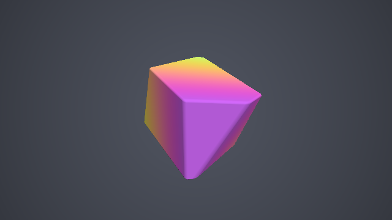
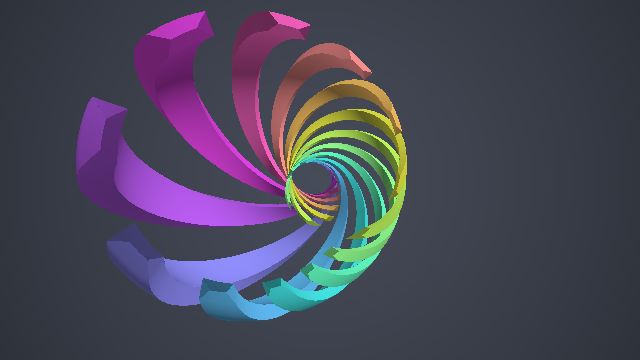
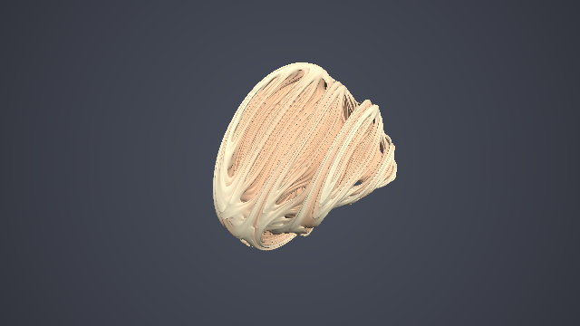

########################################################
第 14 章 4 次元の形状
########################################################

SDF は任意の次元で定義できる。第 3 章の箱の SDF は、ベクトルの成分が 4 つになってもそのまま成り立つ。この章では、4 次元の空間にある形状を、3 次元の画面に描く方法を扱う。4 次元の形状を直接見ることはできないので、3 次元の断面を見る方法と、ステレオ投影で 3 次元に写す方法の 2 つを説明する。最後に、4 次元のフラクタルである四元数ジュリア集合を描く。

4 次元の形状を見る方法
======================

4 次元の点を :math:`\mathbf{q} = (x, y, z, w)` と表す。4 次元の形状を 3 次元の画面に描くには、何らかの方法で 3 次元の形状に変換する必要がある。主な方法には次のものがある。

.. list-table::
   :header-rows: 1
   :widths: 20 45 35

   * - 方法
     - 内容
     - 特徴
   * - 断面
     - 4 次元の形状を 3 次元の超平面（例えば :math:`w = 0`）で切った断面を描く
     - 実装が簡単で、距離の下界が得られる。形状の一部しか見えない。
   * - 透視投影
     - 4 次元の視点から、3 次元の「スクリーン」に投影する
     - 形状全体が見えるが、重なりが多く分かりにくい。
   * - ステレオ投影
     - 3 次元球面 :math:`S^3` 上の形状を、1 点から 3 次元空間に投影する
     - 角度を保つ等角写像で、形が崩れにくい。:math:`S^3` 上の形状に限られる。

どの方法でも、4 次元での回転を加えると、3 次元の像が大きく変化する。4 次元の回転は、6 つの座標平面（:math:`xy, xz, xw, yz, yw, zw`）それぞれでの 2 次元の回転の組み合わせで表せる。このうち :math:`xw, yw, zw` 平面の回転は、3 次元には対応するものが無い回転である。サンプルでは、第 4 章の 2 次元の回転行列を、4 次元の点の 2 つの成分に適用して回転させる。

3 次元の断面
============

4 次元の点 :math:`\mathbf{q}` から形状までの距離を :math:`f_4(\mathbf{q})` とする。3 次元の点 :math:`\mathbf{p}` を 4 次元の点 :math:`(\mathbf{p}, 0)` とみなして :math:`f_4` を評価すると、:math:`w = 0` の断面の SDF が得られる。4 次元での最短距離は、断面の中だけで測った最短距離以下なので、この値は断面の SDF の下界になる。したがって、そのままスフィアトレーシングに使える。

次のサンプルは、4 次元の超立方体（テッセラクト）を 4 次元で回転させ、:math:`w = 0` の断面を描く。4 次元の箱の SDF は、第 3 章の箱の式の成分を 4 つにしたものである。

.. literalinclude:: ../examples/shaders/14_slice.frag
   :language: glsl
   :linenos:
   :lineno-match:
   :lines: {glsl:14_slice.frag:sdBox4..map}
   :caption: 14_slice.frag（抜粋）

.. rst-class:: example-links

:download:`14_slice.frag をダウンロード <../examples/shaders/14_slice.frag>` ｜ `ブラウザーで実行 <demos/14_slice.html>`__

   14_slice.frag の実行結果。4 次元での回転に伴って、断面は立方体から、角を切り落とした多面体へと形を変えていく。

回転していないとき、断面は立方体になる。:math:`xw` 平面だけで回転させると、断面は :math:`x` 方向に伸びた直方体になる。さらに :math:`zw` 平面の回転を加えると、断面は角が切り落とされた多面体になる。3 次元の立方体を平面で斜めに切ると、断面が正方形から六角形まで変化するのと同じ現象である。色は、断面上の点の 4 次元での :math:`w` 座標（回転後）で付けている。

ステレオ投影
============

3 次元球面とステレオ投影
------------------------

4 次元空間の単位球面 :math:`S^3 = \{\mathbf{q} \mid |\mathbf{q}| = 1\}` は、3 次元の広がりを持つ曲がった空間である。2 次元の球面（地球の表面）を平面の地図に描くのと同じように、:math:`S^3` は 3 次元空間に投影できる。

ステレオ投影は、球面上の 1 点（投影の中心、ここでは :math:`(0, 0, 0, 1)`）から、球面上の各点を通る直線を引き、:math:`w = 0` の空間と交わる点に写す方法である。レイマーチングでは、3 次元の点 :math:`\mathbf{p}` がどの :math:`S^3` 上の点に対応するかが必要なので、逆向きの写像（逆ステレオ投影）を使う。

.. math::

   \sigma^{-1}(\mathbf{p}) = \frac{\bigl(2\mathbf{p},\ |\mathbf{p}|^2 - 1\bigr)}{|\mathbf{p}|^2 + 1}

原点は :math:`(0, 0, 0, -1)` に、無限遠点は投影の中心に写る。

距離の補正
----------

ステレオ投影は等角写像であり、各点の近くでは一様な拡大縮小として振る舞う。逆ステレオ投影の拡大率は次のとおりである。

.. math::

   \lambda(\mathbf{p}) = \frac{2}{1 + |\mathbf{p}|^2}

つまり、3 次元での小さな長さ :math:`\delta` は、:math:`S^3` 上では :math:`\lambda \delta` になる。したがって、:math:`S^3` 上で測った形状までの距離 :math:`d_S` を :math:`\lambda` で割れば、3 次元での距離の近似が得られる。

.. math::

   d(\mathbf{p}) \approx \frac{d_S\bigl(\sigma^{-1}(\mathbf{p})\bigr)}{\lambda(\mathbf{p})}
   = \frac{1 + |\mathbf{p}|^2}{2}\, d_S\bigl(\sigma^{-1}(\mathbf{p})\bigr)

拡大率は場所によって変わるので、この値は厳密な距離ではない。形状から離れた点では、距離を過大評価することもある。そのため、第 9 章で説明したように歩幅を小さくして（サンプルでは 0.7 倍）スフィアトレーシングを行う。

クリフォードトーラスとホップファイバー
--------------------------------------

:math:`S^3` 上の点は、2 つの複素数 :math:`(z_1, z_2) = (x + iy,\ z + iw)` を使って、次のように表せる。

.. math::

   \mathbf{q} = \bigl(\cos\alpha\ e^{i\phi_1},\ \sin\alpha\ e^{i\phi_2}\bigr), \qquad 0 \le \alpha \le \frac{\pi}{2}

:math:`\alpha` を一定にした点の集合はトーラスになり、特に :math:`\alpha = \pi/4` のものをクリフォードトーラスと呼ぶ。:math:`\alpha` が一定のトーラス同士は :math:`S^3` 上で等間隔に並んでいるので、:math:`|\alpha - \pi/4|` はクリフォードトーラスまでの :math:`S^3` 上の距離そのものになる。

さらに、:math:`\phi_1 - \phi_2` が一定の曲線は、:math:`S^3` 上の大円になる。これは点 :math:`(z_1, z_2)` を :math:`(e^{it} z_1,\ e^{it} z_2)` と回したときの軌跡で、ホップファイバーと呼ばれる。サンプルでは、クリフォードトーラスをホップファイバーに沿った 12 本のリボンに切り分けている。トーラス上で、ファイバーに垂直な方向に測った距離は、:math:`\phi_1 - \phi_2` の差の半分になる。

.. literalinclude:: ../examples/shaders/14_stereographic.frag
   :language: glsl
   :linenos:
   :lineno-match:
   :lines: {glsl:14_stereographic.frag:inverseStereographic..map}
   :caption: 14_stereographic.frag（抜粋）

.. rst-class:: example-links

:download:`14_stereographic.frag をダウンロード <../examples/shaders/14_stereographic.frag>` ｜ `ブラウザーで実行 <demos/14_stereographic.html>`__

   14_stereographic.frag の実行結果。各リボンは 1 本のホップファイバーに沿っており、互いに鎖のように絡み合っている。

:math:`S^3` はどの 4 次元の回転でも自分自身に写るので、:math:`S^3` 上の点を回転させてから距離を評価すれば、形状を 4 次元で回転させられる。回転によって形状の一部が投影の中心に近づくと、その部分は 3 次元では遠くまで大きく広がって写る。

四元数ジュリア集合
==================

第 13 章のマンデルバルブは、複素数の漸化式を 3 次元に拡張したものであった。複素数を 4 次元の数である四元数に置き換えると、4 次元のフラクタルが得られる。四元数 :math:`\mathbf{q} = (a, \mathbf{v})` （:math:`a` は実部、:math:`\mathbf{v}` は 3 次元の虚部）の 2 乗は次のようになる。

.. math::

   \mathbf{q}^2 = \bigl(a^2 - \mathbf{v} \cdot \mathbf{v},\ 2a\mathbf{v}\bigr)

定数 :math:`\mathbf{c}` を固定し、点 :math:`\mathbf{z}_0` から漸化式 :math:`\mathbf{z}_{k+1} = \mathbf{z}_k^2 + \mathbf{c}` を反復したときに発散しない点の集合を、四元数ジュリア集合と呼ぶ。距離推定関数は、マンデルバルブと同じ形になる。

.. math::

   d \approx \frac{1}{2} \frac{|\mathbf{z}_k| \log |\mathbf{z}_k|}{|\mathbf{z}'_k|}, \qquad
   |\mathbf{z}'_{k+1}| \approx 2 |\mathbf{z}_k|\, |\mathbf{z}'_k|

ジュリア集合では漸化式の初期値が点そのものなので、:math:`|\mathbf{z}'_0| = 1` から始め、マンデルバルブのように :math:`+1` を加えない。サンプルでは、平方根の計算を減らすため、:math:`|\mathbf{z}|^2` と :math:`|\mathbf{z}'|^2` を使って計算している。

.. literalinclude:: ../examples/shaders/14_julia.frag
   :language: glsl
   :linenos:
   :lineno-match:
   :lines: {glsl:14_julia.frag:quatSquare..sdJulia}
   :caption: 14_julia.frag（抜粋）

.. rst-class:: example-links

:download:`14_julia.frag をダウンロード <../examples/shaders/14_julia.frag>` ｜ `ブラウザーで実行 <demos/14_julia.html>`__

   14_julia.frag の実行結果。:math:`w = 0` の 3 次元の断面を描いている。

四元数ジュリア集合は 4 次元の形状なので、描いているのは 3 次元の断面である。定数 :math:`\mathbf{c}` を時間とともに少しずつ変えると、形状が滑らかに変化する。断面の位置（:math:`w` の値）を変えたり、:math:`\mathbf{z}_0` に 4 次元の回転を加えたりしても、異なる形の断面が得られる。
