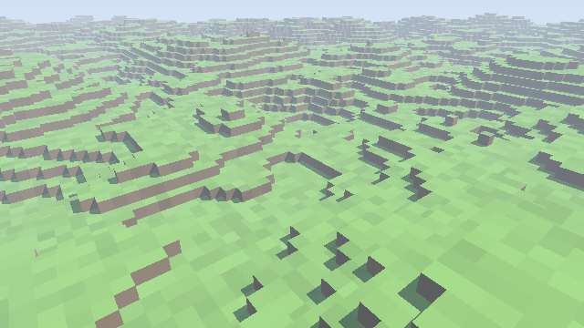
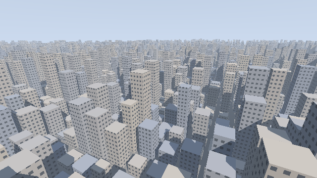
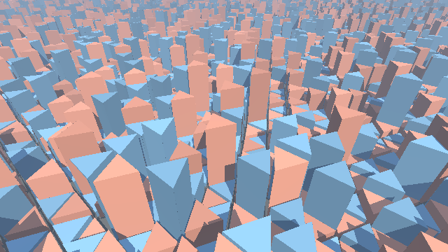
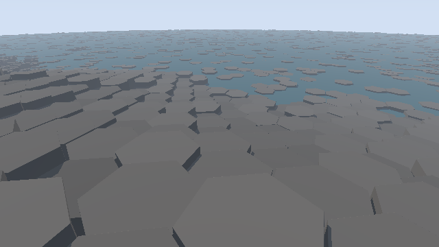
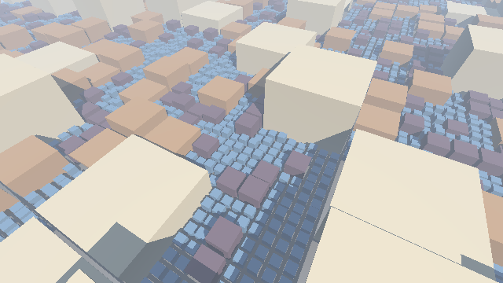
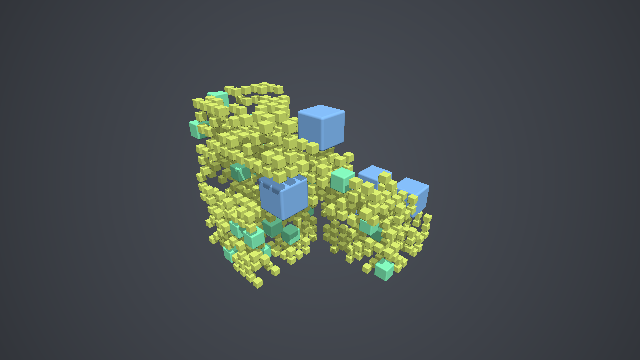

########################################################
第 15 章 グリッドの走査
########################################################

第 4 章の空間の繰り返しでは、自分のセルの形状だけを評価していたため、セルごとに形状が異なると、隣のセルの形状を見落として距離を過大評価することがあった。この章では、レイが通過する格子のセルを、始点に近い順に 1 つずつたどる方法（グリッドの走査）を説明する。この方法を使うと、ボクセル（格子状に並んだ立方体）で作った世界を描けるほか、セルごとに異なる形状を置いたシーンを正しく描ける。後半では、正方形以外の格子として三角形と六角形の格子の走査を、大きさの異なるセルからなる格子として四分木と八分木を扱う。

3D DDA
======

考え方
------

1 辺の長さが 1 の立方体で空間を区切った格子を考える。レイ :math:`\mathbf{o} + t\hat{\mathbf{d}}` が通過するセルを順にたどるには、レイが次にどのセルの境界を越えるかを求めればよい。Amanatides と Woo（1987）は、この計算を各軸ごとの簡単な加算だけで行う方法を示した。これを :term:`DDA` （digital differential analyzer）と呼ぶ。

各軸 :math:`i \in \{x, y, z\}` について、次の 2 つの値を管理する。

.. list-table::
   :header-rows: 1
   :widths: 25 75

   * - 変数
     - 意味
   * - ``tDelta``
     - レイが軸 :math:`i` の方向にセル 1 つ分進むのに必要な :math:`t` の増分 :math:`|1/d_i|`
   * - ``tMax``
     - レイが軸 :math:`i` の次のセルの境界に達する :math:`t`

``tMax`` の 3 つの成分のうち最小のものが、レイが次に越える境界である。その軸の方向に 1 セル進み、その軸の ``tMax`` に ``tDelta`` を加える。これを繰り返すと、レイが通過するセルを漏れなく、近い順にたどれる。

.. literalinclude:: ../examples/shaders/15_voxel.frag
   :language: glsl
   :linenos:
   :lineno-match:
   :lines: {glsl:15_voxel.frag:traverse}
   :caption: 15_voxel.frag（抜粋）

``tMax`` の初期値は、始点を含むセルの境界までの距離から求める。:math:`d_i > 0` の場合は、セルの上側の境界 :math:`\lfloor o_i \rfloor + 1` までの距離 :math:`(\lfloor o_i \rfloor + 1 - o_i)/d_i` になり、:math:`d_i < 0` の場合は下側の境界 :math:`\lfloor o_i \rfloor` までの距離になる。サンプルでは、この 2 つの場合を ``stepDir`` （:math:`\pm 1`）を使った 1 つの式にまとめている。

``mask`` は、最小の ``tMax`` を持つ軸だけが 1、ほかが 0 のベクトルである。``step(tMax, min(tMax.yzx, tMax.zxy))`` は、各成分が他の 2 つの成分以下のときに 1 になる。``mask`` を使うと、分岐を使わずに 1 つの軸だけを更新でき、最後に越えた境界の面から法線も得られる。

ボクセルの描画
--------------

ボクセルが埋まっているかどうかは、セルの番号から決める。サンプルでは、第 10 章の値ノイズで列ごとの地面の高さを決め、それより低いボクセルを埋まっているとしている。

.. literalinclude:: ../examples/shaders/15_voxel.frag
   :language: glsl
   :linenos:
   :lineno-match:
   :lines: {glsl:15_voxel.frag:groundHeight..isFilled}
   :caption: 15_voxel.frag（抜粋）

.. rst-class:: example-links

:download:`15_voxel.frag をダウンロード <../examples/shaders/15_voxel.frag>` ｜ `ブラウザーで実行 <demos/15_voxel.html>`__

   15_voxel.frag の実行結果

影は、当たった面から光源の方向に、もう一度 DDA でたどって求める。ボクセルの世界では形状がすべて格子に沿った立方体なので、SDF を使うスフィアトレーシングよりも、DDA の方が単純で確実である。一方、ソフトシャドウ（第 6 章）のように SDF の値を使う技法は、そのままでは使えない。

セルの中のスフィアトレーシング
==============================

第 4 章の問題
-------------

第 4 章の空間の繰り返しで、セルごとに高さの異なるビルを並べることを考える。あるセルの中の点では、そのセルのビルまでの距離しか分からない。隣のセルに高いビルがあると、実際にはそちらの方が近いにもかかわらず、大きな距離を返してしまう。その結果、スフィアトレーシングが隣のビルを通り越し、ビルの一部が欠けて見える。

グリッドの走査との組み合わせ
----------------------------

この問題は、グリッドの走査とスフィアトレーシングを組み合わせることで解決できる。レイが通過するセルを DDA で順にたどり、各セルの中では、そのセルの形状だけを使ってスフィアトレーシングを行う。スフィアトレーシングは、レイがセルに入る :math:`t` から出る :math:`t` までの区間だけで行い、区間の終わりまで何にも当たらなければ次のセルに進む。

各セルの中では、そのセルの形状だけを考えればよいので、隣のセルの形状を見落とすことはない。ただし、形状はセルの中に収まっている必要がある。

.. literalinclude:: ../examples/shaders/15_city.frag
   :language: glsl
   :linenos:
   :lineno-match:
   :lines: {glsl:15_city.frag:trace}
   :caption: 15_city.frag（抜粋）

このサンプルでは、ビルはすべて地面に立っているので、水平方向（:math:`xz` 平面）の 2 次元の DDA で十分である。レイが上に向かっていて、すでにビルの最大の高さより上にある場合は、以降は何にも当たらないので走査を打ち切る。

.. rst-class:: example-links

:download:`15_city.frag をダウンロード <../examples/shaders/15_city.frag>` ｜ `ブラウザーで実行 <demos/15_city.html>`__

   15_city.frag の実行結果。ビルの高さと幅は、第 10 章のハッシュ関数でセルごとに決めている。

セルごとの形状は、第 10 章のハッシュ関数でセルの番号から決めている。セルの番号が同じなら常に同じ値が得られるので、ビルの形は描画のたびに変わらない。

三角形と六角形の格子
====================

ここまでは、正方形（3 次元では立方体）の格子を扱ってきた。平面を同じ形の正多角形で隙間なく敷き詰められるのは、正方形のほかに正三角形と正六角形だけである。正六角形の格子は、隣り合うセルの中心までの距離がどの方向でも等しく、格子の向きが目立ちにくいため、蜂の巣や柱状の岩などの自然物によく使われる。正三角形の格子は、第 10 章で紹介したシンプレックスノイズの格子でもある。

走査の一般的な考え方
--------------------

この章の 3D DDA は、各軸の次の境界までの距離を比べ、最も近い境界を越える方法であった。これは、次の一般的な考え方の特別な場合とみなせる。

1. レイが現在のセルから出ていくとき、最初に通過する境界（辺や面）を求める。
2. その境界の向こう側にあるセルに進む。

セルが凸多角形（3 次元では凸多面体）であれば、レイがセルの中を通る区間は 1 つにつながっており、出ていく境界は 1 つに決まる。各境界までの距離を計算して最小のものを選べばよい。この考え方は、三角形や六角形の格子にもそのまま使える。

三角形の格子
------------

正三角形の格子は、互いに 120° ずつ向きの異なる 3 組の平行な直線で平面を区切ったものである。正方形の格子が 2 組の平行な直線（:math:`x` 一定と :math:`y` 一定）でできているのと同じように考えられる。そこで、3 組の直線の法線を :math:`\hat{\mathbf{m}}_0, \hat{\mathbf{m}}_1, \hat{\mathbf{m}}_2`、直線の間隔を :math:`s` として、各組について点 :math:`\mathbf{p}` が何本目の直線の間にあるかを、セルの番号とする。

.. math::

   L_k = \left\lfloor \frac{\mathbf{p} \cdot \hat{\mathbf{m}}_k}{s} \right\rfloor \qquad (k = 0, 1, 2)

3 つの法線の和は 0 なので、:math:`\sum_k \mathbf{p} \cdot \hat{\mathbf{m}}_k = 0` となり、セルの番号の和は :math:`-1` か :math:`-2` のどちらかになる。和が :math:`-1` のセルと :math:`-2` のセルは、向きが逆の三角形（上向きと下向き）である。

走査は、前述の DDA を 3 組の直線に広げるだけでよい。各組について、次の直線に達する :math:`t` （``tMax``）と、1 本進むのに必要な :math:`t` の増分（``tDelta``）を管理し、最も近い直線を越えて、その組の番号だけを 1 つ進める。

.. literalinclude:: ../examples/shaders/15_tri_grid.frag
   :language: glsl
   :linenos:
   :lineno-match:
   :lines: {glsl:15_tri_grid.frag:trace}
   :caption: 15_tri_grid.frag（抜粋）

セルの中の三角柱は、三角形の 3 つの辺の直線までの距離の最大値（から少し内側にずらしたもの）と、高さによる制限の最大値で表す。凸多角形の各辺までの距離の最大値は、第 3 章の箱の SDF の内側の項と同じく、内側では正確な距離、外側では距離の下界になる。

.. literalinclude:: ../examples/shaders/15_tri_grid.frag
   :language: glsl
   :linenos:
   :lineno-match:
   :lines: {glsl:15_tri_grid.frag:sdTriangleCell}
   :caption: 15_tri_grid.frag（抜粋）

.. rst-class:: example-links

:download:`15_tri_grid.frag をダウンロード <../examples/shaders/15_tri_grid.frag>` ｜ `ブラウザーで実行 <demos/15_tri_grid.html>`__

   15_tri_grid.frag の実行結果。上向きの三角形のセルを赤、下向きの三角形のセルを青で塗り分けている。

六角形の格子
------------

正六角形の格子の境界は、三角形の格子と違い、平面全体を横切る直線にはならない（六角形の辺は、隣のセルでは別の位置にずれる）。そのため、DDA のように各組の直線の番号を数える方法は使えない。そこで、「出ていく辺を求めて隣のセルに進む」という一般的な考え方をそのまま使う。

隣り合うセルの中心の間隔を 1 とすると、六角形のセルの 6 つの辺は、3 組の向かい合う辺の対になっている。各組の辺の法線を :math:`\hat{\mathbf{n}}_k` とすると、辺はセルの中心 :math:`\mathbf{c}` から法線方向に :math:`\pm 0.5` の位置にあり、辺の向こう側の隣のセルの中心は :math:`\mathbf{c} \pm \hat{\mathbf{n}}_k` である。レイの方向の成分 :math:`d_k = \hat{\mathbf{d}} \cdot \hat{\mathbf{n}}_k` の符号から、各組のどちらの辺に向かうかがわかるので、その辺に達する :math:`t` を求める。

.. math::

   t_k = \frac{\operatorname{sign}(d_k) \cdot 0.5 - (\mathbf{o} - \mathbf{c}) \cdot \hat{\mathbf{n}}_k}{d_k}

3 つの :math:`t_k` のうち最小のものが、レイがセルから出ていく辺である。

.. literalinclude:: ../examples/shaders/15_hex_columns.frag
   :language: glsl
   :linenos:
   :lineno-match:
   :lines: {glsl:15_hex_columns.frag:trace}
   :caption: 15_hex_columns.frag（抜粋）

走査の始めには、レイの始点を含むセルの中心が必要になる。これは、第 4 章で説明する六角形の繰り返しと同じ方法で求める（関数 ``hexCenter``）。

.. rst-class:: example-links

:download:`15_hex_columns.frag をダウンロード <../examples/shaders/15_hex_columns.frag>` ｜ `ブラウザーで実行 <demos/15_hex_columns.html>`__

   15_hex_columns.frag の実行結果。玄武岩の柱状節理のように、六角柱の高さはセルごとに少しずつ異なる。

六角柱の高さは、海岸からの距離に応じた大まかな高さに、セルごとのハッシュ値による段差を加えている。隣のセルとの高さの差が大きいので、第 4 章の繰り返しでは隣の六角柱を見落とすが、走査を使えば正しく描ける。

四分木と八分木
==============

考え方
------

ここまでの格子は、どの場所でもセルの大きさが同じであった。第 10 章の四分木の模様のように、正方形を必要な場所だけ 4 つに分割していくと、大きさの異なるセルからなる格子ができる。3 次元で立方体を 8 つに分割していくものを :term:`八分木` と呼ぶ。

四分木・八分木には、次の 2 つの使い方がある。

* **手続き的な四分木・八分木**: セルを分割するかどうかを、セルの位置と深さのハッシュ値で、その場で計算して決める。木のデータを保存しないので、シェーダーだけで扱える。大小の区画が混ざった街並みや、大小の物体が散らばった空間を作るのに使う。
* **データ構造としての八分木**: ボクセルや SDF の値を八分木のデータとして保存し、描画時にたどる。何も無い大きな領域を 1 つのノードにまとめられるので、記憶容量を節約でき、走査も速くなる。

この節では、前者を実装し、後者は最後に紹介する。

点が属する葉のセル
------------------

点が属する葉のセル（それ以上分割しないセル）は、第 10 章と同じく、根のセルから順に分割の判定をたどって求める。分割する場合は、子のうち点を含むものに進む。子のセルの位置は、セルの最小の角に、点が子の境界を越えている軸の分だけ子の大きさを加えれば求まる。

.. literalinclude:: ../examples/shaders/15_quadtree_city.frag
   :language: glsl
   :linenos:
   :lineno-match:
   :lines: {glsl:15_quadtree_city.frag:quadtreeLeaf}
   :caption: 15_quadtree_city.frag（抜粋）

大きさの異なるセルの走査
------------------------

セルの大きさが場所によって異なると、隣のセルの大きさや位置が一定ではないため、DDA のように番号を 1 つずつ進める方法は使えない。そこで、前の節の一般的な考え方（出ていく境界を求めて隣のセルに進む）を、次のように使う。

1. 現在の点が属する葉のセルを、根からたどって求める。
2. レイがそのセル（正方形または立方体）から出ていく :math:`t` を、箱との交差で求める。
3. セルの中だけでスフィアトレーシングを行う。何にも当たらなければ、出口よりわずかに先の点に進み、1 に戻る。

出口よりわずかに先（サンプルでは 0.001）に進むのは、ちょうど境界上の点では、どちらのセルに属するかが数値の誤差で不安定になるためである。隣のセルの大きさを知る必要がないので、四分木・八分木以外の、大きさや形の異なるセルにもそのまま使える。ただし、セルごとに根からたどり直すので、深い木ほど 1 セルあたりの計算が増える。

.. literalinclude:: ../examples/shaders/15_quadtree_city.frag
   :language: glsl
   :linenos:
   :lineno-match:
   :lines: {glsl:15_quadtree_city.frag:cellExit..trace}
   :caption: 15_quadtree_city.frag（抜粋）

.. rst-class:: example-links

:download:`15_quadtree_city.frag をダウンロード <../examples/shaders/15_quadtree_city.frag>` ｜ `ブラウザーで実行 <demos/15_quadtree_city.html>`__

   15_quadtree_city.frag の実行結果。区画の大きさ（分割の深さ）ごとにビルの色を変えている。

15_city.frag では、すべての区画が同じ大きさだったため、街並みが単調であった。四分木で区画を分けると、大きな区画には大きく高いビル、細かく分割された場所には小さなビルが並び、より自然な街並みになる。

八分木と空の空間の飛ばし
------------------------

3 次元の八分木でも、走査の手順は同じである。次のサンプルでは、1 辺 8 の立方体を八分木で分割し、葉のセルの一部にだけ立方体を置いている。

.. literalinclude:: ../examples/shaders/15_octree.frag
   :language: glsl
   :linenos:
   :lineno-match:
   :lines: {glsl:15_octree.frag:octreeLeaf..hasObject}
   :caption: 15_octree.frag（抜粋）

.. rst-class:: example-links

:download:`15_octree.frag をダウンロード <../examples/shaders/15_octree.frag>` ｜ `ブラウザーで実行 <demos/15_octree.html>`__

   15_octree.frag の実行結果。立方体の大きさは、置かれた葉のセルの大きさ（分割の深さ）で決まる。

分割しなかったセルは大きいまま残るので、そのセルに物体が無ければ、レイはセル全体を 1 回で通り過ぎる。物体のあるセルでだけスフィアトレーシングを行えばよい。これが、八分木による空の空間の飛ばしの基本的な考え方である。また、根のセル全体との交差を最初に調べ、根のセルの外の空間は一度に飛ばしている。

データ構造としての八分木
------------------------

実際のボクセルのデータ（例えば 3D スキャンの結果や、ゲームの地形）を描く場合は、八分木をデータ構造として保存する。各ノードは、8 つの子が存在するかどうかのビットと、子のデータの位置を持つ。何も無い大きな領域は子を持たない 1 つのノードで表せるので、細かいボクセルを大量に含む空間でも、記憶容量を大きく節約できる。このような八分木をスパースボクセル八分木と呼ぶ。

スパースボクセル八分木の走査では、この節の方法と同じく、レイが通過するノードを順にたどる。毎回根からたどり直す代わりに、親のノードを記録したスタックを使って隣のノードに移ることで、計算量を減らす方法が知られている（Laine and Karras, 2010）。

SDF の値を細かい格子（ブリック）に保存し、ブリックを八分木で管理する方法も、SDF を使う制作ツールなどで使われている。物体の近くの細かいブリックでは正確な距離を、遠くでは粗い距離を使うことで、複雑な形状でも一定の速さで描ける。

本資料のビューアーと Shadertoy の形式では、外部のデータを読み込む仕組みを用意していないため、データ構造としての八分木の実装は扱わない。第 17 章の複数パスの描画を使えば、テクスチャの中に八分木を構築して読み出すこともできる。

計算量
======

グリッドの走査では、何も無いセルでも 1 セルずつ進むため、空の空間が広いと反復回数が増える。スフィアトレーシングなら、何も無い空間を 1 回で大きく飛ばせる。そのため、次のような工夫を組み合わせることが多い。

* 形状が存在しうる範囲（15_city.frag ではビルの最大の高さ）の外では、走査を打ち切るか、SDF で大きく進む。
* 格子を階層的にし、空の大きなセルをまとめて飛ばす。前の節の八分木はその代表的な方法である。例えば、8 × 8 × 8 のボクセルをまとめた粗い格子で空かどうかを先に調べ、空であれば細かい格子の走査を省く。

グリッドの走査とスフィアトレーシングは、どちらか一方が優れているというものではなく、形状の性質に応じて使い分け、組み合わせるものである。
