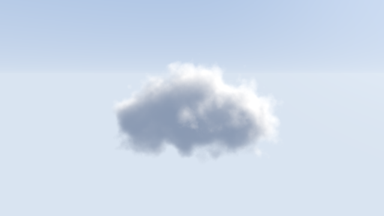
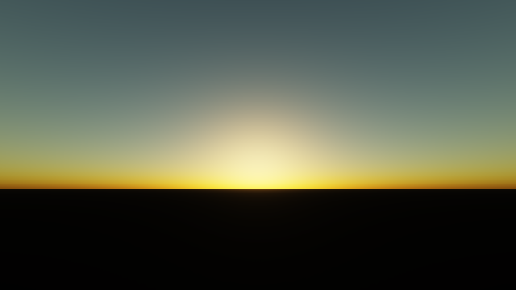

########################################################
第 16 章 ボリュームレンダリング
########################################################

雲、煙、霧のように、はっきりした表面を持たず、空間に広がって光を吸収・散乱する物体を関与媒質と呼ぶ。関与媒質を描くには、表面の 1 点ではなく、レイが媒質の中を通過する区間全体で光の変化を積分する必要がある。この手法を :term:`ボリュームレンダリング` と呼ぶ。この章では、SDF とノイズで雲の形を定義し、レイマーチングで光の吸収と散乱を積分して描く。最後に、同じ考え方を大気全体に適用し、空の色を求める。

   16_volume.frag の実行結果

.. rst-class:: example-links

:download:`16_volume.frag をダウンロード <../examples/shaders/16_volume.frag>` ｜ `ブラウザーで実行 <demos/16_volume.html>`__

関与媒質による光の減衰と散乱
============================

吸収と散乱
----------

関与媒質の中を進む光は、媒質中の粒子によって次のように変化する。

* **吸収**: 光のエネルギーが粒子に吸収されて失われる。
* **外への散乱**: 光が粒子に当たって別の方向に進路を変え、レイの方向から失われる。
* **内への散乱**: 別の方向から来た光（例えば太陽光）が粒子に当たり、レイの方向に進路を変えて加わる。

単位長さあたりに吸収される割合を吸収係数 :math:`\sigma_a`、散乱される割合を散乱係数 :math:`\sigma_s` と呼び、両者の和 :math:`\sigma_t = \sigma_a + \sigma_s` を消散係数と呼ぶ。

透過率
------

消散係数 :math:`\sigma_t` の媒質の中を、点 :math:`\mathbf{p}(0)` から :math:`\mathbf{p}(t)` まで進んだ光が失われずに残る割合を透過率と呼ぶ。透過率は、第 7 章のフォグと同じくランベルト・ベールの法則で表される。

.. math::

   T(t) = \exp\left(-\int_0^t \sigma_t\bigl(\mathbf{p}(s)\bigr)\, ds\right)

第 7 章では媒質が一様（:math:`\sigma_t` が定数）だったので :math:`T = e^{-\sigma t}` となった。雲のように濃さが場所によって異なる媒質では、この積分を数値的に求める。

ボリュームレンダリング方程式
----------------------------

内への散乱として太陽光が 1 回だけ散乱される場合（単一散乱）だけを考えると、視点に届く光 :math:`L` は次のように表せる。

.. math::

   L = \int_0^{t_{\max}} T(t)\, \sigma_s\bigl(\mathbf{p}(t)\bigr)\, L_s\bigl(\mathbf{p}(t)\bigr)\, dt
       + T(t_{\max})\, L_{\text{bg}}

第 1 項は、レイ上の各点で散乱されてレイの方向に加わった光 :math:`L_s` が、視点に届くまでに :math:`T(t)` だけ減衰したものの総和である。第 2 項は、媒質を透過して見える背景 :math:`L_{\text{bg}}` （空）の光である。

点 :math:`\mathbf{p}` で散乱される光 :math:`L_s` は、太陽から :math:`\mathbf{p}` までの透過率 :math:`T_{\text{light}}` と、位相関数 :math:`p(\theta)` で決まる。

.. math::

   L_s(\mathbf{p}) = p(\theta)\, T_{\text{light}}(\mathbf{p})\, L_{\text{sun}} + L_{\text{ambient}}

:math:`\theta` は太陽光の進行方向と散乱後の方向（視点に向かう方向）のなす角である。:math:`L_{\text{ambient}}` は、空から届く光による散乱を定数で近似した項である。

位相関数
--------

位相関数 :math:`p(\theta)` は、光が散乱される方向の分布を表す。全方向に均等に散乱される場合は :math:`p = 1/(4\pi)` である。雲の水滴は光を前方（元の進行方向に近い方向）に強く散乱する性質があり、太陽の方を向いて雲を見ると、雲の縁が明るく輝いて見える。この性質は、次の Henyey-Greenstein 位相関数でよく表される。

.. math::

   p(\theta) = \frac{1}{4\pi} \frac{1 - g^2}{\bigl(1 + g^2 - 2g\cos\theta\bigr)^{3/2}}

:math:`g \in (-1, 1)` は散乱の偏りを表し、正の値ほど前方に散乱しやすい。サンプルでは、計算を簡単にするために、定数とべき乗の和で前方散乱を近似した関数を使っている。

雲の形の定義
============

雲の密度は、大まかな形を SDF で、細かな凹凸をノイズで表す。

ノイズ
------

細かな凹凸には、第 10 章の値ノイズと fBm を 3 次元に拡張したものを使う。2 次元では正方形の 4 頂点の値を補間したが、3 次元では立方体の 8 頂点の値を補間する。ハッシュ関数は第 10 章と同じ PCG ハッシュで、3 つの座標を順にハッシュ関数に通して組み合わせる。

.. literalinclude:: ../examples/shaders/16_volume.frag
   :language: glsl
   :linenos:
   :lineno-match:
   :lines: {glsl:16_volume.frag:pcgHash..fbm}
   :caption: 16_volume.frag（抜粋）

雲の密度は陰影に直接は現れないため、補間には計算の軽い 3 次のエルミート補間を使っている。fBm では、オクターブごとの格子点が揃わないように、周波数の倍率を 2 ではなく 2.02 にしている。

密度
----

3 つの球を smooth min でつないだ SDF を雲の大まかな形とし、その値を fBm で揺らしてから密度に変換する。

.. literalinclude:: ../examples/shaders/16_volume.frag
   :language: glsl
   :linenos:
   :lineno-match:
   :lines: {glsl:16_volume.frag:sdCloudShape..density}
   :caption: 16_volume.frag（抜粋）

ノイズで揺らした SDF が負になる場所を雲の内部とし、内部に入るほど密度が大きくなるようにしている。ノイズの項 ``EROSION * (fbm(3.0 * q) - 0.5) * 2.0`` は :math:`-\mathrm{EROSION}` 以上なので、大まかな形の SDF が ``EROSION`` より大きい場所では密度は必ず 0 になる。この性質は、後で空の空間を飛ばすときに使う。

積分の計算
==========

離散化
------

ボリュームレンダリング方程式の積分は、レイを一定の歩幅 :math:`\Delta t` で進みながら、区間ごとの寄与を足し合わせて求める。区間 :math:`i` の中で密度が一定とみなすと、その区間で吸収・散乱される割合は :math:`\alpha_i = 1 - e^{-\sigma_t \Delta t}` である。サンプルでは、散乱係数と消散係数が等しい（吸収が無い）と仮定し、次の手順で積分する。

.. math::

   L \mathrel{+}= T\, \alpha_i\, L_s(\mathbf{p}_i), \qquad T \mathrel{\times}= 1 - \alpha_i

最後に、残った透過率 :math:`T` を背景の空の色に掛けて加える。雲の奥まで進んで :math:`T` がほぼ 0 になったら、それ以降の寄与は無視できるので、ループを打ち切る。

.. literalinclude:: ../examples/shaders/16_volume.frag
   :language: glsl
   :linenos:
   :lineno-match:
   :lines: {glsl:16_volume.frag:render}
   :caption: 16_volume.frag（抜粋）

SDF による空の空間の飛ばし
--------------------------

一定の歩幅で進むと、雲の外の何も無い空間でも多くの反復を費やしてしまう。そこで、雲の外では大まかな形の SDF を使って、密度が 0 であることが保証された距離だけ一気に進む。前節で述べたとおり、大まかな形の SDF が ``EROSION`` より大きい場所では密度が 0 なので、``shape - EROSION`` だけ進んでも雲を飛ばすことはない。スフィアトレーシングとボリュームレンダリングを組み合わせることで、計算量を大きく減らせる。

太陽光の透過率
--------------

各点での太陽光の透過率 :math:`T_{\text{light}}` も、光源の方向に少しずつ進んで密度を足し合わせて求める。

.. literalinclude:: ../examples/shaders/16_volume.frag
   :language: glsl
   :linenos:
   :lineno-match:
   :lines: {glsl:16_volume.frag:lightTransmittance}
   :caption: 16_volume.frag（抜粋）

視線方向の反復 1 回ごとにこの反復が入るため、計算量は両者の反復回数の積になる。光源に向かう方向の反復回数 ``LIGHT_STEPS`` は、見た目が大きく変わらない範囲でなるべく小さくする。

縞模様の抑制
------------

一定の歩幅で進むと、すべてのピクセルでサンプリングする位置が揃うため、雲の中に等高線のような縞模様が現れる。サンプルでは、ピクセルの座標とフレーム番号をハッシュ関数に通して得た乱数 ``jitter`` で開始位置をずらし、縞模様を細かいノイズに置き換えている。ノイズは縞模様よりも目立ちにくく、複数のフレームを平均すれば消える。

ここで使っている乱数は、ハッシュ関数で作った白色ノイズ（第 10 章）で、隣り合うピクセルの値に相関が無い。そのため、たまたま近い値が固まった場所が、粗い斑点として見える。これに対し、隣り合うピクセルの値がなるべく異なるように並べた乱数を :term:`ブルーノイズ` と呼ぶ。ブルーノイズは低い周波数の成分が少なく、高い周波数の成分だけからなるため、同じサンプル数でもノイズが細かく均一に見え、目立ちにくい。ブルーノイズは計算で作るのが難しいので、あらかじめ作成したテクスチャ（Peters による公開データなど）を読み込んで使うのが一般的である。ジッターのほか、第 17 章のパストレーシングのサンプリングや、ディザリングにも使われる。

大気の散乱
==========

第 7 章では、空の色を地平線から天頂への単純なグラデーションで描いた。実際の空の色は、太陽の光が大気中の分子やエアロゾル（微粒子）で散乱されることで生まれる。この章の関与媒質の考え方を大気全体に適用すると、昼の青空から夕焼けまでを 1 つのモデルで描ける。この手法は Nishita ら（1993）による単一散乱のモデルに基づく。

   16_atmosphere.frag の実行結果（太陽が地平線の近くにあるとき）

.. rst-class:: example-links

:download:`16_atmosphere.frag をダウンロード <../examples/shaders/16_atmosphere.frag>` ｜ `ブラウザーで実行 <demos/16_atmosphere.html>`__

2 種類の散乱
------------

大気による散乱は、粒子の大きさによって性質が大きく異なる。

.. list-table::
   :header-rows: 1
   :widths: 20 40 40

   * - 散乱
     - レイリー散乱
     - ミー散乱
   * - 原因
     - 空気の分子（光の波長よりずっと小さい）
     - エアロゾル（光の波長と同程度の大きさ）
   * - 波長への依存
     - 波長の 4 乗に反比例する。青い光ほど強く散乱する
     - ほとんど依存しない（白っぽく散乱する）
   * - 散乱の方向
     - 前方と後方に対称
     - 前方に強く偏る
   * - 見え方
     - 空の青、夕焼けの赤
     - 太陽のまわりの白いかさ、かすみ

昼の空が青いのは、青い光がレイリー散乱で空全体に散らばるためである。夕方に太陽が地平線に近づくと、太陽の光は大気の中を長い距離通ってくるため、青い光が途中で散乱されて失われ、残った赤や橙の光が届く。

大気のモデル
------------

地球を半径 :math:`R_E = 6360` km の球、大気の上端を半径 :math:`R_A = 6420` km の球とする。粒子の密度は高さ :math:`h` とともに指数関数的に減少するとし、レイリー散乱とミー散乱のそれぞれについて、海面での散乱係数 :math:`\beta` とスケールハイト :math:`H` （密度が :math:`1/e` になる高さ）で表す。

.. math::

   \beta_R(h) = \beta_R(0)\, e^{-h/H_R}, \qquad \beta_M(h) = \beta_M(0)\, e^{-h/H_M}

サンプルでは、:math:`\beta_R(0) = (5.8, 13.5, 33.1) \times 10^{-6}\ \text{m}^{-1}` （RGB）、:math:`H_R = 8` km、:math:`\beta_M(0) = 21 \times 10^{-6}\ \text{m}^{-1}`、:math:`H_M = 1.2` km としている。

単一散乱の積分
--------------

視点から方向 :math:`\hat{\mathbf{d}}` を見たときに届く光は、この章の前半で説明したボリュームレンダリング方程式と同じ形で書ける。視線上の各点 :math:`\mathbf{p}` で、太陽から :math:`\mathbf{p}` まで届いた光が散乱され、:math:`\mathbf{p}` から視点までの間で減衰する。

.. math::

   L = \int_0^{t_{\max}} \bigl(\beta_R(h)\, P_R(\theta) + \beta_M(h)\, P_M(\theta)\bigr)\,
       T(\text{太陽} \to \mathbf{p} \to \text{視点})\, E_{\text{sun}}\, dt

:math:`P_R, P_M` はそれぞれの位相関数、:math:`\theta` は視線と太陽の方向のなす角、:math:`T` は太陽から :math:`\mathbf{p}` を経て視点に至る経路全体の透過率である。透過率は、経路上の光学的深さ（密度 × 距離の積分）から求める。

.. math::

   T = \exp\Bigl(-\beta_R(0)\, D_R - 1.1\, \beta_M(0)\, D_M\Bigr)

:math:`D_R, D_M` は、それぞれの密度（海面を 1 とする）を経路に沿って積分した値である。ミー散乱の係数に掛けている 1.1 は、エアロゾルによる吸収を含めた消散係数を散乱係数から近似するための係数である。

.. literalinclude:: ../examples/shaders/16_atmosphere.frag
   :language: glsl
   :linenos:
   :lineno-match:
   :lines: {glsl:16_atmosphere.frag:skyRadiance}
   :caption: 16_atmosphere.frag（抜粋）

視線方向の積分では 16 点、各点から太陽の方向の積分では 8 点で密度を評価している。大気と地面の範囲は、レイと球の交点を解析的に求めて決める（関数 ``raySphere``）。形状が単純な球なので、ここではスフィアトレーシングを使う必要がない。

位相関数には、レイリー散乱に :math:`P_R(\theta) = \frac{3}{16\pi}(1 + \cos^2\theta)` を、ミー散乱に Henyey-Greenstein 位相関数を改良した Cornette-Shanks の式を使っている。ミー散乱の :math:`g = 0.76` は、太陽のまわりの明るいかさを作る。

この単一散乱のモデルでは、一度散乱された光がもう一度散乱される多重散乱を無視している。そのため、日没後の空や、エアロゾルの多いかすんだ空は、実際より暗くなる。多重散乱まで含めて計算した結果を、あらかじめテクスチャに保存しておく方法（Bruneton and Neyret, 2008 など）が、ゲームなどで広く使われている。
