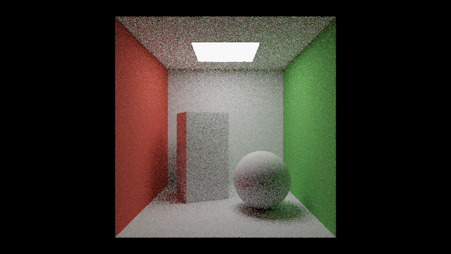
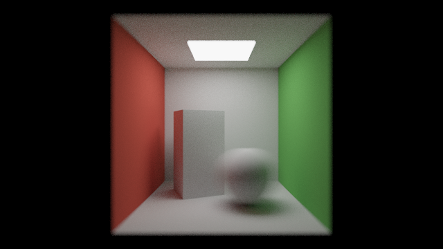

########################################################
第 17 章 パストレーシング
########################################################

本編の照明モデルでは、光源から直接届く光と、天空光を定数で近似した環境光だけを考えていた。現実の世界では、光は物体の間で何度も反射し、例えば赤い壁の近くにある白い物体はわずかに赤みを帯びる。このように、他の物体で反射してから届く光を間接光と呼ぶ。この章では、間接光を含めて光の振る舞いを物理的に計算する :term:`パストレーシング` を、レイマーチングの上に実装する。後半では、複数パスの描画によるフレーム間の蓄積と、同じ枠組みで実現できる被写界深度とモーションブラーを扱う。

   17_path_tracing.frag の実行結果。白い物体の側面が、近くの壁の色を反射して赤や緑を帯びている。

.. rst-class:: example-links

:download:`17_path_tracing.frag をダウンロード <../examples/shaders/17_path_tracing.frag>` ｜ `ブラウザーで実行 <demos/17_path_tracing.html>`__

このサンプルは計算量が大きい。ブラウザーでの表示が遅い場合は、ウィンドウを小さくするか、ファイルの先頭の ``SAMPLES`` を小さくする。

レンダリング方程式
==================

表面上の点 :math:`\mathbf{x}` から方向 :math:`\hat{\omega}_o` に出ていく光の放射輝度 :math:`L_o` は、次のレンダリング方程式で表される（Kajiya, 1986）。

.. math::

   L_o(\mathbf{x}, \hat{\omega}_o) = L_e(\mathbf{x}, \hat{\omega}_o)
   + \int_{\Omega} f_r(\mathbf{x}, \hat{\omega}_i, \hat{\omega}_o)\,
     L_i(\mathbf{x}, \hat{\omega}_i)\, (\hat{\mathbf{n}} \cdot \hat{\omega}_i)\, d\omega_i

.. list-table::
   :header-rows: 1
   :widths: 30 70

   * - 記号
     - 意味
   * - :math:`L_e`
     - 表面自身が発する光（光源でなければ 0）
   * - :math:`\Omega`
     - 法線 :math:`\hat{\mathbf{n}}` のまわりの半球
   * - :math:`f_r`
     - BRDF（双方向反射率分布関数）。方向 :math:`\hat{\omega}_i` から入った光が方向 :math:`\hat{\omega}_o` に反射される割合
   * - :math:`L_i`
     - 方向 :math:`\hat{\omega}_i` から :math:`\mathbf{x}` に入ってくる光

右辺の :math:`L_i` は、方向 :math:`\hat{\omega}_i` に見える別の表面の :math:`L_o` そのものである。つまりレンダリング方程式は、未知の関数 :math:`L` が積分の中にも現れる積分方程式になっている。

モンテカルロ積分
================

レンダリング方程式の積分は解析的に解けないので、乱数を使って近似する。確率密度 :math:`p(\hat{\omega})` に従って方向 :math:`\hat{\omega}_k` を :math:`N` 個選ぶと、積分は次の式で推定できる。

.. math::

   \int_{\Omega} g(\hat{\omega})\, d\omega \approx \frac{1}{N} \sum_{k=1}^{N} \frac{g(\hat{\omega}_k)}{p(\hat{\omega}_k)}

この推定値の期待値は真の積分値に一致し、誤差（標準偏差）は :math:`1/\sqrt{N}` に比例して小さくなる。

パストレーシングでは、表面に当たるたびに 1 つの方向を選んで次のレイを飛ばし、この操作を繰り返して 1 本の経路（パス）を作る。1 本の経路から得られる値は誤差が大きいが、1 ピクセルにつき多数の経路の結果を平均することで、正しい値に近づける。

拡散反射面の重点サンプリング
============================

方向を選ぶ確率密度 :math:`p` は、被積分関数の形に近いほど誤差が小さくなる。これを重点サンプリングと呼ぶ。ランバート反射面の BRDF は :math:`f_r = \rho / \pi` で一定なので、被積分関数は :math:`\cos\theta` に比例する。そこで、:math:`p(\hat{\omega}) = \cos\theta / \pi` に従って方向を選ぶと、推定値の係数は次のようにアルベドだけになる。

.. math::

   \frac{f_r \cos\theta}{p} = \frac{(\rho/\pi) \cos\theta}{\cos\theta / \pi} = \rho

:math:`\cos\theta` に比例する方向は、2 つの一様乱数 :math:`u_1, u_2 \in [0, 1)` から次のように作れる。単位円板上に一様に点を選び、それを半球に持ち上げる方法である。

.. math::

   r = \sqrt{u_1}, \quad \phi = 2\pi u_2, \qquad
   \hat{\omega} = r\cos\phi\, \hat{\mathbf{t}} + r\sin\phi\, \hat{\mathbf{b}} + \sqrt{1 - u_1}\, \hat{\mathbf{n}}

:math:`\hat{\mathbf{t}}` と :math:`\hat{\mathbf{b}}` は、法線 :math:`\hat{\mathbf{n}}` に直交する 2 つの単位ベクトルである。

.. literalinclude:: ../examples/shaders/17_path_tracing.frag
   :language: glsl
   :linenos:
   :lineno-match:
   :lines: {glsl:17_path_tracing.frag:cosineSampleHemisphere}
   :caption: 17_path_tracing.frag（抜粋）

乱数の生成
----------

乱数には、第 10 章の PCG ハッシュを使う。第 10 章や第 16 章では座標をハッシュ関数に通して 1 つの値を得たが、パストレーシングでは 1 つのピクセルで多数の乱数が必要になる。そこで、ピクセルの座標とフレーム番号から初期値（シード）を作り、乱数を 1 つ生成するたびにシードをハッシュ関数に通して更新する。こうすると、ハッシュ関数を CPU の乱数生成器のように使って、乱数の列を作れる。

.. literalinclude:: ../examples/shaders/17_path_tracing.frag
   :language: glsl
   :linenos:
   :lineno-match:
   :lines: {glsl:17_path_tracing.frag:seed..random}
   :caption: 17_path_tracing.frag（抜粋）

光源の直接サンプリング
======================

前節の方法だけで経路を作ると、経路が光源に当たったときにだけ光が得られる。光源が小さいと、ほとんどの経路が光源に当たらず、結果は非常にノイズの多い画像になる。

そこで、表面に当たるたびに、光源上の 1 点を直接選んでシャドウレイを飛ばし、その点からの光を加える。この方法を :term:`Next Event Estimation` （NEE）と呼ぶ。光源上の点を面積 :math:`A` の光源から一様に選ぶと（確率密度 :math:`1/A`）、立体角と面積の関係 :math:`d\omega = \cos\theta' \, dA / r^2` から、直接光の推定値は次のようになる。

.. math::

   L_{\text{direct}} \approx f_r\, L_e\, \frac{\cos\theta\, \cos\theta'}{r^2}\, A\, V

:math:`\theta` は表面の法線と光源への方向のなす角、:math:`\theta'` は光源の法線と表面への方向のなす角、:math:`r` は 2 点間の距離、:math:`V` はシャドウレイが遮られなければ 1、遮られれば 0 である。

.. literalinclude:: ../examples/shaders/17_path_tracing.frag
   :language: glsl
   :linenos:
   :lineno-match:
   :lines: {glsl:17_path_tracing.frag:LIGHT_Y..sampleDirectLight}
   :caption: 17_path_tracing.frag（抜粋）

直接光を NEE で数えるので、経路が偶然光源に当たったときに光源の光を加えると、同じ光を 2 回数えることになる。そのため、経路の途中で光源に当たった場合は光を加えない。視点から光源が直接見える場合（最初のレイが光源に当たった場合）だけは、NEE では数えていないので加える。

経路の追跡
==========

以上をまとめたものが、1 本の経路をたどる関数 ``tracePath`` である。第 11 章と同じく、再帰呼び出しの代わりにループとスループットを使う。

.. literalinclude:: ../examples/shaders/17_path_tracing.frag
   :language: glsl
   :linenos:
   :lineno-match:
   :lines: {glsl:17_path_tracing.frag:tracePath}
   :caption: 17_path_tracing.frag（抜粋）

経路は ``MAX_DEPTH`` 回の反射で打ち切っている。打ち切ると、それより多く反射した光が失われるため、画像はわずかに暗くなる。偏りなく打ち切るにはロシアンルーレット（確率的に経路を終了させ、生き残った経路の寄与をその確率で割る方法）を使う。

``mainImage`` では、1 ピクセルにつき ``SAMPLES`` 本の経路を追跡して平均する。ピクセル内でレイの位置をランダムにずらすことで、アンチエイリアスも同時に行っている。

.. literalinclude:: ../examples/shaders/17_path_tracing.frag
   :language: glsl
   :linenos:
   :lineno-match:
   :lines: {glsl:17_path_tracing.frag:mainImage}
   :caption: 17_path_tracing.frag（抜粋）

ノイズの低減
============

モンテカルロ積分の誤差は :math:`1/\sqrt{N}` に比例するので、ノイズを半分にするには経路の数を 4 倍にする必要がある。1 フレームで追跡できる経路の数には限りがあるため、実用的なパストレーサーでは次の方法を組み合わせる。

* **フレーム間の蓄積**: カメラとシーンが静止している間、各フレームの結果を前のフレームまでの結果に足し合わせ、実質的な経路の数を増やす（次節）。
* **多重重点サンプリング**: BRDF に基づく方向の選択と光源の直接サンプリングを、それぞれの確率密度に応じた重みで組み合わせる。
* **デノイズ**: 少ない経路数で得られたノイズの多い画像を、フィルターで滑らかにする。

フレーム間の蓄積
================

複数パスの描画
--------------

フレーム間で結果を蓄積するには、前のフレームの結果を次のフレームで読み出す必要がある。フラグメントシェーダーは画面に色を書き出すだけなので、画面の代わりにテクスチャに書き出し、次のフレームでそのテクスチャを読む。このように、1 フレームの描画を複数の段階（パス）に分ける方法を、複数パスの描画と呼ぶ。

Shadertoy では、Buffer A〜D のタブで描画結果をテクスチャに保存し、他のパスから ``iChannel0`` などで読み出せる。付属のビューアーも、Buffer A と Image の 2 つのパスに対応している。1 つのファイルの中で、次の区切りの行でパスを分ける。

.. code-block:: glsl
   :linenos:

   // ==== Buffer A ====
   // ここに Buffer A のコードを書く。iChannel0 は Buffer A 自身の前のフレーム
   void mainImage(out vec4 fragColor, in vec2 fragCoord) { ... }

   // ==== Image ====
   // ここに Image のコードを書く。iChannel0 は Buffer A の今のフレーム
   void mainImage(out vec4 fragColor, in vec2 fragCoord) { ... }

Buffer A は 32 ビット浮動小数点数のテクスチャに描画されるので、1 を超える値や、多数のフレームの合計も精度を落とさずに保存できる。テクスチャは ``texelFetch(iChannel0, ivec2(fragCoord), 0)`` のように、ピクセルの整数座標で読み出す。Shadertoy で実行する場合は、Buffer A と Image の両方のタブで ``iChannel0`` に Buffer A を設定する。なお、複数のパスで同じ関数を使う場合は、Shadertoy の Common のタブと同じく、``// ==== Common ====`` の区切りに書いたコードをすべてのパスで共有できる（第 18 章）。

蓄積の実装
----------

Buffer A では、毎フレーム少数の経路を追跡し、前のフレームまでの合計に加える。RGB に放射輝度の合計を、アルファ成分に経路の数の合計を保存しておくと、Image のパスでは合計を経路の数で割るだけで平均が得られる。最初のフレーム（``iFrame == 0``）では、前のフレームの値を読まずに 0 から始める。

.. literalinclude:: ../examples/shaders/17_progressive.frag
   :language: glsl
   :linenos:
   :lineno-match:
   :start-at: void mainImage(out vec4 fragColor, in vec2 fragCoord)
   :caption: 17_progressive.frag（抜粋。前半が Buffer A、後半が Image のパス）

.. rst-class:: example-links

:download:`17_progressive.frag をダウンロード <../examples/shaders/17_progressive.frag>` ｜ `ブラウザーで実行 <demos/17_progressive.html>`__

   17_progressive.frag の実行結果（64 フレーム、1 ピクセルあたり 256 本の経路を蓄積したもの）。手前の動く球はモーションブラーでぶれ、ピントの外れた部分はぼけている。

17_path_tracing.frag（1 ピクセルあたり 8 本）と比べると、ノイズが大きく減っていることがわかる。蓄積は、カメラやシーンが変化したら最初からやり直す必要がある。このサンプルではシーンを静止させているが、カメラを動かす場合は、``iMouse`` などの変化を検出して ``iFrame == 0`` と同じく合計を 0 に戻す。

被写界深度
==========

薄レンズモデル
--------------

これまでのカメラはピンホールカメラで、すべての距離にピントが合っていた。実際のカメラのレンズは大きさを持つため、ピントの合う距離（ピント面）から離れた物体はぼけて写る。この効果を被写界深度と呼ぶ。

被写界深度は、薄レンズモデルで簡単に表現できる。ピンホールカメラのレイがピント面と交わる点を :math:`\mathbf{f}` とする。レイの始点を、半径 :math:`a` のレンズ上のランダムな点 :math:`\mathbf{o}'` にずらし、方向を :math:`\mathbf{f}` に向かうように変える。

.. math::

   \hat{\mathbf{d}}' = \frac{\mathbf{f} - \mathbf{o}'}{|\mathbf{f} - \mathbf{o}'|}

ピント面上の点は、レンズ上のどの点から見ても同じピクセルに写るのでぼけない。ピント面から離れた点は、レンズ上の位置によって写るピクセルがずれるので、多数の経路を平均するとぼけて見える。レンズの半径 :math:`a` を大きくするほど、ぼけが大きくなる。

.. literalinclude:: ../examples/shaders/17_progressive.frag
   :language: glsl
   :linenos:
   :lineno-match:
   :lines: {glsl:17_progressive.frag:sampleDisk..cameraRay}
   :caption: 17_progressive.frag（抜粋）

レンズ上の点は、円板の中から一様に選ぶ。半径を :math:`\sqrt{u_1}` とするのは、円板の面積が半径の 2 乗に比例するためで、コサイン重み付きの半球のサンプリング（前述）と同じ考え方である。

モーションブラー
================

露光時間の間に物体が動くと、写真では物体がぶれて写る。この効果をモーションブラーと呼ぶ。被写界深度がレンズ上の位置についての積分であるのと同じように、モーションブラーは露光時間の中の時刻についての積分である。

経路ごとに露光時間の中の時刻 :math:`s \in [0, 1)` を乱数で選び、その時刻のシーンで経路を追跡する。サンプルでは、グローバル変数 ``shutterTime`` に時刻を設定し、``map`` の中で球の位置をその時刻に応じて動かしている。多数の経路を平均すると、球の位置が露光時間の間で平均され、ぶれた像になる。

被写界深度とモーションブラーは、アンチエイリアス（ピクセル内の位置）と同じく、積分する変数を 1 つ増やすだけで実現できる。モンテカルロ積分では、積分の次元が増えても、1 本の経路につき乱数を 1〜2 個増やすだけで済む。これは、パストレーシングの枠組みの大きな利点である。

発展
====

パストレーシングは、第 11 章の反射・屈折、第 12 章の物理ベースの材質、第 16 章の関与媒質も同じ枠組みで扱える。BRDF を第 12 章の GGX に置き換えたり、媒質中での散乱を経路に加えたりすることで、より写実的な画像を得られる。第 12 章で近似したサブサーフェススキャッタリングも、物体の内部で散乱を繰り返す経路を追跡すれば、物理的に正しく計算できる。詳しくは参考文献の Pharr らによる書籍を参照のこと。
