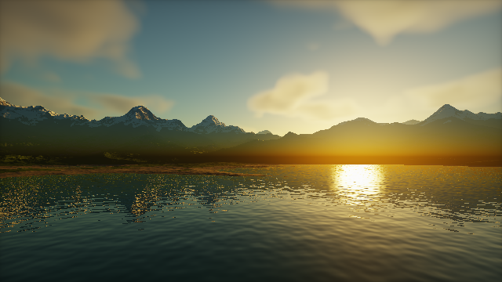
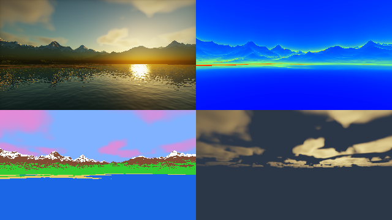

########################################################
第 18 章 実践：夕暮れの風景を描く
########################################################

第 8 章では、本編の技法を組み合わせて 1 つのシーンを作った。発展編の最後の 3 つの章では、発展編の技法を組み合わせて作品を完成させる。この章では、夕日に照らされた山々と湖、空に浮かぶ雲を描く。

発展編の各章は独立して読めるように書いているため、技法同士をどう組み合わせるかはあまり説明していない。この章では、特に次の 2 点に注目する。

* **技法同士の連携**: 大気の散乱（第 16 章）で求めた太陽の色と空の色を、地形・湖面・雲のすべての照明に使い、光の色を画面全体で一貫させる。
* **計算量の管理**: 発展編の技法はどれも計算が重い。どこにどれだけの計算を割り当てるかを考え、雲を複数パスの描画（第 17 章）で低い解像度に描くことで、計算量を減らす。

完成イメージと作品の設計
========================

   18_landscape.frag の実行結果

.. rst-class:: example-links

:download:`18_landscape.frag をダウンロード <../examples/shaders/18_landscape.frag>` ｜ `ブラウザーで実行 <demos/18_landscape.html>`__

作品を作るときは、技法を選ぶ前に、どのような絵にしたいかを決める。このシーンでは、次のように設計した。

* **構図**: 画面の下半分を湖面、中央を遠くの山並み、上半分を空とする。湖面に山と空が映り込むので、画面全体が同じ光の色でまとまる。
* **時刻と光**: 太陽の高度を約 5° の夕方にする。太陽の光は大気の中を長い距離通るため橙色になり、空は地平線の近くが明るく、天頂に向かって青くなる。
* **光の方向**: 太陽を画面の右奥に置き、山並みを逆光気味に見せる。山の手前側の斜面は天空光だけで照らされて青みを帯び、稜線と雪だけが夕日で明るくなる。
* **動き**: カメラは湖の上をゆっくり進み、雲は風とともに流れる。太陽はわずかずつ沈んでいく。

シーンの構成と計算の予算
========================

シーンを構成する要素と、使う技法を次の表に示す。

.. list-table::
   :header-rows: 1
   :widths: 15 55 30

   * - 要素
     - 技法
     - 関連する章
   * - 空と太陽
     - 大気の散乱。同じモデルで地上に届く太陽の色も求める
     - 第 16 章
   * - 山と湖岸
     - リッジノイズによる地形、距離に応じたオクターブ数、歩幅の調整
     - 第 10 章
   * - 岩・草・雪・砂
     - 高さと傾きによる材質の割り当て、GGX による鏡面反射、雪のラップライティング
     - 第 10 章、第 12 章
   * - 湖面
     - 波の法線（バンプマッピング）、フレネル反射、屈折と水中での吸収
     - 第 10 章、第 11 章
   * - 雲
     - ボリュームレンダリング、カールノイズによる流れ
     - 第 10 章、第 16 章
   * - かすみ
     - 大気の散乱による空気遠近法
     - 第 7 章、第 16 章
   * - 仕上げ
     - トーンマッピング、カラーグレーディング
     - 第 7 章

計算量の大部分を占めるのは、レイマーチングで繰り返し評価する関数である。1 ピクセルあたりの評価の回数は、最悪の場合でおおよそ次のようになる。

.. list-table::
   :header-rows: 1
   :widths: 30 40 30

   * - 処理
     - 評価の回数（ファイルの先頭の定数で決まる）
     - 備考
   * - 地形のレイマーチング
     - 地形の関数を最大 250 回（6 オクターブ）
     - 遠いほどオクターブ数を減らす
   * - 地形の法線と影
     - 法線に 4 回（最大 10 オクターブ）、影に最大 40 回（4 オクターブ）
     - 地形が見えるピクセルだけ
   * - 湖面の映り込み
     - 地形の関数を最大 100 回
     - 湖面が見えるピクセルだけ
   * - 空の色
     - 大気の密度を 12 × (1 + 4) = 60 回、これを 3 方向（視線、天頂、映り込み）
     - 毎ピクセル
   * - 雲
     - 雲の密度を 32 × (1 + 3) = 128 回
     - 1/4 の解像度で計算する

雲は 1 ピクセルあたりの評価の回数が多く、しかも空が見えるピクセルの大部分で必要になる。一方、雲は輪郭がぼんやりしていて、低い解像度で計算しても見た目がほとんど変わらない。そこで、雲だけを縦横半分（ピクセル数で 1/4）の解像度で計算し、拡大して合成する。これにより、雲の計算量は 1/4 になる。

パスの構成
==========

このサンプルは、第 17 章の複数パスの描画を使い、3 つの部分からなる。

.. list-table::
   :header-rows: 1
   :widths: 20 80

   * - パス
     - 役割
   * - Common
     - すべてのパスで共有するコード。ノイズ、大気の散乱、雲の密度、地形の高さ、カメラを定義する。
   * - Buffer A
     - 雲を 1/4 の解像度で描き、雲から届く光と雲の透過率をテクスチャに保存する。
   * - Image
     - 地形・湖面・空を描き、Buffer A の雲を合成して表示する。

Common は Shadertoy の Common のタブに当たり、付属のビューアーでは ``// ==== Common ====`` の行から次の区切りまでのコードが、すべてのパスの先頭に加えられる。複数のパスで同じ関数（例えばカメラや雲の層の位置）を使う場合に、コードの重複を避けられる。

空と太陽
========

大気の散乱のモデル（第 16 章）は、空の色だけでなく、地上に届く太陽の光の色も与える。太陽の光が大気を通過する間に減衰する割合は、第 16 章で光学的深さから求めた透過率そのものである。

.. literalinclude:: ../examples/shaders/18_landscape.frag
   :language: glsl
   :linenos:
   :lineno-match:
   :lines: {glsl:18_landscape.frag:sunDirection}
   :caption: 18_landscape.frag（抜粋）

.. literalinclude:: ../examples/shaders/18_landscape.frag
   :language: glsl
   :linenos:
   :lineno-match:
   :lines: {glsl:18_landscape.frag:sunlightAt}
   :caption: 18_landscape.frag（抜粋）

太陽の高度が低いと、太陽の光は大気の中を長い距離通るため、青い光が散乱されて失われ、橙色の光が残る。この色を地形・湖面・雲の照明に使うことで、太陽に照らされた部分が自然に夕日の色になる。照明の色を手で決めるのではなく、空と同じ物理モデルから求めているため、太陽の高度を変えても空と地上の色が食い違わない。

天空光（環境光）の色も、同じモデルで天頂方向の空の色として求める。これらの値は 1 ピクセルにつき 1 回だけ計算し、そのピクセルのすべての照明で使い回す。

地形
====

高さの関数
----------

山は、第 10 章のリッジノイズで尾根のある形にする。湖の中心からの距離に応じて、湖底の低い起伏から高い山へ滑らかにつなぐことで、湖を山が囲む地形にしている。湖面の高さは :math:`y = 0` である。

.. literalinclude:: ../examples/shaders/18_landscape.frag
   :language: glsl
   :linenos:
   :lineno-match:
   :lines: {glsl:18_landscape.frag:terrainHeight..octavesAt}
   :caption: 18_landscape.frag（抜粋）

関数 ``octavesAt`` は、距離 :math:`t` に応じてオクターブ数を減らす。距離が 2 倍になるごとに、画面上での起伏の大きさは半分になるので、オクターブを 1 つ減らしても見た目はほとんど変わらない。第 10 章の「オクターブ数の使い分け」を、距離に応じて連続的に行うものである。

レイマーチング
--------------

地形のレイマーチングでは、第 9 章の距離に比例する閾値と、第 10 章の歩幅の縮小を使う。

.. literalinclude:: ../examples/shaders/18_landscape.frag
   :language: glsl
   :linenos:
   :lineno-match:
   :lines: {glsl:18_landscape.frag:marchTerrain}
   :caption: 18_landscape.frag（抜粋）

反復回数の上限に達したレイを「当たった」ものとして扱っている点に注意する。山の稜線や湖面の映り込みでは、レイが地形の表面すれすれを進み、上限に達しやすい。これを「当たらなかった」（空が見える）として扱うと、山の輪郭や映り込みに空の色の点が散らばる。地形の近くで上限に達したレイは、ほぼ地形に当たっていると考えてよい。

材質
====

地形の各点の材質は、高さと傾き（法線の :math:`y` 成分）で決める。湖面に近い低い場所は砂、高く平らな場所は雪、低く平らな場所は草、それ以外は岩とする。境界をノイズで揺らし、材質の境目が等高線に沿った直線にならないようにしている。

.. literalinclude:: ../examples/shaders/18_landscape.frag
   :language: glsl
   :linenos:
   :lineno-match:
   :lines: {glsl:18_landscape.frag:terrainMaterial}
   :caption: 18_landscape.frag（抜粋）

照明は、第 12 章の非金属の PBR である。雪には、第 12 章のラップライティングを使い、光が雪の中で散乱して影の側に回り込む様子を近似している。間接光（環境光）は、天空光の色にベースカラーを掛け、上を向いた面ほど強くしている。

.. literalinclude:: ../examples/shaders/18_landscape.frag
   :language: glsl
   :linenos:
   :lineno-match:
   :lines: {glsl:18_landscape.frag:shadeTerrain}
   :caption: 18_landscape.frag（抜粋）

湖面
====

波
--

湖面は平面のまま、波による法線の傾きだけを第 10 章のバンプマッピングで表す。2 つの勾配ノイズを逆向きに流すことで、波が一方向に動き続けるだけの単調な動きにならないようにしている。

.. literalinclude:: ../examples/shaders/18_landscape.frag
   :language: glsl
   :linenos:
   :lineno-match:
   :lines: {glsl:18_landscape.frag:waveHeight..waterNormal}
   :caption: 18_landscape.frag（抜粋）

反射と屈折
----------

湖面の色は、第 11 章のガラスと同じく、フレネル反射率で反射と屈折を混ぜて求める。水の屈折率は 1.33 なので、垂直入射での反射率は :math:`F_0 = ((1.33 - 1)/(1.33 + 1))^2 \approx 0.02` である。カメラの近くの湖面は真上に近い角度から見るので湖底が透けて見え、遠くの湖面は浅い角度から見るので山と空が鏡のように映る。

.. literalinclude:: ../examples/shaders/18_landscape.frag
   :language: glsl
   :linenos:
   :lineno-match:
   :lines: {glsl:18_landscape.frag:shadeWater}
   :caption: 18_landscape.frag（抜粋）

* **反射**: 反射方向に地形のレイマーチングをもう一度行い、当たれば地形の色を、当たらなければ空の色を使う。映り込みの地形は、計算を減らすために影を省略している。
* **屈折**: 湖底までの深さと屈折方向から、水の中を通る距離を求め、第 16 章のランベルト・ベールの法則で減衰させる。水は赤い光を最も強く吸収するので、深い場所ほど青緑になる。
* **遠くの波**: 遠くの波は 1 ピクセルより細かくなり、法線が隣のピクセルとまったく異なる向きになってちらつく。そこで、距離に応じて法線を真上に近づけ、遠くの湖面を平らにしている。第 9 章で述べた「1 ピクセルより細かい形状は描かない」という考え方の応用である。

雲
==

雲の密度
--------

雲は、高さ 2.2 km〜3.2 km の層の中にある関与媒質として扱う。密度は 3 次元の値ノイズの fBm で作り、層の上端と下端で 0 に近づける。雲の形は、一定の風で流すとともに、第 10 章のカールノイズで位置をずらし、形が潰れずに少しずつ変化するようにしている。

.. literalinclude:: ../examples/shaders/18_landscape.frag
   :language: glsl
   :linenos:
   :lineno-match:
   :lines: {glsl:18_landscape.frag:curlField..cloudDensity}
   :caption: 18_landscape.frag（抜粋）

雲の描画
--------

雲の描画は、第 16 章のボリュームレンダリングと同じである。雲の層は平らなので、レイが層を通過する区間は、2 つの平面との交点から解析的に求められる（関数 ``cloudSlab``）。

.. literalinclude:: ../examples/shaders/18_landscape.frag
   :language: glsl
   :linenos:
   :lineno-match:
   :lines: {glsl:18_landscape.frag:renderClouds}
   :caption: 18_landscape.frag（抜粋）

雲の照明には、雲の高さで求めた太陽の色を使う。雲の高さでは太陽の光が通る大気が少し短いので、地上よりわずかに明るく黄色い光になる。位相関数は、前方散乱の強い Henyey-Greenstein の関数と、後方散乱の関数を混ぜたものを使っている。夕日の方向の雲の縁が明るく輝き、太陽と反対側の雲も真っ暗にならない。

複数パスによる雲の合成
======================

Buffer A
--------

Buffer A では、画面の左下の 1/4 の範囲だけを計算する。この範囲の座標を全画面の座標に対応させてレイを作るので、Buffer A の左下には、画面全体の雲が縦横半分の大きさで描かれる。残りのピクセルは何もせずに終える。

.. literalinclude:: ../examples/shaders/18_landscape.frag
   :language: glsl
   :linenos:
   :lineno-match:
   :lines: {glsl:18_landscape.frag:mainImage}
   :caption: 18_landscape.frag（抜粋。Buffer A のパス）

雲の結果は、雲から届く光（RGB）と、雲の透過率（アルファ成分）の 2 つである。透過率を保存しておくと、Image のパスで、雲の奥にある空の色を雲の透過率だけ残して合成できる。

拡大と合成
----------

Image のパスでは、Buffer A の 4 つのテクセルを双線形補間して、半分の解像度の雲を全画面に拡大する。付属のビューアーのテクスチャは補間を行わない設定（最近傍）なので、補間は ``texelFetch`` で 4 点を読み出して自分で行う。

.. literalinclude:: ../examples/shaders/18_landscape.frag
   :language: glsl
   :linenos:
   :lineno-match:
   :lines: {glsl:18_landscape.frag:sampleClouds}
   :caption: 18_landscape.frag（抜粋）

雲の層は山より高いので、雲は空が見える方向にだけ合成すればよい。地形や湖面が見えるピクセルでは雲を使わない。ただし、雲は低い解像度で計算しているので、山の稜線のすぐ上の雲は、拡大するときにわずかにぼやける。この誤差は雲の輪郭がもともとぼんやりしているため目立たないが、雲の層を山より低くする場合は、Buffer A でも地形との前後関係を考える必要がある。

空気遠近法と仕上げ
==================

遠くの山ほど、手前の大気で散乱された光が加わり、空の色に近づく。この効果を空気遠近法と呼ぶ。第 7 章のフォグを、大気の散乱のモデルに合わせたものである。

.. literalinclude:: ../examples/shaders/18_landscape.frag
   :language: glsl
   :linenos:
   :lineno-match:
   :lines: {glsl:18_landscape.frag:aerialPerspective}
   :caption: 18_landscape.frag（抜粋）

透過率は、海面付近のレイリー散乱とミー散乱の消散係数から求め、失われた光の分を、その方向の空の色で置き換える。高さによる大気の密度の変化を無視した近似だが、湖面の高さから数十 km 先の山を見る場面では十分に自然に見える。レイリー散乱の係数は青ほど大きいので、遠くの山は青みを帯びる。

最後に、第 7 章のトーンマッピングとカラーグレーディング（彩度の調整とビネット）を施して仕上げる。

.. literalinclude:: ../examples/shaders/18_landscape.frag
   :language: glsl
   :linenos:
   :lineno-match:
   :lines: {glsl:18_landscape.frag:renderPixel}
   :caption: 18_landscape.frag（抜粋）

デバッグ
========

大きなシェーダーでは、どの要素が見た目や計算量を決めているかを確かめながら作業を進める。デバッグ版のサンプルは、第 9 章と同じく画面を 4 分割し、通常の描画、地形の反復回数、要素の色分け、雲だけを同時に表示する。デバッグ版は、ファイルの ``DEBUG_MODE`` の値だけが異なる。

.. rst-class:: example-links

:download:`18_landscape_debug.frag をダウンロード <../examples/shaders/18_landscape_debug.frag>` ｜ `ブラウザーで実行 <demos/18_landscape_debug.html>`__

   18_landscape_debug.frag の実行結果。左上が通常の描画、右上が地形の反復回数、左下が要素の色分け（白: 雪、緑: 草、茶: 岩、黄: 砂、青: 湖面、桃: 雲）、右下が雲だけの表示である。

反復回数の表示（右上）では、山の稜線と、遠くの湖岸の付近が赤くなっている。どちらも、レイが地形の表面とほぼ平行に進む場所である。湖面が見える方向は、湖面までの距離で地形のレイマーチングを打ち切るので、反復回数が少ない（青い）。このように、計算量が大きい場所を特定してから、品質の設定（ファイルの先頭の定数）を調整する。

改造の案
========

* ``sunDirection`` の高度を変え、昼の風景や日没後の薄明を作る。太陽の色と空の色は自動的に変わる。
* ``CLOUD_COVERAGE`` を大きくして曇り空にする。
* 雲の影を地形に落とす。地形の点から太陽の方向にレイを伸ばし、雲の層で雲の密度を数点評価して、太陽の光を減衰させる。
* 第 10 章のセルラーノイズで、湖岸に岩を置く。計算が重いので、岩の近くだけで評価する（第 9 章のバウンディングボリューム）。
* 雲だけでなく、地形の影や湖面の映り込みも低い解像度で計算し、複数パスの描画で合成する。
