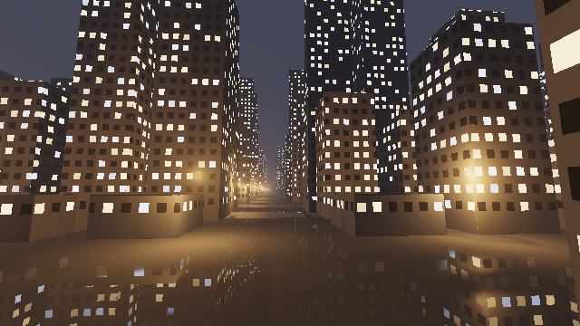
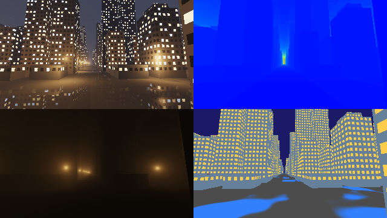

########################################################
第 19 章 実践：ボクセルの都市の夜景
########################################################

この章では、第 15 章のグリッドの走査で描いた街並みを夜景にする。窓の明かり、霧の中でにじむ街灯の光、雨に濡れた路面の映り込みを加える。第 18 章の風景では太陽という 1 つの光源で画面全体を照らしたが、夜景では多数の小さな光源が画面の印象を決める。多数の光源をどう効率よく扱うかが、この章の中心になる。

完成イメージ
============

   19_night_city.frag の実行結果

.. rst-class:: example-links

:download:`19_night_city.frag をダウンロード <../examples/shaders/19_night_city.frag>` ｜ `ブラウザーで実行 <demos/19_night_city.html>`__

カメラは大通りの上を、少し見上げながら進む。画面の明るさのほとんどは、窓の明かりと街灯という人工の光によるもので、月の光はごく弱い。

シーンの構成
============

.. list-table::
   :header-rows: 1
   :widths: 15 55 30

   * - 要素
     - 技法
     - 関連する章
   * - 街並み
     - 2D DDA とセル内のスフィアトレーシング、ハッシュによるビルの生成、大通りの配置
     - 第 10 章、第 15 章
   * - 窓の明かり
     - ハッシュによる点灯・消灯と色の決定、発光する材質
     - 第 10 章
   * - 霧の中の街灯の光
     - 一様な関与媒質での単一散乱を、セルごとに解析的に積分する
     - 第 15 章、第 16 章
   * - 街灯による照明
     - 近くの点光源だけを評価する
     - 第 5 章
   * - 濡れた路面
     - ノイズによる水たまり、フレネル反射による映り込み
     - 第 10 章、第 11 章、第 12 章
   * - 夜空と露出
     - 光害で赤みを帯びた夜空、露出を上げたトーンマッピング
     - 第 7 章

多数の光源をすべての点で評価すると、計算量が光源の数に比例して増える。この章では、光源も格子のセルに対応させて配置し、レイが通過するセルの近くの光源だけを評価する。第 15 章のグリッドの走査を、形状だけでなく光源の選択にも使うのである。

街の構成
========

第 15 章の街並みに、4 セルごとに大通りを通す。大通りのセルにはビルを置かず、交差点と大通り沿いの角に街灯を置く。

.. literalinclude:: ../examples/shaders/19_night_city.frag
   :language: glsl
   :linenos:
   :lineno-match:
   :lines: {glsl:19_night_city.frag:isAvenue..cellSDF}
   :caption: 19_night_city.frag（抜粋）

走査の関数は第 15 章とほぼ同じだが、セルを通過するたびに、そのセルで霧から散乱される光を加えている（後述）。

窓の明かり
==========

ビルの壁を細かい格子に分け、各格子を 1 つの窓とする。窓が点灯しているかどうかと、光の色（暖色か寒色か）と明るさは、窓の番号とセルの番号のハッシュ値で決める。同じ窓は常に同じ値になるので、カメラが動いても窓の明かりはちらつかない。

.. literalinclude:: ../examples/shaders/19_night_city.frag
   :language: glsl
   :linenos:
   :lineno-match:
   :lines: {glsl:19_night_city.frag:windowLight}
   :caption: 19_night_city.frag（抜粋）

窓の明かりは、照明の計算を行わずに表面の色にそのまま加える発光（emission）として扱う。窓の明かりが周囲を照らす効果は省略しているが、窓は暗い夜景の中で最も明るい要素なので、これだけで夜景らしさが大きく増す。

霧の中の街灯の光
================

点光源からの散乱の積分
----------------------

霧の中では、街灯の光が霧の粒子に散乱され、光源のまわりがぼんやりと光って見える。これを、一様な霧（消散係数 :math:`\sigma_t`、散乱係数 :math:`\sigma_s`）の中にある点光源からの単一散乱として計算する。

視線 :math:`\mathbf{o} + t\hat{\mathbf{d}}` 上の点と光源 :math:`\mathbf{L}` の距離を :math:`r(t)` とすると、点光源からの光は :math:`I / r^2` で弱まる。視線上の区間 :math:`[t_a, t_b]` で散乱されて視点に届く光は、透過率と位相関数を一定とみなすと、次の積分に比例する。

.. math::

   \int_{t_a}^{t_b} \frac{dt}{r(t)^2}, \qquad r(t)^2 = h^2 + (t - t_c)^2

:math:`t_c` は視線が光源に最も近づく位置、:math:`h` はそのときの距離である。この積分は解析的に求められる。

.. math::

   \int_{t_a}^{t_b} \frac{dt}{h^2 + (t - t_c)^2}
   = \frac{1}{h}\left(\arctan\frac{t_b - t_c}{h} - \arctan\frac{t_a - t_c}{h}\right)

レイマーチングのように区間を細かく分けて数値的に積分する必要がないので、1 つの光源につき数回の計算で済む。

.. literalinclude:: ../examples/shaders/19_night_city.frag
   :language: glsl
   :linenos:
   :lineno-match:
   :lines: {glsl:19_night_city.frag:lampInScatter}
   :caption: 19_night_city.frag（抜粋）

セルごとの積分
--------------

街灯は無数にあるので、すべての街灯について積分するわけにはいかない。点光源からの光は距離の 2 乗で弱まるので、ある区間で散乱される光の大部分は、その区間の近くの光源から来る。そこで、走査でレイが通過する各セルについて、そのセルの 4 つの角にある街灯だけを考え、セルの中の区間で積分する。

.. literalinclude:: ../examples/shaders/19_night_city.frag
   :language: glsl
   :linenos:
   :lineno-match:
   :lines: {glsl:19_night_city.frag:fogInScatter}
   :caption: 19_night_city.frag（抜粋）

各街灯の光は、その街灯に接する 4 つのセルを通過する区間でだけ数えられ、それより遠くを通るレイには届かないことになる。そのため、光のにじみの外縁はわずかに途切れるが、遠くでは光が十分弱いので目立たない。また、ビルが街灯の光を遮る効果（光の筋）は省略している。光の筋まで表現するには、視線上の各点から街灯への影を調べる必要があり、計算量が大きく増える。

霧による減衰
------------

霧による減衰と、街全体の明かりが霧で散乱される効果（夜空のぼんやりした明るさ）は、第 7 章のフォグと同じ式で加える。

.. literalinclude:: ../examples/shaders/19_night_city.frag
   :language: glsl
   :linenos:
   :lineno-match:
   :lines: {glsl:19_night_city.frag:applyFog}
   :caption: 19_night_city.frag（抜粋）

街灯による照明
==============

壁や路面を照らす街灯の光も、近くの街灯だけを評価する。表面の点の周囲 3 × 3 の角にある街灯について、ランバート反射と距離の 2 乗による減衰を計算する。影は省略している。

.. literalinclude:: ../examples/shaders/19_night_city.frag
   :language: glsl
   :linenos:
   :lineno-match:
   :lines: {glsl:19_night_city.frag:lampLighting}
   :caption: 19_night_city.frag（抜粋）

距離の 2 乗に ``0.01`` を加えているのは、光源のすぐ近くで値が無限大に発散するのを防ぐためである。

濡れた路面
==========

雨上がりの路面には、ところどころに水たまりができる。水たまりの場所は、第 10 章の値ノイズで決める。水たまりは鏡に近い滑らかな表面、乾いた路面は映り込みの弱い粗い表面として扱い、フレネル反射率で映り込みの強さを決める。

.. literalinclude:: ../examples/shaders/19_night_city.frag
   :language: glsl
   :linenos:
   :lineno-match:
   :lines: {glsl:19_night_city.frag:renderPixel}
   :caption: 19_night_city.frag（抜粋）

映り込みは、路面から反射方向に、もう一度グリッドの走査を行って求める。映り込みのレイでは、計算を減らすために霧の散乱光を省略し、走査するセルの数も少なくしている。夜景の路面の映り込みは、窓の明かりや街灯のような明るい光だけが目立つので、この程度の近似でも十分に効果がある。

カメラの位置が低いので、路面はほぼ真横から見ることになり、フレネル反射率は乾いた路面でも大きくなる。乾いた路面の映り込みが強すぎると、路面全体が水面のように見えてしまう。そこで、乾いた路面では反射率に 0.05 を掛けて、粗い表面でぼやけて弱まった映り込みを近似している。

夜空と露出
==========

夜空は、天頂は暗い紺色にし、地平線に近いほど街の明かりで赤みを帯びるようにする（光害）。星は、方向を格子に分けてハッシュ値で散らばらせている。

夜景は全体に暗いので、トーンマッピングの前に値を 3 倍して露出を上げている。写真で夜景を撮るときに、露光時間を長くするのと同じである。露出を上げると窓の明かりや街灯は白く飛びやすくなるが、トーンマッピングにより滑らかに白に近づく。

デバッグ
========

デバッグ版は、通常の描画、走査したセルの数、霧の散乱光だけ、材質の色分けを 4 分割で表示する。

.. rst-class:: example-links

:download:`19_night_city_debug.frag をダウンロード <../examples/shaders/19_night_city_debug.frag>` ｜ `ブラウザーで実行 <demos/19_night_city_debug.html>`__

   19_night_city_debug.frag の実行結果。左上が通常の描画、右上が走査したセルの数、左下が霧の散乱光だけ、右下が材質の色分け（灰: 路面、青: 水たまり、黄: 窓、灰青: 壁、赤茶: 屋上）である。

走査したセルの数（右上）は、大通りの奥に向かうレイで最も多くなる。大通りに沿って進むレイは、ビルに当たらずに多くのセルを通過するためである。霧の散乱光（左下）では、街灯の位置にだけ光がにじんでいることを確かめられる。材質の色分け（右下）では、水たまりの範囲を確かめながら、``wetness`` の閾値を調整できる。

改造の案
========

* 霧の濃さ ``FOG_SIGMA`` と ``FOG_SCATTER`` を大きくして、深い霧の夜にする。
* 窓の明かりの点灯の割合を時間とともに変え、夜が更けていく様子を表現する。
* 街灯の光の筋を表現する。視線上の数点から街灯への影を、グリッドの走査で調べる。
* 第 17 章の複数パスの描画で、ピクセル内の位置を少しずつずらした前のフレームの結果と混ぜ、窓の格子の輪郭のギザギザを減らす（時間方向のアンチエイリアス）。
