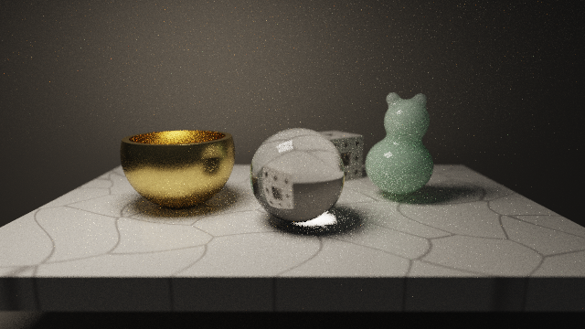
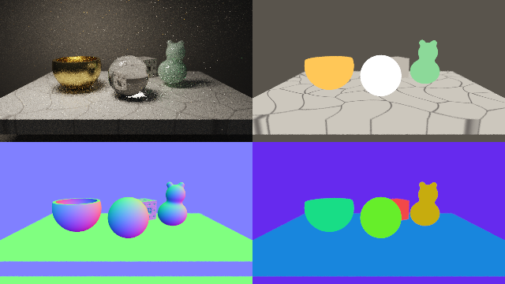

########################################################
第 20 章 実践：パストレーシングによる静物画
########################################################

この章では、大理石の台の上に、金の器、ガラスの球、翡翠の置物、メンガーのスポンジの置物を並べ、第 17 章のパストレーシングで静物画を描く。第 11 章と第 12 章では、反射・屈折・サブサーフェススキャッタリングを、1 回の描画で済む近似として扱った。この章では、これらをパストレーシングの経路の追跡に組み込み、物理的に計算し直す。近似と比べることで、どこが近似されていたのかも明らかになる。

完成イメージ
============

   20_still_life.frag の実行結果（40 フレーム、1 ピクセルあたり 80 本の経路を蓄積したもの）

.. rst-class:: example-links

:download:`20_still_life.frag をダウンロード <../examples/shaders/20_still_life.frag>` ｜ `ブラウザーで実行 <demos/20_still_life.html>`__

照明は、左上にある大きな長方形の照明（撮影用のソフトボックスに相当する）だけである。ガラスの球の下には、球で屈折した光が集まって明るくなるコースティクスが現れている。第 11 章の近似では表現できなかった効果である。

このサンプルは計算量が大きく、1 枚の絵が収束するまでに時間がかかる。リアルタイムの作品ではなく、時間をかけて 1 枚の写実的な絵を作る、オフラインのレンダリングの例として読んでほしい。

シーンの構成
============

.. list-table::
   :header-rows: 1
   :widths: 20 50 30

   * - 物体
     - 材質と技法
     - 関連する章
   * - 金の器
     - 金属。GGX の重点サンプリングと光源の直接サンプリング
     - 第 12 章、第 17 章
   * - ガラスの球
     - 誘電体。反射と屈折をフレネル反射率で確率的に選ぶ
     - 第 11 章、第 17 章
   * - 翡翠の置物
     - 内部で散乱する媒質。ランダムウォーク法
     - 第 12 章、第 16 章、第 17 章
   * - メンガーのスポンジの置物
     - 拡散反射
     - 第 13 章
   * - 大理石の台
     - セルラーノイズの脈、拡散反射とつやの 2 つの成分
     - 第 10 章、第 12 章
   * - カメラ
     - 薄レンズによる被写界深度、フレーム間の蓄積
     - 第 17 章

パスの構成は第 18 章と同じく、Common にシーンと経路の追跡を、Buffer A に蓄積を、Image に表示を置く。Buffer A と Image の処理は、第 17 章の 17_progressive.frag と同じである。

経路の追跡の全体
================

関数 ``tracePath`` は、第 17 章と同じくループとスループットで経路をたどる。各反射点では、材質に応じて次の方向を選び、スループットに重みを掛ける。

.. list-table::
   :header-rows: 1
   :widths: 20 45 35

   * - 材質
     - 次の方向の選び方
     - 光源の直接サンプリング
   * - 拡散反射
     - コサイン重み付きの半球のサンプリング
     - 行う
   * - 大理石のつや
     - GGX の重点サンプリング（確率 0.2 で選ぶ）
     - 行わない
   * - 金属
     - GGX の重点サンプリング
     - 行う
   * - ガラス
     - 反射か屈折をフレネル反射率で選ぶ
     - 行わない
   * - 翡翠
     - 表面での反射か、内部のランダムウォーク
     - 内部から出る点で行う

第 17 章で述べたとおり、光源の直接サンプリング（NEE）を行った点の次の経路が照明に当たっても、その光を加えてはいけない。同じ光を 2 回数えることになるからである。一方、ガラスのように直接サンプリングを行わない材質では、経路が照明に当たったときに光を加える必要がある。これを、変数 ``countEmission`` で管理している。

.. literalinclude:: ../examples/shaders/20_still_life.frag
   :language: glsl
   :linenos:
   :lineno-match:
   :lines: {glsl:20_still_life.frag:tracePath}
   :caption: 20_still_life.frag（抜粋）

ガラスの表面では直接サンプリングを行わない。ガラスの向こうにある照明は、屈折によって方向が変わるため、照明上の点に向かってまっすぐシャドウレイを飛ばしても、正しい寄与にならないからである。照明の光は、経路が屈折を経て偶然照明に当たったときにだけ加えられる。コースティクスの部分のノイズが減りにくいのはこのためである。

金属: GGX の重点サンプリング
============================

金の器は、第 12 章の GGX の鏡面反射を持つ金属である。パストレーシングでは、BRDF の値を評価するだけでなく、BRDF の形に沿って次の方向を選ぶ（重点サンプリング）必要がある。

GGX では、まずマイクロファセットの法線 :math:`\hat{\mathbf{h}}` を、確率密度 :math:`D(\hat{\mathbf{h}})\,(\hat{\mathbf{n}} \cdot \hat{\mathbf{h}})` に従って選ぶ。2 つの一様乱数 :math:`u_1, u_2` から、次の式で選べる。

.. math::

   \cos\theta_h = \sqrt{\frac{1 - u_1}{1 + (\alpha^2 - 1)\, u_1}}, \qquad \phi_h = 2\pi u_2

選んだ :math:`\hat{\mathbf{h}}` で視線を反射させた方向 :math:`\hat{\mathbf{l}}` が、次の経路の方向になる。このときの :math:`\hat{\mathbf{l}}` の確率密度は :math:`p(\hat{\mathbf{l}}) = D\,(\hat{\mathbf{n}} \cdot \hat{\mathbf{h}}) / (4\,(\hat{\mathbf{v}} \cdot \hat{\mathbf{h}}))` である。BRDF に余弦を掛けた値をこの確率密度で割ると、:math:`D` が打ち消され、スループットに掛ける重みは次のようになる。

.. math::

   \frac{f_{\text{spec}}\, (\hat{\mathbf{n}} \cdot \hat{\mathbf{l}})}{p(\hat{\mathbf{l}})}
   = \frac{F\, G\, (\hat{\mathbf{v}} \cdot \hat{\mathbf{h}})}
          {(\hat{\mathbf{n}} \cdot \hat{\mathbf{v}})\,(\hat{\mathbf{n}} \cdot \hat{\mathbf{h}})}

.. literalinclude:: ../examples/shaders/20_still_life.frag
   :language: glsl
   :linenos:
   :lineno-match:
   :lines: {glsl:20_still_life.frag:sampleGGX..specularBRDF}
   :caption: 20_still_life.frag（抜粋）

金属では、光源の直接サンプリングも行う。照明上の点を選び、その方向の BRDF の値（``specularBRDF``）を掛けて直接光を加える。このため、金属で反射した経路が照明に当たっても、その光は加えない。幾何減衰項の係数には、第 12 章の直接光用の値 :math:`k = (r+1)^2/8` ではなく、間接光にも使える :math:`k = \alpha/2` を使っている（Karis, 2013）。

ガラス: 反射と屈折の確率的な選択
================================

第 11 章では、ガラスの表面で反射と屈折の両方を追跡できないため、反射の成分を空の色で近似した。パストレーシングでは、反射と屈折のどちらか一方を、フレネル反射率 :math:`F` に等しい確率で選ぶ。反射を確率 :math:`F` で、屈折を確率 :math:`1 - F` で選ぶと、重み（:math:`F` または :math:`1 - F`）と選ぶ確率が打ち消し合うので、スループットは変わらない。多数の経路を平均すれば、反射と屈折の両方が正しい割合で含まれる。

ガラスの内部に入った経路は、第 11 章と同じく SDF の符号を反転させて出口を探す。出口でもフレネル反射率に従って、外に出るか内部で反射するかを選ぶ。屈折できない角度（全反射）の場合は必ず内部で反射する。サンプルでは、内部での反射を最大 4 回まで追跡している。

このように、反射と屈折を確率的に選ぶことで、ガラスに映り込む周囲の物体、ガラスを通して見える背景のゆがみ、ガラスが作るコースティクスが、すべて同じ仕組みで計算される。

翡翠: ランダムウォーク法
========================

内部での散乱
------------

翡翠の内部は、光を散乱する関与媒質（第 16 章）とみなす。表面から内部に入った光は、指数分布に従ってランダムな距離だけ進み、散乱して方向を変える。これを繰り返し、表面に達したら外に出る。この方法をランダムウォーク法と呼ぶ。

消散係数 :math:`\sigma_t` の一様な媒質の中で、光が散乱されずに距離 :math:`s` 以上進む確率は :math:`e^{-\sigma_t s}` である（第 16 章の透過率）。したがって、次に散乱されるまでの距離は、一様乱数 :math:`u` から次の式で選べる。

.. math::

   s = -\frac{\ln u}{\sigma_t}

選んだ距離 :math:`s` が表面までの距離より短ければ、その点で散乱が起こる。散乱のたびに、スループットに散乱アルベド（:math:`\sigma_s / \sigma_t`、散乱されずに吸収される割合を除いたもの）を掛け、新しい方向を全方向から一様に選ぶ（等方散乱）。散乱アルベドを RGB ごとに変えると、内部を長く通った光ほど色が付き、翡翠らしい緑色になる。

.. literalinclude:: ../examples/shaders/20_still_life.frag
   :language: glsl
   :linenos:
   :lineno-match:
   :lines: {glsl:20_still_life.frag:JADE_SIGMA_T..JADE_IOR}
   :caption: 20_still_life.frag（抜粋）

出口での扱い
------------

表面に達した経路は、外に出る。厳密には、出口でも屈折とフレネル反射を考える必要があるが、内部で多数回散乱した光は方向がほぼ一様になっているので、出口からはランバート反射と同じ分布で出ていくものとして近似している。この近似により、出口の点でも拡散反射と同じく光源の直接サンプリングを使え、ノイズが大きく減る。

第 12 章の近似（光源の方向の厚みによる透過光）と比べると、ランダムウォーク法では、光が内部で曲がった経路を通って光源から直接見えない部分にも回り込む様子や、薄い耳の部分が明るく透ける様子が、特別な処理なしに得られる。その代わり、1 本の経路の計算量が大きく、収束にも時間がかかる。

大理石の台
==========

大理石の模様は、第 10 章のセルラーノイズの :math:`F_2 - F_1` が 0 に近い場所を、細い脈として描いたものである。座標を少しゆがめてから評価し、脈が直線的になりすぎないようにしている。

大理石の表面には、拡散反射に加えて、磨かれた表面のつや（鏡面反射）がある。2 つの成分を同時に追跡することはできないので、確率 0.2 でつやの成分を、確率 0.8 で拡散反射の成分を選ぶ。選んだ成分の重みを、選んだ確率で割ることで、平均すると両方の成分が正しく含まれる。

.. literalinclude:: ../examples/shaders/20_still_life.frag
   :language: glsl
   :linenos:
   :lineno-match:
   :lines: {glsl:20_still_life.frag:marbleVeins}
   :caption: 20_still_life.frag（抜粋）

ロシアンルーレット
==================

経路の反射の回数が増えると、スループットは小さくなり、その経路の寄与も小さくなる。そのような経路を最後まで追跡するのは無駄が多い。そこで、4 回目以降の反射では、スループットの最大の成分に比例する確率で経路を続け、それ以外は打ち切る。続けた経路のスループットを、続けた確率で割ることで、打ち切った経路の分の寄与が補われ、平均すると結果は偏らない。第 17 章では、最大の反射回数で打ち切るとわずかに暗くなることを述べたが、ロシアンルーレットを使えばこの偏りを小さくしつつ、計算量を減らせる。

カメラと蓄積
============

カメラは第 17 章の薄レンズモデルで、ガラスの球にピントを合わせている。奥の翡翠の置物とメンガーのスポンジの置物は、わずかにぼける。

.. literalinclude:: ../examples/shaders/20_still_life.frag
   :language: glsl
   :linenos:
   :lineno-match:
   :lines: {glsl:20_still_life.frag:cameraRay}
   :caption: 20_still_life.frag（抜粋）

1 フレームでは 1 ピクセルあたり 2 本の経路しか追跡しないので、最初はノイズが多いが、フレームを重ねるごとに滑らかになっていく。図は 40 フレーム（1 ピクセルあたり 80 本）を蓄積したもので、まだ翡翠の内部やコースティクスの部分にノイズが残っている。ブラウザーで実行すると、時間とともにノイズが減っていく様子を確認できる。

デバッグ
========

パストレーシングでは、結果が収束するまで時間がかかるので、形状や材質の割り当ての誤りを見つけにくい。デバッグ版では、最初に当たった点のベースカラー、法線、材質を、経路を追跡せずに直接表示する。これらは 1 フレームで確定するので、すぐに確認できる。

.. rst-class:: example-links

:download:`20_still_life_debug.frag をダウンロード <../examples/shaders/20_still_life_debug.frag>` ｜ `ブラウザーで実行 <demos/20_still_life_debug.html>`__

   20_still_life_debug.frag の実行結果。左上がパストレーシング、右上がベースカラー、左下が法線、右下が材質の色分けである。

近似と限界
==========

このサンプルは、物理的に正しい計算を目指しているが、次の近似を含んでいる。

* フレネル反射率に Schlick の近似を使っている。また、屈折率の波長による違い（分散）は無視しているので、ガラスの球は虹色にならない。
* 翡翠の内部の散乱は等方散乱とし、出口での屈折を省略している。
* 光源の直接サンプリングと BRDF に基づく方向の選択を、多重重点サンプリング（第 17 章）で組み合わせていない。そのため、つやの強い大理石に映る照明などは、ノイズが減りにくい。
* ガラスを通した照明の光（コースティクス）は、経路が偶然照明に当たったときにしか数えられないため、収束が遅い。双方向パストレーシングやフォトンマッピングなどの手法を使うと効率よく計算できる。

改造の案
========

* 金の器の粗さを変え、鏡のような器や、つや消しの器にする。
* 翡翠の散乱アルベドと消散係数を変え、蝋や牛乳のような材質にする。
* 第 14 章の 4 次元の超立方体の断面を、ガラスの材質で置く。
* 照明の大きさを小さくし、影がくっきりした絵と、ノイズの減り方の違いを比べる。
