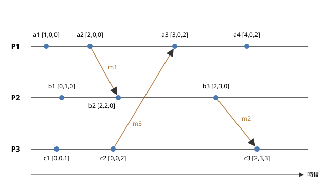

時刻と順序
==========

この章では、分散システムで「いつ」「どちらが先に」起きたかを扱う方法を説明します。1 台のコンピューターの中では、出来事の順序は明らかです。しかし、複数のノードがそれぞれ自分の時計を持つ分散システムでは、時計のずれのために、時刻を比べるだけでは出来事の順序を正しく決められません。この章では、物理的な時計の限界と NTP による同期から始め、ランポート時計とベクトル時計による論理的な順序付け、さらに物理時刻と論理時刻を組み合わせるハイブリッド論理時計と Google の TrueTime までを見ていきます。

物理時計とクロックドリフト
--------------------------

コンピューターの時計は、水晶振動子の発振を数えることで時間を測っています。水晶振動子の周波数は製造時のばらつきや温度によってわずかに変化するため、時計は正確な時刻から少しずつずれていきます。時計の進む速さのずれをクロックドリフト（clock drift）と呼び、一般に ppm（parts per million：100 万分の 1）の単位で表します。

一般的なサーバーの水晶振動子のドリフトは、数十 ppm 程度です。例えば 20 ppm のドリフトがあると、1 日（86,400 秒）でずれる時間は次のようになります。

.. math::

   86400 \times 20 \times 10^{-6} = 1.728 \ \text{秒}

1 日で 2 秒近く、1 か月放っておけば 1 分近くずれる計算です。また、ある時点で 2 つのノードの時計が示す時刻の差を、クロックスキュー（clock skew）と呼びます。ドリフトが時計の速さのずれであるのに対し、スキューは時刻そのもののずれです。ドリフトがある限り、一度時刻を合わせても、スキューは時間とともに大きくなっていきます。そのため、時計は定期的に正確な時刻源と同期する必要があります。

NTP
---

ネットワーク越しに時計を同期させるための標準的なプロトコルが、NTP（Network Time Protocol）です。NTP は 1980 年代にミルズ（David L. Mills）によって開発され、現在のバージョン 4 は RFC 5905 で定められています。

階層構造
~~~~~~~~

NTP のサーバーは、正確な時刻源からの距離によって階層（ストラタム）に分けられます。

* ストラタム 0：GPS 受信機や原子時計などの基準となる時計
* ストラタム 1：ストラタム 0 の時計に直接接続されたサーバー
* ストラタム 2：ストラタム 1 のサーバーと同期するサーバー
* 以下同様に続き、ストラタム 15 までが有効です。16 は同期していないことを表します。

一般のサーバーやパソコンは、組織の NTP サーバーや公開されている NTP サーバーと同期します。Windows は Windows Time サービス、Linux は chrony や systemd-timesyncd などのソフトウェアで時刻を同期しています。

時刻のずれの推定
~~~~~~~~~~~~~~~~

NTP のクライアントは、サーバーとの間で 4 つの時刻を記録して、時計のずれを推定します。クライアントがリクエストを送った時刻を :math:`t_1`、サーバーがそれを受け取った時刻を :math:`t_2`、サーバーがレスポンスを送った時刻を :math:`t_3`、クライアントがそれを受け取った時刻を :math:`t_4` とします。:math:`t_1` と :math:`t_4` はクライアントの時計、:math:`t_2` と :math:`t_3` はサーバーの時計で測った値です。このとき、往復の遅延 :math:`\delta` と、サーバーに対するクライアントの時計のずれであるオフセット :math:`\theta` は、次のように推定されます。

.. math::

   \delta = (t_4 - t_1) - (t_3 - t_2), \qquad
   \theta = \frac{(t_2 - t_1) + (t_3 - t_4)}{2}

往復の時間からサーバーでの処理時間を引いたものが、ネットワークの往復の遅延 :math:`\delta` です。オフセットの式は、行きと帰りの遅延が等しいと仮定して導かれています。行きと帰りの遅延が異なる場合、推定の誤差は最大で :math:`\delta / 2` になります。つまり、遅延の大きいネットワーク越しの同期ほど、精度が下がります。NTP は、複数のサーバーと何度もやり取りし、遅延の小さい測定結果を重視するなどの工夫で精度を高めています。

それでも、NTP で得られる精度には限界があります。一般に、インターネット越しの同期では数 ms から数十 ms、同じ LAN の中では 1 ms 未満程度の精度とされています。さらに高い精度が必要な場合には、ネットワーク機器のハードウェアで時刻を記録する PTP（Precision Time Protocol、IEEE 1588）が使われ、マイクロ秒以下の精度を実現できます。

時刻の巻き戻り
--------------

時計を同期させるとき、ずれを修正する方法は 2 つあります。

* ステップ：時刻を一度に正しい値に書き換えます。時計が進みすぎていた場合、時刻は過去に巻き戻ります。
* スルー（slew）：時計の進む速さをわずかに変えて、時間をかけて少しずつずれを解消します。時刻は巻き戻りませんが、修正には時間がかかります。

例えば ntpd の既定の設定では、ずれが 128 ms を超えるとステップで、それ以下ならスルーで修正します。スルーで修正する速さには上限があり、ntpd では 500 ppm、つまり 1 秒あたり 0.5 ms です。

時刻の巻き戻りは、アプリケーションにとって危険です。例えば、処理の開始と終了の時刻の差で処理時間を測っていると、途中で時刻が巻き戻ったときに処理時間が負になります。タイムアウトの判定や、ログの時刻の並び、有効期限の判定なども誤ります。仮想マシンが一時停止して再開したときや、管理者が手動で時刻を変更したときにも、時刻は大きく飛びます。

うるう秒
~~~~~~~~

時刻の不連続は、うるう秒によっても生じます。地球の自転に基づく時刻と原子時計に基づく時刻のずれを調整するため、協定世界時（UTC）には、これまで不定期に 1 秒が挿入されてきました。挿入時には、23 時 59 分 59 秒の次に 23 時 59 分 60 秒が入ります。多くのシステムはこの 60 秒をうまく扱えず、同じ時刻が 2 回現れるような処理になります。2012 年のうるう秒では、Linux カーネルの不具合などによって、多くのサーバーで障害が発生しました。

この問題を避けるため、Google などは、うるう秒の前後の長い時間（例えば 24 時間）をかけて時計の速さをわずかに変え、1 秒のずれを少しずつ吸収するリープスミア（leap smear）という方法を使っています。なお、2022 年の国際度量衡総会では、2035 年までにうるう秒の挿入をやめる方向が決議されています。

単調時計
--------

時刻の巻き戻りから処理時間の計測を守るために、OS は 2 種類の時計を提供しています。

.. list-table:: 時刻の時計と単調時計
   :header-rows: 1
   :widths: 20 40 40

   * - 観点
     - 時刻の時計（wall clock）
     - 単調時計（monotonic clock）
   * - 表すもの
     - 現在の日付と時刻（1970 年 1 月 1 日からの経過秒数など）
     - ある任意の時点からの経過時間
   * - 巻き戻り
     - NTP の修正や手動の変更で巻き戻ることがあります
     - 決して巻き戻りません
   * - 異なるノードの間での比較
     - 同期の精度の範囲で比較できます
     - 意味がありません（起点がノードごとに異なります）
   * - Python の関数
     - ``time.time()``
     - ``time.monotonic()``
   * - Linux のクロック
     - ``CLOCK_REALTIME``
     - ``CLOCK_MONOTONIC``

処理時間やタイムアウトを測るときは、必ず単調時計を使います。Python では次のように書きます。

.. code-block:: python
   :linenos:

   import time

   start = time.monotonic()
   do_something()
   elapsed = time.monotonic() - start  # 時刻が修正されても負にならない
   print(f"{elapsed:.3f} 秒")

一方、単調時計の値は、そのノードの中でしか意味を持ちません。異なるノードで起きた出来事の時刻を比べるには、時刻の時計を使うしかありませんが、その精度は NTP の同期の精度に制限されます。

順序が必要な理由
----------------

分散システムでは、出来事の順序が重要になる場面が数多くあります。

* 同じデータに対する複数の更新を、どの順に適用するかを決めます。
* ログを集めて、障害の原因となった出来事の連鎖を調べます。
* ある操作が、それより前の操作の結果を見たうえで実行されたことを保証します。
* スナップショットを作るときに、どの更新までを含めるかを決めます。

最も単純な方法は、各ノードの時計の時刻を出来事に付け、時刻の順に並べることです。しかし、この方法は時計のずれによって簡単に誤ります。

例えば、2 つのレプリカ A と B を持つデータストアで、各書き込みにそのレプリカの時刻を付け、同じキーに複数の書き込みがあれば時刻の新しいものを残す（LWW：Last Write Wins）とします。レプリカ A の時計が 100 ms 進んでいるとき、次のことが起こります。

#. 実際の時刻 12:00:00.000 に、クライアント 1 がレプリカ A に :math:`x = 1` を書き込みます。A の時計では 12:00:00.100 と記録されます。
#. 実際の時刻 12:00:00.050 に、クライアント 2 がレプリカ B に :math:`x = 2` を書き込みます。B の時計は正確なので、12:00:00.050 と記録されます。
#. 2 つのレプリカが同期すると、時刻の新しい :math:`x = 1` が残り、実際には後から書き込まれた :math:`x = 2` は黙って失われます。

時計のずれが数 ms から数十 ms ある以上、その範囲で起きた出来事の順序を時刻から正しく決めることはできません。そこで、物理的な時刻ではなく、出来事の間の因果関係に基づいて順序を定める方法が考え出されました。

happened-before 関係
--------------------

1978 年、ランポート（Leslie Lamport）は論文「Time, Clocks, and the Ordering of Events in a Distributed System」で、分散システムの出来事の順序を因果関係によって定義しました。

ここでは、分散システムを、メッセージを送り合う複数のプロセスからなるものと考えます。各プロセスで起きる出来事をイベントと呼び、イベントには、プロセスの中だけで完結する内部イベント、メッセージの送信、メッセージの受信の 3 種類があります。

ランポートは、イベントの間の「前に起きた」ことを表す happened-before 関係 :math:`\rightarrow` を、次の 3 つの規則で定義しました。

#. :math:`a` と :math:`b` が同じプロセスのイベントで、:math:`a` が :math:`b` より先に起きたなら、:math:`a \rightarrow b` です。
#. :math:`a` があるメッセージの送信で、:math:`b` が同じメッセージの受信なら、:math:`a \rightarrow b` です。
#. :math:`a \rightarrow b` かつ :math:`b \rightarrow c` なら、:math:`a \rightarrow c` です（推移律）。

:math:`a \rightarrow b` は、「:math:`a` の影響が :math:`b` に及び得る」ことを意味します。同じプロセスの中では前のイベントの結果が後のイベントに引き継がれ、プロセスの間ではメッセージを通じて情報が伝わるからです。

一方、:math:`a \rightarrow b` でも :math:`b \rightarrow a` でもないとき、:math:`a` と :math:`b` は並行（concurrent）であるといい、:math:`a \parallel b` と書きます。

.. math::

   a \parallel b \iff \neg (a \rightarrow b) \wedge \neg (b \rightarrow a)

並行な 2 つのイベントは、互いに影響を及ぼし合うことができません。物理的な時刻ではどちらかが先に起きていたとしても、システムの振る舞いに関する限り、その前後は意味を持ちません。happened-before 関係は、すべてのイベントの組について前後を決めるものではなく、因果関係のあるイベントの間だけで順序を決める半順序です。

ランポート時計
--------------

happened-before 関係を、各イベントに付ける数値で表す方法がランポート時計（Lamport clock）です。ランポート時計は、物理的な時刻とは無関係な、単なるカウンターです。このような時計を論理時計と呼びます。

各プロセス :math:`P_i` は、初期値が 0 のカウンター :math:`C_i` を持ち、次の規則に従って値を更新します。

* 規則 1：内部イベントとメッセージの送信の前に、カウンターを 1 増やします。送信するメッセージには、増やした後の値をタイムスタンプとして付けます。

  .. math::

     C_i \leftarrow C_i + 1

* 規則 2：タイムスタンプ :math:`t` の付いたメッセージを受信したら、自分のカウンターと :math:`t` の大きい方に 1 を足した値をカウンターにします。

  .. math::

     C_i \leftarrow \max(C_i, t) + 1

各イベント :math:`e` には、更新した後のカウンターの値 :math:`C(e)` を割り当てます。この規則によって、次の性質（時計条件）が成り立ちます。

.. math::

   a \rightarrow b \implies C(a) < C(b)

同じプロセスの中ではカウンターが増え続けるので、後のイベントほど値が大きくなります。また、受信イベントの値は、送信イベントの値（メッセージのタイムスタンプ）より必ず大きくなります。推移律により、因果関係の連鎖をたどっても値は増え続けます。

ただし、逆は成り立ちません。:math:`C(a) < C(b)` であっても、:math:`a \rightarrow b` とは限りません。:math:`a` と :math:`b` が並行である可能性があるからです。ランポート時計の値を比べても、2 つのイベントが因果関係にあるのか並行なのかは分かりません。

全順序化
~~~~~~~~

ランポート時計では、異なるプロセスのイベントが同じ値を持つことがあります。そこで、値が同じ場合はプロセスの ID で順序を決めることにすると、すべてのイベントを 1 列に並べる全順序が得られます。イベント :math:`a` がプロセス :math:`P_i` で、:math:`b` がプロセス :math:`P_j` で起きたとき、全順序 :math:`\Rightarrow` を次のように定めます。

.. math::

   a \Rightarrow b \iff C(a) < C(b) \ \vee \ \bigl(C(a) = C(b) \wedge i < j\bigr)

この全順序は、happened-before 関係と矛盾しません。つまり、:math:`a \rightarrow b` なら必ず :math:`a \Rightarrow b` です。並行なイベントの間の順序は任意に決まりますが、すべてのノードが同じ規則で並べれば、すべてのノードが同じ順序に合意できます。ランポートは論文の中で、この全順序を使って、中央の管理者なしに相互排除（ロック）を実現する方法を示しました。すべてのノードが同じ順序で同じ要求を処理すれば同じ状態になるという考え方は、複製状態機械と呼ばれ、レプリケーションの基礎となる重要なものです（「:doc:`d08_consensus`」を参照）。

サンプルで確かめる
~~~~~~~~~~~~~~~~~~

サンプルコード :download:`lamport_clock.py <../examples/lamport_clock.py>` は、3 つのプロセス P1、P2、P3 が、決められたシナリオで内部イベント、送信、受信を行うときのランポート時計の値を計算し、全順序で並べて表示するものです。シナリオは次のとおりで、後で説明するベクトル時計のサンプルと共通です。

.. list-table:: サンプルのシナリオ
   :header-rows: 1
   :widths: 15 85

   * - プロセス
     - イベント（起きる順）
   * - P1
     - a1 内部、a2 m1 を P2 へ送信、a3 m3 を P3 から受信、a4 内部
   * - P2
     - b1 内部、b2 m1 を P1 から受信、b3 m2 を P3 へ送信
   * - P3
     - c1 内部、c2 m3 を P1 へ送信、c3 m2 を P2 から受信

.. literalinclude:: ../examples/lamport_clock.py
   :language: python
   :linenos:
   :caption: lamport_clock.py

実行結果は次のとおりです。

.. code-block:: text

   イベントの処理（実行順）
     a1 P1 内部           L = 1  (0 + 1)
     b1 P2 内部           L = 1  (0 + 1)
     c1 P3 内部           L = 1  (0 + 1)
     a2 P1 送信 m1 → P2   L = 2  (1 + 1)
     c2 P3 送信 m3 → P1   L = 2  (1 + 1)
     b2 P2 受信 m1 ← P1   L = 3  (max(1, 2) + 1)
     a3 P1 受信 m3 ← P3   L = 3  (max(2, 2) + 1)
     b3 P2 送信 m2 → P3   L = 4  (3 + 1)
     a4 P1 内部           L = 4  (3 + 1)
     c3 P3 受信 m2 ← P2   L = 5  (max(2, 4) + 1)

   プロセスごとのタイムスタンプ
     P1: a1=1, a2=2, a3=3, a4=4
     P2: b1=1, b2=3, b3=4
     P3: c1=1, c2=2, c3=5

   全順序（タイムスタンプ, プロセス ID の順に並べる）
     a1(1,1) < b1(1,2) < c1(1,3) < a2(2,1) < c2(2,3)
     < a3(3,1) < b2(3,2) < a4(4,1) < b3(4,2) < c3(5,3)

例えば b2 は、P2 自身のカウンターが 1 のときに、タイムスタンプ 2 の付いた m1 を受信したので、:math:`\max(1, 2) + 1 = 3` になります。c3 は、自分のカウンター 2 とメッセージ m2 のタイムスタンプ 4 から、:math:`\max(2, 4) + 1 = 5` になります。

この結果からも、ランポート時計の限界が分かります。c1 の値は 1、b2 の値は 3 で :math:`C(c1) < C(b2)` ですが、c1 から b2 へ至るメッセージの経路はなく、2 つのイベントは並行です。値の大小だけからは、c1 が b2 に影響を与えた可能性があるのかどうかを判断できません。

ベクトル時計
------------

ランポート時計の限界を補い、2 つのイベントが因果関係にあるか並行かを判定できるようにしたのが、ベクトル時計（vector clock）です。ベクトル時計は、1988 年ごろにファイジ（Colin J. Fidge）とマターン（Friedemann Mattern）がそれぞれ独立に提案しました。

ベクトル時計の規則
~~~~~~~~~~~~~~~~~~

:math:`n` 個のプロセスからなるシステムで、各プロセス :math:`P_i` は、長さが :math:`n` で初期値がすべて 0 の整数のベクトル :math:`V_i` を持ちます。:math:`V_i[j]` は、「:math:`P_i` が知っている限りで、:math:`P_j` で起きたイベントの数」を表します。各プロセスは次の規則で値を更新します。

* 規則 1：内部イベントとメッセージの送信の前に、自分の要素だけを 1 増やします。送信するメッセージには、増やした後のベクトルを付けます。

  .. math::

     V_i[i] \leftarrow V_i[i] + 1

* 規則 2：ベクトル :math:`T` の付いたメッセージを受信したら、要素ごとに大きい方の値をとり、その後で自分の要素を 1 増やします。

  .. math::

     V_i[k] \leftarrow \max(V_i[k], T[k]) \quad (k = 1, \ldots, n), \qquad
     V_i[i] \leftarrow V_i[i] + 1

受信時に要素ごとの最大値をとることで、メッセージの送信元が知っていたすべてのプロセスのイベントの情報が、受信側に引き継がれます。

ベクトル時計の比較
~~~~~~~~~~~~~~~~~~

イベント :math:`e` のベクトル時計を :math:`V(e)` とします。2 つのベクトル :math:`V` と :math:`W` の大小関係を、次のように定義します。

.. math::

   V \leq W &\iff \forall k \ (V[k] \leq W[k]) \\
   V < W &\iff V \leq W \ \wedge \ V \neq W

このとき、ベクトル時計と happened-before 関係の間には、次の関係が成り立ちます。

.. math::

   a \rightarrow b &\iff V(a) < V(b) \\
   a \parallel b &\iff \neg \bigl(V(a) \leq V(b)\bigr) \wedge \neg \bigl(V(b) \leq V(a)\bigr)

ランポート時計では一方向の含意（:math:`\implies`）しか成り立ちませんでしたが、ベクトル時計では同値（:math:`\iff`）が成り立ちます。つまり、ベクトル時計を比べるだけで、2 つのイベントの関係が「前」「後」「並行」のどれであるかを正確に判定できます。なお、:math:`<` は全順序ではなく半順序です。ある要素では :math:`V` が大きく、別の要素では :math:`W` が大きいという場合があり、そのときの 2 つのイベントは並行です。

時空間図で見る
~~~~~~~~~~~~~~

先ほどのシナリオについて、各イベントのベクトル時計を時空間図に示します。横線が各プロセスの時間の流れ（左から右へ）、点がイベント、斜めの矢印がメッセージを表します。ベクトルの要素は、左から P1、P2、P3 に対応します。

   ベクトル時計の時空間図

例えば a3 は、P1 の 3 つ目のイベントで、P3 の 2 つ目のイベント c2 で送られた m3 を受信しています。そのため、:math:`\max([2,0,0], [0,0,2])` で :math:`[2,0,2]` となり、自分の要素を増やして :math:`[3,0,2]` になります。このベクトルは、「a3 の時点で、P1 の 3 つのイベントと P3 の 2 つのイベントの影響を受けており、P2 のイベントの影響は受けていない」ことを表しています。

ベクトル時計による判定は、次のようになります。

* a1 :math:`[1,0,0]` と b2 :math:`[2,2,0]`：すべての要素で a1 の方が小さいか等しいので、:math:`a1 \rightarrow b2` です。実際、a1 の後に a2 が m1 を送り、b2 がそれを受信しています。
* c1 :math:`[0,0,1]` と b2 :math:`[2,2,0]`：第 3 要素は c1 の方が大きく、第 1 要素は b2 の方が大きいので並行です。ランポート時計では 1 と 3 で c1 の方が小さくなりましたが、ベクトル時計ではそれが因果関係によるものではないことが分かります。
* a4 :math:`[4,0,2]` と b3 :math:`[2,3,0]`：第 1 要素は a4 が、第 2 要素は b3 が大きいので並行です。

サンプルで確かめる
~~~~~~~~~~~~~~~~~~

サンプルコード :download:`vector_clock.py <../examples/vector_clock.py>` は、同じシナリオでベクトル時計を計算し、2 つのイベントの組について関係を判定して表示するものです。引数なしで実行するとあらかじめ用意した組を判定し、``python vector_clock.py a3 b2`` のようにイベントの名前を 2 つ指定すると、その組を判定します。

.. literalinclude:: ../examples/vector_clock.py
   :language: python
   :linenos:
   :caption: vector_clock.py

引数なしで実行した結果は次のとおりです。

.. code-block:: text

   イベントの処理（実行順）
     a1 P1 V = [1,0,0]  内部
     b1 P2 V = [0,1,0]  内部
     c1 P3 V = [0,0,1]  内部
     a2 P1 V = [2,0,0]  送信 m1 → P2
     c2 P3 V = [0,0,2]  送信 m3 → P1
     b2 P2 V = [2,2,0]  受信 m1 [2,0,0] ← P1
     a3 P1 V = [3,0,2]  受信 m3 [0,0,2] ← P3
     b3 P2 V = [2,3,0]  送信 m2 → P3
     a4 P1 V = [4,0,2]  内部
     c3 P3 V = [2,3,3]  受信 m2 [2,3,0] ← P2

   2 つのイベントの関係
     a1 [1,0,0] と b2 [2,2,0]: 前（a1 → b2）
     c3 [2,3,3] と a2 [2,0,0]: 後（a2 → c3）
     c2 [0,0,2] と a4 [4,0,2]: 前（c2 → a4）
     a1 [1,0,0] と b1 [0,1,0]: 並行（a1 ∥ b1）
     c1 [0,0,1] と b2 [2,2,0]: 並行（c1 ∥ b2）
     a3 [3,0,2] と b2 [2,2,0]: 並行（a3 ∥ b2）
     a4 [4,0,2] と b3 [2,3,0]: 並行（a4 ∥ b3）
     a3 [3,0,2] と c3 [2,3,3]: 並行（a3 ∥ c3）

a3 と c3 の組に注目してください。ランポート時計の値は 3 と 5 ですが、ベクトル時計では第 1 要素は a3 が、第 2 要素と第 3 要素は c3 が大きいので並行と判定されます。a3 は P3 からのメッセージを受け取っていますが、そのメッセージは c3 より前の c2 で送られたもので、a3 から c3 へ情報が伝わる経路はありません。

ベクトル時計の利用と限界
~~~~~~~~~~~~~~~~~~~~~~~~

ベクトル時計による並行性の判定は、複製されたデータの更新の競合を検出するのに使われます。2 つのレプリカで行われた更新のベクトルが「前」「後」の関係にあれば、新しい方で古い方を上書きして構いません。並行であれば、2 つの更新は互いを知らずに行われた競合であり、どちらかを捨てるのではなく、両方を残してアプリケーションに解決を委ねるなどの対処が必要です。Amazon の Dynamo は、この目的でベクトル時計を使いました。データの競合の解決については「:doc:`d05_replication`」で説明します。

ベクトル時計の欠点は、ベクトルの長さがプロセスの数に比例することです。プロセスが数千あるシステムで、すべてのメッセージに数千要素のベクトルを付けるのは現実的ではありません。また、プロセスが参加したり離脱したりする環境では、ベクトルの要素の管理も問題になります。実際のデータストアでは、プロセスではなくデータを更新したレプリカごとに要素を持つバージョンベクトルを使ったり、古い要素を刈り込んだりする工夫がされています。

ハイブリッド論理時計
--------------------

論理時計は因果関係を正しく表しますが、その値は物理的な時刻と無関係です。そのため、「10 分前の時点のデータを読みたい」といった、実際の時刻に基づく問い合わせには使えません。また、利用者や運用者にとって、ログに記録された論理時計の値から実際の時刻を知ることもできません。一方、物理時計は実際の時刻に近い値を持ちますが、因果関係を保証しません。

この 2 つの長所を組み合わせたのが、ハイブリッド論理時計（HLC：Hybrid Logical Clock）です。HLC は、2014 年にクルカルニ（Sandeep S. Kulkarni）らが論文「Logical Physical Clocks」で提案しました。

HLC のタイムスタンプは、物理時刻に近い値 :math:`l` と、論理的なカウンター :math:`c` の組 :math:`(l, c)` です。プロセス :math:`j` の物理時計の現在の値を :math:`pt_j` とすると、更新の規則は次のとおりです。更新前の :math:`l_j` の値を :math:`l'_j` と書きます。

内部イベントと送信の場合：

.. math::

   l_j \leftarrow \max(l'_j, \, pt_j), \qquad
   c_j \leftarrow
   \begin{cases}
     c_j + 1 & (l_j = l'_j) \\
     0 & (\text{それ以外})
   \end{cases}

タイムスタンプ :math:`(l_m, c_m)` の付いたメッセージを受信した場合：

.. math::

   l_j \leftarrow \max(l'_j, \, l_m, \, pt_j), \qquad
   c_j \leftarrow
   \begin{cases}
     \max(c_j, c_m) + 1 & (l_j = l'_j = l_m) \\
     c_j + 1 & (l_j = l'_j \ne l_m) \\
     c_m + 1 & (l_j = l_m \ne l'_j) \\
     0 & (\text{それ以外})
   \end{cases}

物理時計が :math:`l` より進んでいれば :math:`l` は物理時刻に追従し、カウンターは 0 に戻ります。物理時計が :math:`l` に追いついていない間は、:math:`l` を据え置いてカウンターを 1 増やします。自分より大きい :math:`l` を持つメッセージを受け取ったときは、:math:`l` をその値に合わせ、カウンターはメッセージのカウンターに 1 を足した値にします。タイムスタンプを :math:`(l, c)` の辞書式順序で比べると、ランポート時計と同じく :math:`a \rightarrow b \implies (l, c)(a) < (l, c)(b)` が成り立ちます。さらに、:math:`l` と物理時刻の差は、ノード間の時計のずれの範囲に収まります。

HLC は、物理時計と同じ大きさ（64 ビット程度）に収めることができ、既存のタイムスタンプを置き換えやすいという利点もあります。CockroachDB などの分散データベースが、トランザクションの順序付けに HLC を使っています。

TrueTime
--------

Google の分散データベース Spanner は、別のアプローチをとりました。時計のずれをなくすことはできませんが、「ずれがどれだけあるか」を正確に知ることはできます。2012 年の Spanner の論文で発表された TrueTime は、時刻を 1 つの値ではなく、幅を持った区間として返す API です。

TrueTime の主な操作は次のとおりです。

.. list-table:: TrueTime の API
   :header-rows: 1
   :widths: 30 70

   * - 操作
     - 内容
   * - ``TT.now()``
     - 区間 :math:`[\mathit{earliest}, \mathit{latest}]` を返します。真の時刻がこの区間に含まれることが保証されます
   * - ``TT.after(t)``
     - 時刻 :math:`t` が確実に過ぎていれば真を返します
   * - ``TT.before(t)``
     - 時刻 :math:`t` が確実にまだ来ていなければ真を返します

区間の幅の半分を不確かさ :math:`\varepsilon` と呼びます。Google は、各データセンターに GPS 受信機と原子時計を備えた時刻サーバーを置き、各サーバーが頻繁に同期することで、:math:`\varepsilon` を小さく保っています。GPS と原子時計は故障の原因が異なるため、両方を使うことで信頼性を高めています。論文では、:math:`\varepsilon` はおおむね 1 ms から 7 ms の間で変動すると報告されています。

コミット待ち
~~~~~~~~~~~~

Spanner は、TrueTime を使って、トランザクションのタイムスタンプの順序が実際の時間の順序と一致することを保証します。トランザクションをコミットするとき、Spanner は次の手順をとります。

#. コミットのタイムスタンプ :math:`s` として、``TT.now()`` の :math:`\mathit{latest}` 以上の値を選びます。
#. ``TT.after(s)`` が真になるまで待ってから、コミットの完了を知らせ、結果を他のトランザクションから見えるようにします。

この待ちをコミット待ち（commit wait）と呼びます。待ちが終わった時点で、真の時刻は確実に :math:`s` を過ぎています。したがって、このトランザクションの完了を知った後に始まる別のトランザクションは、必ず :math:`s` より大きなタイムスタンプを得ます。待ち時間は平均して :math:`2\varepsilon` 程度で、:math:`\varepsilon` が数 ms であれば、待ちによる遅延は許容できる範囲に収まります。

TrueTime は、時計のずれを「なくす」のではなく「上限を知って、その分だけ待つ」ことで、物理時刻に基づく正しい順序付けを実現しました。ただし、この方法は :math:`\varepsilon` が小さいときにしか実用的ではなく、そのために専用のハードウェアによる時刻の基盤が必要です。こうした順序の保証が一貫性モデルの上で何を意味するかは、「:doc:`d06_consistency`」で説明します。

時刻と順序の方式の比較
----------------------

この章で扱った方式を比べると、次のようになります。

.. list-table:: 時刻と順序付けの方式
   :header-rows: 1
   :widths: 20 27 27 26

   * - 方式
     - 因果関係の保証
     - 実際の時刻との関係
     - 主な用途
   * - 物理時計（NTP）
     - なし（ずれの範囲で逆転することがあります）
     - 近い（同期の精度の範囲）
     - ログの時刻、有効期限、利用者に見せる時刻
   * - ランポート時計
     - :math:`a \rightarrow b \implies C(a) < C(b)`
     - なし
     - 全順序の決定、相互排除
   * - ベクトル時計
     - 前後と並行を正確に判定できます
     - なし
     - 更新の競合の検出
   * - HLC
     - ランポート時計と同等
     - 近い（時計のずれの範囲）
     - 分散データベースのトランザクションの順序
   * - TrueTime
     - コミット待ちにより実際の時間の順序を保証します
     - 誤差の上限が分かります
     - 地球規模のデータベースの一貫性

まとめ
------

* コンピューターの時計はドリフトによって少しずつずれるため、NTP などで定期的に同期します。NTP の精度は遅延に左右され、ずれをなくすことはできません。
* 時刻の時計は NTP の修正やうるう秒によって巻き戻ったり飛んだりします。処理時間やタイムアウトの計測には、決して巻き戻らない単調時計を使います。
* 時計のずれがあるため、時刻で出来事の順序を決めると誤ることがあります。ランポートの happened-before 関係は、因果関係によって出来事の順序を定義します。
* ランポート時計は因果関係を数値で表し、プロセス ID と組み合わせて全順序を作れますが、値の比較から並行性は判定できません。ベクトル時計は、前後と並行を正確に判定できますが、ベクトルの長さがプロセス数に比例します。
* ハイブリッド論理時計は物理時刻に近い値で因果関係を保ち、Spanner の TrueTime は時刻の不確かさの上限を知ってその分だけ待つことで、実際の時間の順序と一致する順序付けを実現します。
