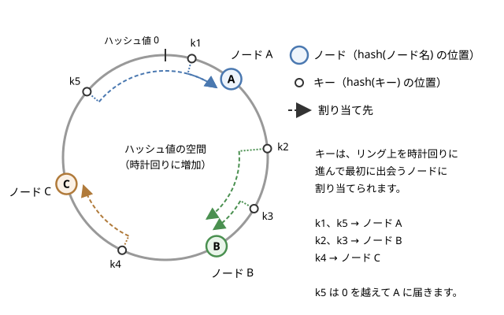

パーティショニング
==================

この章では、1 台のノードには収まらない量のデータや処理を、複数のノードに分けて受け持たせるパーティショニングを説明します。データをキーの範囲で分ける方法とハッシュ値で分ける方法を比べた後、単純な剰余による割り当てがノードの増減に弱い理由と、それを解決するコンシステントハッシュと仮想ノードを取り上げます。後半では、アクセスが一部に集中するホットスポット、データの再分割（リバランス）、リクエストを正しいノードに届けるルーティング、セカンダリインデックスの扱いを説明します。

パーティショニングの目的
------------------------

「:doc:`d05_replication`」で説明したレプリケーションは、同じデータの複製を複数のノードに置く技術でした。レプリケーションによって可用性や読み込みの性能は向上しますが、どのノードもデータ全体を持つので、データの量が 1 台のディスクやメモリに収まらなくなると対応できません。また、書き込みはすべてのレプリカで行う必要があるため、書き込みの性能も 1 台の能力を超えられません。

パーティショニング（partitioning）は、データを互いに重ならない部分集合（パーティション）に分け、各パーティションを別々のノードに受け持たせる技術です。シャーディング（sharding）とも呼ばれ、分けられた各部分はシャードとも呼ばれます。製品によって呼び名が異なり、Bigtable ではタブレット、HBase ではリージョン、Elasticsearch や MongoDB ではシャード、Kafka ではパーティションと呼びます。なお、ネットワークがつながらなくなる「ネットワーク分断」（network partition）とは別の概念です。

パーティショニングの目的は次のとおりです。

* 容量の拡大：データを分けて置くことで、全体として 1 台に収まらない量のデータを扱えます。
* 性能の拡大：読み込みも書き込みも、各パーティションを受け持つノードがそれぞれ処理するので、ノードを増やすほど全体のスループットが上がります。
* 障害の影響の局所化：1 つのパーティションに問題が起きても、他のパーティションのデータには影響しません。

実際のシステムでは、パーティショニングとレプリケーションを組み合わせます。各パーティションを複数のノードに複製し、1 台のノードは、あるパーティションのリーダーであると同時に別のパーティションのフォロワーでもある、という配置が一般的です。

パーティショニングで最も重要なのは、データと負荷を各ノードに均等に分けることです。偏りがあると、一部のノードだけが忙しくなり、ノードを増やしても全体の性能が上がりません。このような偏りをスキュー（skew）と呼び、負荷が極端に集中したパーティションやノードをホットスポットと呼びます。

キー範囲による分割
------------------

最も素直な方法は、キーを順に並べて、連続した範囲ごとにパーティションに分けることです。例えば、ユーザー名をキーとする場合、「a〜f」「g〜m」「n〜s」「t〜z」のように分けます。百科事典が巻ごとに見出し語の範囲を分けているのと同じ考え方です。

.. list-table:: キー範囲による分割の例
   :header-rows: 1
   :widths: 30 30 40

   * - パーティション
     - キーの範囲
     - 受け持つノード
   * - P1
     - a 以上 g 未満
     - ノード 1
   * - P2
     - g 以上 n 未満
     - ノード 2
   * - P3
     - n 以上 t 未満
     - ノード 3
   * - P4
     - t 以上
     - ノード 1

範囲の境界は、データが均等になるように決める必要があります。キーの分布は均一とは限らないため（例えば、ある文字で始まる名前が特に多いなど）、境界は固定せず、データの量に応じて調整するのが普通です。Bigtable や HBase は、パーティションが一定の大きさを超えると 2 つに分割し、小さくなりすぎると隣と統合します。

キー範囲による分割の利点は、パーティションの中でキーが整列していることです。「ユーザー ID が 1000 から 1999 まで」「2026 年 10 月の記録」のような範囲の検索は、少数のパーティションだけを読めば済みます。

一方、欠点はアクセスのパターンによってホットスポットが生じやすいことです。典型的な例は、時刻をキーにする場合です。センサーのデータを測定時刻をキーにして記録すると、新しいデータはすべて最新の時刻の範囲に書き込まれるため、その範囲を受け持つ 1 つのパーティションに書き込みが集中します。連番の ID をキーにする場合も同じです。対策として、キーの先頭にセンサーの ID を付けて「センサー ID ＋時刻」をキーにすれば、書き込みは複数のパーティションに分散します。その代わり、ある時間帯のデータをすべてのセンサーについて読むには、センサーごとに範囲の検索を行う必要があります。

ハッシュによる分割
------------------

キーの偏りによるホットスポットを避けるために、キーそのものではなく、キーのハッシュ値でパーティションを決める方法があります。よいハッシュ関数は、似たキー（例えば ``sensor-0001`` と ``sensor-0002``）にもまったく異なる値を与えるので、キーの分布に偏りがあっても、ハッシュ値はほぼ均一に分布します。

ハッシュ関数は暗号用途ほどの強さは不要ですが、同じキーには、どのノードのどのプロセスで計算しても同じ値を返す必要があります。Python の組み込み関数 ``hash()`` は、文字列に対してはプロセスごとに異なる値を返す（ハッシュのランダム化）ため、この目的には使えません。MD5 や MurmurHash など、決定的なハッシュ関数を使います。

ハッシュによる分割の欠点は、キーの順序が失われることです。隣り合うキーがばらばらのパーティションに散らばるため、範囲の検索ではすべてのパーティションに問い合わせる必要があります。

両者の折衷として、キーを 2 つの部分に分ける方法があります。例えば Cassandra の主キーは、パーティションキーとクラスタリングキーからなります。パーティションキーのハッシュ値でパーティションを決め、同じパーティションの中ではクラスタリングキーの順にデータを整列して格納します。「ユーザー ID」をパーティションキー、「投稿時刻」をクラスタリングキーにすれば、ユーザーは均等に分散しつつ、あるユーザーの投稿を時刻の範囲で効率よく読み出せます。

.. list-table:: キー範囲による分割とハッシュによる分割の比較
   :header-rows: 1
   :widths: 24 38 38

   * - 観点
     - キー範囲による分割
     - ハッシュによる分割
   * - 負荷の均等さ
     - キーの分布やアクセスのパターンに依存
     - キーが十分に多ければほぼ均等
   * - 範囲の検索
     - 少数のパーティションで済む
     - 全パーティションへの問い合わせが必要
   * - 代表例
     - Bigtable、HBase
     - Cassandra、Dynamo、Redis Cluster

剰余による割り当ての問題
------------------------

ハッシュ値からパーティション（ここではノード）を決める最も簡単な方法は、ハッシュ値をノードの台数 :math:`N` で割った余りを使うことです。

.. math::

   \text{ノード番号} = h(k) \bmod N

ここで :math:`h(k)` はキー :math:`k` のハッシュ値です。ハッシュ値が均一に分布していれば、各ノードはおよそ :math:`1/N` ずつのキーを受け持ちます。

この方法の問題は、ノードの台数が変わったときに起こります。:math:`N` 台から :math:`N + 1` 台に増やすと、ほとんどのキーの割り当て先が変わってしまうのです。キーが移動しないのは、:math:`h(k) \bmod N` と :math:`h(k) \bmod (N + 1)` が等しい場合だけです。:math:`N` と :math:`N + 1` は互いに素なので、両者が等しい値 :math:`r` になるのは、:math:`h(k)` を :math:`N(N + 1)` で割った余りが :math:`r` に等しいとき（:math:`0 \le r < N`）に限られます。ハッシュ値が均一なら、この余りは :math:`0` から :math:`N(N + 1) - 1` までの :math:`N(N + 1)` 通りの値を等しい確率でとり、そのうち移動しないのは :math:`0` から :math:`N - 1` の :math:`N` 通りです。したがって、移動するキーの割合は次のようになります。

.. math::

   \text{移動する割合} = 1 - \frac{N}{N(N + 1)} = 1 - \frac{1}{N + 1} = \frac{N}{N + 1}

4 台から 5 台に増やすと :math:`4/5`、つまり 80% のキーが移動します。一方、新しいノードが全体の :math:`1/(N + 1)` を受け持てば均等になるので、本来は全体の :math:`1/(N + 1)` だけを移動すれば十分です。

.. list-table:: ノードを 1 台追加したときに移動するキーの割合
   :header-rows: 1
   :widths: 30 35 35

   * - 台数の変化
     - 剰余方式（:math:`N/(N+1)`）
     - 必要最小限（:math:`1/(N+1)`）
   * - 2 台 → 3 台
     - 約 67%
     - 約 33%
   * - 4 台 → 5 台
     - 80%
     - 20%
   * - 9 台 → 10 台
     - 90%
     - 10%
   * - 99 台 → 100 台
     - 99%
     - 1%

ノードが多くなるほど、剰余方式では「ほぼすべて」のキーが移動します。データベースであれば、ほぼ全データをネットワーク越しにコピーし直すことになります。キャッシュサーバーの振り分けに使っていた場合は、キャッシュサーバーを 1 台追加しただけで、ほぼすべてのキャッシュが無効になり（どのキーも、以前とは別のサーバーに問い合わせることになるため）、背後のデータベースにアクセスが殺到します。ノードの故障で台数が減る場合も同じです。

コンシステントハッシュ
----------------------

この問題を解決するのがコンシステントハッシュ（consistent hashing）です。カーガー（David Karger）らが 1997 年に、Web のキャッシュの負荷分散を目的として発表しました。

コンシステントハッシュでは、ハッシュ値の空間（例えば :math:`0` から :math:`2^{64} - 1`）の両端をつないで、リング状に並べます。そして、ノードもキーも同じハッシュ関数でリング上の位置に置きます。ノードの位置は、ノード名などのハッシュ値で決めます。各キーは、自分の位置からリング上を時計回りに進んで、最初に出会うノードに割り当てられます。

   コンシステントハッシュのリング

この方式では、ノードの増減の影響が局所的です。

* ノードを追加した場合：新しいノードは、リング上で自分の手前（反時計回り側）にある区間のキーを、時計回りで次のノードから引き継ぎます。他のノードの間でキーは移動しません。
* ノードを削除した場合：削除したノードが受け持っていたキーは、時計回りで次のノードに移ります。こちらも、他のキーは移動しません。

ノードの位置がランダムに散らばっていれば、:math:`N + 1` 台目のノードが引き継ぐキーの割合の期待値は :math:`1/(N + 1)` で、必要最小限の移動で済みます。

リング上の位置からノードを探すには、ノードの位置を整列した配列を用意し、二分探索でキーの位置より大きい最初の要素を見つけます。ノードが :math:`M` 個の位置を占めるとき、1 回の検索は :math:`O(\log M)` で済みます。

仮想ノード
----------

コンシステントハッシュには、1 台のノードがリング上の 1 か所だけを占める単純な形だと、負荷が均等にならないという問題があります。ノードの位置はハッシュ値で決まるため、リング上のノードの間隔はばらばらで、たまたま広い区間を受け持ったノードには多くのキーが集まります。また、ノードを削除すると、その区間のキーはすべて時計回りで次の 1 台に移るため、その 1 台だけに負荷が集中します。

これを解決するのが仮想ノード（virtual node、vnode）です。1 台の物理ノードを、リング上の複数の位置（例えば 100 か所）に置きます。位置は「ノード名＋番号」のハッシュ値などで決めます。1 台が多数の小さな区間を受け持つことになるので、区間の大きさのばらつきが平均化されます。また、ノードを削除したときには、その多数の区間のキーが、それぞれの区間の次の位置にある様々なノードに分散して移ります。

仮想ノードには、次のような利点もあります。

* 性能の異なるノードの混在：性能の高いノードには多くの仮想ノードを割り当てれば、性能に比例した量のデータを受け持たせられます。
* 移動の分散：ノードを追加するとき、新しいノードは多数の既存ノードから少しずつデータを引き継ぐので、データのコピーの負荷が 1 台に集中しません。

Amazon の Dynamo や、その設計を受け継いだ Cassandra は、仮想ノードを使ったコンシステントハッシュでデータを分割しています。Cassandra では、1 台のノードが受け持つ仮想ノード（トークン）の数を ``num_tokens`` という設定で指定します。

ただし、仮想ノードの数を増やしすぎると、リングの情報（どの位置をどのノードが受け持つか）が大きくなり、各ノードで管理する手間が増えます。また、レプリケーションと組み合わせる場合、仮想ノードが多いほど、あるノードと複製を共有する相手のノードが多くなり、複数のノードが同時に故障したときにデータの一部を失う可能性が高まるという指摘もあります。実際の数は、こうした点との兼ね合いで決めます。

サンプルで比較する
------------------

サンプルコード :download:`consistent_hash.py <../examples/consistent_hash.py>` は、10,000 個のキーを 4 台のノードに割り当て、ノードを 1 台追加したときに移動するキーの割合を、剰余方式とコンシステントハッシュ（仮想ノードの数 :math:`v` を変えたもの）で比べます。また、4 台のときの各ノードのキー数の最小値、最大値、標準偏差を比べます。ハッシュ関数には ``hashlib`` の MD5 を使っているので、結果は毎回同じになります。

.. literalinclude:: ../examples/consistent_hash.py
   :language: python
   :linenos:
   :caption: consistent_hash.py

実行結果は次のとおりです。

.. code-block:: text

   キー 10000 個、ノード 4 台 → 5 台に追加

   [ノードを 1 台追加したときに移動するキーの割合]
     剰余方式 (hash mod N)        :  80.1%
     コンシステントハッシュ (v=   1):   8.9%
     コンシステントハッシュ (v=  10):  16.8%
     コンシステントハッシュ (v= 100):  18.7%
     コンシステントハッシュ (v=1000):  20.6%
     (理想的な値は 1/5 = 20.0%)

   [仮想ノードの数と各ノードのキー数の偏り (4 台、平均 2500 個)]
     方式                 最小   最大   標準偏差
     剰余方式             2430   2584      56.5
     仮想ノード    1 個    587   4086    1250.0
     仮想ノード   10 個   1589   3669     855.6
     仮想ノード  100 個   2419   2648      91.1
     仮想ノード 1000 個   2436   2630      77.1

結果から、次のことが読み取れます。

* 剰余方式では、前の節で計算したとおり、約 80% のキーが移動しています。
* コンシステントハッシュでは、移動するキーは新しいノードが引き継ぐ分だけです。仮想ノードが 1 個の場合は 8.9% と少なくなっていますが、これは新しいノードがたまたま狭い区間を引き継いだためで、負荷を均等にするという目的は果たせていません。仮想ノードを増やすと、理想的な 20% に近づきます。
* 仮想ノードが 1 個の場合、キー数の最小は 587 個、最大は 4,086 個で、約 7 倍の差があります。仮想ノードを 100 個にすると標準偏差は 91 程度まで下がり、剰余方式（ハッシュ値をそのまま均等に分ける方式）に近い均等さになります。

コンシステントハッシュ以外にも、ノードの増減で移動するキーを少なくする方式があります。ランデブーハッシュ（rendezvous hashing、HRW：Highest Random Weight）は、キーとノードの組ごとにハッシュ値を計算し、値が最大のノードにキーを割り当てます。リングを管理する必要がない代わりに、1 回の検索でノードの数だけハッシュ値を計算します。

固定数のパーティションによる方法
--------------------------------

ノードの増減に強いもう 1 つの方法は、ノードの台数よりずっと多い、固定数のパーティションをあらかじめ作っておくことです。例えば、ノードが 10 台のクラスターで 1,000 個のパーティションを作り、各ノードに約 100 個ずつ受け持たせます。キーからパーティションへの対応（例えば :math:`h(k) \bmod 1000`）は、ノードの台数に関係なく一定です。

ノードを追加するときは、既存のノードからパーティションをいくつか丸ごと新しいノードに移します。キーとパーティションの対応は変わらず、変わるのはパーティションとノードの対応だけです。剰余を使っていても、割る数がノードの台数ではなくパーティションの数なので、前の節の問題は起きません。

Redis Cluster は、キーの CRC16 の値を 16384 で割った余りで 16,384 個のハッシュスロットのどれかに割り当て、スロットを単位としてノードに受け持たせています。Elasticsearch のインデックスや Kafka のトピックも、作成時に決めた数のシャード（パーティション）に分かれています。

この方法の課題は、パーティションの数を最初に適切に決めることです。少なすぎると、将来ノードを増やしてもパーティションが足りずに負荷を分けられません。多すぎると、パーティションごとの管理の手間が増えます。データの量に応じてパーティションを分割・統合する方式（動的なパーティショニング）は、この課題を避けられます。キー範囲による分割で境界を調整する Bigtable や HBase の方式は、その例です。

ホットスポット
--------------

ハッシュによる分割は、キーごとのアクセスが均等であることを前提としています。しかし現実には、特定のキーにアクセスが集中することがあります。例えば、SNS でフォロワーの非常に多い有名人が投稿すると、その投稿のキーに大量の読み込みと書き込み（いいねやコメント）が集中します。同じキーは必ず同じパーティションに割り当てられるので、ハッシュ関数をどれだけ工夫しても、この偏りは解消できません。

ホットスポットへの対策には、次のようなものがあります。

* キーの分割：集中するキーの末尾に乱数（例えば 00〜99 の 2 桁）を付けて、100 個の異なるキーとして書き込みます。書き込みは 100 個のパーティションに分散しますが、読み込むときは 100 個のキーをすべて読んで結果をまとめる必要があります。この手間がかかるので、集中が分かっているキーにだけ適用します。
* キャッシュ：読み込みが集中する場合は、パーティションの手前にキャッシュを置き、パーティションまで届くリクエストを減らします。
* レプリカからの読み込み：読み込みをパーティションのリーダーだけでなくフォロワーにも分散します。ただし、「:doc:`d05_replication`」で説明したレプリケーション遅延による古い値の読み込みを許容する必要があります。

どのキーにアクセスが集中しているかは、運用中にキーごとのアクセス数を計測して把握します。ホットスポットは事前の設計だけでは防ぎきれないため、観察と対処の仕組みを用意しておくことが重要です。

再分割（リバランス）
--------------------

運用を続けると、データの量やアクセスの量が増える、ノードを追加する、ノードが故障して置き換える、といった理由で、パーティションの配置を変える必要が生じます。データと負荷をノード間で移し替えて均等な状態に戻すことを、再分割またはリバランス（rebalancing）と呼びます。

リバランスには、次のような要件があります。

* リバランスの後、負荷がノード間で均等になっていること。
* リバランスの最中も、読み込みと書き込みを受け付けられること。
* 移動するデータの量が必要最小限であること。

データの移動は、一般に次の手順で行います。まず、移動先のノードにパーティションのデータをコピーします。コピーの間に行われた書き込みは、変更の記録を追いかけて移動先に反映します。移動先が追いついたら、パーティションの担当をメタデータ上で切り替え、以後のリクエストを移動先に送ります。

リバランスは、大量のデータをネットワーク越しにコピーするため、それ自体がネットワークとディスクに大きな負荷をかけます。通常のリクエストの処理を妨げないよう、コピーの速度を制限するのが普通です。

リバランスを自動で行うか、人の判断で行うかも重要な設計上の選択です。自動化すれば運用の手間は減りますが、障害検知と組み合わさると危険な場合があります。例えば、あるノードが過負荷で応答が遅くなったときに、障害検知がそのノードを故障とみなして自動的にリバランスを始めると、データのコピーによって、そのノードを含むクラスター全体の負荷がさらに高まり、状況が悪化します。「:doc:`d01_distributed_overview`」で説明したように、遅いノードと故障したノードは外から区別できません。そのため、自動化するシステムでも、移動の計画を人が確認してから実行する仕組みを用意することがあります。

リクエストのルーティング
------------------------

データを分割すると、クライアントがあるキーを読み書きしたいとき、どのノードにリクエストを送ればよいかという問題が生じます。パーティションの配置はリバランスで変わるので、この対応関係を常に最新に保つ必要があります。この問題はサービスディスカバリの一種で、主に次の 3 つの方式があります。

.. list-table:: リクエストのルーティングの方式
   :header-rows: 1
   :widths: 24 46 30

   * - 方式
     - 説明
     - 例
   * - 任意のノードで受け付け
     - クライアントは任意のノードに送信し、担当でないノードは担当のノードに転送
     - Cassandra
   * - ルーティング層
     - パーティションの配置を知る専用の層（プロキシ）が受信し、担当のノードに転送
     - MongoDB の mongos
   * - クライアントからの直接送信
     - クライアントが配置を把握し、担当のノードに直接送信。配置が古ければ、ノードが正しい担当を通知
     - Redis Cluster（MOVED 応答によるリダイレクト）

いずれの方式でも、パーティションとノードの対応（メタデータ）を誰かが正しく管理する必要があります。多くのシステムでは、この情報を ZooKeeper や etcd のような、合意アルゴリズムで一貫性を保つ調整サービスに置きます（「:doc:`d08_consensus`」を参照してください）。各ノードやルーティング層は、調整サービスの変更通知を受けて、自分の持つ対応表を更新します。HBase や、かつての Kafka は ZooKeeper をこの目的に使っていました（Kafka は現在、Raft をもとにした KRaft という仕組みで自らメタデータを管理しています）。一方、Cassandra はゴシッププロトコル（ノードどうしが互いに知っている情報を交換し合い、情報を徐々にクラスター全体に広める方式）で、配置の情報をノード間に広めています。

セカンダリインデックス
----------------------

ここまでは、主キーでデータにアクセスする場合を考えてきました。しかし、実際のアプリケーションでは、主キー以外の項目で検索することがよくあります。例えば、主キーが商品 ID の商品データを、「色が赤の商品」で検索したい場合です。主キー以外の項目による索引をセカンダリインデックスと呼びます。データを分割したとき、セカンダリインデックスの分け方には 2 つの方式があります。

ローカルインデックス
~~~~~~~~~~~~~~~~~~~~

各パーティションが、自分の持つデータだけについてのインデックスを持つ方式です。ドキュメント単位のインデックス（document-partitioned index）とも呼ばれます。書き込みは、データと同じパーティションのインデックスを更新するだけで済むので、単純で速く、データとインデックスの間で一貫性を保つのも簡単です。

その代わり、「色が赤の商品」を検索するには、赤い商品がどのパーティションにあるか分からないので、すべてのパーティションに問い合わせて結果をまとめる必要があります。この方式をスキャッター・ギャザー（scatter/gather）と呼びます。パーティションが多いと検索のコストが大きくなり、また、1 つでも遅いパーティションがあると、全体の応答がそれに引きずられて遅くなります。

グローバルインデックス
~~~~~~~~~~~~~~~~~~~~~~

インデックスの値（「赤」など）をキーとして、インデックス自体を別に分割する方式です。項目単位のインデックス（term-partitioned index）とも呼ばれます。「色が赤」のインデックスの項目は 1 つのパーティションにまとまっているので、検索はそのパーティションだけを読めば済みます。

その代わり、1 件のデータを書き込むと、データのパーティションとは別のパーティションにあるインデックスも更新する必要があります。複数の項目にインデックスがあれば、更新するパーティションはさらに増えます。データとインデックスの更新を一貫して行うには、パーティションをまたぐトランザクション（「:doc:`d08_consensus`」で説明します）が必要になり、コストが大きくなります。そのため、多くのシステムではグローバルインデックスを非同期に更新します。例えば Amazon DynamoDB のグローバルセカンダリインデックスは非同期に更新されるため、書き込みの直後にインデックスで検索すると、その書き込みがまだ反映されていないことがあります。

.. list-table:: セカンダリインデックスの 2 つの方式
   :header-rows: 1
   :widths: 20 40 40

   * - 観点
     - ローカルインデックス
     - グローバルインデックス
   * - 書き込み
     - 同じパーティションだけで完結し、高速
     - 複数のパーティションの更新が必要
   * - 検索
     - 全パーティションへの問い合わせが必要
     - 該当するパーティションだけで済む
   * - データとの一貫性
     - 保つのが容易
     - 非同期の更新が多数

まとめ
------

* パーティショニングは、データを重ならない部分に分けて複数のノードに受け持たせ、1 台の容量と性能の限界を超えるための技術です。通常はレプリケーションと組み合わせて使います。
* キー範囲による分割は範囲の検索に強い一方、ホットスポットが生じやすくなります。ハッシュによる分割は負荷を均等にしやすい一方、キーの順序が失われます。
* ハッシュ値をノードの台数で割った剰余で割り当てると、:math:`N` 台から :math:`N + 1` 台に増やしたときに約 :math:`N/(N + 1)` のキーが移動します。
* コンシステントハッシュは、ノードの増減で移動するキーを必要最小限にします。仮想ノードを使うと、負荷の偏りが小さくなり、性能の異なるノードも扱えます。固定数のパーティションを使う方法も広く使われています。
* 特定のキーへのアクセスの集中は、分割の方式だけでは防げません。リバランス、ルーティング、セカンダリインデックスにも、それぞれ一貫性と性能の兼ね合いがあります。
