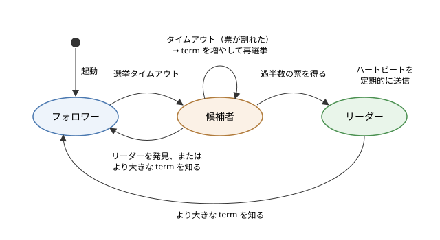

合意と分散トランザクション
==========================

この章では、複数のノードが 1 つの値について意見をそろえる合意（consensus）の問題と、複数のノードにまたがる更新をまとめて成功させるか、まとめて取り消すための分散トランザクションを説明します。合意が理論的にどこまで可能かを示す FLP 不可能性から始め、2 相コミットとその弱点である阻塞、Paxos と Raft という代表的な合意アルゴリズムを取り上げます。後半では、合意の応用である分散ロックとフェンシングトークン、合意を提供する調整サービス（ZooKeeper と etcd）、そしてマイクロサービスで使われる Saga と Outbox パターンを説明します。

合意問題
--------

分散システムでは、複数のノードが同じ判断を下す必要のある場面が数多くあります。

* リーダー選出：「:doc:`d05_replication`」で説明したシングルリーダーのレプリケーションでは、リーダーが故障したら新しいリーダーを 1 つだけ選ぶ必要があります。2 つのノードが同時にリーダーだと思い込むと、スプリットブレインになります。
* アトミックコミット：複数のノードにまたがるトランザクションは、全ノードでコミットするか、全ノードでアボートするかのどちらかでなければなりません。
* 操作の順序の決定：複数のレプリカが同じ操作を同じ順序で適用すれば、同じ状態になります（複製状態機械）。そのためには、次に適用する操作が何かについて、全レプリカの意見をそろえる必要があります。
* 一意性の制約：同じユーザー名を 2 人が同時に登録しようとしたとき、どちらか一方だけを認める必要があります。

これらはいずれも、「複数のノードが、提案された値の中から 1 つの値を選び、全員がその値に同意する」という問題に帰着します。これを合意問題と呼びます。合意のアルゴリズムは、故障していないノードについて次の性質を満たす必要があります。

.. list-table:: 合意アルゴリズムが満たすべき性質
   :header-rows: 1
   :widths: 20 80

   * - 性質
     - 内容
   * - 合意（agreement）
     - 2 つのノードが異なる値を決定することはありません
   * - 妥当性（validity）
     - 決定される値は、いずれかのノードが提案した値です
   * - 停止性（termination）
     - 故障していないノードは、いずれ必ず何らかの値を決定します

合意と妥当性は「悪いことが起きない」ことを表す安全性（safety）の性質、停止性は「よいことがいずれ起きる」ことを表す活性（liveness）の性質です。妥当性は、「常に 0 を決定する」のような無意味なアルゴリズムを除外するための条件です。

故障の数と過半数
~~~~~~~~~~~~~~~~

ノードが故障しても合意を続けられるように、多くの合意アルゴリズムは過半数（クォーラム）の同意で決定します。ノードの総数が :math:`n` のとき、過半数は :math:`\lfloor n/2 \rfloor + 1` 台です。2 つの過半数の集合は必ず 1 台以上のノードを共有するので、2 つの異なる値がそれぞれ別の過半数の同意を得ることはありません。

過半数が生き残っていれば合意を続けられるので、:math:`f` 台までのクラッシュ停止に耐えるには、次の台数が必要です。

.. math::

   n \ge 2f + 1

.. list-table:: クラスターの台数と耐えられる故障の数
   :header-rows: 1
   :widths: 30 35 35

   * - ノードの台数
     - 過半数
     - 耐えられる故障の台数
   * - 3 台
     - 2 台
     - 1 台
   * - 4 台
     - 3 台
     - 1 台
   * - 5 台
     - 3 台
     - 2 台
   * - 7 台
     - 4 台
     - 3 台

4 台は 3 台と同じく 1 台の故障にしか耐えられず、過半数を集める手間だけが増えます。そのため、合意を行うクラスターは 3 台、5 台のように奇数で構成するのが普通です。なお、ここで考えているのはクラッシュ停止の故障です。ノードが嘘をつくビザンチン故障（「:doc:`d01_distributed_overview`」を参照してください）に耐えるには :math:`n \ge 3f + 1` 台が必要になり、アルゴリズムも別のものになります。

FLP 不可能性
------------

合意問題は、どのような条件でも解けるわけではありません。1985 年に、フィッシャー（Michael Fischer）、リンチ（Nancy Lynch）、パターソン（Michael Paterson）は、非同期のシステムモデルでは、たとえ 1 台のノードがクラッシュするだけでも、必ず停止する決定的な合意アルゴリズムは存在しないことを証明しました。3 人の頭文字をとって、FLP 不可能性と呼ばれます。

非同期のシステムモデルとは、メッセージの遅延やノードの処理時間に上限がないモデルです（「:doc:`d01_distributed_overview`」を参照してください）。このモデルでは、応答のないノードが故障しているのか、単に遅いだけなのかを区別できません。FLP の証明は、どのようなアルゴリズムに対しても、メッセージの到着順序をうまく選べば、決定を永遠に先送りさせ続けられることを示しています。

これは「合意は実現できない」という意味ではありません。実際のアルゴリズムは、次のようにしてこの制約を回避しています。

* 安全性は常に守り、停止性だけを条件付きにする：Paxos や Raft は、メッセージがどれだけ遅れても、異なる値を決定することはありません。一方、ネットワークが不安定な間は決定できないことがあり、ネットワークがある程度安定すれば（部分同期のモデル）決定できます。
* タイムアウトを使う：一定時間応答のないノードを故障とみなすことで、非同期のモデルの外に出ます。判断を誤ることはありますが、誤っても安全性を損なわないようにアルゴリズムを設計します。
* 乱数を使う：FLP は決定的なアルゴリズムについての結果です。乱数を使えば、非同期のモデルでも確率 1 で決定に至る合意アルゴリズムを作れることが知られています。Raft の選挙タイムアウトのランダム化も、乱数によって決定の先送りが続く可能性を小さくする工夫です。

合意の研究の歴史については「:doc:`d02_distributed_history`」で取り上げています。

2 相コミット
------------

複数のノード（例えば、別々のデータベースのパーティション）にまたがって更新を行うトランザクションを考えます。銀行口座の振替で、口座 A がノード 1 に、口座 B がノード 2 にあるとき、A から引いて B に足す処理は、両方のノードでコミットするか、両方でアボートするかのどちらかでなければなりません。この性質をアトミック性（原子性）と呼び、複数のノードでアトミック性を保証する問題をアトミックコミット問題と呼びます。

アトミックコミットは合意の一種ですが、1 つでもアボートしたいと言うノードがあれば、必ずアボートを決定しなければならない点が通常の合意と異なります。このための最も代表的なプロトコルが 2 相コミット（2PC：Two-Phase Commit）です。2 相コミットでは、トランザクションを取りまとめるコーディネーターと、データを持つ参加者が、次の 2 つのフェーズでやり取りします。

#. 準備フェーズ（投票フェーズ）：コーディネーターは全参加者に準備要求（PREPARE）を送ります。各参加者は、コミットに必要な処理（制約の確認、ロックの取得、変更内容のディスクへの記録）を行い、確実にコミットできる状態になったら Yes、できなければ No と投票します。
#. コミットフェーズ（決定フェーズ）：全員が Yes ならコミット、1 人でも No か応答がなければアボートと決定します。コーディネーターは、決定を自分のログに永続化してから、全参加者に送ります。参加者は決定に従ってコミットまたはアボートを行い、ロックを解放します。

このプロトコルの要点は、2 つの「後戻りできない点」にあります。参加者は Yes と投票した時点で、以後どのような故障があっても、コーディネーターの指示があればコミットできることを約束します。そのため、Yes と投票した参加者は、自分の判断でアボートすることも、コミットすることもできなくなります。また、コーディネーターが決定をログに記録した時点で、トランザクションの結果は確定します。コーディネーターが故障しても、再起動後にログを読んで決定を送り直します。

2 相コミットは、データベースの内部（パーティションをまたぐトランザクション）や、異なる種類のデータベースやメッセージキューをまたぐトランザクション（X/Open XA という標準の API がよく知られています）で使われています。

阻塞
~~~~

2 相コミットの最大の弱点は、参加者が Yes と投票した後にコーディネーターが故障すると、参加者が先に進めなくなることです。これを阻塞（blocking）と呼びます。

Yes と投票した参加者は、コーディネーターから決定が届くまで、自分ではコミットもアボートも決められません。他の参加者に問い合わせて、誰かが既に決定を受け取っていたり、No と投票していたりすれば結果が分かりますが、全員が Yes と投票して決定を待っている場合は、誰にも結果が分かりません。コーディネーターは故障の直前にコミットを決定していたかもしれないし、アボートを決定していたかもしれないからです。このとき参加者は、変更したデータのロックを保持したまま、コーディネーターの復旧を待ち続けるしかありません。ロックされたデータにアクセスする他のトランザクションも、すべて待たされます。

サンプルで確かめる
~~~~~~~~~~~~~~~~~~

サンプルコード :download:`two_phase_commit.py <../examples/two_phase_commit.py>` は、コーディネーターと 3 つの参加者からなる 2 相コミットを、1 つのプロセスの中でシミュレーションするものです。全員が Yes と投票する場合、1 人が No と投票する場合、全員が Yes と投票した後にコーディネーターが故障する場合の 3 つのシナリオを実行します。時刻は模擬時計の値で、実際には待ちません。

.. literalinclude:: ../examples/two_phase_commit.py
   :language: python
   :linenos:
   :caption: two_phase_commit.py

実行結果は次のとおりです。

.. code-block:: text

   === シナリオ 1：全員 Yes ===
     [    0 ms] コーディネーター: フェーズ 1：全参加者に PREPARE を送信
     [   10 ms] 参加者 1        : 変更をログに記録、ロック取得 → Yes
     [   10 ms] 参加者 2        : 変更をログに記録、ロック取得 → Yes
     [   10 ms] 参加者 3        : 変更をログに記録、ロック取得 → Yes
     [   20 ms] コーディネーター: 投票結果 Yes, Yes, Yes
     [   20 ms] コーディネーター: 決定 COMMIT をログに記録して送信
     [   30 ms] 参加者 1        : コミットしてロック解放
     [   30 ms] 参加者 2        : コミットしてロック解放
     [   30 ms] 参加者 3        : コミットしてロック解放
     最終状態: 参加者 1=コミット済み, 参加者 2=コミット済み, 参加者 3=コミット済み

   === シナリオ 2：参加者 2 が No ===
     [    0 ms] コーディネーター: フェーズ 1：全参加者に PREPARE を送信
     [   10 ms] 参加者 1        : 変更をログに記録、ロック取得 → Yes
     [   10 ms] 参加者 2        : 制約違反のため準備失敗 → No
     [   10 ms] 参加者 3        : 変更をログに記録、ロック取得 → Yes
     [   20 ms] コーディネーター: 投票結果 Yes, No, Yes
     [   20 ms] コーディネーター: 決定 ABORT をログに記録して送信
     [   30 ms] 参加者 1        : 変更を取り消してロック解放
     [   30 ms] 参加者 3        : 変更を取り消してロック解放
     最終状態: 参加者 1=アボート済み, 参加者 2=アボート済み, 参加者 3=アボート済み

   === シナリオ 3：準備完了後にコーディネーターが故障 ===
     [    0 ms] コーディネーター: フェーズ 1：全参加者に PREPARE を送信
     [   10 ms] 参加者 1        : 変更をログに記録、ロック取得 → Yes
     [   10 ms] 参加者 2        : 変更をログに記録、ロック取得 → Yes
     [   10 ms] 参加者 3        : 変更をログに記録、ロック取得 → Yes
     [   20 ms] コーディネーター: 投票結果 Yes, Yes, Yes
     [   20 ms] コーディネーター: *** 故障（決定を送る前に停止）***
     [ 1020 ms] 参加者 1        : タイムアウト。他の参加者に問い合わせ
     [ 1020 ms] 参加者 1        : 全員が準備完了で結果不明 → 待つしかない
     [ 1020 ms] 参加者 2        : タイムアウト。他の参加者に問い合わせ
     [ 1020 ms] 参加者 2        : 全員が準備完了で結果不明 → 待つしかない
     [ 1020 ms] 参加者 3        : タイムアウト。他の参加者に問い合わせ
     [ 1020 ms] 参加者 3        : 全員が準備完了で結果不明 → 待つしかない
     [ 6020 ms] 参加者 1        : まだ決定が届かない（ロック保持中）
     [ 6020 ms] 参加者 2        : まだ決定が届かない（ロック保持中）
     [ 6020 ms] 参加者 3        : まだ決定が届かない（ロック保持中）
     最終状態: 参加者 1=準備完了(ロック中), 参加者 2=準備完了(ロック中), 参加者 3=準備完了(ロック中)
     [36020 ms] コーディネーター: *** 再起動 *** ログを読み込む
     [36020 ms] コーディネーター: 決定の記録なし → ABORT を記録して送信
     [36030 ms] 参加者 1        : 変更を取り消してロック解放
     [36030 ms] 参加者 2        : 変更を取り消してロック解放
     [36030 ms] 参加者 3        : 変更を取り消してロック解放
     最終状態: 参加者 1=アボート済み, 参加者 2=アボート済み, 参加者 3=アボート済み

シナリオ 2 では、No と投票した参加者 2 は、その時点で自分の判断でアボートしています。No と投票した参加者は、結果が必ずアボートになると分かっているからです。シナリオ 3 では、3 つの参加者がいずれも準備完了の状態でロックを保持したまま、コーディネーターが再起動する 36 秒後まで待たされています。再起動したコーディネーターのログには決定の記録がないので、まだ誰にもコミットを伝えていないことが確実であり、安全にアボートできます。もしコミットの決定を記録した後で故障していたなら、再起動後にはコミットを送り直す必要があります。

2 相コミットの課題と対策
~~~~~~~~~~~~~~~~~~~~~~~~

2 相コミットには、阻塞のほかにも次のような課題があります。

* 遅延：少なくとも 2 往復のメッセージと、参加者とコーディネーターでのディスクへの書き込みが必要です。
* ロックの保持時間：参加者は準備フェーズから決定を受け取るまでロックを保持するので、遅延の大きい環境では、他のトランザクションを長く待たせます。
* 最も遅い参加者に合わせる：全員の投票がそろうまで決定できないので、1 つでも遅い参加者があると全体が遅くなります。

阻塞の根本原因は、コーディネーターが単一障害点であることです。そこで、コーディネーターの状態（特に決定のログ）を、次に説明する Paxos や Raft で複数のノードに複製すれば、1 台が故障しても別のノードが決定を引き継げます。Google の Spanner は、各パーティションを Paxos で複製したグループとし、その上で 2 相コミットを行うことで、この問題を解決しています。

3 相コミット
~~~~~~~~~~~~

阻塞を解消するために、スキーン（Dale Skeen）は 3 相コミット（3PC：Three-Phase Commit）を提案しました。3 相コミットは、投票と決定の間に「事前コミット」（pre-commit）のフェーズを加え、全員が Yes と投票したことを全参加者が知ってからコミットするようにします。こうすると、コーディネーターが故障しても、残った参加者どうしで状態を確かめて、コミットとアボートのどちらに進むべきかを判断できます。

ただし、3 相コミットが阻塞しないことを保証できるのは、メッセージの遅延に上限があり、ネットワーク分断が起きないという前提のもとだけです。ネットワークが分断されると、分断された両側が異なる判断を下し、一貫性が失われるおそれがあります。実際のネットワークではこの前提が成り立たないため、3 相コミットはほとんど使われていません。代わりに、前の項で説明したように、合意アルゴリズムで 2 相コミットのコーディネーターを冗長化する方法が使われています。

Paxos
-----

Paxos は、ランポート（Leslie Lamport）が考案した合意アルゴリズムです。論文「The Part-Time Parliament」は架空のギリシャの島パクソスの議会になぞらえた難解な書き方だったため、ランポートは 2001 年に、平易に説明し直した「Paxos Made Simple」を発表しました。Paxos は、非同期のネットワークで、過半数のノードが動いていれば安全性を保ちながら合意できることを示した、合意アルゴリズムの基礎です。

Paxos には次の 3 つの役割があります。1 台のノードが複数の役割を兼ねるのが普通です。

* 提案者（proposer）：値を提案し、合意を取りまとめます。
* 受理者（acceptor）：提案に投票します。過半数の受理者が受理した値が選ばれます。
* 学習者（learner）：選ばれた値を知り、それを使います。

1 つの値を決める基本の Paxos は、次の 2 つのフェーズからなります。提案には、提案者ごとに重ならない、単調に増加する提案番号 :math:`n` を付けます。

#. 準備フェーズ：提案者は提案番号 :math:`n` を選び、受理者に Prepare(:math:`n`) を送ります。受理者は、それまでに応答したどの提案番号よりも :math:`n` が大きければ、「今後 :math:`n` より小さい番号の提案は受理しない」と約束（Promise）し、既に受理した値があれば、その値と提案番号を返します。
#. 受理フェーズ：提案者は、過半数の受理者から約束を得たら、Accept(:math:`n`, :math:`v`) を送ります。このとき値 :math:`v` は、約束の応答に含まれていた値のうち、最も大きい提案番号に対応する値でなければなりません。どの受理者もまだ値を受理していなければ、提案者は自由に値を選べます。受理者は、自分の約束に反しない限り、この提案を受理します。過半数の受理者が受理した時点で、値が選ばれたことになります。

安全性の鍵は、受理フェーズでの値の選び方にあります。ある値が既に過半数に受理されていれば、後から来た提案者が集める過半数の約束の中に、その値を受理した受理者が必ず 1 台は含まれます（2 つの過半数は必ず交わるため）。提案者はその値を引き継がなければならないので、一度選ばれた値が別の値に覆ることはありません。

一方、2 つの提案者が互いに大きな提案番号で準備フェーズをやり直し続けると、どちらの提案も受理されないまま進まなくなることがあります。これは FLP 不可能性が示す、停止性が保証できない状況の一例です。実際には、提案者を 1 つ（リーダー）に絞ることで、この競合を避けます。

基本の Paxos が決めるのは 1 つの値だけです。複製状態機械のように一連の操作の順序を決めるには、ログの位置ごとに Paxos を実行します。リーダーを固定して、準備フェーズを一度で済ませ、以後の位置では受理フェーズだけを行う最適化を Multi-Paxos と呼びます。Google のロックサービス Chubby や Spanner は、Paxos を使って複製を行っています。

Paxos は正しさが証明された強力なアルゴリズムですが、論文が説明しているのは 1 つの値を決める部分が中心で、リーダーの選び方、ログの管理、メンバーの変更など、実用のシステムに必要な部分は実装者に任されていました。そのため、Paxos を実装するのは難しいとよく言われます。

Raft
----

Raft は、オンガロ（Diego Ongaro）とオースターハウト（John Ousterhout）が 2014 年に発表した合意アルゴリズムで、「理解しやすさ」を最も重要な設計目標としています。Paxos と同等の耐故障性を持ちながら、問題をリーダー選出、ログ複製、安全性の 3 つに分けて、実装に必要な部分まで具体的に定めています。etcd、Consul、CockroachDB、TiKV など、多くのシステムが Raft を使っています。

Raft は、複製状態機械を実現するためのアルゴリズムです。クライアントの操作をログに追加し、全ノードが同じログを同じ順序で状態機械（例えばキーバリューストア）に適用することで、全ノードの状態をそろえます。

ノードの状態と term
~~~~~~~~~~~~~~~~~~~

Raft の各ノードは、フォロワー、候補者（candidate）、リーダーのいずれかの状態にあります。通常は 1 台のリーダーと、残りのフォロワーで構成されます。

   Raft のノードの状態遷移

Raft は時間を term と呼ぶ区間に分けます。term は 1、2、3 と増えていく整数で、各 term は選挙で始まります。1 つの term には、多くとも 1 台のリーダーしかいません。term は論理的な時計の役割を果たし、各ノードは自分の知る現在の term（currentTerm）を持ちます。メッセージには送信者の term が付いており、自分より大きな term を見たノードは、すぐに自分の term をそれに更新してフォロワーになります。小さな term のメッセージは、古いリーダーや候補者からのものなので拒否します。

リーダー選出
~~~~~~~~~~~~

リーダーは、自分が動いていることを示すために、定期的にハートビート（ログの項目を含まない AppendEntries メッセージ）を全フォロワーに送ります。フォロワーは、選挙タイムアウトの間にリーダーからのメッセージを受け取らず、候補者に投票もしなければ、リーダーが故障したとみなして選挙を始めます。

#. フォロワーは term を 1 増やし、候補者になります。自分に投票し、他の全ノードに RequestVote を送ります。
#. RequestVote を受け取ったノードは、その term でまだ誰にも投票していなければ（そして、候補者のログが自分のログ以上に新しければ）、その候補者に投票します。各ノードは 1 つの term に 1 票しか投じません。現在の term と投票先は、再起動しても忘れないようディスクに記録します。
#. 過半数の票を得た候補者がリーダーになり、すぐにハートビートを送って、他の候補者の選挙を止めます。
#. 選挙の途中で、同じかより大きな term のリーダーからハートビートを受け取った候補者は、フォロワーに戻ります。
#. 複数の候補者が同時に現れて票が割れ、誰も過半数を得られないまま時間が過ぎた場合は、term を増やして選挙をやり直します。

各 term で 1 ノード 1 票しか投じないので、同じ term に過半数を得る候補者は多くとも 1 つです。これにより、1 つの term にリーダーが 2 つ存在することはありません。

票が割れる状況が繰り返されるのを避けるため、選挙タイムアウトはノードごとにランダムに選びます。Raft の論文では、例として 150〜300 ms の範囲が示されています。ランダムにすれば、多くの場合 1 台だけが先にタイムアウトし、他のノードがタイムアウトする前に選挙に勝てます。選挙タイムアウトは、ネットワークの往復時間より十分長く、ノードの故障の平均間隔より十分短くする必要があります。

サンプルコード :download:`raft_election.py <../examples/raft_election.py>` は、5 ノードの Raft のリーダー選出を離散イベントシミュレーションで再現するものです。イベント（タイムアウトやメッセージの到着）を時刻順に処理し、時刻は模擬時計の値です。乱数のシードを固定しているので、結果は毎回同じになります。簡単にするため、ログ複製は省略しており、そのため RequestVote でのログの新しさの確認も省いています。

.. literalinclude:: ../examples/raft_election.py
   :language: python
   :linenos:
   :caption: raft_election.py

実行結果は次のとおりです。

.. code-block:: text

   [  265 ms] ノード 1 (term 1, 候補者): 選挙タイムアウト。候補者になり RequestVote を送信
   [  265 ms] ノード 4 (term 1, 候補者): 選挙タイムアウト。候補者になり RequestVote を送信
   [  268 ms] ノード 1 (term 1, 候補者): ノード 4 への投票を拒否（ノード 1 に投票済み）
   [  269 ms] ノード 3 (term 1, 候補者): 選挙タイムアウト。候補者になり RequestVote を送信
   [  269 ms] ノード 3 (term 1, 候補者): ノード 1 への投票を拒否（ノード 3 に投票済み）
   [  269 ms] ノード 5 (term 1, フォロワー): ノード 4 に投票
   [  270 ms] ノード 2 (term 1, フォロワー): ノード 1 に投票
   [  271 ms] ノード 3 (term 1, 候補者): ノード 4 への投票を拒否（ノード 3 に投票済み）
   [  271 ms] ノード 1 (term 1, 候補者): ノード 3 への投票を拒否（ノード 1 に投票済み）
   [  273 ms] ノード 5 (term 1, フォロワー): ノード 3 への投票を拒否（ノード 4 に投票済み）
   [  274 ms] ノード 5 (term 1, フォロワー): ノード 1 への投票を拒否（ノード 4 に投票済み）
   [  274 ms] ノード 2 (term 1, フォロワー): ノード 4 への投票を拒否（ノード 1 に投票済み）
   [  275 ms] ノード 4 (term 1, 候補者): ノード 1 への投票を拒否（ノード 4 に投票済み）
   [  277 ms] ノード 2 (term 1, フォロワー): ノード 3 への投票を拒否（ノード 1 に投票済み）
   [  278 ms] ノード 4 (term 1, 候補者): ノード 3 への投票を拒否（ノード 4 に投票済み）
   [  435 ms] ノード 2 (term 2, 候補者): 選挙タイムアウト。候補者になり RequestVote を送信
   [  437 ms] ノード 4 (term 2, フォロワー): より大きな term 2 を知り、フォロワーに戻る
   [  437 ms] ノード 4 (term 2, フォロワー): ノード 2 に投票
   [  438 ms] ノード 5 (term 2, フォロワー): ノード 2 に投票
   [  441 ms] ノード 1 (term 2, フォロワー): より大きな term 2 を知り、フォロワーに戻る
   [  441 ms] ノード 1 (term 2, フォロワー): ノード 2 に投票
   [  444 ms] ノード 3 (term 2, フォロワー): より大きな term 2 を知り、フォロワーに戻る
   [  444 ms] ノード 3 (term 2, フォロワー): ノード 2 に投票
   [  447 ms] ノード 2 (term 2, リーダー): 3 票を得て過半数。リーダーに当選
   [  447 ms] ノード 2 (term 2, リーダー): ハートビートの送信を開始（50 ms ごと）
   [  500 ms] ノード 2 (term 2, リーダー): *** 故障 ***
   [  649 ms] ノード 5 (term 3, 候補者): 選挙タイムアウト。候補者になり RequestVote を送信
   [  652 ms] ノード 4 (term 3, フォロワー): ノード 5 に投票
   [  657 ms] ノード 1 (term 3, フォロワー): ノード 5 に投票
   [  657 ms] ノード 3 (term 3, フォロワー): ノード 5 に投票
   [  663 ms] ノード 5 (term 3, リーダー): 3 票を得て過半数。リーダーに当選
   [  663 ms] ノード 5 (term 3, リーダー): ハートビートの送信を開始（50 ms ごと）
   [ 1000 ms] ノード 2 (term 2, フォロワー): *** 復帰。フォロワーとして再開 ***
   [ 1022 ms] ノード 2 (term 2, フォロワー): リーダー 5 のハートビートで新しい term 3 を知る

   [1500 ms 時点の状態]
     ノード 1: term 3, フォロワー
     ノード 2: term 3, フォロワー
     ノード 3: term 3, フォロワー
     ノード 4: term 3, フォロワー
     ノード 5: term 3, リーダー

この実行では、次のことが起きています。

* term 1 では、ノード 1、4、3 がほぼ同時にタイムアウトして候補者になりました。候補者は自分に投票済みなので互いに投票を拒否し、ノード 4 とノード 1 はそれぞれ 2 票しか得られず、票が割れて誰もリーダーになれませんでした。
* 次にタイムアウトしたノード 2 が term 2 の選挙を始めました。term 1 の候補者たちは、より大きな term を知ってフォロワーに戻り、ノード 2 に投票しました。ノード 2 は過半数の 3 票を得た時点でリーダーになりました。
* 500 ms にリーダーのノード 2 が故障すると、ハートビートが届かなくなったフォロワーのうち、最初にタイムアウトしたノード 5 が term 3 の選挙を始め、リーダーになりました。故障から新しいリーダーの当選まで、約 160 ms かかっています。
* 1,000 ms に復帰したノード 2 は、リーダー 5 のハートビートでより大きな term 3 を知り、フォロワーとしてクラスターに戻りました。

ログ複製
~~~~~~~~

リーダーが決まると、クライアントからの操作はすべてリーダーが受け付けます。リーダーは操作をログの末尾に追加し、AppendEntries で全フォロワーに送ります。各ログの項目には、その項目を追加したときの term と、ログ内の位置（インデックス）が付いています。

リーダーは、ある項目が過半数のノードのログに書き込まれたことを確認すると、その項目をコミット済みとし（この判定には、次の項で説明する制約があります）、状態機械に適用してクライアントに結果を返します。フォロワーは、次の AppendEntries でコミット済みの位置を知らされ、自分も状態機械に適用します。過半数に書き込まれているので、少数のノードが故障しても、コミット済みの項目は失われません。

AppendEntries には、新しい項目の直前の項目のインデックスと term も含まれます。フォロワーは、自分のログのその位置に同じ term の項目がなければ要求を拒否します。リーダーは拒否されたら位置を 1 つずつさかのぼって送り直し、一致する位置を見つけたら、それより後のフォロワーのログを自分のログで上書きします。この仕組みにより、2 つのログで同じインデックスと term を持つ項目があれば、そこまでのログはすべて一致する、という性質（ログ一致の性質）が保たれます。

安全性
~~~~~~

リーダーが故障して新しいリーダーが選ばれたとき、コミット済みの項目を持たないノードがリーダーになると、その項目が上書きされて失われてしまいます。Raft はこれを、選挙に次の制約を加えることで防ぎます。

* 投票の制約：RequestVote には候補者のログの最後の項目の term とインデックスが含まれます。投票者は、候補者のログが自分のログより古ければ投票しません。ログの新しさは、最後の項目の term が大きい方を新しいとし、term が同じならログが長い方を新しいとします。

コミット済みの項目は過半数のノードが持っており、当選に必要な過半数の票と必ず 1 台以上が重なります。その重なったノードは、コミット済みの項目を持たない候補者には投票しません。したがって、当選したリーダーは必ずコミット済みの項目をすべて持っています。これをリーダー完全性と呼びます。

もう 1 つ、コミットの判定にも制約があります。リーダーが「過半数のログに書き込まれた」ことを数えてコミット済みとできるのは、自分の term の項目だけです。前の term の項目は、過半数に書き込まれていても、その後のリーダーの交代によって上書きされる場合があるためです（具体的な例は Raft の論文で示されています）。前の term の項目は、それより後ろにある自分の term の項目がコミットされたときに、ログ一致の性質によってまとめてコミット済みになります。

このほか、Raft はクラスターのメンバーを安全に変更する方法や、ログが長くなりすぎないようにスナップショットを作ってログを切り詰める方法も定めています。

合意アルゴリズムの性能と制約
~~~~~~~~~~~~~~~~~~~~~~~~~~~~

合意アルゴリズムは強力ですが、コストもあります。すべての書き込みはリーダーを経由し、過半数への往復とディスクへの書き込みを待つので、1 台のデータベースより遅くなります。書き込みの性能はリーダー 1 台の能力に制限され、ノードを増やしてもかえって遅くなります。また、リーダーの故障から新しいリーダーの選出までの間（上の例では約 160 ms、実際の設定では数秒になることもあります）は書き込みができません。そのため、大量のデータを扱うシステムでは、データをパーティションに分け、パーティションごとに独立した Raft のグループを動かすのが一般的です（「:doc:`d07_partitioning`」を参照してください）。

リーダー選出の実際
------------------

アプリケーションが Raft や Paxos を自分で実装することはまれです。多くの場合、合意を実装した調整サービス（後で説明する ZooKeeper や etcd）を使って、アプリケーションのリーダーを選びます。

典型的な方法は、リース（lease）を使うものです。リースは、有効期限付きのロックです。リーダーになりたいノードは、調整サービス上の決まったキーに、期限付きで自分の名前を書き込もうとします。書き込みに成功したノードがリーダーになり、期限が切れる前に定期的にリースを更新し続けます。リーダーが故障して更新が止まると、期限が切れてキーが削除され、他のノードがリーダーになれます。

ただし、リースには時刻に関わる落とし穴があります。リーダーが「自分はまだリーダーである」と判断するには、自分の時計でリースの期限を確かめる必要があります。しかし、プロセスがガベージコレクションや仮想マシンの一時停止、ディスクの入出力の待ちなどで長く止まると、止まっている間にリースの期限が切れ、別のノードが新しいリーダーになっているかもしれません。止まっていたプロセスは、再開したときにそのことに気付かず、リーダーとして書き込みを続けてしまうおそれがあります。「:doc:`d03_time_and_order`」で説明したように、ノードの時計にはずれがあることも、この問題を難しくします。

分散ロックとフェンシングトークン
--------------------------------

この問題は、リーダー選出に限らず、分散ロック全般に当てはまります。分散ロックは、複数のノードのうち 1 つだけが、ある資源（ファイル、外部 API の呼び出し、定期実行のジョブなど）を扱えるようにする仕組みです。リースによるロックでは、次のような事態が起こり得ます。

.. list-table:: ロックの期限切れによる二重書き込み
   :header-rows: 1
   :widths: 14 43 43

   * - 時刻
     - クライアント 1
     - クライアント 2
   * - 1
     - ロックを取得（期限 10 秒）
     -
   * - 2
     - ガベージコレクションで停止
     -
   * - 3
     - （停止中に期限切れ）
     - ロックを取得
   * - 4
     - （停止中）
     - ストレージに書き込み
   * - 5
     - 再開し、ロックを持っているつもりで書き込み
     -

時刻 5 で、クライアント 1 の古い書き込みが、クライアント 2 の書き込みを上書きしてしまいます。ロックを持つ側がどれだけ注意しても、自分が止まっていたことを確実に知る方法はないので、この問題はロックを持つ側だけでは解決できません。

これを防ぐのがフェンシングトークン（fencing token）です。ロックサービスは、ロックを与えるたびに単調に増加する番号（トークン）を発行します。クライアントは、ストレージへの書き込みにトークンを添えます。ストレージは、これまでに受け付けた最大のトークンを覚えておき、それより小さいトークンの書き込みを拒否します。

.. code-block:: python
   :linenos:

   class FencedStorage:
       """フェンシングトークンを確かめるストレージ。"""

       def __init__(self) -> None:
           self.max_token = 0
           self.data: dict[str, str] = {}

       def write(self, key: str, value: str, token: int) -> bool:
           if token < self.max_token:
               return False  # 古いロックの持ち主からの書き込みを拒否
           self.max_token = token
           self.data[key] = value
           return True

上の表の例では、クライアント 1 がトークン 33、クライアント 2 がトークン 34 を受け取ります。クライアント 2 がトークン 34 で書き込んだ後、クライアント 1 がトークン 33 で書き込もうとしても、ストレージはそれを拒否します。重要なのは、ロックを持つ側ではなく、資源を守る側（ストレージ）が確認を行うことです。

ZooKeeper では znode の作成時のトランザクション ID（zxid）、etcd ではキーのリビジョン番号が単調に増加するので、フェンシングトークンとして使えます。Google の Chubby も、シーケンサーと呼ぶ同様の仕組みを提供しています。

なお、ロックの目的が「同じ処理を 2 回行わないための効率化」であり、まれに 2 回行われても正しさに問題がない場合は、フェンシングまでは不要なこともあります。正しさのためにロックが必要な場合は、フェンシングトークンを使うか、操作そのものを冪等にする（「:doc:`d04_communication`」を参照してください）必要があります。

ZooKeeper と etcd
-----------------

合意アルゴリズムを正しく実装するのは難しいため、多くのシステムは、合意を提供する専用の調整サービス（coordination service）を使います。代表的なものが ZooKeeper と etcd です。どちらも、少数（通常 3 台か 5 台）のノードで小さなデータを複製して持ち、強い一貫性（線形化可能性。「:doc:`d06_consistency`」を参照してください）のある書き込みを提供します。

.. list-table:: ZooKeeper と etcd の比較
   :header-rows: 1
   :widths: 24 38 38

   * - 観点
     - ZooKeeper
     - etcd
   * - 合意アルゴリズム
     - Zab（ZooKeeper Atomic Broadcast）
     - Raft
   * - データモデル
     - ファイルシステムのような木構造のノード（znode）
     - キーと値（キーの範囲で検索可能）
   * - 故障の検知
     - セッションと、セッションが切れると消えるエフェメラルノード
     - 期限付きのリースと、リースに結び付けたキー
   * - 変更の通知
     - ウォッチ
     - ウォッチ
   * - 主な利用例
     - HBase、かつての Kafka、Hadoop の周辺のシステム
     - Kubernetes（クラスターの状態の保存）

調整サービスの代表的な使い方は次のとおりです。

* 設定情報の管理：全ノードが参照する設定を置き、ウォッチで変更を即座に知ります。
* サービスディスカバリとメンバー管理：各ノードがエフェメラルノード（またはリース付きのキー）を作り、ノードが故障するとそれが自動的に消えるので、生きているノードの一覧が分かります。
* リーダー選出と分散ロック：ZooKeeper では、シーケンシャルなエフェメラルノード（作成順に番号が付くノード）を作り、番号の最も小さいノードを作ったクライアントがロックを得ます。他のクライアントは、自分の 1 つ前の番号のノードだけをウォッチすれば、ロックが解放されたときに全員が一斉に起こされる（群れの効果）のを避けられます。
* パーティションの割り当ての管理：どのパーティションをどのノードが受け持つかを記録します（「:doc:`d07_partitioning`」を参照してください）。

調整サービスは、すべての書き込みを合意で処理するので、大量のデータや頻繁な書き込みには向きません。アプリケーションのデータそのものではなく、システムを調整するための小さく重要なデータだけを置くのが原則です。

Saga と補償トランザクション
---------------------------

マイクロサービスのように、サービスごとに別々のデータベースを持つ構成では、複数のサービスにまたがる処理に 2 相コミットを使うのは困難です。各サービスのデータベースが 2 相コミットに対応しているとは限らず、対応していても、阻塞やロックの保持がサービス間の可用性を結び付けてしまいます。

そこで使われるのが Saga です。Saga は、ガルシア＝モリーナ（Hector Garcia-Molina）とセーラム（Kenneth Salem）が 1987 年に、長時間かかるトランザクションのために提案した考え方です。Saga は、全体の処理を、各サービスのローカルトランザクションの列 :math:`T_1, T_2, \ldots, T_n` に分けます。各ローカルトランザクション :math:`T_i` には、その効果を打ち消す補償トランザクション :math:`C_i` を用意します。途中の :math:`T_k` が失敗したら、それまでに完了したものを逆順に補償します。

.. math::

   T_1, T_2, \ldots, T_{k-1}, \; (T_k \text{ が失敗}), \; C_{k-1}, \ldots, C_2, C_1

.. list-table:: 旅行の予約の Saga の例
   :header-rows: 1
   :widths: 25 35 40

   * - ステップ
     - ローカルトランザクション
     - 補償トランザクション
   * - 1
     - 航空券を予約
     - 航空券の予約の取り消し
   * - 2
     - ホテルを予約
     - ホテルの予約の取り消し
   * - 3
     - 決済
     - 返金

例えば決済に失敗したら、ホテルの予約を取り消し、次に航空券の予約を取り消します。補償は、元の状態に戻す操作ではなく、意味的に打ち消す操作であることに注意してください。送ってしまったメールは取り消せないので、「先ほどの予約は取り消されました」というメールを送るのが補償になります。

Saga の進め方には、次の 2 つの方式があります。

* オーケストレーション：中央のオーケストレーター（調整役のサービス）が、各サービスに順に指示を出し、失敗したら補償を指示します。流れが 1 か所にまとまっていて分かりやすい一方、オーケストレーターに処理が集中します。
* コレオグラフィ：各サービスが、前のステップの完了のイベントを受け取って自分の処理を行い、完了のイベントを発行します。中央の調整役は不要ですが、全体の流れが各サービスに分散して把握しにくくなります。

Saga の注意点は、分離性（isolation）がないことです。ステップ 1 と 2 が完了してステップ 3 が失敗するまでの間、他の処理からは、ホテルが予約された中途半端な状態が見えます。これを考慮して、「仮予約」のような中間状態を明示する、補償しにくい操作（決済や外部への通知）をできるだけ後に置く、といった設計を行います。また、各ステップと補償はリトライされる可能性があるので、冪等にしておく必要があります。

Outbox パターン
---------------

サービスがデータベースを更新し、同時にその事実をメッセージキューにイベントとして送りたい場面はよくあります。例えば、注文サービスが注文をデータベースに保存し、「注文が作成された」というイベントを送って在庫サービスに知らせる場合です。Saga のコレオグラフィも、この仕組みの上に成り立っています。

素朴に「データベースに書き込んでから、メッセージを送る」と実装すると、2 つの操作の間でプロセスが故障した場合、データベースには注文があるのにイベントは送られません。順序を逆にすると、イベントは送られたのに注文が保存されていない、という逆の不整合が起こります。データベースとメッセージキューという 2 つのシステムに書き込むこの問題を、二重書き込み（dual write）の問題と呼びます。

Outbox パターンは、この問題をデータベースのローカルトランザクションだけで解決します。送りたいイベントを、データベース内の送信待ちの表（outbox）に、業務データと同じトランザクションで書き込みます。

.. code-block:: sql
   :linenos:

   BEGIN;
   INSERT INTO orders (id, item, quantity) VALUES (1001, 'book', 2);
   INSERT INTO outbox (id, topic, payload)
       VALUES (5001, 'order-created', '{"order_id": 1001}');
   COMMIT;

同じトランザクションなので、注文とイベントは両方とも保存されるか、両方とも保存されないかのどちらかです。別のプロセス（リレー）が outbox の表を読んでメッセージキューに送り、送信が済んだ行に印を付けるか削除します。リレーが outbox を読む方法には、表を定期的に問い合わせるポーリングと、データベースの変更ログを読む変更データキャプチャ（CDC：Change Data Capture）があります。

リレーは、メッセージを送った直後、送信済みの印を付ける前に故障すると、再起動後に同じメッセージをもう一度送ります。つまり、Outbox パターンの配信保証は at-least-once です。受信側は、同じイベントを 2 回受け取っても問題がないよう、イベントの ID を記録して重複を除くなど、冪等に処理する必要があります（「:doc:`d04_communication`」を参照してください）。

まとめ
------

* 合意は、複数のノードが 1 つの値に同意する問題で、リーダー選出、アトミックコミット、複製状態機械などの基礎です。:math:`f` 台の故障に耐えるには :math:`2f + 1` 台のノードが必要です。
* FLP 不可能性は、非同期のモデルでは必ず停止する決定的な合意アルゴリズムがないことを示しています。実際のアルゴリズムは、安全性を常に守り、停止性をタイムアウトや乱数で実用上確保します。
* 2 相コミットは複数のノードでのアトミックなコミットを実現しますが、コーディネーターが故障すると参加者が阻塞します。コーディネーターを合意で冗長化することで対処します。
* Paxos と Raft は過半数の同意に基づく合意アルゴリズムです。Raft はリーダー選出、ログ複製、安全性に分けて理解しやすく設計されており、ランダムな選挙タイムアウトで票の割れを避けます。
* リースによる分散ロックは、プロセスの停止によって二重の持ち主を生みます。フェンシングトークンで資源の側が古い書き込みを拒否し、サービスをまたぐ処理には Saga と Outbox パターンを使います。
