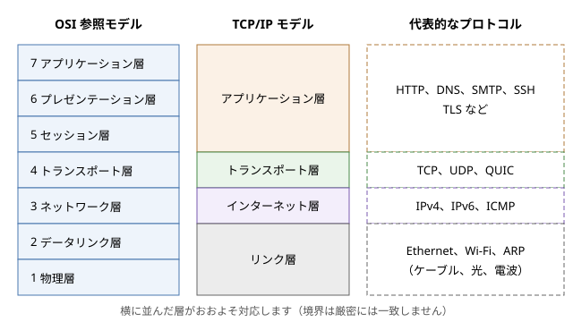
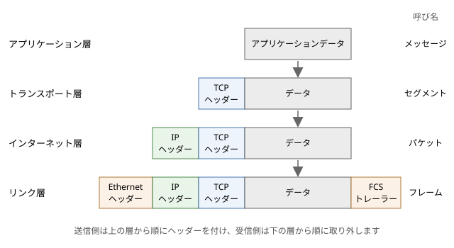

ネットワークの全体像
====================

この章では、ネットワークとは何か、データがどのような仕組みで相手に届くのかを、全体を見渡す立場から説明します。回線交換とパケット交換の違い、プロトコルと階層モデル、カプセル化といった基本的な考え方を押さえたあと、帯域幅や遅延など性能を表す指標を数式で整理します。最後に、インターネットがどのような組織のつながりでできているか、プロトコルがどのように標準化されているかを見ます。以降の章で扱う個々の技術は、この章で示す全体像のどこかに位置付けられます。

ネットワークとは
----------------

ネットワークは、複数のコンピューターを通信路で結び、データをやり取りできるようにしたものです。通信路はリンクと呼ばれ、銅線のケーブル、光ファイバー、電波などが使われます。ネットワークにつながる機器はノードと呼ばれます。

ノードは、役割によって大きく次の 2 種類に分けられます。

* ホスト（エンドシステム）：PC、スマートフォン、サーバーなど、アプリケーションを動かし、通信の始点や終点になる機器です。
* 中継機器：スイッチやルーターなど、受け取ったデータを別のリンクへ転送する機器です。

ネットワークは、その広がりによって呼び方が変わります。1 つの建物やフロアの中で機器を結ぶネットワークを LAN（Local Area Network）、離れた拠点の間を結ぶネットワークを WAN（Wide Area Network）と呼びます。LAN の中ではスイッチがフレームを転送し、LAN と LAN の間ではルーターがパケットを転送します。

インターネットは、世界中の無数のネットワークを相互に接続した「ネットワークのネットワーク」です。家庭の LAN、企業の LAN、大学のネットワーク、通信事業者のネットワークは、それぞれ別の組織が運用していますが、共通のプロトコルである IP（Internet Protocol）を使うことで、1 つの大きなネットワークのように振る舞います。

回線交換とパケット交換
----------------------

多数の利用者が通信路を共有する方法には、大きく分けて回線交換とパケット交換の 2 つがあります。

回線交換
~~~~~~~~

回線交換は、従来の電話網で使われてきた方式です。通信を始める前に、発信者から着信者までの経路上の交換機に通信路を予約し、通話が終わるまでその通信路を専有します。いったん回線がつながれば、一定の帯域幅が保証され、遅延もほぼ一定です。音声のように、一定の速さでデータが流れ続ける通信には適しています。

一方で、回線交換には無駄が生じやすいという欠点があります。コンピューターの通信は、短い時間に大量のデータを送ったかと思えば、しばらく何も送らないというように、断続的（バースト的）であることが普通です。回線を専有していると、何も送っていない時間にもその帯域幅は他の利用者に使えません。

パケット交換
~~~~~~~~~~~~

パケット交換では、送りたいデータをパケットと呼ばれる小さな単位に分割し、それぞれに宛先などを書いたヘッダーを付けて送り出します。経路上の中継機器は、パケットを受け取るとヘッダーを見て次の転送先を決め、パケットを送り出します。このように、受け取ったパケットをいったん蓄えてから次へ送り出す方式を、蓄積交換（ストアアンドフォワード）と呼びます。

パケット交換では、通信路をあらかじめ予約しません。複数の通信のパケットが、同じリンクを順番に共有して流れます。ある利用者が何も送っていない間は、他の利用者がそのリンクを使えます。このように、利用者ごとの需要の偏りを利用して 1 本のリンクを多数で共有することを、統計的多重化と呼びます。コンピューターの通信のように断続的な通信では、回線交換よりもはるかに多くの利用者を同じリンクに収容できます。

その代わり、パケット交換では帯域幅や遅延が保証されません。多くのパケットが同時に同じリンクに集まると、中継機器はパケットを待ち行列（キュー）に並べて順番に送り出します。この待ち時間がキューイング遅延です。キューがあふれると、パケットは捨てられます（パケットロス）。ネットワークが混雑してこうした状態が続くことを輻輳と呼びます。失われたパケットの再送や輻輳の制御は、主にトランスポート層の TCP が担います（「:doc:`n05_transport_layer`」で説明します）。

.. list-table:: 回線交換とパケット交換の比較
   :header-rows: 1
   :widths: 22 39 39

   * - 観点
     - 回線交換
     - パケット交換
   * - 通信路の確保
     - 通信の前に予約し、終了まで専有
     - 予約なし。パケットごとにリンクを共有
   * - 帯域幅
     - 一定の帯域幅を保証
     - 保証なし。混雑時に減少
   * - 遅延
     - ほぼ一定
     - キューイングによって変動
   * - 混雑時の振る舞い
     - 新しい通信の受け付けを拒否（話し中）
     - 遅延の増加、パケットの損失
   * - 断続的な通信の効率
     - 低い（空いている時間も専有）
     - 高い（統計的多重化）
   * - 代表例
     - 従来の電話網
     - インターネット

現在では、電話も多くがパケット交換のネットワークの上で IP 電話として実現されています。パケット交換がどのような経緯で生まれたかは「:doc:`n02_network_history`」で説明します。

プロトコル
----------

ネットワークで通信する機器やプログラムは、互いに約束事を守ってデータをやり取りします。この約束事をプロトコルと呼びます。プロトコルは、主に次の 3 つを定めます。

* 形式：メッセージがどのような項目から成り、各項目がどこに何バイトで書かれるか
* 意味：各項目の値が何を表し、受け取った側がどう解釈するか
* 手順：どのような順序でメッセージを送り合い、誤りや無応答のときにどうするか

例えば、Web ブラウザーが Web サーバーにページを要求するときは、HTTP（Hypertext Transfer Protocol）というプロトコルに従って、次のようなリクエストを送ります。

.. code-block:: http
   :linenos:

   GET /index.html HTTP/1.1
   Host: www.example.com
   Accept: text/html

サーバーは、このリクエストを HTTP の規則に従って解釈し、``HTTP/1.1 200 OK`` で始まるレスポンスを返します。ブラウザーとサーバーが別々の会社によって作られていても通信できるのは、両者が同じプロトコルに従っているからです。HTTP の詳細は「:doc:`n07_http`」で説明します。

階層モデル
----------

ネットワークで 1 つのデータを届けるには、多くの問題を解決する必要があります。電気信号や光をどう 0 と 1 に対応させるか、同じリンクにつながる機器のうち誰に渡すか、遠く離れた宛先までどの経路で運ぶか、失われたデータをどう回復するか、アプリケーションのデータをどう表現するか、といった問題です。

これらを 1 つの巨大なプロトコルで解決しようとすると、設計も実装も手に負えなくなります。そこで、通信の機能を複数の層（レイヤー）に分け、各層が 1 つの役割を担うように設計します。各層は、すぐ下の層が提供する機能を使って、すぐ上の層に機能を提供します。

層に分けることには、次の利点があります。

* 各層を独立して設計、実装できます。例えば、アプリケーションの開発者は、データが光ファイバーを通るか電波を通るかを気にせずにプログラムを書けます。
* ある層の実装を、別の実装に取り替えられます。有線 LAN を無線 LAN に替えても、その上の IP や TCP、HTTP はそのまま動きます。
* 問題の切り分けがしやすくなります。障害が起きたとき、どの層の問題かを順に確かめられます（「:doc:`n10_network_troubleshooting`」で扱います）。

OSI 参照モデルと TCP/IP モデル
~~~~~~~~~~~~~~~~~~~~~~~~~~~~~~

代表的な階層モデルには、OSI 参照モデルと TCP/IP モデルの 2 つがあります。

OSI 参照モデルは、国際標準化機構（ISO：International Organization for Standardization）が OSI（Open Systems Interconnection）の一部として定めた、通信の機能を 7 つの層に分けたモデルです。OSI のプロトコル群そのものは普及しませんでしたが、7 層の区分は通信を説明するための共通の言葉として今も広く使われています。「L2 スイッチ」「L7 ロードバランサー」のように、層の番号で機器の種類を呼ぶのはその例です。

TCP/IP モデルは、インターネットで実際に使われているプロトコル群に合わせた 4 層のモデルです。図に、2 つのモデルの対応と、各層の代表的なプロトコルを示します。

   OSI 参照モデルと TCP/IP モデル

OSI 参照モデルの上位 3 層（アプリケーション層、プレゼンテーション層、セッション層）は、TCP/IP モデルではまとめてアプリケーション層として扱われます。データの表現形式の変換や対話の管理は、TCP/IP の世界では各アプリケーションのプロトコルが自分で担うからです。また、OSI 参照モデルの下位 2 層（データリンク層、物理層）は、TCP/IP モデルではリンク層にまとめられます。

TCP/IP モデルの各層の役割は次のとおりです。

.. list-table:: TCP/IP モデルの各層
   :header-rows: 1
   :widths: 18 34 16 16 16

   * - 層
     - 役割
     - データの単位
     - 宛先の識別
     - 代表的な機器
   * - アプリケーション層
     - アプリケーションごとの通信の手順とデータの形式
     - メッセージ
     - URL、ドメイン名など
     - プロキシ、ロードバランサー（L7）
   * - トランスポート層
     - ホスト上のプログラム間の通信。TCP では信頼性のある順序どおりの配送
     - セグメント（UDP ではデータグラム）
     - ポート番号
     - ファイアウォール、ロードバランサー（L4）
   * - インターネット層
     - 複数のネットワークをまたいだ、宛先ホストまでのパケットの配送
     - パケット
     - IP アドレス
     - ルーター
   * - リンク層
     - 同じリンクにつながる隣の機器までのフレームの配送
     - フレーム
     - MAC アドレス
     - スイッチ、無線 LAN のアクセスポイント

ここで重要なのは、インターネット層の IP は「できるだけ届ける」（ベストエフォート）だけで、届くことも順序も保証しない点です。データが確実に、順序どおりに届くことは、両端のホストの TCP が保証します。ネットワークの内部は単純にしておき、複雑な機能は両端のホストに置くというこの考え方は、エンドツーエンド原理と呼ばれ、インターネットの設計の基本になっています。

各層の詳細は、「:doc:`n03_link_layer`」「:doc:`n04_internet_layer`」「:doc:`n05_transport_layer`」で順に説明し、アプリケーション層のプロトコルの例として「:doc:`n06_dns`」と「:doc:`n07_http`」を取り上げます。

カプセル化
----------

送信側では、アプリケーションが渡したデータに、各層が自分の層の制御情報をヘッダーとして付け加えながら、下の層へ渡していきます。これをカプセル化と呼びます。Web のデータを有線 LAN で送る場合のカプセル化の様子を図に示します。

   カプセル化

#. アプリケーション層は、HTTP のメッセージなどのデータを作り、TCP に渡します。
#. トランスポート層の TCP は、データの先頭に送信元と宛先のポート番号、シーケンス番号などを含む TCP ヘッダーを付けます。これがセグメントです。
#. インターネット層の IP は、セグメントの先頭に送信元と宛先の IP アドレスなどを含む IP ヘッダーを付けます。これがパケットです。
#. リンク層の Ethernet は、パケットの先頭に送信元と宛先の MAC アドレスなどを含む Ethernet ヘッダーを付け、末尾に誤り検出用の FCS（Frame Check Sequence）をトレーラーとして付けます。これがフレームで、電気信号や光として送り出されます。

受信側では、逆に下の層から順にヘッダーを取り外し、中身を上の層へ渡していきます。この処理を逆カプセル化と呼びます。このとき各層は、ヘッダーの中の情報を見て、中身をどの上位のプロトコルに渡すかを決めます。Ethernet ヘッダーの EtherType は中身が IPv4 か IPv6 かなどを、IP ヘッダーのプロトコル番号は中身が TCP か UDP かなどを、TCP ヘッダーの宛先ポート番号はどのプログラムに渡すかを示します。1 本のリンクを複数のプロトコルやプログラムで共有できるのは、この仕組みのおかげです。

各層は、自分の層のヘッダーだけを読み書きし、その中身には関与しません。例えば、ルーターはフレームを受け取ると Ethernet ヘッダーを取り外して IP ヘッダーを読み、次のリンク用の新しい Ethernet ヘッダーを付けて送り出しますが、TCP ヘッダーやアプリケーションのデータには通常触れません。送信元と宛先のホストの同じ層どうしが、間の機器を意識せずに直接やり取りしているように見えることから、各層のヘッダーは対応する層どうしの「会話」に使われていると考えられます。

ヘッダーのオーバーヘッド
~~~~~~~~~~~~~~~~~~~~~~~~

ヘッダーは、運びたいデータそのものではないため、その分だけ回線の容量を消費します。Ethernet で 1 つのフレームに載せられる IP パケットの大きさの上限を MTU（Maximum Transmission Unit）と呼び、一般的な値は 1,500 バイトです。IPv4 ヘッダーと TCP ヘッダーはオプションがなければそれぞれ 20 バイトなので、1 つのセグメントで運べるアプリケーションのデータは最大で 1,460 バイトです。

一方、回線上では、Ethernet ヘッダー（14 バイト）と FCS（4 バイト）に加えて、フレームの始まりを示すプリアンブルなど（8 バイト）と、フレームの間に空ける間隔（12 バイト分）も必要です。したがって 1,460 バイトのデータを運ぶために 1,538 バイト分の時間を使うことになり、効率はおよそ 95% です。

.. math::

   \frac{1460}{1500 + 14 + 4 + 8 + 12} = \frac{1460}{1538} \approx 0.949

逆に、1 バイトだけのデータを送る場合でも、ヘッダーなどは同じだけ必要なので、効率は極端に悪くなります。小さなデータを大量に送るプロトコルでは、このオーバーヘッドが無視できなくなります。MTU については「:doc:`n03_link_layer`」と「:doc:`n04_internet_layer`」で詳しく説明します。

性能を表す指標
--------------

ネットワークの性能を考えるときは、主に次の指標を使います。

帯域幅
~~~~~~

帯域幅は、リンクが 1 秒あたりに送り出せるデータの量で、単位は bps（bits per second）です。「100 Mbps の回線」は、1 秒間に 1 億ビットを送り出せる回線です。ファイルの大きさはバイト（8 ビット）で数えることが多いため、計算では 8 倍の換算が必要な点に注意してください。また、ネットワークの速度では 1 Mbps = :math:`10^6` bps のように 10 の累乗で数えるのが普通です。

遅延
~~~~

遅延（レイテンシ、latency）は、データが送信元を出てから宛先に届くまでにかかる時間です。1 つのパケットの遅延は、主に次の要素の和になります。

.. list-table:: 遅延の内訳
   :header-rows: 1
   :widths: 22 50 28

   * - 要素
     - 内容
     - 大きさを決めるもの
   * - 伝搬遅延
     - 信号がリンクの上を伝わる時間
     - 距離と媒体の伝搬速度
   * - 送信遅延（伝送遅延）
     - パケットのすべてのビットをリンクに送り出すのにかかる時間
     - パケットの大きさと帯域幅
   * - 処理遅延
     - 中継機器がヘッダーを調べて転送先を決める時間
     - 機器の性能
   * - キューイング遅延
     - 送り出しを待つキューに並んでいる時間
     - ネットワークの混雑の程度

伝搬遅延は、光ファイバーの中では光の速さのおよそ 3 分の 2、1 秒あたり約 20 万 km で信号が進むことから見積もれます。距離 1,000 km なら片道約 5 ms です。この値は物理法則で決まるため、機器をいくら高速にしても縮められません。地球の裏側との通信に 100 ms を超える往復時間がかかるのはこのためです。

RTT
~~~

RTT（Round Trip Time）は、データを送ってから、その応答が戻ってくるまでの往復の時間です。TCP のコネクションの確立、HTTP のリクエストとレスポンスのように、多くのプロトコルは「送って、応答を待つ」ことを繰り返すため、RTT は体感の速さに直結します。RTT は ``ping`` コマンドで簡単に測れます（「:doc:`n10_network_troubleshooting`」で説明します）。

スループット
~~~~~~~~~~~~

スループットは、実際に 1 秒あたりに届けられたデータの量です。帯域幅が「最大でどれだけ送れるか」を表すのに対し、スループットは「実際にどれだけ送れたか」を表します。経路上で最も帯域幅の小さいリンク（ボトルネック）、他の通信との共有、ヘッダーのオーバーヘッド、パケットの損失と再送、TCP の制御などにより、スループットは帯域幅よりも小さくなります。

転送時間
--------

あるサイズのデータを送り終えて、最後のビットが相手に届くまでの時間（転送時間）は、単純化すると次の式で表せます。

.. math::

   \text{転送時間} = \text{遅延} + \frac{\text{データサイズ}}{\text{帯域幅}}

第 1 項は最初のビットが届くまでの時間、第 2 項はすべてのビットを送り出すのにかかる時間です。例えば、片道の遅延が 10 ms、帯域幅が 100 Mbps の回線で 10 MB（:math:`8 \times 10^7` ビット）のデータを送ると、次のようになります。

.. math::

   0.01\,\text{s} + \frac{8 \times 10^{7}\,\text{bit}}{10^{8}\,\text{bit/s}} = 0.01\,\text{s} + 0.8\,\text{s} = 0.81\,\text{s}

この式から、データが小さいときは遅延が、データが大きいときは帯域幅が、転送時間を支配することが分かります。

サンプルコード :download:`transfer_time.py <../examples/transfer_time.py>` は、性質の異なる 5 種類の回線と 4 種類のデータサイズについて、この式で転送時間を計算して表にするものです。あわせて、次の節で説明する帯域幅遅延積も計算します。回線の帯域幅と遅延は、説明のためのおおよその値です。

.. literalinclude:: ../examples/transfer_time.py
   :language: python
   :linenos:
   :caption: transfer_time.py

実行結果は次のとおりです。

.. code-block:: text

   回線の一覧
   回線              帯域幅      片道の遅延
   データセンター内  10 Gbps     100.0 μs
   家庭の光回線      100 Mbps    10.0 ms
   モバイル回線      20 Mbps     30.0 ms
   大陸間の専用線    1 Gbps      70.0 ms
   静止衛星回線      50 Mbps     270.0 ms

   転送時間 = 遅延 + サイズ / 帯域幅
   回線                    1 KB    100 KB     10 MB      1 GB
   データセンター内    100.8 μs  180.0 μs    8.1 ms  800.1 ms
   家庭の光回線         10.1 ms   18.0 ms  810.0 ms   80.01 s
   モバイル回線         30.4 ms   70.0 ms    4.03 s  400.03 s
   大陸間の専用線       70.0 ms   70.8 ms  150.0 ms    8.07 s
   静止衛星回線        270.2 ms  286.0 ms    1.87 s  160.27 s

   帯域幅遅延積 = 帯域幅 x RTT
   回線              RTT         帯域幅遅延積
   データセンター内  200.0 μs    250.0 KB
   家庭の光回線      20.0 ms     250.0 KB
   モバイル回線      60.0 ms     150.0 KB
   大陸間の専用線    140.0 ms    17.5 MB
   静止衛星回線      540.0 ms    3.4 MB

1 KB や 100 KB の列を見ると、転送時間はほぼ遅延で決まっています。大陸間の専用線は家庭の光回線の 10 倍の帯域幅を持ちますが、100 KB の転送には家庭の光回線の 4 倍近い時間がかかります。Web ページの表示のように小さなデータのやり取りを何度も繰り返す処理では、帯域幅を増やしても速くならず、往復の回数を減らすことや、利用者の近くにサーバーを置くこと（CDN など）が効果的です。一方、1 GB の列では帯域幅がほぼすべてを決めており、大きなファイルの転送では帯域幅が重要です。

なお、実際の通信では、TCP のコネクションの確立や暗号化のためのハンドシェイクにも何往復かの時間がかかり、TCP は送信の速さを少しずつ上げていくため、転送時間はこの式の値よりも長くなります。

帯域幅遅延積
------------

帯域幅と RTT の積を、帯域幅遅延積（BDP：Bandwidth-Delay Product）と呼びます。

.. math::

   \text{帯域幅遅延積} = \text{帯域幅} \times \text{RTT}

帯域幅遅延積は、送信側がデータを送り始めてから最初の応答が戻ってくるまでの間に、送り出せるデータの量を表します。言い換えると、回線を休みなく使い続けるために、応答を待たずに送信中にしておかなければならないデータの量です。回線を水道管にたとえると、帯域幅は管の太さ、遅延は管の長さ、帯域幅遅延積は管の容積に当たります。

TCP では、送信側は相手からの確認応答（ACK）を受け取る前に送り出してよいデータの量（ウィンドウ）に上限があります。ウィンドウの大きさを :math:`W`、往復の時間を :math:`\mathrm{RTT}` とすると、1 往復の間に送れるデータは高々 :math:`W` なので、スループットには次の上限があります。

.. math::

   \text{スループット} \le \frac{W}{\mathrm{RTT}}

したがって、回線の帯域幅を使い切るには、ウィンドウが帯域幅遅延積以上でなければなりません。上の実行結果の大陸間の専用線（1 Gbps、RTT 140 ms）では、帯域幅遅延積は 17.5 MB です。もしウィンドウが TCP ヘッダーの 16 ビットの項目で表せる上限の 65,535 バイトに制限されていると、スループットの上限は次のとおりで、1 Gbps の回線のわずか 0.4% 程度しか使えません。

.. math::

   \frac{65535 \times 8\,\text{bit}}{0.14\,\text{s}} \approx 3.7\,\text{Mbps}

帯域幅が大きく遅延も大きいネットワークは、ロングファットネットワーク（LFN：Long Fat Network）と呼ばれます。LFN で性能を出すため、TCP にはウィンドウを 65,535 バイトより大きくできるウィンドウスケールオプションが追加されています。ウィンドウや輻輳制御の詳細は「:doc:`n05_transport_layer`」で説明します。

インターネットの構造
--------------------

インターネットは、1 つの組織が運営する 1 つのネットワークではありません。数多くの組織がそれぞれ自分のネットワークを運用し、それらが互いに接続しています。

ISP
~~~

家庭や企業は、ISP（Internet Service Provider）と契約してインターネットに接続します。ISP は、利用者を自分のネットワークに収容し、他の ISP のネットワークと接続することで、インターネット全体への到達性を提供します。

ISP どうしの接続には、大きく 2 つの形態があります。

* トランジット：小さな ISP が大きな ISP に料金を払い、インターネット全体への経路を提供してもらう接続です。
* ピアリング：同程度の規模の ISP どうしが、互いの利用者あての通信だけを、多くの場合は無償で交換する接続です。

他の ISP からトランジットを買わずに、ピアリングだけでインターネット全体に到達できる最上位の ISP は、ティア 1 と呼ばれます。インターネットは、こうしたティア 1 の ISP を頂点とし、地域の ISP、さらに利用者へと広がる、ゆるやかな階層構造になっています。

IX
~~

多くの ISP が個別に回線を引いて 1 対 1 で接続するのは非効率です。そこで、多数の ISP やコンテンツ事業者が 1 か所に集まって相互に接続するための施設として、IX（Internet Exchange）が設けられています。IX には高速なスイッチが置かれ、参加する組織はそこに自分のルーターをつなぐだけで、他の多くの参加者とピアリングできます。通信が遠回りせずに近くで交換されるため、遅延とコストの両方を減らせます。

AS
~~

インターネットの経路制御の観点では、1 つの組織が一貫した方針で運用するネットワークのまとまりを AS（Autonomous System）と呼びます。ISP、大企業、大学、クラウド事業者などがそれぞれ AS を持ち、世界で一意な AS 番号で識別されます。

AS の内部の経路は、各 AS が OSPF（Open Shortest Path First）などのプロトコルで自由に制御します。AS と AS の間では、BGP（Border Gateway Protocol）というプロトコルで「どの IP アドレスの範囲に、どの AS を経由して到達できるか」という経路の情報を交換します。BGP では、最短の経路よりも、トランジットとピアリングの契約関係などの方針に基づいて経路が選ばれます。経路制御については「:doc:`n04_internet_layer`」で説明します。

また、IP アドレスや AS 番号、ポート番号などの番号資源は、IANA（Internet Assigned Numbers Authority）が全体を管理し、地域ごとの RIR（Regional Internet Registry）を通じて割り当てられています。アジア太平洋地域の RIR は APNIC で、日本では JPNIC が国内の割り当てを担っています。

標準化
------

異なる会社の機器やソフトウェアが互いに通信できるのは、プロトコルが標準として公開されているからです。ネットワークの標準化には、主に次の組織が関わっています。

.. list-table:: ネットワークの主な標準化組織
   :header-rows: 1
   :widths: 20 45 35

   * - 組織
     - 対象
     - 代表的な成果
   * - IETF
     - インターネットのプロトコル（主にインターネット層からアプリケーション層）
     - IP、TCP、UDP、DNS、HTTP、TLS、QUIC
   * - IEEE
     - LAN などのリンク層と物理層の規格
     - IEEE 802.3（Ethernet）、IEEE 802.11（無線 LAN）
   * - ISO、ITU-T
     - 国際的な通信規格
     - OSI 参照モデル、電話網の規格
   * - W3C、WHATWG
     - Web の技術
     - HTML、DOM、Fetch などの仕様

IETF と RFC
~~~~~~~~~~~

インターネットのプロトコルを標準化しているのは、IETF（Internet Engineering Task Force）です。IETF は会員制の団体ではなく、誰でもメーリングリストや会合に参加して議論できます。IETF の方針は「大まかな合意と動くコード（rough consensus and running code）」という言葉で表され、投票で決めるのではなく、議論による大まかな合意と、実際に動く実装を重視します。

IETF で作られた文書は、RFC（Request for Comments）として番号を付けて公開されます。RFC の番号は通し番号で、いったん公開された RFC の内容は変更されず、改訂するときは新しい番号の RFC が発行されます。例えば、TCP の仕様は 1981 年の RFC 793 で定められましたが、2022 年に RFC 9293 として改訂されました。RFC にはインターネット標準になるものだけでなく、情報提供や実験的なものも含まれます。

.. list-table:: 主なプロトコルの RFC
   :header-rows: 1
   :widths: 40 30 30

   * - プロトコル
     - RFC
     - 発行年
   * - UDP
     - RFC 768
     - 1980
   * - IPv4
     - RFC 791
     - 1981
   * - DNS
     - RFC 1034、RFC 1035
     - 1987
   * - IPv6
     - RFC 8200
     - 2017
   * - TLS 1.3
     - RFC 8446
     - 2018
   * - QUIC
     - RFC 9000
     - 2021
   * - HTTP のセマンティクス
     - RFC 9110
     - 2022
   * - TCP
     - RFC 9293
     - 2022

RFC を読むときに知っておくとよいのが、「MUST」「SHOULD」「MAY」などの英単語の意味です。RFC 2119 などで定義されており、MUST は必須、SHOULD は特別な理由がない限り従うべき推奨、MAY は任意を表します。プロトコルを実装するときは、これらの違いに注意して仕様を読みます。

IEEE 802
~~~~~~~~

LAN の規格は、IEEE（Institute of Electrical and Electronics Engineers）の 802 委員会が定めています。有線 LAN の Ethernet は IEEE 802.3、無線 LAN は IEEE 802.11 として標準化されており、伝送速度の向上などに合わせて規格が追加され続けています。無線 LAN の製品で「Wi-Fi」と表示されているのは、業界団体の Wi-Fi Alliance が IEEE 802.11 に基づく製品の相互接続性を認証したものです。これらは「:doc:`n03_link_layer`」で扱います。

まとめ
------

* ネットワークはノードとリンクから成り、インターネットは多数の組織のネットワークを IP で相互に接続した「ネットワークのネットワーク」です。
* パケット交換は、データをパケットに分けてリンクを共有する方式で、断続的なコンピューターの通信を効率よく運べます。その代わり、帯域幅や遅延は保証されず、パケットが失われることもあります。
* 通信の機能は層に分けて設計されます。OSI 参照モデルは 7 層、TCP/IP モデルはリンク層、インターネット層、トランスポート層、アプリケーション層の 4 層です。
* 送信側では各層がヘッダーを付けるカプセル化を行い、受信側では下の層から順にヘッダーを取り外して上の層へ渡します。
* 転送時間はおおよそ「遅延 + サイズ / 帯域幅」で、小さなデータでは遅延が、大きなデータでは帯域幅が支配的です。回線を使い切るには、帯域幅遅延積以上のデータを送信中にしておく必要があります。
* インターネットは ISP、IX、AS のつながりで構成され、プロトコルは IETF の RFC や IEEE 802 などの標準として公開されています。
