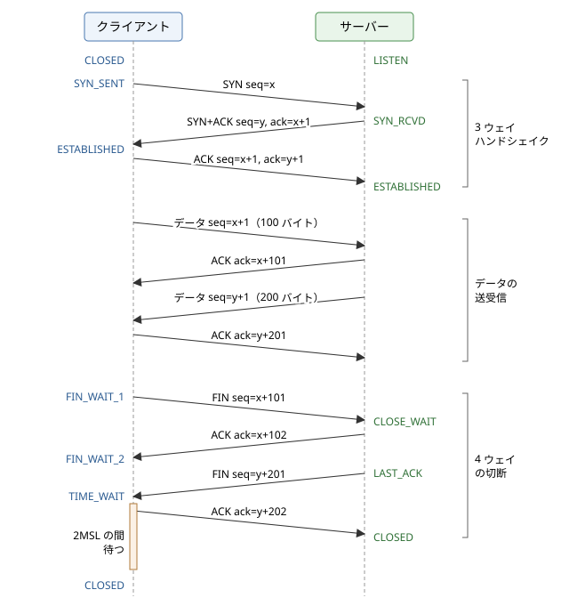

トランスポート層
================

この章では、インターネット層の上に位置するトランスポート層を説明します。IP はパケットをホストまで届けますが、ホストの中のどのプログラムに渡すかは決めず、パケットの損失や順序の入れ替わりも防ぎません。トランスポート層は、ポート番号によってプログラムを区別し、必要に応じて信頼性のある通信を提供します。最も単純な UDP を見たあと、TCP がコネクションの確立と切断、シーケンス番号と確認応答、再送、フロー制御、輻輳制御によって、損失の起こるネットワークの上で信頼性のある通信を実現する仕組みを詳しく説明します。最後に、TCP の制約を乗り越えるために作られた QUIC を取り上げます。

トランスポート層の役割
----------------------

トランスポート層のプロトコルは、ホストの間ではなく、ホストの中で動くプログラム（プロセス）の間の通信を提供します。インターネットで使われる主なトランスポート層のプロトコルは、UDP（User Datagram Protocol）と TCP（Transmission Control Protocol）の 2 つです。

.. list-table:: UDP と TCP の比較
   :header-rows: 1
   :widths: 24 38 38

   * - 項目
     - UDP
     - TCP
   * - コネクション
     - なし（いきなり送信）
     - あり（送信前に確立）
   * - データの単位
     - メッセージ（データグラム）。境界を保持
     - バイトストリーム。境界はなし
   * - 到達の保証
     - なし
     - あり（再送による回復）
   * - 順序の保証
     - なし
     - あり
   * - フロー制御・輻輳制御
     - なし
     - あり
   * - ヘッダーの大きさ
     - 8 バイト
     - 20 バイト以上
   * - 主な用途
     - DNS、NTP、音声・映像の配信、オンラインゲーム、QUIC
     - Web（HTTP/1.1、HTTP/2）、メール、SSH、データベースの接続

ポート番号
~~~~~~~~~~

ホストの中の通信相手のプログラムを区別するために、トランスポート層は 16 ビットのポート番号（0〜65535）を使います。サーバーのプログラムは決まったポート番号で待ち受け、クライアントはそのポート番号を宛先にして通信を始めます。IANA はポート番号の範囲を次のように分けています。

.. list-table:: ポート番号の範囲
   :header-rows: 1
   :widths: 25 25 50

   * - 範囲
     - 名前
     - 用途
   * - 0〜1023
     - ウェルノウンポート
     - 代表的なサービス（HTTP の 80、HTTPS の 443、SSH の 22、DNS の 53 など）
   * - 1024〜49151
     - 登録済みポート
     - 特定のアプリケーション用に登録された番号（MySQL の 3306、PostgreSQL の 5432 など）
   * - 49152〜65535
     - 動的・プライベートポート
     - クライアント側で一時的に使う番号

クライアント側のポート番号は、通常 OS が空いている番号から自動的に選びます。これをエフェメラルポート（一時ポート）と呼びます。実際に使われる範囲は OS によって異なり、Linux の初期設定では 32768〜60999、Windows では 49152〜65535 です。

TCP の 1 つのコネクションは、プロトコル、送信元 IP アドレス、送信元ポート番号、宛先 IP アドレス、宛先ポート番号の 5 つの組（5 タプル）で識別されます。同じサーバーの 443 番ポートに多数のクライアントが同時に接続できるのは、クライアント側の IP アドレスとポート番号の組が異なるためです。

UDP
---

UDP は 1980 年に RFC 768 として定められた、非常に単純なプロトコルです。IP の機能に、ポート番号によるプログラムの区別と、データの誤りの検出だけを加えたもので、ヘッダーは次の 4 つのフィールド、合わせて 8 バイトしかありません。

.. list-table:: UDP のヘッダー
   :header-rows: 1
   :widths: 30 20 50

   * - フィールド
     - 大きさ
     - 内容
   * - 送信元ポート番号
     - 16 ビット
     - 送信元のプログラムのポート番号
   * - 宛先ポート番号
     - 16 ビット
     - 宛先のプログラムのポート番号
   * - 長さ
     - 16 ビット
     - ヘッダーとデータを合わせた長さ（バイト単位）
   * - チェックサム
     - 16 ビット
     - 誤り検出用の値（IPv4 では省略可能、IPv6 では必須）

UDP は、送られたデータを 1 つのメッセージ（データグラム）として扱い、1 回の送信が受信側でも 1 回の受信になります。しかし、データグラムが失われても再送されず、届く順序も入れ替わることがあり、送信の速さも調整されません。

それでも UDP が使われるのは、次のような場合です。

* 1 回の問い合わせと応答で終わる通信：DNS のように、短いリクエストとレスポンスで済む場合は、コネクションを確立する往復の時間を省けます。失われた場合は、アプリケーションがタイムアウトして問い合わせ直します。
* 遅れたデータには価値がない通信：音声通話やオンラインゲームでは、失われたデータを待って再送するより、次の新しいデータを処理する方が適しています。
* 独自の制御を実装したい場合：後で説明する QUIC は、UDP の上に TCP に代わる信頼性と輻輳制御を独自に実装しています。

UDP で損失を扱うには、アプリケーション自身がタイムアウトと再送を実装する必要があります。サンプルコード :download:`udp_echo.py <../examples/udp_echo.py>` は、localhost で UDP のエコーサーバーをスレッドで起動し、クライアントがメッセージを送って応答を待つものです。サーバーは 30% の確率で応答を捨ててパケットの損失を模擬し、クライアントは 0.3 秒のタイムアウトで損失を検出して送り直し、1 つのメッセージを最大 3 回まで送ります。

.. literalinclude:: ../examples/udp_echo.py
   :language: python
   :linenos:
   :caption: udp_echo.py

実行結果は次のとおりです。乱数のシードを固定しているので、毎回同じ結果になります。msg-7 は 2 回続けて応答が失われましたが、3 回目の送信で応答を得ています。

.. code-block:: text

     [サーバー] msg-1 を受信したが、応答を捨てる
   [クライアント] msg-1: 1 回目 タイムアウト
   [クライアント] msg-1: 2 回目 応答 'msg-1'
   [クライアント] msg-2: 1 回目 応答 'msg-2'
     [サーバー] msg-3 を受信したが、応答を捨てる
   [クライアント] msg-3: 1 回目 タイムアウト
   [クライアント] msg-3: 2 回目 応答 'msg-3'
   [クライアント] msg-4: 1 回目 応答 'msg-4'
   [クライアント] msg-5: 1 回目 応答 'msg-5'
   [クライアント] msg-6: 1 回目 応答 'msg-6'
     [サーバー] msg-7 を受信したが、応答を捨てる
   [クライアント] msg-7: 1 回目 タイムアウト
     [サーバー] msg-7 を受信したが、応答を捨てる
   [クライアント] msg-7: 2 回目 タイムアウト
   [クライアント] msg-7: 3 回目 応答 'msg-7'
   [クライアント] msg-8: 1 回目 応答 'msg-8'
   成功: 8 / 8

このサンプルからは、タイムアウトによる損失の検出の本質的な難しさも分かります。クライアントには、リクエストが失われたのか、応答が失われたのか、単にサーバーの処理が遅いのかを区別できません。このサンプルでは応答だけを捨てているので、サーバーは同じメッセージを複数回処理しています。処理が重複しても問題がないように設計する冪等性の考え方は、「:doc:`d04_communication`」で説明します。

TCP の特徴
----------

TCP は 1981 年に RFC 793 として定められ、その後の多くの拡張をまとめた現在の仕様は RFC 9293（2022 年）です。TCP は、ベストエフォート型の IP の上で、次の性質を持つ通信を提供します。

* コネクション型：通信の前に、両端でコネクションを確立し、送受信の状態を共有します。
* 信頼性：データが失われたら再送し、重複したら取り除き、順序が入れ替わったら並べ直して、送った順番どおりにすべてのデータを届けます。
* バイトストリーム：アプリケーションから見ると、TCP は区切りのないバイトの流れです。送信側で 100 バイトを 2 回送っても、受信側では 200 バイトが 1 回で読めたり、50 バイトずつ 4 回に分かれたりします。メッセージの区切りはアプリケーションが決める必要があります（「:doc:`n09_socket_programming`」で説明します）。
* 全二重：1 つのコネクションで、両方向に同時にデータを送れます。
* フロー制御と輻輳制御：受信側の処理能力とネットワークの混雑に合わせて、送信の速さを調整します。

TCP のヘッダー
~~~~~~~~~~~~~~

TCP が運ぶデータの単位をセグメントと呼びます。TCP のヘッダーは、オプションがなければ 20 バイト、オプションを含めて最大 60 バイトです。

.. list-table:: TCP のヘッダー
   :header-rows: 1
   :widths: 30 15 55

   * - フィールド
     - 大きさ
     - 内容
   * - 送信元ポート番号
     - 16 ビット
     - 送信元のプログラムのポート番号
   * - 宛先ポート番号
     - 16 ビット
     - 宛先のプログラムのポート番号
   * - シーケンス番号
     - 32 ビット
     - このセグメントのデータの先頭のバイトの番号
   * - 確認応答番号（ACK 番号）
     - 32 ビット
     - 次に受け取りたいバイトの番号（ACK フラグが立っている場合に有効）
   * - データオフセット
     - 4 ビット
     - ヘッダーの長さ（4 バイト単位）
   * - 予約
     - 4 ビット
     - 将来のための領域（0）
   * - フラグ
     - 8 ビット
     - CWR、ECE、URG、ACK、PSH、RST、SYN、FIN の各ビット
   * - ウィンドウサイズ
     - 16 ビット
     - 受信側が受け入れられるデータの量（バイト単位）
   * - チェックサム
     - 16 ビット
     - ヘッダーとデータの誤り検出用の値
   * - 緊急ポインター
     - 16 ビット
     - 緊急データの位置（ほとんど未使用）
   * - オプション
     - 可変長
     - MSS、ウィンドウスケール、SACK、タイムスタンプなど

特に重要なフラグは次の 4 つです。

* SYN：コネクションの確立を要求します。
* ACK：確認応答番号が有効であることを示します。コネクションの確立後は、ほぼすべてのセグメントで立っています。
* FIN：送信するデータがもうないことを示し、コネクションの切断を始めます。
* RST：コネクションを強制的に中止します。待ち受けていないポートへの接続要求に対しても返されます。

コネクションの確立と切断
------------------------

コネクションの確立から切断までの、クライアントとサーバーのやり取りと状態の変化を図に示します。

   TCP のコネクションの確立、データの送受信、切断

3 ウェイハンドシェイク
~~~~~~~~~~~~~~~~~~~~~~

TCP のコネクションは、次の 3 つのセグメントのやり取りで確立します。これを 3 ウェイハンドシェイクと呼びます。

#. クライアントは、シーケンス番号の初期値 :math:`x` を選び、SYN を送ります。状態は SYN_SENT になります。
#. 待ち受けていた（LISTEN の状態の）サーバーは、自分の初期値 :math:`y` を選び、SYN と ACK（確認応答番号 :math:`x+1`）を同時に立てたセグメントを返します。状態は SYN_RCVD になります。
#. クライアントは ACK（確認応答番号 :math:`y+1`）を返し、ESTABLISHED（確立）の状態になります。これを受け取ったサーバーも ESTABLISHED になります。

SYN は 1 バイト分のシーケンス番号を消費するため、確認応答番号は初期値に 1 を足した値になります。

ハンドシェイクの目的は、両方向のシーケンス番号の初期値を互いに伝えて確認することです。初期値は 0 ではなく、推測されにくいランダムな値が選ばれます。以前の同じ組み合わせのコネクションの古いセグメントと混同しないため、また第三者が偽のセグメントを差し込む攻撃を難しくするためです。ハンドシェイクでは、MSS、ウィンドウスケール、SACK の利用の可否、タイムスタンプなどのオプションも取り決めます。

3 ウェイハンドシェイクのため、TCP ではデータを送り始める前に 1 RTT の時間がかかります。HTTPS ではさらに TLS のハンドシェイク（「:doc:`n08_network_security`」を参照してください）が続くため、遠くのサーバーとの通信ではコネクションの確立だけで目に見える遅延になります。HTTP がコネクションを使い回すキープアライブ（「:doc:`n07_http`」を参照してください）や、データベースのコネクションプールが重要なのはこのためです。最初の SYN にデータを載せる TCP Fast Open（RFC 7413）という拡張もありますが、広くは使われていません。

なお、SYN を受け取ったサーバーは、確立の途中のコネクションの情報を保持します。大量の偽の SYN を送ってこの領域を使い果たさせる攻撃を SYN フラッド攻撃と呼び、OS は SYN cookie などの方法で対策しています。

コネクションの切断と TIME_WAIT
~~~~~~~~~~~~~~~~~~~~~~~~~~~~~~

TCP は全二重なので、切断も方向ごとに行います。図は、クライアントから切断を始める場合です。

#. クライアントは、送るデータがなくなると FIN を送り、FIN_WAIT_1 の状態になります。
#. サーバーは ACK を返し、CLOSE_WAIT の状態になります。ACK を受け取ったクライアントは FIN_WAIT_2 になります。この時点で、クライアントからサーバーへの方向だけが閉じています。サーバーはまだデータを送れます。
#. サーバーのアプリケーションがソケットを閉じると、サーバーは FIN を送り、LAST_ACK の状態になります。
#. クライアントは ACK を返し、TIME_WAIT の状態になります。ACK を受け取ったサーバーは CLOSED になり、コネクションの情報を破棄します。

4 つのセグメントをやり取りすることから、4 ウェイの切断と呼ばれます（2 番目と 3 番目をまとめて 3 つで済む場合もあります）。

先に FIN を送った側は、最後の ACK を送ったあと、すぐにはコネクションの情報を破棄せず、TIME_WAIT の状態で MSL（Maximum Segment Lifetime、セグメントがネットワークに留まり得る最大の時間）の 2 倍の時間だけ待ちます。理由は次の 2 つです。

* 最後の ACK が失われた場合、相手は FIN を再送してきます。そのときに ACK を送り直せるように、状態を保っておく必要があります。
* 同じ 5 タプルですぐに新しいコネクションを作ると、ネットワークに残っていた古いコネクションの遅れたセグメントを、新しいコネクションのデータと取り違えるおそれがあります。2MSL 待てば、古いセグメントは消えています。

TIME_WAIT の時間は実装によって異なり、Linux では 60 秒です。短いコネクションを大量に作っては切るクライアントでは、TIME_WAIT のコネクションが大量に溜まってエフェメラルポートを使い果たし、新しい接続ができなくなることがあります。コネクションを使い回すのが根本的な対策です。また、サーバーを再起動したときに、前のプロセスの TIME_WAIT が残っていて同じポートで待ち受けられないことがあるため、Linux などではサーバーのソケットに ``SO_REUSEADDR`` オプションを設定するのが一般的です（Windows ではこのオプションの意味が異なります。「:doc:`n09_socket_programming`」を参照してください）。

逆に、CLOSE_WAIT の状態のコネクションが大量に溜まっている場合は、相手は切断したのに、自分のアプリケーションがソケットを閉じていないことを意味します。多くはアプリケーションの不具合で、ファイル記述子などの資源の枯渇につながります。各状態のコネクションは、``netstat`` や ``ss`` コマンドで確かめられます（「:doc:`n10_network_troubleshooting`」を参照してください）。

.. list-table:: TCP の主な状態
   :header-rows: 1
   :widths: 25 75

   * - 状態
     - 意味
   * - LISTEN
     - サーバーが接続を待ち受けている状態
   * - SYN_SENT
     - SYN を送り、応答を待っている状態
   * - SYN_RCVD
     - SYN を受け取って SYN と ACK を返し、最後の ACK を待っている状態
   * - ESTABLISHED
     - コネクションが確立し、データを送受信できる状態
   * - FIN_WAIT_1、FIN_WAIT_2
     - 自分から FIN を送り、相手の ACK や FIN を待っている状態
   * - CLOSE_WAIT
     - 相手から FIN を受け取り、自分のアプリケーションが閉じるのを待っている状態
   * - LAST_ACK
     - 自分も FIN を送り、最後の ACK を待っている状態
   * - TIME_WAIT
     - 切断を終え、古いセグメントが消えるまで 2MSL 待っている状態
   * - CLOSED
     - コネクションが存在しない状態

切断には、FIN による正常な切断のほかに、RST による強制的な中止もあります。RST を受け取った側は、送受信の途中のデータを破棄してただちにコネクションを閉じ、アプリケーションには「接続がリセットされた」というエラーが返ります。

シーケンス番号と確認応答
------------------------

TCP は、送るデータの 1 バイトごとに番号を付けます。セグメントのシーケンス番号は、そのセグメントのデータの先頭のバイトの番号です。受信側は、データを受け取ると、確認応答番号に「次に受け取りたいバイトの番号」を入れた ACK を返します。図の例では、クライアントがシーケンス番号 :math:`x+1` から 100 バイトを送ると、サーバーは確認応答番号 :math:`x+101` を返しています。

TCP の確認応答は累積的です。確認応答番号 :math:`n` は、「:math:`n-1` 番までのバイトをすべて受け取った」ことを意味します。途中のセグメントが失われて後ろのセグメントだけが届いた場合、受信側は後ろのデータを保持しつつ、失われた部分の番号を確認応答番号にした ACK を返し続けます。こうして、同じ確認応答番号の ACK（重複 ACK）が続けて送信側に届きます。

累積的な確認応答では、どこが抜けているかの最初の 1 か所しか伝えられません。そこで、受け取ったデータの範囲をオプションで具体的に伝える SACK（Selective Acknowledgment、RFC 2018）が使われます。SACK を使うと、送信側は抜けている部分だけを再送できます。

再送とタイムアウト
------------------

TCP は、送ったデータの ACK が一定時間内に返ってこなければ、データが失われたとみなして再送します。この待ち時間を RTO（Retransmission Timeout、再送タイムアウト）と呼びます。

RTO を短くしすぎると、ACK が単に遅れているだけなのに無駄な再送をしてしまい、長くしすぎると、損失からの回復が遅くなります。適切な値は経路の RTT によって大きく異なり、同じ経路でも混雑の程度によって変わります。そこで TCP は、送ったセグメントの ACK が返るまでの時間を測って RTT の推定値を更新し続け、RTO を計算します。RFC 6298 の方法では、RTT の測定値を :math:`R` とすると、平滑化した RTT（:math:`\mathit{SRTT}`）とそのばらつき（:math:`\mathit{RTTVAR}`）を次のように更新します。

.. math::

   \mathit{RTTVAR} &\leftarrow \frac{3}{4}\,\mathit{RTTVAR} + \frac{1}{4}\,\lvert \mathit{SRTT} - R \rvert \\
   \mathit{SRTT} &\leftarrow \frac{7}{8}\,\mathit{SRTT} + \frac{1}{8}\,R \\
   \mathit{RTO} &= \mathit{SRTT} + 4 \cdot \mathit{RTTVAR}

ばらつきの 4 倍を加えることで、RTT が揺れ動く経路でも無駄な再送を起こしにくくしています。RFC 6298 では、RTO の初期値を 1 秒、最小値を 1 秒とすることを推奨していますが、Linux は最小値として 200 ms を使っています。また、再送したセグメントの ACK は、元の送信と再送のどちらへの応答か区別できないため、RTT の測定には使いません（カーンのアルゴリズム）。

再送してもまた ACK が返らなければ、RTO を 2 倍にして再送を繰り返します（指数バックオフ）。ネットワークがひどく混雑しているときに再送で混雑をさらに悪化させないためです。再送を一定の回数繰り返しても応答がなければ、TCP はコネクションを諦め、アプリケーションにエラーを返します。Linux の初期設定では、これに十数分かかります。相手のホストが突然停止した場合、TCP だけではそれを素早く検出できないため、アプリケーションは自分でタイムアウトを設定する必要があります。

高速再送
~~~~~~~~

RTO による再送は、少なくとも RTO の時間だけ待つため、回復が遅くなります。そこで TCP は、同じ確認応答番号の重複 ACK を 3 つ受け取ったら、RTO を待たずにその番号のセグメントを再送します。これを高速再送と呼びます。重複 ACK が届くということは、後続のセグメントは届いており、ネットワークはまだデータを運べている状態だと考えられます。1 つや 2 つの重複 ACK では、単に順序が入れ替わっただけの可能性があるため、3 つを目安にしています。

フロー制御とウィンドウ
----------------------

送信側が、受信側のアプリケーションが読み出すよりも速くデータを送ると、受信側のバッファがあふれます。これを防ぐのがフロー制御です。

TCP では、受信側はセグメントのヘッダーのウィンドウサイズのフィールドに、受信バッファの空き容量を書いて送ります。これを受信ウィンドウ（rwnd）と呼びます。送信側は、ACK をまだ受け取っていないデータの量が受信ウィンドウを超えないように送信します。ACK を待たずに、ウィンドウの範囲で複数のセグメントを続けて送れるため、1 つ送るたびに ACK を待つよりはるかに効率よく送れます。ACK が返るとウィンドウが前に進むため、この方式をスライディングウィンドウと呼びます。

受信側のアプリケーションがデータを読まずにバッファがいっぱいになると、受信側はウィンドウサイズ 0 を通知し、送信側は送信を止めます。その後、送信側は定期的に小さなセグメントを送ってウィンドウが開いたかを確かめます。

ウィンドウとスループットの上限
~~~~~~~~~~~~~~~~~~~~~~~~~~~~~~

「:doc:`n01_network_overview`」の帯域幅遅延積の節で見たように、送信側が ACK を待たずに送れるデータの量はウィンドウサイズまでで、その ACK が返るまでに 1 RTT かかります。したがって、1 つのコネクションのスループットには、次の上限があります。

.. math::

   \text{スループット} \le \frac{\text{ウィンドウサイズ}}{\mathrm{RTT}}

ウィンドウサイズのフィールドは 16 ビットなので、そのままでは最大 65,535 バイトです。RTT が 100 ms の経路では、上限はおよそ :math:`65535 \times 8 / 0.1 \approx 5.2` Mbps にしかなりません。帯域幅を使い切るには、ウィンドウサイズが帯域幅遅延積以上である必要があります。例えば、RTT 100 ms で 1 Gbps を出すには、:math:`10^9 \times 0.1 / 8 = 12.5` MB のウィンドウが必要です。

そこで、ハンドシェイクで取り決めたビット数だけウィンドウサイズの値を左にシフトして解釈するウィンドウスケールオプション（RFC 7323）が使われます。シフトは最大 14 ビットで、ウィンドウを約 1 GB まで大きくできます。現在の OS は、通信の状況に合わせて受信バッファの大きさを自動的に調整します。

輻輳制御
--------

フロー制御が受信側を守る仕組みであるのに対し、輻輳制御はネットワークを守る仕組みです。多数の送信者が、経路上のボトルネックのリンクの容量を超えて送り続けると、ルーターのキューがあふれてパケットが捨てられます。捨てられたパケットを各送信者が再送すると混雑はさらに悪化し、回線は再送のパケットでいっぱいになって、意味のあるデータがほとんど届かなくなります。この状態を輻輳崩壊と呼びます。

1986 年には実際にインターネットで輻輳崩壊が起き、これを受けてジェイコブソン（Van Jacobson）らが TCP にスロースタートと輻輳回避などのアルゴリズムを導入し、1988 年に発表しました（経緯は「:doc:`n02_network_history`」を参照してください）。これが現在の TCP の輻輳制御の基礎になっています（現在の標準は RFC 5681 です）。

輻輳制御の考え方は、送信側がネットワークの混雑の程度を、パケットの損失などの手がかりから推測し、送信の量を自分で調整するというものです。送信側は、受信ウィンドウとは別に、ネットワークに送り出してよいデータの量として輻輳ウィンドウ（cwnd）を持ちます。実際に送れる量は、両者の小さい方です。

.. math::

   \text{送信できる量} = \min(\mathit{cwnd},\ \mathit{rwnd})

スロースタート
~~~~~~~~~~~~~~

コネクションの開始時は、ネットワークの空き容量が分かりません。そこで cwnd を小さな値から始め、ACK が返るたびに 1 MSS ずつ増やします。1 RTT の間に送ったセグメントの数だけ ACK が返るため、cwnd は RTT ごとに 2 倍になります。「スロー」という名前ですが、増え方は指数的で、すぐに大きくなります。名前は、それ以前の TCP がいきなりウィンドウいっぱいに送っていたのに比べて「ゆっくり始める」ことに由来します。

cwnd の初期値は、かつては 1〜4 セグメントでしたが、現在は 10 セグメント（RFC 6928）が一般的です。cwnd がしきい値 ssthresh（slow start threshold）に達すると、次の輻輳回避に移ります。

輻輳回避と AIMD
~~~~~~~~~~~~~~~

輻輳回避の段階では、cwnd を RTT ごとに 1 MSS ずつ、線形に増やします。そして、パケットの損失を検出したら、ネットワークが混雑していると判断して cwnd を大きく減らします。

* 重複 ACK で損失を検出した場合：ssthresh を cwnd の半分にし、cwnd も ssthresh まで下げて、輻輳回避を続けます（高速リカバリー）。重複 ACK が届くということは、ネットワークはまだデータを運べているので、最初からやり直す必要はないと考えます。
* RTO で損失を検出した場合：ssthresh を cwnd の半分にし、cwnd を 1 に戻して、スロースタートからやり直します。ACK がまったく返らないのは、深刻な混雑を意味すると考えます。

損失がなければ一定量ずつ増やし（加算的増加）、損失があれば一定の割合で減らす（乗算的減少）この方式を、AIMD（Additive Increase / Multiplicative Decrease）と呼びます。

.. math::

   \text{損失がない RTT ごとに：}\ \mathit{cwnd} \leftarrow \mathit{cwnd} + 1, \qquad
   \text{損失を検出したとき：}\ \mathit{cwnd} \leftarrow \mathit{cwnd} / 2

AIMD には、同じボトルネックを共有する複数のコネクションの cwnd が、次第に公平な値に近づくという性質があります。加算的増加では各コネクションが同じ量ずつ増えますが、乗算的減少では cwnd の大きいコネクションほど大きく減るため、差が縮まっていくのです。

サンプルコード :download:`congestion_sim.py <../examples/congestion_sim.py>` は、RTT ごとの cwnd の変化を、この単純なモデルで計算して表示するものです。11 番目の RTT で重複 ACK による損失、19 番目の RTT でタイムアウトによる損失が起きるものとしています。

.. literalinclude:: ../examples/congestion_sim.py
   :language: python
   :linenos:
   :caption: congestion_sim.py

実行結果は次のとおりです。cwnd が 16 に達するまでは RTT ごとに 2 倍になり、その後は 1 ずつ増えています。重複 ACK による損失では cwnd が半分になって輻輳回避を続け、タイムアウトでは 1 に戻ってスロースタートからやり直しています。cwnd の変化がのこぎりの歯のような形を描くのが、AIMD の特徴です。

.. code-block:: text

   RTT  cwnd  ssthresh  状態                  cwnd のグラフ
     1     1        16  スロースタート        #
     2     2        16  スロースタート        ##
     3     4        16  スロースタート        ####
     4     8        16  スロースタート        ########
     5    16        16  輻輳回避              ################
     6    17        16  輻輳回避              #################
     7    18        16  輻輳回避              ##################
     8    19        16  輻輳回避              ###################
     9    20        16  輻輳回避              ####################
    10    21        16  輻輳回避              #####################
    11    22        16  損失（重複 ACK）      ######################
    12    11        11  輻輳回避              ###########
    13    12        11  輻輳回避              ############
    14    13        11  輻輳回避              #############
    15    14        11  輻輳回避              ##############
    16    15        11  輻輳回避              ###############
    17    16        11  輻輳回避              ################
    18    17        11  輻輳回避              #################
    19    18        11  損失（タイムアウト）  ##################
    20     1         9  スロースタート        #
    21     2         9  スロースタート        ##
    22     4         9  スロースタート        ####
    23     8         9  スロースタート        ########
    24     9         9  輻輳回避              #########
    25    10         9  輻輳回避              ##########
    26    11         9  輻輳回避              ###########

AIMD では、cwnd が損失のたびに半分になり、RTT ごとに 1 MSS ずつしか回復しません。帯域幅遅延積の大きい経路では、cwnd が数千セグメントにもなるため、半分に減ったあと元に戻るまでに数千 RTT もかかってしまいます。また、損失率 :math:`p` の経路での TCP のスループットは、おおよそ次の式で見積もられることが知られています（Mathis らによる近似）。

.. math::

   \text{スループット} \approx \frac{\mathrm{MSS}}{\mathrm{RTT}} \cdot \frac{1.22}{\sqrt{p}}

この式から、RTT が大きいほど、また損失率が高いほど、スループットが下がることが分かります。遠くのサーバーとの通信が、帯域幅に余裕があっても遅くなりがちなのはこのためです。

CUBIC と BBR
~~~~~~~~~~~~

AIMD の問題を改善するため、多くの輻輳制御のアルゴリズムが提案されてきました。現在広く使われているのは、次の 2 つです。

* CUBIC：損失を検出したときの cwnd を覚えておき、その後の cwnd を、最後の損失からの経過時間の 3 次関数に従って増やします。損失の直前の値に近づくまでは速く増やし、その付近では慎重に、それを超えたらまた速く増やします。増え方が RTT ではなく時間で決まるため、RTT の異なるコネクションの間でも公平になりやすい特徴があります。Linux では 2006 年から標準のアルゴリズムで、RFC 9438 として標準化されています。
* BBR（Bottleneck Bandwidth and Round-trip propagation time）：Google が 2016 年に発表したアルゴリズムです。損失を混雑の合図とせず、測定した配送の速さと最小の RTT から、ボトルネックの帯域幅と経路の本来の RTT を推定し、その積に見合う量だけを、帯域幅に合わせた一定の間隔で送り出します。

損失を合図にする方式は、ルーターのキューがあふれるまで送信を増やし続けるため、大きなバッファを持つ機器ではキューが常に満杯になり、遅延が大きく増えます。この問題をバッファブロートと呼びます。BBR はキューを溜めないように送るため、遅延を小さく保ちやすいとされています。一方で、他のアルゴリズムとの公平性などの課題も指摘されており、改良が続けられています。

Nagle のアルゴリズムと遅延 ACK
------------------------------

TCP には、小さなセグメントによる無駄を減らすための仕組みが 2 つあります。

* Nagle のアルゴリズム（RFC 896）：ACK を受け取っていない送信済みのデータがある間は、小さなデータをすぐに送らずにバッファに溜め、ACK が届くか 1 MSS 分のデータが溜まってから送ります。1 文字ずつ送る端末の操作などで、40 バイトのヘッダーに 1 バイトのデータが載ったセグメントが大量に流れるのを防ぎます。
* 遅延 ACK：受信側は、データを受け取ってもすぐには ACK を返さず、少し待ちます。その間に返信のデータがあれば ACK をそれに載せ、また 2 つのセグメントに 1 つの ACK で済ませることで、ACK の数を減らします。待ち時間は 500 ms 未満と定められており、実装では数十 ms から 200 ms 程度です。

それぞれは合理的な仕組みですが、組み合わさると問題が起きます。例えば、クライアントがリクエストを 2 回の書き込みに分けて送ると、2 回目の小さなデータは Nagle のアルゴリズムによって 1 回目の ACK を待ちます。ところがサーバーは、リクエストの全体が揃わないので返信を送れず、遅延 ACK のために ACK も待たせます。結果として、遅延 ACK のタイマーが切れるまで、毎回数十 ms から 200 ms 程度の遅延が生じます。

対策は、データをまとめて 1 回で書き込むことです。それが難しく、小さなメッセージを低遅延でやり取りする必要がある場合は、``TCP_NODELAY`` オプションで Nagle のアルゴリズムを無効にします。

.. code-block:: python
   :linenos:

   import socket

   sock = socket.create_connection(("localhost", 8080))
   # Nagle のアルゴリズムを無効にして、小さなデータもすぐに送る
   sock.setsockopt(socket.IPPROTO_TCP, socket.TCP_NODELAY, 1)

ヘッドオブラインブロッキング
----------------------------

TCP はデータを送った順番どおりに届けるため、途中の 1 つのセグメントが失われると、その後ろのデータがすでに届いていても、再送されたセグメントが届くまでアプリケーションに渡せません。先頭の 1 つが詰まると後ろの全体が待たされるこの現象を、ヘッドオブラインブロッキング（HOL ブロッキング）と呼びます。

1 つのコネクションで 1 つのデータの流れを運ぶ場合、この性質は当然のことです。しかし、HTTP/2 のように、1 つの TCP のコネクションの上で多数のリクエストとレスポンスを多重化する場合には問題になります。ある画像のデータを運ぶセグメントが 1 つ失われただけで、それとは無関係な他のすべてのレスポンスも止まってしまうからです。TCP には、どのデータがどのレスポンスに属するかが分からないため、この問題は TCP の中では解決できません。

QUIC
----

QUIC は、TCP と TLS の機能を統合し、UDP の上に作られた新しいトランスポートのプロトコルです。Google が開発して自社のサービスで使い始めたものを元に IETF で標準化され、2021 年に RFC 9000 として定められました。HTTP/3（RFC 9114）は、QUIC の上で動く HTTP です（「:doc:`n07_http`」を参照してください）。

QUIC の主な特徴は次のとおりです。

* ストリームの多重化：1 つのコネクションの中に独立した複数のストリームを持ち、損失からの回復をストリームごとに行います。あるストリームのパケットが失われても、他のストリームは止まらないため、TCP のヘッドオブラインブロッキングを避けられます。
* 速い接続の確立：トランスポートの確立と TLS 1.3 の鍵交換を同時に行うため、初めての接続でも 1 RTT でデータを送り始められます。以前に接続したサーバーには、最初のパケットからデータを送る 0-RTT の再開も可能です。
* 暗号化：ペイロードだけでなく、ヘッダーのほとんどの部分も暗号化されます。途中の機器がヘッダーを読んで振る舞いを変えることを防ぎ、プロトコルの改良を続けやすくしています。
* コネクションの移行：コネクションを IP アドレスとポート番号ではなくコネクション ID で識別するため、スマートフォンが無線 LAN から携帯電話網に切り替わってアドレスが変わっても、コネクションを維持できます。
* ユーザー空間での実装：TCP は OS のカーネルに実装されているため、改良が広く行き渡るのに長い時間がかかります。QUIC は UDP の上でアプリケーションのライブラリとして実装できるため、輻輳制御などの改良を素早く取り入れられます。

UDP を使うのは、新しいプロトコル番号を使うと、インターネット上の多くのファイアウォールや NAT を通れないためです。UDP であれば、既存の機器をほぼそのまま通過できます。

まとめ
------

* トランスポート層は、ポート番号によってホストの中のプログラムを区別します。TCP のコネクションは 5 タプルで識別されます。
* UDP は IP にポート番号とチェックサムを加えただけの単純なプロトコルで、損失の回復が必要ならアプリケーションが行います。
* TCP は 3 ウェイハンドシェイクでコネクションを確立し、シーケンス番号と累積的な確認応答、再送によって、順序どおりの信頼性のあるバイトストリームを提供します。先に切断した側は TIME_WAIT で 2MSL 待ちます。
* フロー制御は受信ウィンドウで受信側を守り、1 つのコネクションのスループットはウィンドウサイズ ÷ RTT を超えません。
* 輻輳制御は、スロースタートと AIMD を基本に、cwnd を調整してネットワークを守ります。現在は CUBIC や BBR が広く使われています。
* TCP の順序保証は、多重化した通信でヘッドオブラインブロッキングを引き起こします。QUIC は UDP の上でストリームごとの回復と速い接続の確立を実現します。
