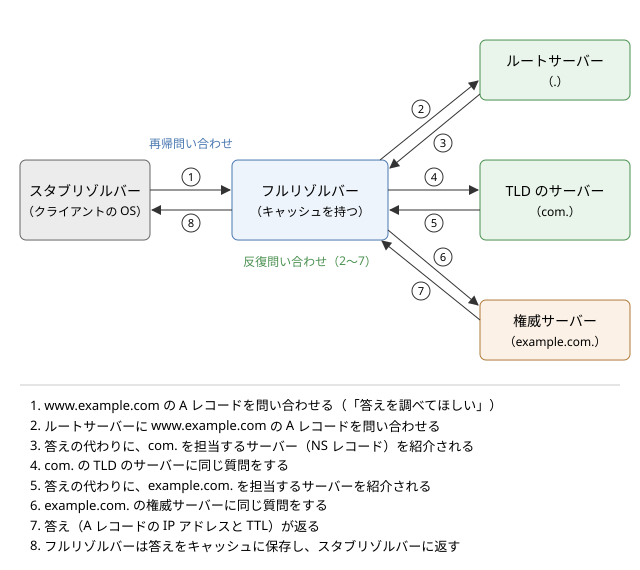

名前解決と DNS
==============

この章では、``www.example.com`` のような名前から IP アドレスを求める仕組みである名前解決と、それを世界規模で実現している DNS（Domain Name System）を説明します。DNS は、Web の閲覧、メールの配送、クラウド上のサービス同士の通信など、ほとんどすべての通信の最初に使われます。名前の階層構造、問い合わせの流れ、レコードの種類、キャッシュと TTL を順に見たあと、DNS を使った負荷分散と、DNS に関わる障害やセキュリティの問題を取り上げます。

名前とアドレス
--------------

「:doc:`n04_internet_layer`」で説明したとおり、インターネット上で通信相手を特定するのは IP アドレスです。しかし、``192.0.2.10`` や ``2001:db8:85a3::8a2e:370:7334`` のような数字の列を人間が覚えて使うのは困難です。そこで、人間には覚えやすい名前を使ってもらい、通信の直前にコンピューターが名前を IP アドレスに変換します。この変換を名前解決（name resolution）と呼びます。

名前とアドレスを分けておくことには、覚えやすさのほかにも利点があります。

* サーバーを別のマシンに移して IP アドレスが変わっても、名前と IP アドレスの対応を書き換えるだけで済み、利用者は同じ名前を使い続けられます。
* 1 つの名前に複数の IP アドレスを対応させ、アクセスを複数のサーバーに分散できます。
* 問い合わせてきた利用者の場所に応じて、近いサーバーの IP アドレスを返せます。

つまり、名前は「何に接続したいか」を表し、IP アドレスは「どこにあるか」を表します。両者の間に変換の段階を 1 つ挟むことで、サービスの提供者はサーバーの配置を自由に変えられます。

hosts ファイル
~~~~~~~~~~~~~~

最も単純な名前解決の方法は、名前と IP アドレスの対応表をファイルに書いておくことです。このファイルは hosts ファイルと呼ばれ、現在の OS にも残っています。Linux や macOS では ``/etc/hosts``、Windows では ``C:\Windows\System32\drivers\etc\hosts`` にあります。

.. code-block:: text
   :linenos:

   127.0.0.1    localhost
   ::1          localhost
   192.168.1.20 fileserver.home.internal

ARPANET の時代には、ネットワークに参加するすべてのホストの対応表を 1 か所で管理し、各ホストがそれを定期的にダウンロードしていました。しかし、ホストの数が増えるにつれて、更新の手間、ファイルの大きさ、名前の重複を防ぐ調整が限界に達しました。この問題を解決するために 1980 年代に考案されたのが DNS です（経緯は「:doc:`n02_network_history`」で説明します）。

現在の OS でも、hosts ファイルは DNS より先に参照されるのが一般的です。そのため、開発中に本番と同じ名前でテスト用のサーバーに接続したい場合などに使われます。一方、マルウェアが hosts ファイルを書き換えて、利用者を偽のサイトに誘導する手口にも使われます。

ドメイン名の階層
----------------

DNS では、名前を木構造（ツリー）で管理します。木の根をルート（root）と呼び、その下に ``com``、``org``、``jp`` などのトップレベルドメイン（TLD：Top Level Domain）があり、さらにその下に ``example.com`` や ``python.org`` のようなドメインが続きます。

ドメイン名は、木の節（ラベル）を下から順にドット（.）でつないで表します。``www.example.com`` は、ルートの下の ``com``、その下の ``example``、その下の ``www`` という経路を表しています。正式には、最後にルートを表す空のラベルを付けて ``www.example.com.`` と書きます。末尾のドットまで書いた名前を FQDN（Fully Qualified Domain Name、完全修飾ドメイン名）と呼びます。1 つのラベルは 63 バイト以内、名前全体は 255 バイト以内という制限があります。

.. list-table:: トップレベルドメインの主な種類
   :header-rows: 1
   :widths: 30 35 35

   * - 種類
     - 例
     - 説明
   * - 分野別トップレベルドメイン（gTLD）
     - com、org、net、info、新しく追加された app、dev など
     - 国や地域に結び付かないドメインです
   * - 国コードトップレベルドメイン（ccTLD）
     - jp、uk、de、cn
     - 国や地域に割り当てられたドメインです。jp の下には co.jp、ac.jp などの属性型のドメインもあります
   * - インフラストラクチャ用
     - arpa
     - IP アドレスから名前を求める逆引きなどに使われます

ゾーンと委任
~~~~~~~~~~~~

木全体を 1 つの組織が管理するのは不可能です。そこで DNS では、木をゾーンと呼ばれる単位に区切り、ゾーンごとに別の組織に管理を任せます。これを委任（delegation）と呼びます。ルートのゾーンは ``com`` の管理を ``com`` の運用者に委任し、``com`` のゾーンは ``example.com`` の管理を ``example.com`` の所有者に委任する、という具合です。委任された側は、さらに下の名前（例えば ``dev.example.com``）を別の組織に委任することもできます。

委任のおかげで、``example.com`` の所有者は、``com`` の運用者に断ることなく ``www.example.com`` や ``api.example.com`` を自由に追加・変更できます。名前の管理が木の構造に沿って分散されていることが、DNS が世界規模に拡大できた理由です。

DNS を構成するサーバー
----------------------

DNS のサーバーは、役割によって大きく 2 種類に分かれます。自分の担当するゾーンの情報を持ち、それについて答える権威サーバーと、利用者の代わりに権威サーバーをたどって答えを探し出すフルリゾルバーです。両者は名前が似ていますが、役割はまったく異なります。

権威サーバー
~~~~~~~~~~~~

権威サーバー（権威 DNS サーバー、authoritative server）は、あるゾーンの情報の正本を持ち、そのゾーンの名前について問い合わせに答えるサーバーです。ゾーンの情報は、ゾーンファイルなどの形で管理者が登録します。1 つのゾーンには、障害に備えて複数の権威サーバーを置くのが普通です。権威サーバーの間では、ゾーン転送と呼ばれる仕組みなどで情報を同期します。

権威サーバーは、自分の担当外の名前については答えを知りません。ただし、自分のゾーンから下のゾーンに委任している場合は、「その名前は、このサーバーに聞いてください」という委任先の情報（NS レコード）を返します。これを紹介（referral）と呼びます。

ルートサーバー
~~~~~~~~~~~~~~

木の根であるルートゾーンを担当する権威サーバーが、ルートサーバーです。ルートサーバーには ``a.root-servers.net`` から ``m.root-servers.net`` までの 13 の名前があり、12 の組織が運用しています。13 という数は、ルートサーバーの一覧が初期の DNS の UDP のメッセージの上限である 512 バイトに収まるように決められたものです。

ただし、ルートサーバーの実体は 13 台ではありません。各ルートサーバーは、エニーキャストと呼ばれる方法で、世界中の多数の拠点に同じ IP アドレスを持つサーバーを置いています。エニーキャストでは、同じ IP アドレスへの経路が複数の拠点から広告され、利用者のパケットは経路制御によって近い拠点に届きます。拠点の数は全体で 1,000 を超えています。

ルートサーバーが答えるのは、各 TLD を担当する権威サーバーの情報だけです。ルートサーバーへの問い合わせは、後で説明するキャッシュのおかげで、実際にはそれほど頻繁には起きません。

フルリゾルバー
~~~~~~~~~~~~~~

フルリゾルバー（キャッシュ DNS サーバー、再帰リゾルバーとも呼ばれます）は、利用者からの問い合わせを受けて、ルートサーバーから順に権威サーバーをたどり、答えを探し出すサーバーです。見つけた答えはキャッシュに保存しておき、同じ問い合わせが来たらキャッシュから答えます。

家庭では、ISP（Internet Service Provider）が提供するフルリゾルバーが、DHCP によって自動的に設定されるのが普通です。企業では、社内にフルリゾルバーを置くことがよくあります。また、Google の ``8.8.8.8`` や Cloudflare の ``1.1.1.1`` のように、誰でも使えるパブリック DNS サービスも広く使われています。

スタブリゾルバー
~~~~~~~~~~~~~~~~

利用者のコンピューターの OS には、スタブリゾルバーと呼ばれる簡単なリゾルバーが組み込まれています。スタブリゾルバーは自分では権威サーバーをたどらず、設定されたフルリゾルバーに「答えを調べて返してほしい」と依頼するだけです。

アプリケーションは、DNS のプロトコルを直接扱わず、OS の関数を呼び出して名前解決を行います。代表的なのが ``getaddrinfo`` 関数です。OS は、hosts ファイル、OS 自身のキャッシュ、フルリゾルバーへの問い合わせを、設定された順序で使って答えを返します。Linux では、参照するフルリゾルバーは ``/etc/resolv.conf`` に、参照の順序は ``/etc/nsswitch.conf`` に書かれています。

名前解決の流れ
--------------

``www.example.com`` の IP アドレスを、どのキャッシュにも情報がない状態から求める場合の流れを、:numref:`fig-dns-resolution` に示します。

.. _fig-dns-resolution:

   名前解決の流れ（キャッシュが空の場合）

フルリゾルバーは、まずルートサーバーに問い合わせます。ルートサーバーは答えを知りませんが、``com`` を担当するサーバーを紹介します。次にフルリゾルバーは ``com`` のサーバーに問い合わせ、``example.com`` を担当するサーバーを紹介されます。最後に ``example.com`` の権威サーバーに問い合わせて、ようやく答えが得られます。

再帰問い合わせと反復問い合わせ
~~~~~~~~~~~~~~~~~~~~~~~~~~~~~~

図の 2 種類の問い合わせは、性質が異なります。

* 再帰問い合わせ（recursive query）：スタブリゾルバーからフルリゾルバーへの問い合わせです。「最終的な答えを返してほしい」と依頼し、問い合わせを受けた側が必要なだけ他のサーバーをたどります。
* 反復問い合わせ（iterative query）：フルリゾルバーから権威サーバーへの問い合わせです。問い合わせを受けたサーバーは、自分の知っている範囲で答えるか、次に聞くべきサーバーを紹介するだけです。たどる作業は、問い合わせた側（フルリゾルバー）が繰り返し行います。

権威サーバーは、他のサーバーをたどる仕事を引き受けません。そのおかげで、権威サーバーは自分のゾーンの情報を返すだけの単純で高速なサーバーになり、膨大な数の問い合わせをさばけます。たどる作業と、その結果のキャッシュは、利用者に近いフルリゾルバーに集約されます。

紹介の応答では、委任先のサーバーの名前（例えば ``ns1.example.com``）が返されます。その名前自体が委任先のゾーンの中にある場合、名前を解決するにはそのサーバーに聞く必要があり、堂々巡りになります。そこで、紹介の応答には委任先のサーバーの IP アドレスも添えられます。これをグルーレコード（glue record）と呼びます。

DNS のメッセージ
~~~~~~~~~~~~~~~~

DNS の問い合わせと応答は、どちらも同じ形式のメッセージです。メッセージは、12 バイトのヘッダーと、質問、回答、権威、追加の 4 つのセクションからなります。

.. list-table:: DNS のヘッダーの主なフィールド
   :header-rows: 1
   :widths: 25 75

   * - フィールド
     - 意味
   * - ID
     - 16 ビットの識別子です。応答には問い合わせと同じ値が入り、問い合わせと応答の対応付けに使われます
   * - QR
     - 問い合わせ（0）と応答（1）の区別
   * - AA
     - 権威サーバーの答え（Authoritative Answer）であることを示すビット
   * - TC
     - 応答が長すぎて切り詰められた（TrunCation）ことを示すビット
   * - RD、RA
     - 再帰の依頼（Recursion Desired）と、再帰の可否（Recursion Available）
   * - RCODE
     - 応答コードです。0（NOERROR）は成功、2（SERVFAIL）はサーバー側の失敗、3（NXDOMAIN）は名前が存在しないことを表します
   * - 各セクションの数
     - 質問、回答、権威、追加の各セクションに含まれるレコードの数

DNS は、通常は UDP の 53 番ポートを使います。問い合わせと応答がそれぞれ 1 つのデータグラムに収まるため、TCP のようにコネクションを確立する往復が不要で、速く答えを得られます。当初の仕様では UDP のメッセージは 512 バイトまでで、それを超える応答は TC ビットを立てて切り詰められ、クライアントは TCP で問い合わせ直します。現在は、EDNS（Extension Mechanisms for DNS）という拡張によって、UDP でもより大きなメッセージを扱えます。

サンプルで問い合わせる
~~~~~~~~~~~~~~~~~~~~~~

サンプルコード :download:`dns_query.py <../examples/dns_query.py>` は、DNS の問い合わせメッセージをバイト列として自分で組み立て、UDP でフルリゾルバーに送り、応答のバイト列を解析して表示するものです。既定では ``8.8.8.8`` に問い合わせます。インターネット接続が必要です。

.. literalinclude:: ../examples/dns_query.py
   :language: python
   :linenos:
   :caption: dns_query.py

``www.python.org`` の A レコードと AAAA レコードを問い合わせた実行結果の例は次のとおりです。アドレスや TTL の値は、実行する時期と場所によって変わります。

.. code-block:: text

   === www.python.org の A レコードを 8.8.8.8 に問い合わせ ===
     問い合わせ (32 バイト): e2 95 01 00 00 01 00 00 00 00 00 00 03 77 77 77 06 70 79 74 68 6f 6e 03 6f 72 67 00 00 01 00 01
     応答 141 バイトを受信しました
     ヘッダー: ID=58005 QR=1 AA=0 TC=0 RD=1 RA=1
     RCODE=0 NOERROR (成功)
     レコード数: 質問 1, 回答 5, 権威 0, 追加 0
     www.python.org. TTL=16424 CNAME dualstack.python.map.fastly.net.
     dualstack.python.map.fastly.net. TTL=60 A 151.101.0.223
     dualstack.python.map.fastly.net. TTL=60 A 151.101.64.223
     dualstack.python.map.fastly.net. TTL=60 A 151.101.192.223
     dualstack.python.map.fastly.net. TTL=60 A 151.101.128.223

   === www.python.org の AAAA レコードを 8.8.8.8 に問い合わせ ===
     問い合わせ (32 バイト): 47 a1 01 00 00 01 00 00 00 00 00 00 03 77 77 77 06 70 79 74 68 6f 6e 03 6f 72 67 00 00 1c 00 01
     応答 189 バイトを受信しました
     ヘッダー: ID=18337 QR=1 AA=0 TC=0 RD=1 RA=1
     RCODE=0 NOERROR (成功)
     レコード数: 質問 1, 回答 5, 権威 0, 追加 0
     www.python.org. TTL=20457 CNAME dualstack.python.map.fastly.net.
     dualstack.python.map.fastly.net. TTL=60 AAAA 2a04:4e42::223
     dualstack.python.map.fastly.net. TTL=60 AAAA 2a04:4e42:400::223
     dualstack.python.map.fastly.net. TTL=60 AAAA 2a04:4e42:600::223
     dualstack.python.map.fastly.net. TTL=60 AAAA 2a04:4e42:200::223

   --- 比較: socket.getaddrinfo('www.python.org') ---
     AF_INET   151.101.192.223
     AF_INET   151.101.0.223
     AF_INET   151.101.64.223
     AF_INET   151.101.128.223

問い合わせのバイト列を見ると、先頭の 2 バイト（``e2 95``）が ID、次の 2 バイト（``01 00``）がフラグで、RD ビットだけが 1 になっています。続く ``00 01`` は質問が 1 つであることを表します。12 バイトのヘッダーの後には、名前がラベルごとに「長さ + 文字列」の形で並びます。``03 77 77 77`` は長さ 3 の ``www``、``06 70 79 74 68 6f 6e`` は長さ 6 の ``python`` で、最後の ``00`` が名前の終わり（ルート）を表します。末尾の 4 バイトのうち、前半の ``00 01`` が問い合わせるレコードの種類（AAAA では ``00 1c``）、後半の ``00 01`` がクラス（IN：インターネット）です。

応答には、同じ名前が何度も現れます。DNS では、メッセージを小さくするために、すでに現れた名前を「メッセージの先頭から何バイト目を見よ」という 2 バイトの圧縮ポインタで置き換えます。長さのバイトの上位 2 ビットが 11 であればポインタです。サンプルの ``read_name`` 関数はポインタをたどって名前を復元しており、不正な応答で無限にたどり続けないよう、たどる回数に上限を設けています。

応答では、``www.python.org`` が CNAME レコードによって ``dualstack.python.map.fastly.net`` という別名を指しており、その先に 4 つの IP アドレスがあることが分かります。これは、Web サイトの配信を CDN（Content Delivery Network）に任せる典型的な構成です（CDN は「:doc:`n07_http`」で説明します）。最後の ``getaddrinfo`` の結果は、OS のスタブリゾルバーを通して得た同じ情報です。この実行環境には IPv6 の接続がないため、OS は IPv4 のアドレスだけを返しています。

リソースレコード
----------------

DNS の情報は、リソースレコード（RR：Resource Record）と呼ばれる単位で登録されます。1 つのレコードは、名前、種類（タイプ）、クラス、TTL、データからなります。同じ名前と種類を持つレコードの集まりは、まとめて扱われます。

.. list-table:: 主なリソースレコード
   :header-rows: 1
   :widths: 12 38 50

   * - 種類
     - 内容
     - 例
   * - A
     - 名前に対応する IPv4 アドレス
     - ``www.example.com. A 192.0.2.10``
   * - AAAA
     - 名前に対応する IPv6 アドレス
     - ``www.example.com. AAAA 2001:db8::10``
   * - CNAME
     - 名前の別名（正式名）
     - ``shop.example.com. CNAME example.cdn.net.``
   * - MX
     - そのドメイン宛てのメールを受け取るサーバーと優先度
     - ``example.com. MX 10 mail.example.com.``
   * - NS
     - そのゾーンを担当する権威サーバー
     - ``example.com. NS ns1.example.com.``
   * - TXT
     - 任意の文字列です。メールの送信元の認証（SPF など）やドメインの所有確認に使われます
     - ``example.com. TXT "v=spf1 -all"``
   * - SOA
     - ゾーンの管理情報（主となる権威サーバー、管理者、シリアル番号、各種のタイマー）
     - ゾーンの頂点に 1 つだけ置きます
   * - PTR
     - IP アドレスに対応する名前（逆引き）
     - ``10.2.0.192.in-addr.arpa. PTR www.example.com.``

権威サーバーに登録するゾーンの情報は、ゾーンファイルと呼ばれるテキスト形式で書くことができます。次は ``example.com`` のゾーンファイルの例です。``@`` はゾーンの頂点（ここでは ``example.com.``）を表し、末尾にドットのない名前にはゾーンの名前が補われます。2 列目の数値が TTL（秒）です。

.. code-block:: text
   :linenos:

   $ORIGIN example.com.
   @     3600  IN SOA   ns1.example.com. admin.example.com. (
                        2026100401 ; シリアル番号
                        7200       ; refresh
                        900        ; retry
                        1209600    ; expire
                        300 )      ; ネガティブキャッシュの TTL
   @     3600  IN NS    ns1.example.com.
   @     3600  IN NS    ns2.example.net.
   @     3600  IN MX    10 mail.example.com.
   ns1   3600  IN A     192.0.2.53
   www   300   IN A     192.0.2.10
   www   300   IN AAAA  2001:db8::10
   mail  3600  IN A     192.0.2.25
   shop  300   IN CNAME example.cdn.example.net.

SOA レコードのシリアル番号は、ゾーンを変更するたびに増やします。副となる権威サーバーは、refresh の間隔で主となるサーバーのシリアル番号を確かめ、増えていればゾーン転送で新しい内容を取り込みます。8 行目の NS レコードが指す ``ns1.example.com`` はこのゾーンの中の名前なので、親の ``com`` のゾーンにはグルーレコードとして ``ns1.example.com`` の A レコードも登録しておく必要があります。

CNAME には、いくつか注意すべき点があります。CNAME を置いた名前には、他の種類のレコードを置けません。ゾーンの頂点（``example.com`` そのもの）は SOA と NS を必ず持つため、頂点には CNAME を置けません。多くの DNS サービスは、この制約を回避する独自の機能（ALIAS レコードなどと呼ばれます）を提供しています。また、CNAME をたどるたびに名前解決の手間が増えるので、CNAME を何段も連ねるのは避けるべきです。

MX レコードの数値は優先度で、値の小さいサーバーが優先されます。メールの送信側のサーバーは、まず優先度の高いサーバーに配送を試み、失敗したら次のサーバーに配送します。

逆引きは、IP アドレスから名前を求める名前解決です。IPv4 では、アドレスの数字を逆順に並べて ``in-addr.arpa`` の下に付けた名前の PTR レコードを引きます。IP アドレスの上位の部分が木の上位に来るように逆順にしているので、アドレスブロックの割り当てに沿って委任できます。逆引きは、ログに名前を記録する場合や、メールサーバーが送信元を確かめる場合などに使われます。

キャッシュと TTL
----------------

名前解決のたびにルートサーバーから順にたどっていては、時間がかかり、権威サーバーにも膨大な負荷がかかります。そこで、フルリゾルバーは得た答えをキャッシュに保存し、同じ問い合わせにはキャッシュから答えます。答えの IP アドレスだけでなく、途中で紹介された NS の情報もキャッシュされます。``com`` のサーバーの情報がキャッシュにあれば、次に別の ``.com`` のドメイン（例えば ``python.com``）を調べるときにはルートサーバーを飛ばせます。

キャッシュの有効期間は、権威サーバーがレコードごとに指定する TTL（Time To Live）で決まります。TTL の単位は秒です。フルリゾルバーは TTL を過ぎたレコードを捨て、次の問い合わせのときに権威サーバーに聞き直します。サンプルの実行結果で ``www.python.org`` の CNAME の TTL が 2 回の問い合わせで異なっていたのは、``8.8.8.8`` が内部で複数のキャッシュを持っており、それぞれの残り時間を返したためと考えられます。フルリゾルバーは、キャッシュから答えるとき、元の TTL から経過時間を引いた残りの時間を返します。

「名前が存在しない」という答え（NXDOMAIN）もキャッシュされます。これをネガティブキャッシュと呼び、その有効期間はゾーンの SOA レコードの値などで決まります。

TTL の設計
~~~~~~~~~~

TTL の長さには、トレードオフがあります。

* 長い TTL（例えば 1 日）：キャッシュが効きやすく、名前解決が速くなり、権威サーバーの負荷も減ります。一方、IP アドレスを変更しても、古いキャッシュが残っている間は古いアドレスに接続され続けます。
* 短い TTL（例えば 60 秒）：変更がすぐに行き渡ります。一方、問い合わせが増え、権威サーバーが止まったときの影響もすぐに表れます。

実務では、サーバーの移転などの予定がある場合、事前に TTL を短くしておき、古い TTL の期間が過ぎてから IP アドレスを切り替える方法がよく使われます。切り替えが終わって安定したら、TTL を元に戻します。

なお、キャッシュはフルリゾルバーだけでなく、OS、ブラウザー、プログラミング言語の実行環境など、あちこちにあります。中には TTL を守らずに長くキャッシュするものもあるため、DNS の変更が全員に行き渡るまでの時間は、TTL だけでは正確に見積もれません。長時間動き続けるサーバーのプログラムが起動時に一度だけ名前解決し、相手の IP アドレスが変わっても古いアドレスに接続し続ける、という不具合もよく起こります。

アプリケーションから見た名前解決
--------------------------------

アプリケーションの開発者にとって、名前解決は ``getaddrinfo`` などを呼ぶだけの簡単な処理に見えます。しかし、実際には次のような点に注意が必要です。

* 名前解決には時間がかかります。キャッシュにない名前では、フルリゾルバーが複数の権威サーバーをたどるため、数十 ms から数百 ms かかることもあります。フルリゾルバーが応答しない場合、OS は再送を繰り返すため、``getaddrinfo`` が数秒以上戻らないこともあります。
* ``getaddrinfo`` は、多くの環境で呼び出したスレッドを止める（ブロックする）関数です。非同期 I/O のプログラム（「:doc:`n09_socket_programming`」を参照）では、名前解決を別のスレッドで行うなどの工夫が必要です。Python の asyncio は、接続先の名前解決を内部で別のスレッドに任せています。
* 1 つの名前に複数のアドレスが返ることを前提にします。最初のアドレスへの接続に失敗したら、次のアドレスを試すのが正しい使い方です。Python の ``socket.create_connection`` は、この処理を行います。
* IPv4 と IPv6 の両方のアドレスが返る場合、片方の経路だけが壊れていると、接続に長い時間がかかることがあります。ブラウザーなどは、これを Happy Eyeballs と呼ばれる方法で避けています（「:doc:`n04_internet_layer`」を参照）。

名前解決に失敗したときは、「名前が存在しない（NXDOMAIN）」のか、「フルリゾルバーに到達できない、または応答がない」のかを区別すると、原因を切り分けやすくなります。サンプルで存在しない名前を問い合わせると、ヘッダーの RCODE が 3（NXDOMAIN）の応答が返ります。一方、フルリゾルバーに到達できない場合は応答が返らず、タイムアウトします。具体的な調べ方は「:doc:`n10_network_troubleshooting`」で説明します。

DNS を使った負荷分散
--------------------

DNS は、アクセスを複数のサーバーに振り分ける手段としても使われます。

* DNS ラウンドロビン：1 つの名前に複数の A レコードを登録し、問い合わせごとに順序を入れ替えて返します。クライアントは多くの場合先頭のアドレスに接続するため、アクセスがおおまかに分散されます。サンプルの実行結果でも、``8.8.8.8`` の応答と ``getaddrinfo`` の結果でアドレスの順序が異なっていました。
* 地理的な振り分け（GeoDNS）：問い合わせてきたフルリゾルバーの IP アドレスから利用者のおおよその場所を推定し、近い拠点のサーバーのアドレスを返します。CDN で広く使われています。
* ヘルスチェックとの組み合わせ：権威サーバーがサーバーの死活を監視し、停止したサーバーのアドレスを答えから外します。TTL を短くしておく必要があります。

DNS による負荷分散は手軽ですが、限界もあります。答えはキャッシュされるので、振り分けの変更はすぐには反映されません。また、DNS はサーバーの負荷を知らずにアドレスを返すので、細かな負荷の調整には向きません。そのため、DNS で拠点を選び、拠点の中ではロードバランサーで振り分ける、という組み合わせが一般的です（ロードバランサーは「:doc:`d09_reliability`」で説明します）。

DNS の障害とセキュリティ
------------------------

DNS は、ほとんどすべての通信の入口にあるため、DNS が止まると、サーバーそのものが正常でも利用者はサービスに到達できません。大規模な障害の原因が DNS の設定の誤りや DNS サービスの停止だった、という事例は少なくありません。障害に備えて、権威サーバーを複数の拠点やネットワークに分散して置くこと、ゾーンの設定の変更を慎重に行うことが重要です。

キャッシュポイズニング
~~~~~~~~~~~~~~~~~~~~~~

当初の DNS には、応答が正しい権威サーバーから来たものかを確かめる仕組みがありませんでした。フルリゾルバーが受け入れる応答の条件は、主に「問い合わせと ID が一致し、問い合わせ先の IP アドレスとポート番号から届いた」ことだけです。UDP は送信元の IP アドレスを偽装しやすいため、攻撃者は、本物の応答が届く前に偽の応答を大量に送り付け、ID が偶然一致すれば偽の情報をキャッシュに入れられます。これをキャッシュポイズニングと呼びます。毒を入れられたフルリゾルバーを使う全員が、偽のサーバーに誘導されてしまいます。

ID は 16 ビットしかないため、総当たりでも成功の可能性があります。2008 年には、カミンスキー（Dan Kaminsky）が、存在しない名前を次々と問い合わせさせることで攻撃の機会を何度でも作り出し、短時間で毒を入れられる手法を公表しました。対策として、問い合わせの送信元ポート番号をランダムにして、攻撃者が当てるべき値を ID とポート番号の組み合わせに増やす方法が広く導入されました。サンプルの ID は再現性のために固定のシードの乱数で作っていますが、実際のリゾルバーは推測できない乱数を使う必要があります。

DNSSEC
~~~~~~

送信元ポートのランダム化は攻撃を難しくするだけで、根本的な対策ではありません。根本的な対策として、DNS の応答にデジタル署名を付ける DNSSEC（DNS Security Extensions）があります。

DNSSEC では、ゾーンの管理者がゾーンのレコードに署名し、署名（RRSIG レコード）と署名の検証に使う公開鍵（DNSKEY レコード）を公開します。さらに、親のゾーンが子のゾーンの鍵のハッシュ値（DS レコード）を登録して署名することで、ルートから順に「この鍵は正しい」という信頼の連鎖を作ります。フルリゾルバーは、ルートゾーンの鍵だけをあらかじめ信頼しておけば、連鎖をたどって応答が改ざんされていないことを検証できます。ルートゾーンは 2010 年に署名されました。

ただし、DNSSEC が保証するのは応答の真正性（本物であり、改ざんされていないこと）であり、問い合わせの内容を秘密にはしません。また、すべてのゾーンが署名しているわけではなく、鍵の管理の手間や設定の誤りによる障害の懸念から、普及は道半ばです。デジタル署名の仕組みは「:doc:`n08_network_security`」で説明します。

DNS の暗号化
~~~~~~~~~~~~

従来の DNS の問い合わせは平文で送られるため、経路上の第三者は利用者がどの名前を調べたか、つまりどのサイトにアクセスしようとしているかを知ることができ、応答を書き換えることもできます。そこで、スタブリゾルバーとフルリゾルバーの間の通信を暗号化する仕組みが作られました。

* DoT（DNS over TLS）：DNS のメッセージを TLS で暗号化して、TCP の 853 番ポートで送ります。
* DoH（DNS over HTTPS）：DNS のメッセージを HTTPS のリクエストとして送ります。通常の Web の通信と同じ 443 番ポートを使うので、区別されにくく、ブラウザーが独自に DoH を使う例も増えています。

これらが守るのは、利用者とフルリゾルバーの間の区間だけです。フルリゾルバーそのものは利用者の問い合わせをすべて知り得るため、どのフルリゾルバーを信頼するかという問題は残ります。また、企業のネットワークでは、ブラウザーが独自の DoH を使うと、社内の名前解決やセキュリティの監視が働かなくなることがあり、運用上の注意が必要です。

DNS を悪用した攻撃
~~~~~~~~~~~~~~~~~~

DNS は、他者を攻撃する道具としても悪用されます。代表的なのが DNS アンプ攻撃（DNS リフレクション攻撃）です。攻撃者は、送信元の IP アドレスを攻撃対象に偽装して、誰からの問い合わせにも答えてしまうフルリゾルバー（オープンリゾルバー）に、大きな応答が返る問い合わせを大量に送ります。小さな問い合わせが大きな応答に増幅されて攻撃対象に届き、回線をあふれさせます。フルリゾルバーを運用する場合は、問い合わせを受け付ける相手を自組織の利用者に限定することが重要です。このようなサービス妨害（DoS：Denial of Service）攻撃については「:doc:`n08_network_security`」でも触れます。

まとめ
------

* DNS は、名前と IP アドレスの対応を、木構造の名前空間と委任によって世界中の組織に分散して管理する仕組みです。
* 権威サーバーは自分のゾーンの情報だけを答え、フルリゾルバーがルートから順に反復問い合わせをして答えを探します。OS のスタブリゾルバーはフルリゾルバーに再帰問い合わせをします。
* 主なレコードには A、AAAA、CNAME、MX、NS、TXT、SOA があります。DNS のメッセージは 12 バイトのヘッダーと 4 つのセクションからなり、通常は UDP で送られます。
* 答えは TTL の間キャッシュされます。TTL は、変更の反映の速さと、問い合わせの量や障害への強さとのトレードオフで決めます。
* 当初の DNS には応答の真正性を確かめる仕組みがなく、キャッシュポイズニングの危険があります。DNSSEC は署名で真正性を、DoT や DoH は暗号化で秘匿性を補います。
