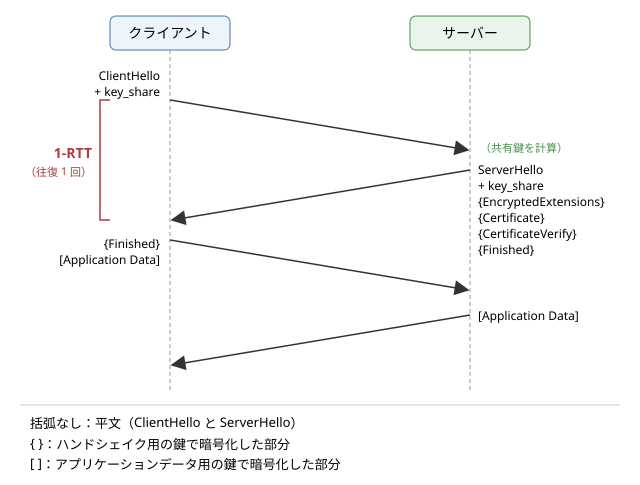

ネットワークセキュリティ
========================

この章では、ネットワークを通じた通信を守るための考え方と技術を説明します。インターネットは、誰が管理しているか分からない多数のネットワークを経由してパケットを運ぶため、途中で盗み見られたり書き換えられたりする危険を前提にしなければなりません。まず通信に対する脅威を整理し、それに対抗する暗号の基本的な部品（共通鍵暗号、公開鍵暗号、ハッシュ関数、MAC、デジタル署名、鍵交換）を説明します。次に、それらを組み合わせた TLS 1.3 のハンドシェイクと、相手が本物であることを保証する証明書と PKI を見ます。最後に、ファイアウォール、VPN、ゼロトラストといったネットワークの守り方と、代表的な攻撃と対策を取り上げます。

通信に対する脅威
----------------

インターネットの通信路は、利用者が管理していない多数の機器を経由します。公衆の無線 LAN、通信事業者のルーター、途中の国のネットワークなど、どこかに悪意のある者が入り込んでいる可能性は常にあります。通信に対する主な脅威は次のとおりです。

.. list-table:: 通信に対する主な脅威
   :header-rows: 1
   :widths: 18 47 35

   * - 脅威
     - 内容
     - 守るべき性質
   * - 盗聴
     - 通信の内容を第三者に読まれること。パスワード、Cookie、個人情報などが漏れます
     - 機密性
   * - 改ざん
     - 通信の内容を途中で書き換えられること。ダウンロードしたプログラムにマルウェアを埋め込まれるなどの被害があります
     - 完全性
   * - なりすまし
     - 通信相手が偽物であること。偽のサーバーにパスワードを入力させられるなどの被害があります
     - 真正性（認証）
   * - サービス妨害（DoS：Denial of Service）
     - 大量のパケットなどでサーバーや回線を使えなくされること
     - 可用性

盗聴、改ざん、なりすましを組み合わせた典型的な攻撃が、中間者攻撃（MITM：Man-In-The-Middle attack）です。攻撃者は、クライアントとサーバーの間に入り込み、クライアントにはサーバーのふりを、サーバーにはクライアントのふりをして、両者の通信を中継しながら盗み見たり書き換えたりします。攻撃者が通信路に入り込む方法には、偽の無線 LAN のアクセスポイント、ARP スプーフィング（「:doc:`n03_link_layer`」を参照）、DNS の偽の応答（「:doc:`n06_dns`」を参照）などがあります。

中間者攻撃に対しては、通信を暗号化するだけでは不十分です。相手が本物かを確かめなければ、攻撃者との間で正しく暗号化した通信をしてしまうだけだからです。機密性、完全性、真正性の 3 つをそろえて守ることが、通信の保護の基本です。

暗号の基礎
----------

ここでは、通信を守るための暗号の部品を説明します。暗号のアルゴリズムは、専門家による長年の分析に耐えた標準的なものを使い、自分で考案してはいけません。また、アルゴリズムを自分で実装するのではなく、実績のあるライブラリを使うことが原則です。

共通鍵暗号
~~~~~~~~~~

共通鍵暗号（対称鍵暗号）は、暗号化と復号に同じ鍵を使う方式です。送信者と受信者が同じ秘密の鍵を共有していれば、鍵を知らない第三者は暗号文から元のデータ（平文）を得られません。

代表的なアルゴリズムが AES（Advanced Encryption Standard）です。AES は米国の NIST（国立標準技術研究所）が公募と評価を経て 2001 年に標準としたもので、128 ビットの単位（ブロック）でデータを暗号化し、鍵の長さは 128、192、256 ビットから選べます。多くの CPU が AES の専用命令を備えており、非常に高速に処理できます。もう 1 つよく使われるのが ChaCha20 で、AES の専用命令を持たない機器でもソフトウェアで高速に動きます。

共通鍵暗号は高速ですが、通信を始める前に、相手と安全に鍵を共有しなければならないという問題があります。これを鍵配送問題と呼びます。初めて通信する相手と、盗聴されている可能性のある通信路で、どうやって秘密の鍵を共有すればよいでしょうか。この問題は、後で説明する公開鍵暗号と鍵交換によって解決されます。

ハッシュ関数
~~~~~~~~~~~~

暗号学的ハッシュ関数は、任意の長さのデータから、固定長の値（ハッシュ値、ダイジェスト）を計算する関数です。代表的なものに SHA-256 があり、256 ビットのハッシュ値を出力します。暗号学的ハッシュ関数は、次の性質を持つように設計されています。

* 一方向性：ハッシュ値から元のデータを求めることが、事実上できません。
* 衝突困難性：同じハッシュ値になる異なる 2 つのデータを見つけることが、事実上できません。
* 入力のわずかな違いで、ハッシュ値がまったく異なる値になります。

ハッシュ値は、データの「指紋」として使えます。ダウンロードしたファイルのハッシュ値を公式に公開された値と比べれば、ファイルが壊れていないかを確かめられます。なお、かつて広く使われた MD5 と SHA-1 は、衝突を見つける方法が発見されたため、署名などの用途に使ってはいけません。

ただし、ハッシュ値だけでは改ざんを防げません。攻撃者はデータを書き換えたうえで、書き換えたデータのハッシュ値を計算し直して添えられるからです。

MAC
~~~

MAC（Message Authentication Code、メッセージ認証コード）は、データと共通の秘密の鍵から計算する短い値です。送信者はデータに MAC を添えて送り、受信者は同じ鍵で MAC を計算し直して、届いた MAC と一致するかを確かめます。鍵を知らない攻撃者は、データを書き換えても正しい MAC を計算できないので、改ざんを検出できます。また、正しい MAC を作れるのは鍵を共有する相手だけなので、相手が本物であることも確かめられます。ハッシュ関数を使って MAC を作る HMAC が広く使われています。

現代の通信では、暗号化と MAC による改ざんの検出を一体にした、AEAD（Authenticated Encryption with Associated Data、認証付き暗号）を使います。AES を使う AES-GCM と、ChaCha20 と Poly1305 を組み合わせた ChaCha20-Poly1305 が代表的です。TLS 1.3 では AEAD だけが使えます。

公開鍵暗号
~~~~~~~~~~

公開鍵暗号（非対称鍵暗号）は、対になる 2 つの鍵を使う方式です。一方の鍵は秘密鍵として本人だけが持ち、もう一方の鍵は公開鍵として誰にでも公開します。公開鍵から秘密鍵を求めることは、事実上できません。公開鍵で暗号化したデータは、対になる秘密鍵でしか復号できないので、相手の公開鍵さえ手に入れば、事前に秘密を共有していなくても、その相手だけが読めるデータを送れます。

代表的なアルゴリズムに、大きな数の素因数分解の難しさを利用する RSA（1977 年にリベスト（Ron Rivest）、シャミア（Adi Shamir）、エーデルマン（Leonard Adleman）が発表）と、楕円曲線上の離散対数問題の難しさを利用する楕円曲線暗号があります。楕円曲線暗号は、RSA より短い鍵で同等の安全性が得られるため、現在の TLS では主流になっています。

公開鍵暗号の処理は、共通鍵暗号に比べてはるかに遅いという欠点があります。そのため、実際の通信では、公開鍵の技術を使って共通鍵を安全に共有し、データそのものは共通鍵暗号で暗号化する、という組み合わせ（ハイブリッド暗号）を使います。

デジタル署名
~~~~~~~~~~~~

デジタル署名は、公開鍵暗号の技術を使って、データが誰によって作られ、改ざんされていないかを確かめる仕組みです。署名者は、データのハッシュ値から自分の秘密鍵を使って署名を作り、データに添えます。検証者は、署名者の公開鍵を使って、署名がそのデータに対して正しいかを確かめます。

署名を作れるのは秘密鍵を持つ本人だけですが、検証は公開鍵を持つ誰にでもできます。この点が、鍵を共有する当事者どうしでしか確かめられない MAC との違いです。代表的な署名のアルゴリズムに、RSA を使うもの（RSA-PSS など）、楕円曲線を使う ECDSA と Ed25519 があります。デジタル署名は、後で説明する証明書や、「:doc:`n06_dns`」で触れた DNSSEC の基礎になっています。

鍵交換
~~~~~~

鍵交換は、盗聴されている通信路でやり取りしながら、2 者だけが知る共通の秘密を作り出す方法です。1976 年にディフィー（Whitfield Diffie）とヘルマン（Martin Hellman）が発表した、ディフィー・ヘルマン鍵交換（DH）がその代表です。

DH では、大きな素数 :math:`p` と数 :math:`g` を公開しておきます。クライアントは秘密の乱数 :math:`a` を選んで :math:`A = g^{a} \bmod p` を、サーバーは秘密の乱数 :math:`b` を選んで :math:`B = g^{b} \bmod p` を相手に送ります。両者はそれぞれ、受け取った値と自分の秘密から、同じ値を計算できます。

.. math::

   B^{a} \bmod p = (g^{b})^{a} \bmod p = g^{ab} \bmod p = (g^{a})^{b} \bmod p = A^{b} \bmod p

盗聴者は :math:`p`、:math:`g`、:math:`A`、:math:`B` を知っていますが、そこから :math:`a` や :math:`b` を求めること（離散対数問題）は、数が十分大きければ事実上できないため、共通の値 :math:`g^{ab} \bmod p` は計算できません。現在は、同じ考え方を楕円曲線の上で行う ECDHE（Elliptic Curve Diffie-Hellman Ephemeral）が主に使われ、Curve25519 という楕円曲線を使う X25519 がよく使われます。

鍵交換そのものは、相手が誰かを確かめません。中間者がクライアントとサーバーのそれぞれと別々に鍵交換をすれば、両者の通信を中継しながら読めてしまいます。そのため、鍵交換はデジタル署名による相手の認証と組み合わせて使います。

前方秘匿性
~~~~~~~~~~

ECDHE の E（Ephemeral）は、鍵交換に使う秘密の乱数を、通信のたびに新しく作って使い捨てることを表します。こうすると、後になってサーバーの署名用の秘密鍵が漏れても、過去の通信の鍵を計算し直すことはできません。この性質を前方秘匿性（forward secrecy）と呼びます。

前方秘匿性がない方式では、攻撃者が暗号化された通信を記録しておき、何年も後に秘密鍵を入手したときに、まとめて復号できてしまいます。TLS 1.2 までは、サーバーの RSA の公開鍵で共通鍵の材料を暗号化して送る、前方秘匿性のない方式も使えましたが、TLS 1.3 では廃止され、常に前方秘匿性のある鍵交換を使います。

TLS
---

TLS（Transport Layer Security）は、TCP などの信頼性のあるトランスポートの上で、機密性、完全性、真正性を提供するプロトコルです。HTTPS は HTTP を TLS の上で使うもので、ほかにもメールの送受信、DNS over TLS など、多くのプロトコルが TLS を使います。TLS は、Netscape 社が開発した SSL（Secure Sockets Layer）を起源とし、IETF で標準化されました。現在の版は 2018 年に RFC 8446 として標準化された TLS 1.3 で、その前の TLS 1.2 も広く使われています。TLS 1.0 と TLS 1.1 は、2021 年に RFC 8996 で使用しないこととされました。現在でも TLS を指して SSL と呼ぶことがありますが、SSL のすべての版は安全でないため使われていません。

TLS は大きく 2 つの部分からなります。

* ハンドシェイク：使う暗号のアルゴリズムを決め、サーバー（必要ならクライアントも）を認証し、鍵交換で共通の秘密を作ります。
* レコード層：ハンドシェイクで作った鍵を使い、アプリケーションのデータを AEAD で暗号化して送ります。

TLS 1.3 のハンドシェイク
~~~~~~~~~~~~~~~~~~~~~~~~

TLS 1.3 のフルハンドシェイク（初めて接続するときのハンドシェイク）の流れを、:numref:`fig-tls-handshake` に示します。

.. _fig-tls-handshake:

   TLS 1.3 のフルハンドシェイク

#. ClientHello：クライアントは、対応している TLS のバージョン、暗号スイート、鍵交換の方式などを伝えます。TLS 1.3 では、サーバーが選びそうな鍵交換の方式を予想して、その公開値（DH の :math:`A` にあたる値）を ``key_share`` 拡張に入れて最初から送ります。接続先のホスト名も、SNI（Server Name Indication）拡張で伝えます。
#. ServerHello：サーバーは、使う方式を選び、自分の公開値を ``key_share`` に入れて返します。この時点で、両者は鍵交換の結果から共通の秘密を計算でき、以降のハンドシェイクは暗号化されます。
#. EncryptedExtensions：ServerHello に含める必要のない追加の情報を、暗号化して送ります。HTTP/2 を使うかどうかを決める ALPN の結果などが入ります。
#. Certificate：サーバーの証明書（と中間認証局の証明書）を送ります。
#. CertificateVerify：それまでのハンドシェイクのメッセージ全体のハッシュ値に、サーバーが秘密鍵で署名したものを送ります。クライアントは、証明書の公開鍵でこの署名を検証し、サーバーが証明書に対応する秘密鍵を持っていること、つまり本物であることを確かめます。鍵交換の公開値も署名の対象に含まれるので、中間者が鍵交換に割り込むことはできません。
#. Finished：ハンドシェイクのメッセージ全体に対する MAC を送ります。途中でメッセージが改ざんされていれば、両者の計算が一致せず検出できます。
#. クライアントもサーバーの Finished を検証し、自分の Finished を送ります。その直後から、アプリケーションデータを暗号化して送れます。

TLS 1.2 のフルハンドシェイクでは、アプリケーションデータを送り始めるまでに 2 往復が必要でした。TLS 1.3 では、ClientHello に最初から ``key_share`` を入れることで、1 往復（1-RTT）でハンドシェイクを終えられるようになりました。TCP の 3 ウェイハンドシェイクの 1 往復と合わせて、HTTPS のリクエストを送り始めるまでに 2 往復かかります。もしクライアントの予想が外れ、サーバーがその鍵交換の方式に対応していなければ、サーバーは HelloRetryRequest を返して別の方式を求め、もう 1 往復が追加されます。

以前に接続したことのあるサーバーには、前回のハンドシェイクで受け取った情報（PSK：Pre-Shared Key）を使ってハンドシェイクを短縮する再開（resumption）ができます。さらに、最初の ClientHello と一緒にアプリケーションデータを送る 0-RTT という機能もあります。ただし、0-RTT のデータは攻撃者に記録されて再送（リプレイ）される危険があるため、GET のような冪等なリクエストにだけ使うべきです。

暗号スイート
~~~~~~~~~~~~

暗号スイートは、TLS で使う暗号のアルゴリズムの組み合わせです。TLS 1.2 までは鍵交換、認証、暗号化、MAC のすべてを 1 つの名前で表していたため、組み合わせが膨大になり、弱いアルゴリズムが残る原因にもなっていました。TLS 1.3 では、暗号スイートは AEAD とハッシュ関数の組み合わせだけを表し、鍵交換と署名の方式は別の拡張で決めます。使える暗号スイートは 5 つに絞られ、``TLS_AES_128_GCM_SHA256``、``TLS_AES_256_GCM_SHA384``、``TLS_CHACHA20_POLY1305_SHA256`` が一般的に使われます。

TLS 1.3 では、安全性に問題のあった多くの機能（前方秘匿性のない RSA による鍵交換、CBC モードの暗号、圧縮、再ネゴシエーションなど）が削除されました。選択肢を減らしたことで、設定の誤りで弱い暗号を使ってしまう危険も小さくなっています。

サンプルで確かめる
~~~~~~~~~~~~~~~~~~

サンプルコード :download:`tls_inspect.py <../examples/tls_inspect.py>` は、Python の ``ssl`` モジュールで Web サーバーに TLS で接続し、TLS のバージョン、暗号スイート、サーバーの証明書の内容を表示するものです。既定では ``www.example.com`` に接続します。インターネット接続が必要です。最後に、信頼する認証局を登録していない状態で接続し直し、証明書の検証が失敗する様子を示します。

.. literalinclude:: ../examples/tls_inspect.py
   :language: python
   :linenos:
   :caption: tls_inspect.py

実行結果の例は次のとおりです。IP アドレス、時間、証明書の内容は、実行する時期と場所によって変わります。

.. code-block:: text

   接続先            : www.example.com (172.66.147.243) ポート 443
   TCP の接続        : 35.5 ms
   TLS ハンドシェイク: 23.9 ms
   TLS のバージョン  : TLSv1.3
   暗号スイート      : TLS_AES_256_GCM_SHA384 (鍵長 256 ビット)
   --- サーバー証明書 ---
   subject   : CN=example.com
   issuer    : C=US, O=SSL Corporation, CN=Cloudflare TLS Issuing ECC CA 3
   有効期間  : Sep 26 22:49:11 2026 GMT から Dec 25 22:56:35 2026 GMT まで
   残り日数  : 82 日
   SAN       : DNS:example.com
   SAN       : DNS:*.example.com

   --- 信頼する認証局を 1 つも登録しない場合 ---
   検証に失敗しました: unable to get local issuer certificate

TLS 1.3 と、AES-256-GCM を使う暗号スイートが選ばれたことが分かります。TCP の接続（3 ウェイハンドシェイク）と TLS のハンドシェイクは、どちらも 1 往復なので、かかる時間は同程度になります（TLS のハンドシェイクには、署名の検証などの計算の時間も含まれます）。時間は実行のたびにかなり変動します。

証明書の subject は証明書の持ち主、issuer は証明書を発行した認証局です。SAN（Subject Alternative Name）には、この証明書が使える名前が並んでいます。``*.example.com`` はワイルドカードで、``www.example.com`` のように ``example.com`` の 1 段下の名前に一致します。有効期間は約 90 日です。

``ssl.create_default_context()`` で作ったコンテキストは、OS などが信頼する認証局の証明書を読み込み、証明書の検証とホスト名の確認を自動的に行います。最後の例のように信頼する認証局がないと、サーバーの証明書が信頼できる発行者につながらないため、検証が失敗して接続できません。検証の失敗は、中間者攻撃を受けている可能性を示します。プログラムで検証を無効にする（``verify=False`` や ``CERT_NONE`` などの設定）と、通信は暗号化されていても相手が本物か分からなくなり、中間者攻撃を防げなくなります。テストのためであっても、本番のコードに残してはいけません。

証明書と PKI
------------

公開鍵暗号やデジタル署名を使うには、相手の公開鍵が本当にその相手のものである必要があります。攻撃者が自分の公開鍵を「www.example.com の公開鍵です」と偽って渡せば、なりすましが成立します。公開鍵と持ち主の対応を保証するのが、証明書と、それを支える PKI（Public Key Infrastructure、公開鍵基盤）です。

証明書
~~~~~~

証明書（公開鍵証明書）は、「この公開鍵は、この名前の持ち主のものである」という内容に、信頼できる第三者である認証局（CA：Certificate Authority）がデジタル署名したものです。インターネットで使われる証明書は、X.509 という形式に従います。

.. list-table:: 証明書の主な内容
   :header-rows: 1
   :widths: 30 70

   * - 項目
     - 内容
   * - subject
     - 証明書の持ち主
   * - subjectAltName（SAN）
     - 証明書が使えるホスト名（ワイルドカードを含む）や IP アドレスの一覧
   * - 公開鍵
     - 持ち主の公開鍵
   * - issuer
     - 発行した認証局
   * - 有効期間
     - 有効期間の開始日時（notBefore）と終了日時（notAfter）
   * - シリアル番号
     - 認証局が証明書ごとに付ける番号
   * - 拡張
     - 鍵の用途、認証局の証明書かどうか、失効情報の確認先など
   * - 署名
     - 以上の内容に対する認証局のデジタル署名

認証局は、証明書を発行する前に、申請者がそのドメインを本当に管理していることを確かめます。確認の方法によって、ドメインの管理だけを確かめる DV（Domain Validation）、組織の実在も確かめる OV（Organization Validation）、さらに厳格に確かめる EV（Extended Validation）に分かれます。2015 年に発行を始めた Let's Encrypt は、ACME（Automatic Certificate Management Environment）というプロトコルによって、DV の証明書を無料かつ自動で発行し、HTTPS の普及を大きく進めました。

証明書の連鎖と信頼の起点
~~~~~~~~~~~~~~~~~~~~~~~~

認証局の署名を検証するには、認証局の公開鍵が必要で、その公開鍵が本物であることも確かめなければなりません。そこで、認証局の公開鍵もまた、上位の認証局が署名した証明書で保証します。この連鎖の頂点にあるのが、ルート認証局の証明書（ルート証明書）で、自分自身で署名されています。

ルート証明書は、OS やブラウザーにあらかじめ組み込まれています。これをトラストストア（信頼するルート証明書の一覧）と呼びます。OS やブラウザーの開発元は、一定の基準を満たして監査を受けた認証局のルート証明書だけをトラストストアに入れます。つまり、PKI の信頼は最終的に、OS やブラウザーの開発元と認証局に対する信頼に基づいています。

ルート認証局の秘密鍵は非常に重要なので、普段はネットワークから切り離して厳重に保管し、日々の証明書の発行は、ルート認証局が署名した中間認証局が行います。サーバーは TLS のハンドシェイクで、自分の証明書と中間認証局の証明書を送ります。サンプルの実行結果の issuer にある ``Cloudflare TLS Issuing ECC CA 3`` は中間認証局です。サーバーが中間認証局の証明書を送り忘れると、クライアントによっては連鎖をたどれずに検証が失敗します。これはサーバーの設定の誤りとしてよくあるものです。

証明書の検証
~~~~~~~~~~~~

クライアントは、サーバーから受け取った証明書について、次のことを確かめます。

#. 署名の連鎖：サーバーの証明書から中間認証局をたどり、トラストストアにあるルート証明書まで、各段の署名が正しいこと。
#. 有効期間：現在の日時が、各証明書の有効期間内であること。
#. ホスト名：接続しようとしたホスト名が、証明書の SAN に含まれていること。
#. 失効：証明書が失効していないこと。
#. 用途：各証明書が、その用途（サーバーの認証や、証明書の発行）に使ってよいものであること。

ホスト名の確認は特に重要です。信頼できる認証局が発行した正しい証明書でも、別のドメインのものであれば受け入れてはいけません。そうしないと、攻撃者は自分のドメインの正規の証明書を使って、任意のサイトになりすませてしまいます。

秘密鍵が漏れた場合などには、有効期間の途中でも証明書を無効にする必要があります。これを失効と呼び、認証局は失効した証明書の一覧（CRL：Certificate Revocation List）を公開したり、個別の証明書の状態を答える OCSP（Online Certificate Status Protocol）のサービスを提供したりします。ただし、失効の確認は遅延やプライバシーの問題を伴い、確認できない場合の扱いも難しいため、確実に機能しているとは言えません。そのため、証明書の有効期間そのものを短くして、漏れた鍵が使える期間を限る方向に進んでいます。

認証局が誤って、あるいは攻撃を受けて不正な証明書を発行する事件も起きてきました。その対策として、発行されたすべての証明書を誰でも監視できる公開のログに記録させる、Certificate Transparency という仕組みが導入されています。ドメインの所有者は、ログを監視して、自分のドメインに覚えのない証明書が発行されていないかを確かめられます。

運用の注意
~~~~~~~~~~

証明書の有効期限切れは、よくある障害の原因です。期限が切れた瞬間に、すべてのクライアントが検証に失敗して接続できなくなります。ACME などで更新を自動化し、期限を監視することが重要です。

通常の HTTPS ではサーバーだけを証明書で認証しますが、クライアントも証明書を提示して相互に認証する方法もあります。これを相互 TLS（mTLS：mutual TLS）と呼び、サーバー同士の通信（マイクロサービスの間など）でよく使われます。

ファイアウォール
----------------

ここからは、暗号とは別の観点から、ネットワークの守り方を見ます。ファイアウォールは、ネットワークの境界に置き、定めた規則に従って通信を通したり遮断したりする仕組みです。

* パケットフィルタリング：パケットの送信元と宛先の IP アドレス、プロトコル、ポート番号などを見て、規則に従って通すか捨てるかを決めます。
* ステートフルインスペクション：TCP のコネクションなど、通信の状態を記録しておき、内部から始めた通信への応答は通し、外部から突然届いたパケットは遮断する、といった判断をします。現在のファイアウォールの基本的な方式です。
* アプリケーション層の検査：HTTP などのアプリケーション層の内容まで見て判断します。Web アプリケーションへの攻撃を検出して遮断するものを WAF（Web Application Firewall）と呼びます。

規則は、「明示的に許可したものだけを通し、それ以外はすべて拒否する」というデフォルト拒否（許可リスト方式）の考え方で作るのが原則です。また、外部に公開する Web サーバーなどは、内部のネットワークとは別の区画（DMZ：DeMilitarized Zone）に置き、公開サーバーが侵入されても内部のネットワークに被害が広がりにくくします。

ファイアウォールは、ネットワークの境界だけでなく、各ホストの OS にも組み込まれています（Windows Defender ファイアウォール、Linux の nftables や iptables など）。また、クラウドでは、仮想マシンごとにセキュリティグループなどと呼ばれるファイアウォールの規則を設定するのが一般的です。ファイアウォールによって接続が遮断された場合の症状と調べ方は、「:doc:`n10_network_troubleshooting`」で説明します。

VPN
---

VPN（Virtual Private Network）は、インターネットのような公衆のネットワークの上に、暗号化したトンネルを作り、離れた場所のネットワークを専用線でつないだかのように使えるようにする技術です。元のパケットを暗号化して、別のパケットの中に入れて（カプセル化して）運びます。

* 拠点間 VPN：本社と支社のネットワークの境界にある機器どうしをトンネルで結び、拠点のネットワークをつなぎます。
* リモートアクセス VPN：社外にいる利用者の端末から、社内のネットワークにトンネルを張って接続します。

VPN を実現するプロトコルには、IP 層で暗号化と認証を行う IPsec、TLS を使う TLS-VPN（SSL-VPN）、簡潔な設計で近年広く使われるようになった WireGuard などがあります。

VPN は通信路を守るものであり、VPN の先にあるネットワークを信頼することを前提にしています。そのため、VPN の機器自体の脆弱性や、VPN の認証情報の漏えいを突かれると、攻撃者は社内のネットワークに入り込めてしまいます。実際に、VPN の機器の脆弱性を突いた侵入は、大きな被害を出した事件の原因として繰り返し報告されています。VPN の機器は、ソフトウェアの更新を怠らず、多要素認証を組み合わせることが重要です。

ゼロトラスト
------------

従来のネットワークセキュリティは、社内のネットワークを安全な内側、インターネットを危険な外側とみなし、境界をファイアウォールや VPN で守る境界型防御の考え方に基づいていました。しかし、クラウドの利用、在宅勤務、スマートフォンの業務利用が広がり、守るべきデータや利用者が境界の外に出るようになりました。また、いったん境界の内側に侵入されると、内部を自由に動き回られてしまうという弱点もあります。

ゼロトラストは、ネットワーク上の位置によって信頼を与えず、すべてのアクセスを毎回検証するという考え方です。米国の NIST は、2020 年に発行した SP 800-207 でゼロトラストのアーキテクチャを整理しています。主な原則は次のとおりです。

* 社内のネットワークからのアクセスでも、無条件には信頼しません。
* リソースへのアクセスごとに、利用者の認証（多要素認証など）と、端末の状態（OS の更新状況など）を確かめて許可を判断します。
* 必要な権限だけを与えます（最小権限）。
* 通信は、社内のネットワークの中でも暗号化します。
* アクセスを記録して監視し、異常を検知します。

ゼロトラストは特定の製品ではなく、設計の考え方です。サービス間の通信を mTLS で認証して暗号化することや、社内のアプリケーションを VPN ではなく認証付きのリバースプロキシ（「:doc:`n07_http`」を参照）の背後に置くことなどが、具体的な実現方法の例です。

代表的な攻撃と対策
------------------

ネットワークに関わる代表的な攻撃と、主な対策を整理します。

.. list-table:: 代表的な攻撃と対策
   :header-rows: 1
   :widths: 22 43 35

   * - 攻撃
     - 内容
     - 主な対策
   * - 中間者攻撃
     - 通信路に入り込み、通信を盗み見たり書き換えたりします
     - TLS と証明書の検証、HSTS
   * - ダウングレード攻撃
     - 通信の確立時に介入して、古く弱いプロトコルや暗号を使わせます
     - 古いバージョンの無効化。TLS 1.3 のハンドシェイクの保護
   * - SYN フラッド
     - TCP の SYN を大量に送り、サーバーが確立途中のコネクションの管理で資源を使い果たすようにします
     - SYN cookie、上流での遮断
   * - 反射・増幅型の DDoS
     - 送信元を偽装した要求を DNS などのサーバーに送り、増幅された応答を攻撃対象に集中させます
     - オープンリゾルバーの解消、送信元を偽装したパケットのフィルタリング、CDN などによる分散した受け止め
   * - ポートスキャン
     - 多数のポート番号に接続を試み、動いているサービスと弱点を探します
     - 不要なサービスの停止、ファイアウォール
   * - パスワードの総当たり
     - SSH などのログインで、パスワードを大量に試します
     - 鍵による認証、多要素認証、試行回数の制限
   * - セッションハイジャック
     - Cookie などのセッション ID を盗み、利用者になりすまします
     - HTTPS の徹底、Cookie の Secure・HttpOnly 属性

HSTS（HTTP Strict Transport Security）は、サーバーが ``Strict-Transport-Security`` ヘッダーで「このサイトには今後 HTTPS だけで接続すること」をブラウザーに指示する仕組みです。一度この指示を受けたブラウザーは、利用者が ``http://`` の URL を開いても、最初から HTTPS で接続します。そのため、平文のリクエストを乗っ取って HTTPS への切り替えを妨げる攻撃（SSL ストリッピング）を防げます。

DoS 攻撃のうち、多数の機器から一斉に攻撃するものを DDoS（Distributed DoS）攻撃と呼びます。乗っ取られた多数の IoT 機器などから攻撃が行われるため、送信元を遮断するだけでは防ぎきれません。大規模な攻撃は、自組織の回線の帯域幅そのものを使い果たすので、自組織の機器だけでは対処できず、通信事業者や CDN、DDoS 対策のサービスと連携して、上流で受け止める必要があります。

SYN cookie は、SYN を受け取った時点ではコネクションの状態を保存せず、必要な情報を初期シーケンス番号に埋め込んで SYN+ACK を返す方法です。初期シーケンス番号は、サーバーだけが知る秘密の値を使って暗号学的に計算するので、攻撃者は正しい値を推測できません。正しい ACK が返ってきたときに初めて状態を作るので、偽の SYN を大量に受けても資源を使い果たしません。

最後に、ネットワークの防御は何重にも重ねることが原則です。これを多層防御と呼びます。ファイアウォールで不要な通信を遮断し、TLS で通信を守り、アプリケーションでは入力を検証し、ソフトウェアを最新に保ち、ログを監視する、というように、1 つの対策が破られても全体が破られないように設計します。

まとめ
------

* 通信に対する主な脅威は、盗聴、改ざん、なりすまし、サービス妨害です。機密性、完全性、真正性をそろえて守る必要があり、暗号化だけでは中間者攻撃を防げません。
* 共通鍵暗号（AES など）は高速ですが鍵の共有が課題です。鍵交換（ECDHE）で共通の秘密を作り、デジタル署名で相手を認証し、AEAD でデータを守るのが現代の組み合わせです。
* TLS 1.3 は ClientHello に鍵交換の公開値を入れることで 1 往復でハンドシェイクを終え、常に前方秘匿性のある鍵交換を使います。
* 証明書は公開鍵と持ち主の対応を認証局の署名で保証します。クライアントは署名の連鎖、有効期間、ホスト名、失効を確かめます。証明書の検証を無効にしてはいけません。
* ファイアウォールと VPN による境界型防御に加え、すべてのアクセスを検証するゼロトラストの考え方が広がっています。防御は多層で行います。
