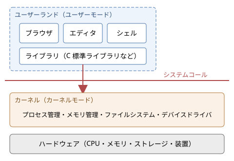

OS とは何か
===========

この章では、OS が何をするソフトウェアなのかを説明します。OS の役割を 2 つの観点から整理したうえで、カーネルとユーザーランドの区別、OS が提供する抽象化、OS の種類、OS とアプリケーションの境界を順に見ていきます。ここで導入する考え方は、第 4 章以降のすべての章の土台になります。

OS の定義
---------

オペレーティングシステム（Operating System、OS）は、計算機のハードウェアを管理し、アプリケーションに共通の機能を提供するソフトウェアです。身近な例には、Windows、macOS、Linux、Android、iOS があります。

OS の定義は、教科書によって表現が少しずつ異なります。これは、OS の役割が 1 つではなく、見る立場によって重点が変わるからです。代表的な見方は次の 2 つです。

* 拡張機械としての OS：アプリケーションの側から見ると、OS はハードウェアを使いやすい形に包み込んだ「仮想的な機械」です。例えばアプリケーションは、ディスクのどのセクタにデータを書くかを気にせず、「ファイル」という単位でデータを読み書きできます。
* 資源管理者としての OS：計算機全体の側から見ると、OS は CPU、メモリ、ストレージ、入出力装置といった資源を、複数のプログラムや利用者に公平かつ効率よく割り当てる管理者です。

この 2 つの見方は対立するものではなく、同じ OS の 2 つの側面です。以下では、それぞれの側面をもう少し詳しく見ます。

拡張機械としての OS
~~~~~~~~~~~~~~~~~~~

ハードウェアを直接操作するのは非常に手間のかかる作業です。例えば、ストレージ装置からデータを読み出すには、本来次のような手順が必要です。

#. 装置の制御レジスタに、読み出すブロックの番号と転送先のメモリアドレスを書き込む。
#. 読み出し開始の命令を装置に送る。
#. 転送の完了を、装置の状態レジスタを調べるか、割り込みを待つことで知る。
#. エラーが起きていれば、再試行やエラー処理を行う。

しかもこの手順は、装置のメーカーや種類（HDD、SSD、USB メモリなど）ごとに異なります。すべてのアプリケーションがこれを自前で実装するのは現実的ではありません。

OS は、こうした装置ごとの違いや細かな手順を隠し、「ファイルを開く」「ファイルから読む」といった単純で統一された操作を提供します。このように、複雑な仕組みの詳細を隠して本質的な操作だけを見せることを抽象化と呼びます。OS は、ハードウェアの上に抽象化の層を作り、アプリケーションから見て「使いやすい機械」を実現しているといえます。

資源管理者としての OS
~~~~~~~~~~~~~~~~~~~~~

現代の計算機では、多数のプログラムが同時に動いています。ブラウザ、エディタ、音楽プレーヤー、ウイルス対策ソフト、各種の常駐プログラムが、限られた数の CPU コアと限られた容量のメモリを共有しています。

もし各プログラムが好き勝手にハードウェアを使えば、次のような問題が起きます。

* 1 つのプログラムが CPU を使い続け、他のプログラムがまったく動けなくなる。
* あるプログラムが、別のプログラムのメモリを誤って（あるいは悪意を持って）書き換える。
* 2 つのプログラムが同時にプリンターに出力し、印刷結果が混ざる。

OS は、資源を誰がいつどれだけ使えるかを決め、プログラム同士が互いに干渉しないように管理します。資源の共有の仕方には、大きく分けて次の 2 種類があります。

.. list-table:: 資源の共有の仕方
   :header-rows: 1
   :widths: 25 40 35

   * - 方式
     - 説明
     - 例
   * - 時分割多重化
     - 1 つの資源を、短い時間ずつ交代で使う
     - CPU（複数のプログラムが数ミリ秒ずつ交代で実行される）、プリンター
   * - 空間分割多重化
     - 1 つの資源を、領域に分けて同時に使う
     - メモリ（プログラムごとに別の領域を割り当てる）、ストレージ

資源管理者としての OS には、資源を効率よく使うこと（利用率やスループットを高めること）と、利用者やプログラムの間で公平に資源を分けること、そしてプログラム同士を互いに保護することが求められます。これらの目標はしばしば互いに衝突するため、OS の設計は常にその間のバランスをとる作業になります。

OS がない世界
-------------

OS の役割を実感するために、OS がない計算機を考えてみます。実は、こうした計算機は今でも身近に存在します。電子レンジや炊飯器の制御用マイコンの多くは、OS を使わず、1 つのプログラムだけがハードウェアを直接操作しています。このような構成をベアメタルと呼びます。

ベアメタルのプログラムは、典型的には次のような形をしています。

.. code-block:: c
   :linenos:

   int main(void) {
       init_hardware();          /* 装置の初期化 */
       for (;;) {                /* 電源が切れるまで繰り返す */
           read_buttons();       /* ボタンの状態を読む */
           update_heater();      /* ヒーターを制御する */
           update_display();     /* 表示を更新する */
       }
   }

決まった仕事だけを行う小さな機器では、この構成で十分です。しかし、汎用の計算機で同じことをしようとすると、次の問題に直面します。

* 複数のプログラムを同時に動かせない。動かすには、プログラム自身が交代で実行する仕組みを作り込む必要がある。
* あるプログラムの不具合が、計算機全体を止めてしまう。
* 装置を操作するコードを、すべてのプログラムが個別に持つ必要がある。
* プログラムを別の計算機に移すと、装置の違いに合わせて書き直す必要がある。

OS は、これらの共通の問題をまとめて引き受けるソフトウェアとして生まれました。その経緯は「:doc:`03_history`」で詳しく説明します。

カーネルとユーザーランド
------------------------

「OS」という言葉は、狭い意味と広い意味の 2 通りで使われます。

* 狭い意味の OS：ハードウェアを直接管理する中核部分だけを指します。この部分をカーネル（kernel、「核」の意味）と呼びます。
* 広い意味の OS：カーネルに加えて、シェル、基本的なコマンド、ライブラリ、ウィンドウシステム、設定ツールなど、OS と一緒に配布される一式を指します。

例えば「Linux」は厳密にはカーネルの名前です。Ubuntu や Red Hat Enterprise Linux などは、Linux カーネルに GNU のツール群やその他のソフトウェアを組み合わせて配布しているもので、ディストリビューションと呼ばれます。一方、Windows や macOS は、カーネルからユーザーインターフェースまでを 1 つの製品として提供しています。

カーネル以外の部分はユーザーランド（userland）またはユーザー空間と呼ばれます。両者の関係を図に示します。

   OS の階層構造

カーネルとユーザーランドの境界は、単なるソフトウェアの区分ではありません。CPU のハードウェアの機能によって強制される境界です。現代の CPU には、少なくとも次の 2 つの動作モードがあります。

* カーネルモード（特権モード）：すべての命令を実行でき、すべてのメモリと装置にアクセスできるモード。カーネルはこのモードで動きます。
* ユーザーモード（非特権モード）：装置の操作や、他のプログラムのメモリへのアクセスなど、危険な操作が禁止されたモード。アプリケーションはこのモードで動きます。

アプリケーションがファイルを読むなど、ユーザーモードではできない操作を必要とするときは、システムコールと呼ばれる決まった手続きでカーネルに処理を依頼します。カーネルは依頼の内容が正当かどうかを確かめたうえで、カーネルモードで処理を実行し、結果をアプリケーションに返します。この仕組みについては「:doc:`04_hardware_and_kernel`」で詳しく説明します。

OS が提供する抽象化
-------------------

OS は、物理的な資源をそれぞれ扱いやすい抽象的な概念に置き換えてアプリケーションに見せます。主な対応を次の表に示します。

.. list-table:: 物理的な資源と OS の抽象化
   :header-rows: 1
   :widths: 22 26 52

   * - 物理的な資源
     - 抽象化
     - アプリケーションから見た姿
   * - CPU
     - プロセス、スレッド
     - 自分専用の CPU があるかのように、命令を順に実行できる
   * - メモリ
     - 仮想アドレス空間
     - 0 番地から始まる広大な自分専用のメモリがあるかのように見える
   * - ストレージ
     - ファイル、ディレクトリ
     - 名前の付いたバイト列を、階層的に整理して保存できる
   * - ネットワーク装置
     - ソケット
     - 通信相手との間に、データを流し込める「管」があるように見える
   * - 入出力装置一般
     - デバイスファイル、ハンドル
     - ファイルと同じように読み書きできる

これらの抽象化に共通する特徴は、「資源を占有しているかのような幻想」を与えることです。実際には、CPU は多数のプログラムで交代に使われ、物理メモリも分け合って使われていますが、各プログラムは他のプログラムの存在をほとんど意識せずに書けます。この幻想を実現する仕組みが、本書の第 5 章から第 11 章の主題です。

特に重要なのが次の 3 つの抽象化です。

* プロセス：実行中のプログラムです。プログラムのコードに加え、メモリの内容、開いているファイル、CPU のレジスタの値などをひとまとめにしたものです。「:doc:`05_process`」で説明します。
* 仮想アドレス空間：プロセスごとに用意される、独立したメモリの見え方です。「:doc:`08_memory`」で説明します。
* ファイル：名前で参照できる、永続的なデータの入れ物です。「:doc:`09_storage_and_filesystem`」で説明します。

UNIX 系 OS では、ファイルの抽象化を特に広く適用し、装置やプロセス間の通信路、カーネルの内部情報までもファイルとして扱えるようにしています。この設計思想は「Everything is a file（すべてはファイルである）」と表現されます。

OS の主な機能
-------------

OS がアプリケーションや利用者に提供する機能を、機能ごとに整理すると次のようになります。

.. list-table:: OS の主な機能
   :header-rows: 1
   :widths: 25 50 25

   * - 機能
     - 内容
     - 関連する章
   * - プロセス管理
     - プログラムの起動と終了、プロセス間通信、CPU の割り当て
     - 第 5 章から第 7 章
   * - メモリ管理
     - メモリの割り当てと解放、仮想記憶、プロセス間の保護
     - 第 8 章
   * - ファイル管理
     - ファイルとディレクトリの作成、読み書き、アクセス権の管理
     - 第 9 章
   * - 入出力管理
     - デバイスドライバによる装置の制御、バッファリング
     - 第 10 章
   * - ネットワーク
     - 通信プロトコルの処理、ソケット API
     - 第 11 章
   * - 保護とセキュリティ
     - 利用者の認証、アクセス制御、攻撃への防御
     - 第 12 章
   * - 利用者インターフェース
     - シェル（コマンドライン）、GUI
     - 本章
   * - 監視と記録
     - 資源の使用状況の計測、ログの記録
     - 第 14 章

機構と方針の分離
----------------

OS の設計でよく使われる考え方に、機構（mechanism）と方針（policy）の分離があります。

* 機構：「どのようにして」行うかを決める仕組みです。例えば、実行中のプロセスを一時停止して別のプロセスに CPU を渡す仕組みは機構です。
* 方針：「何を」行うかを決める判断です。例えば、次にどのプロセスに CPU を渡すかの決め方は方針です。

機構と方針を分けて設計しておくと、機構を変えずに方針だけを差し替えられます。例えば Linux では、CPU の切り替えという同じ機構の上で、用途に応じて異なるスケジューリング方針（通常のプロセス向けの方針、リアルタイム処理向けの方針など）を選べます。この考え方は、CPU スケジューリング、メモリのページ置換、ストレージの入出力スケジューリングなど、OS のさまざまな部分に現れます。

OS の設計目標とトレードオフ
---------------------------

OS に求められる性質は数多くあり、それらは互いに衝突することがあります。主な設計目標と、典型的なトレードオフを次の表に示します。

.. list-table:: OS の設計目標
   :header-rows: 1
   :widths: 20 40 40

   * - 設計目標
     - 内容
     - 衝突しやすい目標
   * - 性能
     - 処理を速く、資源の無駄なく実行する
     - 保護（検査を増やすと遅くなる）
   * - 応答性
     - 利用者の操作にすぐ反応する
     - スループット（頻繁に切り替えると全体の処理量が減る）
   * - 公平性
     - 資源を各プログラムに偏りなく分配する
     - 性能（特定の処理を優先した方が全体は速いことがある）
   * - 信頼性
     - 不具合や故障があっても動き続け、データを失わない
     - 性能（データを確実に書き込むには時間がかかる）
   * - 保護とセキュリティ
     - プログラムや利用者が互いに干渉しないようにする
     - 使いやすさ、性能
   * - 移植性
     - 異なるハードウェアの上で動く
     - 性能（特定のハードウェアに最適化しにくい）
   * - 互換性
     - 過去のアプリケーションを動かし続ける
     - 設計の改善（古い仕様に縛られる）

どの目標をどの程度重視するかは、OS の用途によって変わります。次の節で見るように、OS の種類の違いは、主にこの重み付けの違いから生まれています。

OS の種類
---------

OS は用途に応じて、さまざまな種類に分かれています。

.. list-table:: OS の種類
   :header-rows: 1
   :widths: 22 48 30

   * - 種類
     - 特徴
     - 例
   * - デスクトップ OS
     - 個人が使う PC 向け。GUI と応答性、幅広い周辺機器への対応を重視する
     - Windows、macOS、Linux（Ubuntu など）
   * - サーバー OS
     - 多数の要求を安定して処理することを重視する。GUI を持たないことも多い
     - Linux（Red Hat Enterprise Linux など）、Windows Server、FreeBSD
   * - モバイル OS
     - スマートフォンやタブレット向け。電力消費の抑制、タッチ操作、アプリケーションの隔離を重視する
     - Android、iOS
   * - 組込み OS
     - 家電、自動車、産業機器などに組み込まれる。少ない資源で動くことを重視する
     - 組込み Linux、μITRON、FreeRTOS
   * - リアルタイム OS（RTOS）
     - 決められた時間内に処理を完了することを保証する
     - VxWorks、QNX、μITRON、FreeRTOS
   * - メインフレーム OS
     - 大型汎用機向け。極めて高い信頼性と大量のトランザクション処理を重視する
     - z/OS

ここで、リアルタイム OS の「リアルタイム」は「処理が速い」という意味ではなく、「処理の完了までの時間に上限を保証できる」という意味であることに注意してください。例えば自動車のエアバッグの制御では、平均的に速いことよりも、どんな状況でも決められた時間内に必ず処理が終わることが重要です。リアルタイム OS は、そのために平均的な性能を多少犠牲にすることがあります。リアルタイム性については「:doc:`07_scheduling`」でも触れます。

また、同じ OS が複数の種類にまたがることも珍しくありません。Linux はサーバー、デスクトップ、組込み機器、スーパーコンピュータのいずれでも使われており、Android のカーネルも Linux です。

OS のインターフェース
---------------------

OS は、利用者とアプリケーションの両方に対してインターフェースを提供しています。

利用者に対するインターフェース
~~~~~~~~~~~~~~~~~~~~~~~~~~~~~~

利用者が OS を操作する手段には、主に次の 2 つがあります。

* シェル（CLI）：コマンドを文字で入力して OS を操作するプログラムです。UNIX 系 OS の bash や zsh、Windows の PowerShell やコマンドプロンプトがあります。
* GUI：ウィンドウ、アイコン、マウスなどを使って視覚的に操作する仕組みです。

シェルや GUI は、カーネルの一部ではなく、ユーザーランドで動く普通のプログラムです。例えばシェルにコマンドを入力すると、シェルはシステムコールを使ってカーネルに新しいプロセスの作成を依頼し、そのプロセスでコマンドのプログラムを実行します。

アプリケーションに対するインターフェース
~~~~~~~~~~~~~~~~~~~~~~~~~~~~~~~~~~~~~~~~

アプリケーションが OS の機能を使うためのインターフェースは、いくつかの層に分かれています。

.. list-table:: アプリケーションと OS の間のインターフェース
   :header-rows: 1
   :widths: 22 48 30

   * - インターフェース
     - 内容
     - 例
   * - システムコール
     - カーネルが直接提供する最も低いレベルの機能
     - Linux の ``read``、``write``、``fork``
   * - API
     - ライブラリ関数として提供されるプログラミング用のインターフェース。内部でシステムコールを呼ぶ
     - POSIX（UNIX 系）、Win32 API（Windows）
   * - ABI
     - 機械語のレベルでの取り決め。関数の呼び出し規約、データの配置、実行ファイルの形式など
     - System V ABI、Windows x64 ABI
   * - 言語の標準ライブラリ
     - 言語ごとに OS の違いを吸収したインターフェース
     - C の標準ライブラリ、Python の ``os`` モジュール

アプリケーションがシステムコールを直接呼ぶことはまれで、通常は API を通して OS の機能を使います。例えば C 言語の ``printf`` 関数は、文字列を整形してバッファに溜め、適切なときに ``write`` システムコールを呼んで出力します。Python の ``print`` 関数も、最終的には同じシステムコールにたどり着きます。

POSIX（Portable Operating System Interface）は、UNIX 系 OS の API を標準化した規格です。POSIX に従って書いたプログラムは、Linux、macOS、BSD 系 OS などの間で、ソースコードを大きく変えずに動かせます。Windows は POSIX とは異なる独自の API（Win32 API）を持っていますが、WSL（Windows Subsystem for Linux）を使うと Windows 上で Linux のプログラムを動かせます。

Python のプログラムから見た OS
------------------------------

本書のサンプルコードで使う Python も、OS の機能を利用しています。Python の標準ライブラリのうち、OS と関係の深いモジュールを次の表に示します。

.. list-table:: OS と関係の深い Python の標準ライブラリ
   :header-rows: 1
   :widths: 25 45 30

   * - モジュール
     - 内容
     - 関連する章
   * - ``os``
     - プロセス、ファイル、環境変数など、OS の機能への低レベルなアクセス
     - 第 5 章、第 9 章
   * - ``subprocess``
     - 子プロセスの起動と、パイプによる通信
     - 第 5 章
   * - ``threading``
     - スレッドと、ロックや条件変数などの同期機構
     - 第 6 章
   * - ``mmap``
     - メモリマップトファイル
     - 第 8 章
   * - ``selectors``、``socket``
     - I/O 多重化、ネットワーク通信
     - 第 10 章、第 11 章
   * - ``signal``
     - シグナルの送受信
     - 第 5 章

``os`` モジュールの関数の多くは、同じ名前のシステムコールや POSIX の関数をほぼそのまま呼び出す薄い包み紙になっています。そのため、Python のサンプルコードでも、OS のふるまいをかなり直接的に観察できます。

まとめ
------

* OS は、ハードウェアを使いやすく抽象化する「拡張機械」であり、同時に資源を公平かつ効率よく割り当てる「資源管理者」です。
* OS の中核はカーネルで、CPU のカーネルモードで動きます。アプリケーションはユーザーモードで動き、システムコールでカーネルに処理を依頼します。
* OS は、CPU をプロセスに、メモリを仮想アドレス空間に、ストレージをファイルに抽象化します。
* OS の設計では、性能、応答性、公平性、信頼性、保護などの目標のバランスをとる必要があり、その重み付けによってさまざまな種類の OS が生まれています。
