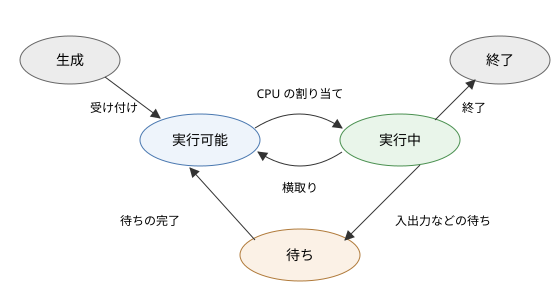

プロセス
========

この章では、OS が CPU を抽象化して提供するプロセスについて説明します。プロセスの中身、状態の移り変わり、プロセスの作成と終了の仕組みを見たあと、プロセス同士がデータをやり取りするためのプロセス間通信を説明します。

プログラムとプロセス
--------------------

プログラムは、ストレージに保存された命令とデータの集まりです。それ自体は動かない、静的な存在です。これに対してプロセスは、実行中のプログラムです。OS がプログラムをメモリに読み込み、CPU で実行を始めると、プロセスが生まれます。

同じプログラムから複数のプロセスを作ることもできます。例えば、テキストエディタを 2 つのウィンドウで同時に起動すると、同じプログラムから 2 つのプロセスが作られます。2 つのプロセスは同じコードを実行しますが、編集中の内容（メモリの中身）や、開いているファイルはそれぞれ独立しています。

OS から見ると、プロセスはプログラムの実行に必要な資源をまとめた単位です。プロセスには、次のようなものが含まれます。

* プログラムのコードとデータを置く、独立したメモリ空間（アドレス空間）
* CPU のレジスタの値（次に実行する命令のアドレスを示すプログラムカウンタを含む）
* 開いているファイルなどの資源の一覧
* プロセス ID、所有者、優先度などの管理情報

プロセスのアドレス空間
----------------------

各プロセスは、自分専用のアドレス空間を持っています。あるプロセスのアドレス 0x1000 と、別のプロセスのアドレス 0x1000 は、物理的には別のメモリを指しています。この仕組みは「:doc:`08_memory`」で説明する仮想記憶によって実現されています。

プロセスのアドレス空間は、用途に応じて次のような領域に分かれています。

.. list-table:: プロセスのアドレス空間の主な領域
   :header-rows: 1
   :widths: 20 55 25

   * - 領域
     - 内容
     - 書き込み
   * - テキスト（コード）
     - プログラムの機械語の命令
     - 不可
   * - データ
     - 初期値を持つ大域変数、静的変数
     - 可
   * - BSS
     - 初期値を持たない（0 で初期化される）大域変数、静的変数
     - 可
   * - ヒープ
     - 実行中に動的に確保するメモリ（C の ``malloc``、Python のオブジェクトなど）。必要に応じて大きくなる
     - 可
   * - 共有ライブラリなど
     - 共有ライブラリのコードとデータ、メモリマップトファイル
     - 領域による
   * - スタック
     - 関数の局所変数、引数、戻り先のアドレス。関数の呼び出しに応じて伸び縮みする
     - 可

一般に、テキストが低いアドレスに置かれ、ヒープは高いアドレスに向かって、スタックは高いアドレスから低いアドレスに向かって伸びます。テキストの領域は書き込み禁止にされているため、プログラムが誤って自分のコードを書き換えることはありません。

また、アドレス空間の上位の部分にはカーネルが配置されていますが、ユーザーモードからはアクセスできないように保護されています。

プロセスの状態
--------------

プロセスは、生成されてから終了するまでの間に、いくつかの状態を移り変わります。代表的な状態の遷移を図に示します。

   プロセスの状態遷移

.. list-table:: プロセスの状態
   :header-rows: 1
   :widths: 20 80

   * - 状態
     - 説明
   * - 生成
     - プロセスが作られている途中の状態
   * - 実行可能
     - CPU さえ割り当てられればすぐに実行できる状態。実行可能キューに並んで順番を待っている
   * - 実行中
     - CPU を割り当てられ、命令を実行している状態。1 つの CPU コアで同時に実行中になれるプロセスは 1 つだけである
   * - 待ち
     - 入出力の完了、一定時間の経過、他のプロセスからの通知など、何らかの事象を待っている状態。事象が起きるまでは、CPU が空いていても実行できない
   * - 終了
     - 実行を終え、後片付けを待っている状態

状態の間の遷移は、次のようなきっかけで起こります。

* 実行可能 → 実行中：スケジューラがそのプロセスを選び、CPU を割り当てる。
* 実行中 → 実行可能：タイマー割り込みなどによって、OS が CPU を取り上げる（横取り）。
* 実行中 → 待ち：プロセスが、ファイルの読み込みなど、すぐには完了しない処理を要求する。
* 待ち → 実行可能：待っていた事象が起きる（例えば、ディスクの読み込みが完了したことを知らせる割り込みが来る）。

待ちの状態から直接実行中に移るのではなく、いったん実行可能に戻ることに注意してください。待っていた事象が起きても、そのとき CPU は別のプロセスが使っているかもしれないからです。

計算機の中のプロセスのほとんどは、たいていの時間を待ちの状態で過ごしています。例えばエディタのプロセスは、利用者がキーを押すのを待っている時間がほとんどです。待ちのプロセスは CPU を使わないので、多数のプロセスが存在していても CPU の使用率は低いままです。

プロセス制御ブロック
--------------------

カーネルは、プロセスごとにその情報を記録したデータ構造を持っています。これをプロセス制御ブロック（PCB：Process Control Block）と呼びます。Linux では ``task_struct`` という構造体が、Windows では ``EPROCESS`` という構造体がこれにあたります。

PCB には、主に次の情報が含まれています。

* プロセス ID（PID）と、親プロセスの ID
* プロセスの状態
* CPU のレジスタの値（実行中でないときに保存しておくため）
* メモリ管理の情報（ページテーブルの場所など）
* 開いているファイルの一覧（ファイルディスクリプタの表）
* スケジューリングの情報（優先度、これまでに使った CPU 時間など）
* 所有者（ユーザー ID）と権限
* シグナルの処理方法など

実行中のプロセスを別のプロセスに切り替えるとき、カーネルは実行中のプロセスのレジスタの値をその PCB に保存し、次に実行するプロセスの PCB からレジスタの値を復元します。この操作をコンテキストスイッチと呼びます。コンテキストスイッチについては「:doc:`07_scheduling`」で詳しく説明します。

自分のプロセスの情報を見る
~~~~~~~~~~~~~~~~~~~~~~~~~~

サンプルコード :download:`process_info.py <../examples/process_info.py>` は、自分自身のプロセスについて、OS が管理している情報の一部を表示するものです。

.. literalinclude:: ../examples/process_info.py
   :language: python
   :linenos:
   :caption: process_info.py

実行結果の例は次のとおりです。

.. code-block:: text

   OS                  : Windows 11
   プロセス ID (PID)   : 19864
   親プロセス ID       : 26732
   実行ファイル        : C:\Users\user\AppData\Local\Python\pythoncore-3.14-64\python.exe
   コマンドライン引数  : ['process_info.py']
   カレントディレクトリ: C:\work\examples
   環境変数の数        : 111
   論理 CPU 数         : 16
   標準入力の fd       : 0
   標準出力の fd       : 1
   標準エラー出力の fd : 2

親プロセス ID は、このプログラムを起動したシェルのプロセス ID です。プロセス ID は実行するたびに変わります。

プロセスの作成
--------------

UNIX 系 OS：fork と exec
~~~~~~~~~~~~~~~~~~~~~~~~

UNIX 系 OS では、新しいプロセスは既存のプロセスの複製として作られます。プロセスの作成は、次の 2 つのシステムコールの組み合わせで行います。

* ``fork``：呼び出したプロセス（親プロセス）の複製を作る。複製されたプロセス（子プロセス）は、親プロセスとまったく同じメモリの内容と開いているファイルを持ち、``fork`` から戻った直後から実行を続ける。
* ``exec``：呼び出したプロセスのメモリの内容を、指定したプログラムで置き換え、そのプログラムを最初から実行する。プロセス ID や開いているファイルは引き継がれる。

``fork`` は 1 回呼び出すと 2 回戻る、という不思議な性質を持っています。親プロセスには子プロセスのプロセス ID が、子プロセスには 0 が返るので、その値によって親と子で処理を分けます。シェルがコマンドを実行する流れを C 言語で単純化して書くと、次のようになります。

.. code-block:: c
   :linenos:

   pid_t pid = fork();              /* 自分の複製を作る */
   if (pid == 0) {
       /* 子プロセス：ls コマンドのプログラムに置き換わる */
       execlp("ls", "ls", "-l", (char *)NULL);
       _exit(127);                  /* exec が失敗した場合だけここに来る */
   } else if (pid > 0) {
       /* 親プロセス（シェル）：子プロセスの終了を待つ */
       int status;
       waitpid(pid, &status, 0);
   }

プロセスの作成を 2 段階に分けておくと、``fork`` と ``exec`` の間で、子プロセスの環境を整えられるという利点があります。例えばシェルは、この間に子プロセスの標準出力をファイルに付け替えることで、``ls > out.txt`` のようなリダイレクトを実現しています。

``fork`` はメモリの内容をすべて複製するので、一見すると非常に重い処理に思えます。実際には、コピーオンライトという工夫によって、複製はほとんど費用をかけずに行われます。親と子は最初は同じ物理メモリを共有し、どちらかが書き込もうとしたときに初めて、そのページだけをコピーします。コピーオンライトについては「:doc:`08_memory`」で説明します。

このように UNIX 系 OS のプロセスは、親が子を作るという関係を繰り返して作られるため、全体として木構造（プロセスツリー）をなしています。その根は、起動時にカーネルが作る最初のユーザープロセス（Linux ではプロセス ID 1 の systemd など）です。

Windows：CreateProcess
~~~~~~~~~~~~~~~~~~~~~~

Windows には ``fork`` に相当する機能がありません。新しいプロセスは ``CreateProcess`` 関数で作り、実行するプログラムをその引数で指定します。つまり、UNIX 系 OS の ``fork`` と ``exec`` を 1 回の呼び出しで行います。子プロセスの標準入出力などは、``CreateProcess`` の引数で指定します。

Python の ``os.fork`` 関数は UNIX 系 OS でしか使えません。OS の違いを吸収してプロセスを起動したい場合は、``subprocess`` モジュールを使います。``subprocess`` モジュールは、UNIX 系 OS では ``fork`` と ``exec``、またはこれに相当する ``posix_spawn`` などを、Windows では ``CreateProcess`` を内部で使います。

プロセスの終了
--------------

プロセスは、次のような場合に終了します。

* プログラムが処理を終え、``exit`` を呼ぶ（C 言語の ``main`` 関数から戻った場合も同じ）。
* 回復できないエラー（不正なメモリアクセスなど）が起き、OS によって強制終了させられる。
* 他のプロセスから終了を要求される（UNIX 系 OS では ``kill`` コマンドによるシグナル）。

プロセスが終了すると、カーネルはそのプロセスが使っていたメモリを解放し、開いていたファイルを閉じます。プロセスは終了時に、成功したか失敗したかを表す小さな整数である終了ステータスを残します。慣習として、0 は成功、0 以外は失敗を表します。シェルでは、直前に実行したコマンドの終了ステータスを ``$?`` で、PowerShell では ``$LASTEXITCODE`` で確かめられます。

ゾンビプロセスと孤児プロセス
~~~~~~~~~~~~~~~~~~~~~~~~~~~~

UNIX 系 OS では、親プロセスは ``wait`` 系のシステムコールで子プロセスの終了を待ち、終了ステータスを受け取ります。子プロセスが終了してから、親プロセスが終了ステータスを受け取るまでの間、子プロセスの PCB の一部は終了ステータスを保持するために残っています。この状態のプロセスをゾンビプロセスと呼びます。

親プロセスがいつまでも ``wait`` を呼ばないと、ゾンビプロセスが溜まり、プロセス ID などの資源を消費し続けます。長時間動くサーバーのプログラムで子プロセスを作る場合は、終了した子プロセスを確実に回収する必要があります。

逆に、子プロセスより先に親プロセスが終了すると、子プロセスは孤児プロセスになります。孤児プロセスは、プロセス ID 1 のプロセス（または特定の回収役のプロセス）に引き取られ、終了時にはそのプロセスが ``wait`` を呼んで回収します。

プロセス間通信
--------------

プロセスはそれぞれ独立したアドレス空間を持っているので、あるプロセスが別のプロセスの変数を直接読み書きすることはできません。プロセス同士がデータをやり取りするには、OS が提供するプロセス間通信（IPC：Inter-Process Communication）の仕組みを使います。

.. list-table:: 主なプロセス間通信の方式
   :header-rows: 1
   :widths: 22 53 25

   * - 方式
     - 説明
     - 主な用途
   * - パイプ
     - 一方向のバイトの流れ。一方の端に書いたデータを、もう一方の端から読める
     - シェルのパイプライン、親子プロセスの間の通信
   * - 名前付きパイプ
     - ファイルシステム上の名前を持つパイプ。親子関係のないプロセスの間でも使える
     - 同じ計算機上のプロセスの間の通信
   * - シグナル
     - プロセスに非同期の通知を送る。送れる情報は通知の種類だけである
     - 終了の要求、子プロセスの終了の通知
   * - 共有メモリ
     - 複数のプロセスのアドレス空間に、同じ物理メモリを対応付ける
     - 大量のデータの高速なやり取り
   * - メッセージキュー
     - メッセージ単位でデータを送受信する
     - プロセス間での要求の受け渡し
   * - ソケット
     - ネットワーク通信と同じ API で通信する。同じ計算機内に限定した UNIX ドメインソケットもある
     - サーバーとクライアントの通信

パイプ
~~~~~~

パイプは最も単純なプロセス間通信です。シェルで ``ls | sort`` と入力すると、シェルはパイプを 1 つ作り、``ls`` のプロセスの標準出力をパイプの書き込み側に、``sort`` のプロセスの標準入力をパイプの読み込み側に付け替えてから、両方のプログラムを実行します。``ls`` も ``sort`` も、自分がパイプにつながっていることを意識せず、ふだんどおり標準入出力を読み書きするだけです。

パイプには容量の上限があり（Linux では既定で 64 KiB）、満杯になると書き込み側のプロセスは待ちの状態になります。逆に、パイプが空のときは読み込み側のプロセスが待ちの状態になります。こうして、データを生み出す速さと消費する速さの違いが自然に調整されます。

サンプルコード :download:`subprocess_pipe.py <../examples/subprocess_pipe.py>` は、子プロセスを起動して、パイプで文字列を送り、子プロセスが大文字に変換して返した文字列を受け取るものです。子プロセスは終了ステータス 3 で終了し、親プロセスはその値を受け取ります。

.. literalinclude:: ../examples/subprocess_pipe.py
   :language: python
   :linenos:
   :caption: subprocess_pipe.py

実行結果の例は次のとおりです。子プロセスの親プロセス ID が、親プロセスのプロセス ID と一致していることが分かります。

.. code-block:: text

   親プロセス: PID=18284
   子プロセス: PID=29044, 親 PID=18284
   子プロセスから受け取った文字列:
   HELLO, PIPE
   OPERATING SYSTEM
   子プロセスの終了ステータス: 3

シグナル
~~~~~~~~

シグナルは、UNIX 系 OS でプロセスに非同期の通知を送る仕組みです。主なシグナルを次の表に示します。

.. list-table:: 主なシグナル
   :header-rows: 1
   :widths: 20 50 30

   * - シグナル
     - 意味
     - 既定の動作
   * - ``SIGINT``
     - 端末で Ctrl+C が押された
     - 終了
   * - ``SIGTERM``
     - 終了の要求（``kill`` コマンドの既定）
     - 終了
   * - ``SIGKILL``
     - 強制終了。プロセスは無視も処理もできない
     - 終了
   * - ``SIGSEGV``
     - 不正なメモリアクセス（セグメンテーション違反）
     - 終了（コアダンプ）
   * - ``SIGCHLD``
     - 子プロセスが終了した
     - 無視
   * - ``SIGHUP``
     - 端末が切断された。デーモンでは設定の再読み込みの合図に使われることが多い
     - 終了

プロセスは、多くのシグナルについて、受け取ったときに実行する関数（シグナルハンドラ）を登録できます。例えばサーバーのプログラムは、``SIGTERM`` を受け取ったら処理中の要求を片付けてから終了する、といった処理を登録しておきます。ただし ``SIGKILL`` だけは処理を登録できず、受け取ったプロセスは必ず終了します。そのため、プロセスを止めるときは、まず ``SIGTERM`` を送って後片付けの機会を与え、それでも終了しない場合にだけ ``SIGKILL`` を使うのが作法です。

Windows にはシグナルの仕組みはありませんが、Ctrl+C の通知（コンソールの制御イベント）や、``TerminateProcess`` 関数による強制終了など、似た役割の仕組みがあります。

共有メモリ
~~~~~~~~~~

共有メモリは、複数のプロセスのアドレス空間の一部を、同じ物理メモリに対応付ける方式です。いったん対応付けてしまえば、データのやり取りにシステムコールが不要になるため、最も高速なプロセス間通信です。一方で、複数のプロセスが同時に同じデータを読み書きすると不整合が起きるため、「:doc:`06_thread`」で説明する排他制御が必要になります。Python では ``multiprocessing.shared_memory`` モジュールで共有メモリを使えます。

まとめ
------

* プロセスは実行中のプログラムであり、独立したアドレス空間、レジスタの値、開いているファイルなどの資源をまとめた単位です。
* プロセスは、実行可能、実行中、待ちなどの状態を移り変わります。カーネルはプロセスの情報を PCB に記録しています。
* UNIX 系 OS では ``fork`` と ``exec`` の組み合わせで、Windows では ``CreateProcess`` でプロセスを作ります。
* 親プロセスは子プロセスの終了ステータスを受け取ります。受け取られていない終了済みのプロセスはゾンビプロセスとして残ります。
* プロセス同士は、パイプ、シグナル、共有メモリ、ソケットなどのプロセス間通信でデータをやり取りします。
