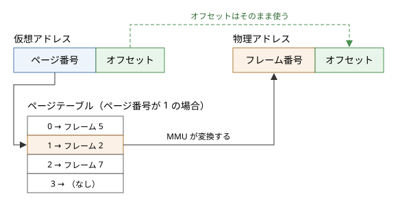

メモリ管理
==========

この章では、OS がメモリをどのように管理しているかを説明します。中心となるのは、各プロセスに独立したアドレス空間を与えるページングと、物理メモリよりも大きなメモリがあるように見せる仮想記憶です。

物理アドレスと論理アドレス
--------------------------

メモリ上の各バイトには、場所を示す番号であるアドレスが付いています。メモリの装置そのものに付いているアドレスを物理アドレスと呼びます。

これに対して、プログラムが扱うアドレスを論理アドレス（仮想アドレス）と呼びます。現代の OS では、プロセスが使うアドレスはすべて論理アドレスで、CPU がメモリにアクセスするたびに、MMU（Memory Management Unit：メモリ管理ユニット）と呼ばれるハードウェアが論理アドレスを物理アドレスに変換します。

論理アドレスと物理アドレスを分けることで、次のことが可能になります。

* 各プロセスが、他のプロセスと重ならない独立したアドレス空間を持てる。
* プロセスのメモリを、物理メモリ上のどこにでも配置できる。
* プロセスのメモリの一部を、物理メモリではなくストレージに置いておける。
* プロセスがアクセスしてよい範囲を、ハードウェアで強制できる。

単純な方式とその問題
--------------------

ページングを説明する前に、より単純な方式とその問題を見ておきます。

ベースレジスタとリミットレジスタ
~~~~~~~~~~~~~~~~~~~~~~~~~~~~~~~~

最も単純な方式は、各プロセスに物理メモリの連続した領域を割り当て、CPU のベースレジスタに領域の先頭の物理アドレスを、リミットレジスタに領域の大きさを設定するものです。MMU は、論理アドレスがリミットより小さいことを確かめてから、ベースを足して物理アドレスを求めます。

この方式でも、プロセス間の保護と配置の自由は実現できます。しかし、プロセスごとに連続した領域が必要なため、プロセスの起動と終了を繰り返すうちに、物理メモリに小さな空き領域が点在するようになります。空き領域の合計は十分あるのに、連続した大きな領域が確保できない状態を外部断片化と呼びます。

セグメンテーション
~~~~~~~~~~~~~~~~~~

セグメンテーションは、プロセスのアドレス空間を、コード、データ、スタックなどの意味のある単位（セグメント）に分け、セグメントごとにベースとリミットを持たせる方式です。セグメントごとにアクセス権を設定できる利点がありますが、セグメントの大きさがまちまちなので、外部断片化の問題は残ります。

x86 の CPU はセグメンテーションの機能を持っていますが、現在の 64 ビットの OS ではほとんど使われておらず、メモリ管理は次に述べるページングで行われています。

ページング
----------

ページングは、論理アドレス空間と物理メモリを、どちらも同じ大きさの小さなブロックに分けて管理する方式です。論理アドレス空間のブロックをページ、物理メモリのブロックをページフレーム（または単にフレーム）と呼びます。ページの大きさは、多くの場合 4 KiB です。

ページングでは、どのページをどのフレームに置くかを自由に決められます。プロセスのページは物理メモリ上で連続している必要がないので、外部断片化が起きません。ただし、割り当ての単位がページなので、プロセスが必要とするメモリがページの大きさで割り切れない場合、最後のページの一部が無駄になります。これを内部断片化と呼びます。

アドレス変換
~~~~~~~~~~~~

ページの大きさを :math:`2^k` バイトとすると、論理アドレスは上位のページ番号と、下位 :math:`k` ビットのページ内オフセットに分けられます。ページ番号からフレーム番号への対応は、プロセスごとに用意されたページテーブルに記録されています。

   ページングによるアドレス変換

ページの大きさを :math:`S`、ページ番号を :math:`p`、オフセットを :math:`d`、ページ :math:`p` が置かれているフレームの番号を :math:`f(p)` とすると、論理アドレス :math:`v` と物理アドレス :math:`r` の関係は次のとおりです。

.. math::

   p = \left\lfloor \frac{v}{S} \right\rfloor, \qquad d = v \bmod S, \qquad r = f(p) \times S + d

:math:`S` が 2 のべき乗なので、この計算はビットのシフトとマスクだけで行えます。

サンプルコード :download:`address_translation.py <../examples/address_translation.py>` は、ページの大きさを 4 KiB とし、小さなページテーブルを使ってアドレスを変換するものです。

.. literalinclude:: ../examples/address_translation.py
   :language: python
   :linenos:
   :caption: address_translation.py

実行結果は次のとおりです。ページテーブルに載っていないページ 3 へのアクセスは、ページフォールトになります。

.. code-block:: text

   仮想アドレス  ページ  オフセット  物理アドレス
        0x00000       0  0x000       0x05000
        0x00ABC       0  0xABC       0x05ABC
        0x01004       1  0x004       0x02004
        0x02FFF       2  0xFFF       0x07FFF
        0x03000       3  0x000       ページフォールト (ページ 3 は物理メモリにありません)
        0x04010       4  0x010       0x01010

ページテーブルのエントリ
~~~~~~~~~~~~~~~~~~~~~~~~

ページテーブルの各エントリには、フレーム番号のほかに、次のような制御用のビットが含まれています。

.. list-table:: ページテーブルのエントリの主なビット
   :header-rows: 1
   :widths: 25 75

   * - ビット
     - 意味
   * - 存在ビット
     - そのページが物理メモリ上にあるかどうか。0 のページにアクセスするとページフォールトが起きる
   * - 書き込み許可ビット
     - そのページに書き込んでよいかどうか
   * - ユーザービット
     - ユーザーモードからアクセスしてよいかどうか。カーネルの領域では 0 にする
   * - 実行禁止ビット
     - そのページの内容を命令として実行してよいかどうか（x86-64 では NX ビット）
   * - 参照ビット
     - そのページが最近アクセスされたかどうか。アクセスされると CPU が 1 にする
   * - ダーティビット
     - そのページが書き換えられたかどうか。書き込まれると CPU が 1 にする

これらのビットに違反するアクセス（書き込み禁止のページへの書き込みなど）があると、CPU は例外を発生させ、カーネルに制御を移します。プログラムの不具合で不正なアドレスにアクセスしたときに、UNIX 系 OS で「Segmentation fault」、Windows で「アクセス違反」と表示されるのは、この仕組みによるものです。

多段のページテーブル
~~~~~~~~~~~~~~~~~~~~

64 ビットの CPU では、アドレス空間は非常に広大です。x86-64 で現在一般的に使われる 48 ビットのアドレス空間を 4 KiB のページに分けると、ページの数は :math:`2^{48} / 2^{12} = 2^{36}` 個にもなります。エントリ 1 つを 8 バイトとすると、1 つのプロセスのページテーブルだけで 512 GiB が必要になってしまいます。

実際には、プロセスが使うのはアドレス空間のごく一部です。そこで、ページテーブルを木構造にし、使っていない部分の表は作らずに済ませます。これを多段のページテーブルと呼びます。x86-64 では 4 段（より広いアドレス空間に対応した CPU では 5 段）のページテーブルが使われ、論理アドレスのページ番号の部分を 9 ビットずつに区切って、各段の表の添字として使います。

TLB
~~~

多段のページテーブルを使うと、1 回のメモリアクセスのために、ページテーブルを引くための複数回のメモリアクセスが必要になります。これでは性能が大きく低下してしまいます。

そこで CPU は、最近使ったページ番号とフレーム番号の対応を、TLB（Translation Lookaside Buffer）と呼ばれる小さく高速なキャッシュに保存しています。プログラムのメモリアクセスには局所性（同じ場所や近くの場所に繰り返しアクセスする傾向）があるため、TLB には数十から数千個程度のエントリしかないにもかかわらず、ほとんどのアドレス変換は TLB だけで済みます。

TLB の内容はプロセスのアドレス空間に固有なので、プロセスを切り替えると、基本的には TLB の内容が使えなくなります。これが「:doc:`07_scheduling`」で述べたコンテキストスイッチの間接的な費用の一因です。

また、大量のメモリを使うプログラムでは、ページの大きさを 2 MiB や 1 GiB にした大きなページ（ヒュージページ）を使うと、少ない TLB のエントリで広い範囲をカバーでき、性能が向上することがあります。

仮想記憶
--------

ページテーブルの存在ビットを使うと、プロセスのページのすべてを物理メモリに置いておく必要がなくなります。使われていないページはストレージ上に置いておき、アクセスされたときに初めて物理メモリに読み込めばよいのです。このように、物理メモリとストレージを組み合わせて、物理メモリよりも大きなメモリがあるように見せる仕組みを仮想記憶と呼びます。

デマンドページング
~~~~~~~~~~~~~~~~~~

必要になったときに初めてページを読み込む方式を、デマンドページングと呼びます。存在ビットが 0 のページにアクセスすると、次の流れで処理が進みます。

#. CPU がページフォールトの例外を発生させ、カーネルに制御が移る。
#. カーネルは、そのアクセスが正当かどうか（プロセスのアドレス空間の有効な範囲内か）を確かめる。正当でなければ、プロセスを強制終了させる。
#. カーネルは空いているフレームを探す。空きがなければ、後述するページ置換によってフレームを空ける。
#. ストレージからページの内容をフレームに読み込む。読み込みの間、プロセスは待ちの状態になる。
#. ページテーブルを更新し、存在ビットを 1 にする。
#. ページフォールトを起こした命令を、最初からやり直す。

プロセスから見ると、ページフォールトは何事もなかったかのように処理され、ただメモリアクセスに時間がかかっただけに見えます。

ページフォールトには、ストレージからの読み込みを伴うメジャーフォールトと、伴わないマイナーフォールトがあります。マイナーフォールトは、例えば初めて使うメモリに 0 で埋めたフレームを割り当てる場合や、他のプロセスがすでに読み込んでいる共有ライブラリのページを対応付けるだけの場合に起きます。メジャーフォールトはストレージへのアクセスを伴うため、マイナーフォールトに比べて桁違いに時間がかかります。

ページ置換
~~~~~~~~~~

物理メモリに空きがないときにページフォールトが起きると、どれかのページを物理メモリから追い出す必要があります。追い出すページのダーティビットが 1 なら、その内容をストレージのスワップ領域（Windows ではページファイル）に書き出してから、フレームを再利用します。どのページを追い出すかを決める方法を、ページ置換アルゴリズムと呼びます。

.. list-table:: 主なページ置換アルゴリズム
   :header-rows: 1
   :widths: 20 50 30

   * - アルゴリズム
     - 追い出すページ
     - 特徴
   * - OPT
     - 今後最も長く参照されないページ
     - ページフォールトが最小になるが、将来の参照を知る必要があるため実現できない。他の方式の評価の基準に使う
   * - FIFO
     - 最も古くに読み込んだページ
     - 実装は単純だが、よく使われるページも追い出してしまう
   * - LRU
     - 最も長く参照されていないページ
     - 過去の参照から将来を予測するもので、OPT に近い性能が出やすい。ただし、すべての参照を記録するのは費用が大きい
   * - クロック
     - 参照ビットが 0 のページ
     - 参照ビットを使って LRU を近似する。実際の OS で広く使われる

クロックアルゴリズムは、フレームを環状に並べ、時計の針のようにその上を回るポインタを使います。ページを追い出す必要が生じたら、針の指すフレームの参照ビットを調べ、1 なら 0 にして（もう一度だけ猶予を与えて）針を進め、0 ならそのページを追い出します。参照ビットは CPU がアクセスのたびに自動的に設定するので、ソフトウェアの費用はわずかです。

サンプルコード :download:`page_replacement_sim.py <../examples/page_replacement_sim.py>` は、同じ参照列に対して 4 つのアルゴリズムのページフォールトの回数を比べるものです。

.. literalinclude:: ../examples/page_replacement_sim.py
   :language: python
   :linenos:
   :caption: page_replacement_sim.py

実行結果は次のとおりです。

.. code-block:: text

   参照列: [7, 0, 1, 2, 0, 3, 0, 4, 2, 3, 0, 3, 2, 1, 2, 0, 1, 7, 0, 1]
   フレーム数 3:
     ページフォールト 15 回: FIFO
     ページフォールト 12 回: LRU
     ページフォールト 14 回: クロック
     ページフォールト  9 回: OPT
   フレーム数 4:
     ページフォールト 10 回: FIFO
     ページフォールト  8 回: LRU
     ページフォールト  9 回: クロック
     ページフォールト  8 回: OPT

   参照列: [1, 2, 3, 4, 1, 2, 5, 1, 2, 3, 4, 5]
     FIFO, フレーム数 3: 9 回
     FIFO, フレーム数 4: 10 回

OPT が最も少なく、LRU とクロックがそれに続き、FIFO が最も多いという結果になっています。

最後の結果に注目してください。FIFO では、フレーム数を 3 から 4 に増やしたのに、ページフォールトの回数が 9 回から 10 回に増えています。この直感に反する現象はビレイディの異常（Belady's anomaly）と呼ばれます。LRU や OPT では、フレーム数を増やしてページフォールトが増えることはありません。

ワーキングセットとスラッシング
~~~~~~~~~~~~~~~~~~~~~~~~~~~~~~

プロセスが一定の期間にアクセスするページの集合を、ワーキングセットと呼びます。プロセスのワーキングセットが物理メモリに収まっていれば、ページフォールトはまれにしか起きません。

ところが、実行中のプロセスのワーキングセットの合計が物理メモリの容量を超えると、あるプロセスのページを追い出した直後に、そのページが再び必要になるという事態が頻発します。こうなると、システムはページの読み書きにほとんどの時間を費やし、計算がほとんど進まなくなります。この状態をスラッシングと呼びます。メモリが不足したときに、計算機が極端に遅くなり、ストレージへのアクセスが止まらなくなるのは、スラッシングが起きているためです。

スラッシングを解消するには、実行するプロセスの数を減らすか、物理メモリを増やすしかありません。

ページングの応用
----------------

ページングと仮想記憶の仕組みは、メモリの節約や高速化のためのさまざまな工夫に応用されています。

コピーオンライト
~~~~~~~~~~~~~~~~

「:doc:`05_process`」で見たように、UNIX 系 OS の ``fork`` は親プロセスのメモリを複製します。実際には、カーネルはメモリの内容をコピーせず、親と子のページテーブルが同じフレームを指すようにし、両方を書き込み禁止にします。どちらかがページに書き込もうとすると例外が起き、カーネルはそのときに初めてそのページだけをコピーして、それぞれに書き込みを許可します。この方式をコピーオンライト（Copy-on-Write）と呼びます。

``fork`` の直後に ``exec`` を呼ぶ場合、ほとんどのページは一度もコピーされずに済みます。

共有ライブラリ
~~~~~~~~~~~~~~

C 標準ライブラリのような共有ライブラリのコードは、多数のプロセスで使われます。OS は、共有ライブラリのコードを物理メモリに 1 つだけ置き、それを使うすべてのプロセスのページテーブルから同じフレームを指すようにしています。コードの領域は書き込み禁止なので、共有しても問題は起きません。

メモリマップトファイル
~~~~~~~~~~~~~~~~~~~~~~

メモリマップトファイルは、ファイルの内容をプロセスのアドレス空間に対応付け、メモリへのアクセスとしてファイルを読み書きする仕組みです。UNIX 系 OS では ``mmap`` システムコールで、Windows では ``CreateFileMapping`` 関数と ``MapViewOfFile`` 関数で使えます。

対応付けた領域に初めてアクセスすると、ページフォールトをきっかけにファイルの内容が読み込まれます。書き換えたページは、カーネルによって適当なときにファイルに書き戻されます。プログラムの実行ファイル自体も、この仕組みでメモリに対応付けられて実行されています。

サンプルコード :download:`mmap_example.py <../examples/mmap_example.py>` は、ファイルをメモリに対応付け、メモリを書き換えることでファイルの内容を変更するものです。

.. literalinclude:: ../examples/mmap_example.py
   :language: python
   :linenos:
   :caption: mmap_example.py

実行結果は次のとおりです。``read`` や ``write`` を使わずに、ファイルの先頭 5 バイトが書き換わっていることが分かります。

.. code-block:: text

   マップした長さ : 24 バイト
   先頭 5 バイト  : b'hello'
   ファイルの内容 : b'HELLO, operating system!'

メモリの割り当てとメモリ不足
----------------------------

ユーザー空間でのメモリの割り当て
~~~~~~~~~~~~~~~~~~~~~~~~~~~~~~~~

C 言語の ``malloc`` や、Python のオブジェクトの作成のたびにシステムコールを呼ぶのは費用が大きすぎます。そのため、プロセスはまとまった大きさのメモリを OS から受け取り（Linux では ``brk`` や ``mmap`` システムコール、Windows では ``VirtualAlloc`` 関数）、それを小さく切り分けて使います。この切り分けを担うのが、C 標準ライブラリなどに含まれるメモリアロケータです。

また、OS からメモリを受け取っても、その時点では物理メモリのフレームは割り当てられていません。実際にフレームが割り当てられるのは、そのページに初めてアクセスしたとき（ページフォールトが起きたとき）です。

メモリの使用量の指標
~~~~~~~~~~~~~~~~~~~~

プロセスのメモリの使用量には、いくつかの異なる指標があります。

.. list-table:: プロセスのメモリの使用量の指標
   :header-rows: 1
   :widths: 30 70

   * - 指標
     - 意味
   * - 仮想メモリサイズ（VSZ）
     - プロセスのアドレス空間のうち、確保済みの領域の合計。実際には使っていない領域も含む
   * - 常駐セットサイズ（RSS）
     - プロセスのページのうち、物理メモリ上にあるものの合計。共有ライブラリのように他のプロセスと共有しているページも含む
   * - ワーキングセット（Windows）
     - Windows で、プロセスのページのうち物理メモリ上にあるものの合計。RSS とほぼ同じ意味

VSZ が非常に大きくても、実際に物理メモリを使っているとは限りません。また、各プロセスの RSS を単純に合計すると、共有されているページを重複して数えることになるため、実際の物理メモリの使用量よりも大きくなります。

オーバーコミットと OOM Killer
~~~~~~~~~~~~~~~~~~~~~~~~~~~~~

前述のとおり、プロセスが確保したメモリの多くは、実際にはすぐには使われません。そこで Linux は既定で、物理メモリとスワップ領域の合計を超える量のメモリの確保を、ある程度まで許します。これをオーバーコミットと呼びます。

オーバーコミットのもとで、プロセスが実際にメモリを使い始め、物理メモリとスワップ領域の両方が不足すると、カーネルは OOM Killer（Out Of Memory Killer）と呼ばれる仕組みを起動します。OOM Killer は、メモリを多く使っているプロセスなどを選んで強制終了させ、メモリを空けます。コンテナや仮想マシンの上で動くプログラムが、エラーを出さずに突然終了した場合は、OOM Killer によって終了させられた可能性を疑う必要があります。

Windows はオーバーコミットを行わず、確保できるメモリの総量（コミットチャージ）を物理メモリとページファイルの合計までに制限します。上限に達すると、それ以上のメモリの確保が失敗します。

まとめ
------

* プロセスは論理アドレスを使い、MMU がそれを物理アドレスに変換します。これにより、プロセスごとの独立したアドレス空間と保護が実現されます。
* ページングは、アドレス空間と物理メモリを同じ大きさのブロックに分けて対応付ける方式で、外部断片化が起きません。変換を高速にするため、TLB が使われます。
* 仮想記憶は、使われていないページをストレージに置くことで、物理メモリよりも大きなメモリを提供します。ページ置換には、LRU を近似したクロックアルゴリズムなどが使われます。
* ワーキングセットが物理メモリに収まらないと、スラッシングが起きて性能が極端に低下します。
* ページングは、コピーオンライト、共有ライブラリ、メモリマップトファイルなどに応用されています。
