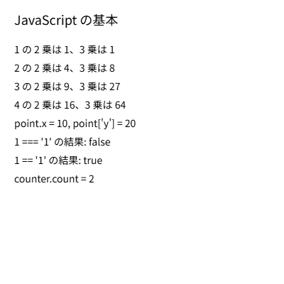

Python エンジニアのための JavaScript 速習
==================================================

p5.js のスケッチは JavaScript で書きます。この章では、Python の知識を前提に、p5.js を書くのに必要な JavaScript の文法を説明します。

文の書き方
----------

JavaScript と Python の書き方の違いのうち、最初に戸惑いやすいのは次の 3 点です。

* **ブロックは波括弧で囲む**：Python はインデントでブロックを表しますが、JavaScript は ``{`` と ``}`` で囲みます。インデントは見やすさのためだけのもので、動作には影響しません。
* **文の終わりにセミコロンを付ける**：セミコロンを省略しても多くの場合は自動で補われますが、意図しない解釈を避けるため、本書では付けて書きます。
* **コメントは** ``//`` **で始める**：複数行のコメントは ``/*`` と ``*/`` で囲みます。

.. code-block:: javascript
   :linenos:

   // 1 行のコメント
   /*
     複数行の
     コメント
   */
   if (x > 0) {
     console.log('正の数です');
   }

変数と定数
----------

変数は ``let`` または ``const`` で宣言します。Python と違い、最初に使う前に宣言が必要です。

.. code-block:: javascript
   :linenos:

   let count = 0;       // 再代入できる
   count = count + 1;

   const SPEED = 3;     // 再代入できない
   // SPEED = 5;        // これはエラーになる

再代入しない値には ``const``、再代入する値には ``let`` を使います。古いコードでは ``var`` も使われていますが、有効範囲（スコープ）が分かりにくいため、新しく書くコードでは使いません。

``let`` と ``const`` で宣言した変数は、宣言したブロックの中でだけ有効です。関数の外で宣言した変数は、どの関数からも使えるグローバル変数になります。p5.js では、``setup()`` と ``draw()`` の両方で使う値を、関数の外で宣言したグローバル変数に入れるのが一般的です。

値の型と演算
------------

主な型と、Python との違いを次の表に示します。

.. list-table::
   :header-rows: 1
   :widths: 20 30 50

   * - 種類
     - JavaScript の例
     - Python との違い
   * - 数値
     - ``42``、``3.14``
     - 整数と浮動小数点数の区別がなく、すべて ``number`` 型。``7 / 2`` は ``3.5`` になる。整数の商が必要なときは ``Math.floor(7 / 2)`` を使う。
   * - 文字列
     - ``'abc'``、``"abc"``
     - Python と同様に、単一引用符と二重引用符のどちらも使える。
   * - テンプレートリテラル
     - :literal:`\`x = ${x}\``
     - バッククォートで囲み、``${}`` の中に式を書く。Python の f 文字列に相当する。
   * - 真偽値
     - ``true``、``false``
     - 先頭が小文字。
   * - 値がないこと
     - ``null``、``undefined``
     - Python の ``None`` に相当する。宣言しただけで値を代入していない変数は ``undefined`` になる。

べき乗は ``**``、剰余は ``%`` で、Python と同じです。``x += 1`` のような複合代入演算子も使えます。さらに、1 を加える ``x++``、1 を引く ``x--`` もよく使います。

比較と論理演算
--------------

等しいかどうかの比較には、``==`` ではなく ``===`` を使います。``==`` は比較の前に型を変換するため、``1 == '1'`` が ``true`` になるなど、意図しない結果になることがあります。``===`` は型も含めて比較します。等しくないことの判定には ``!==`` を使います。

論理演算子は、Python の ``and``、``or``、``not`` の代わりに記号を使います。

.. list-table::
   :header-rows: 1
   :widths: 30 30 40

   * - Python
     - JavaScript
     - 意味
   * - ``a == b``
     - ``a === b``
     - 等しい
   * - ``a != b``
     - ``a !== b``
     - 等しくない
   * - ``a and b``
     - ``a && b``
     - かつ
   * - ``a or b``
     - ``a || b``
     - または
   * - ``not a``
     - ``!a``
     - 否定

条件分岐とループ
----------------

``if`` 文の条件は丸括弧で囲みます。Python の ``elif`` は ``else if`` と書きます。

.. code-block:: javascript
   :linenos:

   if (score >= 80) {
     grade = 'A';
   } else if (score >= 60) {
     grade = 'B';
   } else {
     grade = 'C';
   }

条件によって 2 つの値のどちらかを選ぶときは、条件演算子（三項演算子）が便利です。Python の ``a if 条件 else b`` に相当し、``条件 ? a : b`` と書きます。

.. code-block:: javascript
   :linenos:

   const r = i % 2 === 0 ? 40 : 18;  // i が偶数なら 40、奇数なら 18

``for`` 文には 2 つの書き方があります。回数を指定して繰り返すときは C 言語と同じ形、配列の要素を順に取り出すときは ``for...of`` を使います。

.. code-block:: javascript
   :linenos:

   // Python の for i in range(10): に相当
   for (let i = 0; i < 10; i++) {
     console.log(i);
   }

   // Python の for color in colors: に相当
   const colors = ['red', 'green', 'blue'];
   for (const color of colors) {
     console.log(color);
   }

``for...in`` という構文もありますが、これは配列の要素ではなくキー（添字）を取り出すため、配列には使いません。

関数
----

関数は ``function`` キーワードで定義します。引数の既定値も指定できます。

.. code-block:: javascript
   :linenos:

   function area(width, height = 10) {
     return width * height;
   }

   area(5);      // 50
   area(5, 3);   // 15

関数は :term:`アロー関数` で書くこともできます。Python の ``lambda`` に似ていますが、波括弧を使えば複数行の処理も書けます。

.. code-block:: javascript
   :linenos:

   const double = (x) => x * 2;

   const greet = (name) => {
     const message = `こんにちは、${name} さん`;
     return message;
   };

アロー関数は、関数を引数として渡すとき（:term:`コールバック関数`）によく使います。

配列とオブジェクト
------------------

配列は Python のリストに相当します。よく使う操作を次に示します。

.. code-block:: javascript
   :linenos:

   const numbers = [3, 1, 4];
   numbers.push(1);                         // 末尾に追加（append に相当）
   console.log(numbers.length);             // 要素数（len() に相当）
   console.log(numbers[0]);                 // 先頭の要素
   const doubled = numbers.map((n) => n * 2);         // 各要素を変換
   const large = numbers.filter((n) => n >= 3);       // 条件に合う要素を抽出
   numbers.forEach((n, i) => console.log(i, n));      // 添字と要素を順に処理

Python と違い、``numbers[-1]`` で末尾の要素は取り出せません。末尾の要素は ``numbers[numbers.length - 1]`` または ``numbers.at(-1)`` で取り出します。

オブジェクトは、Python の辞書に近いデータ構造です。キーは引用符なしで書けて、値は ``.`` または ``[]`` で取り出します。

.. code-block:: javascript
   :linenos:

   const ball = { x: 100, y: 200, color: 'red' };
   console.log(ball.x);         // 100
   console.log(ball['color']);  // 'red'
   ball.speed = 3;              // 新しいキーを追加

``const`` で宣言した配列やオブジェクトでも、中身は変更できます。``const`` が禁止するのは変数への再代入だけです。

クラス
------

クラスの書き方は Python とよく似ています。主な違いは次のとおりです。

* コンストラクターは ``__init__`` ではなく ``constructor`` という名前にする。
* ``self`` の代わりに ``this`` を使う。メソッドの引数に ``this`` を書く必要はない。
* インスタンスは ``new`` を付けて作る。

.. code-block:: javascript
   :linenos:

   class Counter {
     constructor(start) {
       this.count = start;
     }

     increment() {
       this.count += 1;
     }
   }

   const counter = new Counter(0);
   counter.increment();
   console.log(counter.count);  // 1

Python との対応表
-----------------

この章で説明した内容を次の表にまとめます。

.. list-table::
   :header-rows: 1
   :widths: 50 50

   * - Python
     - JavaScript
   * - ``x = 1``
     - ``let x = 1;`` または ``const x = 1;``
   * - ``None``
     - ``null`` または ``undefined``
   * - ``True`` / ``False``
     - ``true`` / ``false``
   * - ``f"x = {x}"``
     - :literal:`\`x = ${x}\``
   * - ``print(x)``
     - ``console.log(x);``
   * - ``len(a)``
     - ``a.length``
   * - ``a.append(x)``
     - ``a.push(x);``
   * - ``for x in a:``
     - ``for (const x of a) { }``
   * - ``for i in range(n):``
     - ``for (let i = 0; i < n; i++) { }``
   * - ``def f(x):``
     - ``function f(x) { }``
   * - ``lambda x: x * 2``
     - ``(x) => x * 2``
   * - ``class A:`` と ``def __init__(self):``
     - ``class A { constructor() { } }``
   * - ``self.x``
     - ``this.x``
   * - ``A()``
     - ``new A()``

サンプル
--------

この章の内容をまとめて試すサンプルです。結果はキャンバスと開発者ツールのコンソールの両方に表示されます。

.. literalinclude:: ../examples/ch03_js_basics/sketch.js
   :language: javascript
   :linenos:
   :caption: ch03_js_basics/sketch.js

* `実行する <examples/ch03_js_basics/index.html>`__
* ダウンロード：:download:`index.html <../examples/ch03_js_basics/index.html>`、:download:`sketch.js <../examples/ch03_js_basics/sketch.js>`

   サンプルの実行結果

10 行目の関数は、2 乗を計算するので本来は ``square`` と名付けたいところです。しかし、p5.js には正方形を描く ``square()`` 関数があり、同じ名前の関数を定義すると p5.js の初期化時にエラーになります。p5.js の関数や変数と同じ名前をグローバルに定義しないように注意してください。この問題は、:doc:`04_structure` で説明するインスタンスモードを使うと避けられます。
