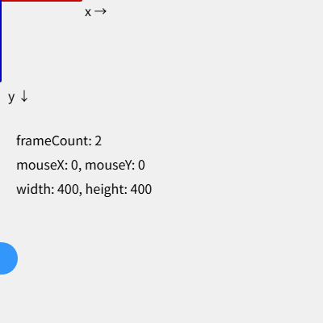

スケッチの基本構造
==================

この章では、p5.js のスケッチがどのような流れで実行されるかと、描画の基本となる座標系を説明します。

setup() と draw()
-----------------

p5.js のスケッチは、基本的に ``setup()`` と ``draw()`` の 2 つの関数で構成されます。どちらも自分で呼び出す必要はなく、p5.js が決まったタイミングで呼び出します。

.. list-table::
   :header-rows: 1
   :widths: 20 30 50

   * - 関数
     - 呼ばれるタイミング
     - 主な用途
   * - ``setup()``
     - 最初に 1 回だけ
     - キャンバスの作成、変数の初期化
   * - ``draw()``
     - ``setup()`` の後、繰り返し
     - 1 :term:`フレーム` 分の描画

``draw()`` は、既定では 1 秒間に約 60 回呼ばれます。``draw()`` の中で毎回少しずつ違う絵を描くと、パラパラ漫画のようにアニメーションになります。

:doc:`02_setup` で作った最初のスケッチを、もう一度見てみます。

.. literalinclude:: ../examples/ch02_hello/sketch.js
   :language: javascript
   :linenos:
   :caption: ch02_hello/sketch.js

5 行目の ``createCanvas(400, 400)`` で、幅 400 ピクセル、高さ 400 ピクセルのキャンバスを作ります。``draw()`` では、10 行目で背景を塗りつぶしてから、12 行目でマウスの位置に円を描いています。``draw()`` が繰り返し呼ばれるたびに、その時点のマウスの位置に円が描き直されるため、円がマウスに付いてくるように見えます。

10 行目の ``background()`` を削除すると、前のフレームの絵が消えずに残るため、円の軌跡が線のように残ります。

座標系
------

キャンバスの座標系は、数学で一般的な座標系とは y 軸の向きが逆です。

* 原点 :math:`(0, 0)` はキャンバスの左上の角
* x 座標は右に行くほど大きくなる
* y 座標は下に行くほど大きくなる

幅 400、高さ 400 のキャンバスでは、右下の角が :math:`(400, 400)` になります。座標の単位はピクセルです。

システム変数
------------

p5.js には、キャンバスの大きさやマウスの位置などを保持する変数が用意されています。これらを :term:`システム変数` と呼びます。値は p5.js が自動的に更新します。

.. list-table::
   :header-rows: 1
   :widths: 30 70

   * - 変数
     - 内容
   * - ``width``、``height``
     - キャンバスの幅と高さ
   * - ``mouseX``、``mouseY``
     - 現在のマウスの位置
   * - ``pmouseX``、``pmouseY``
     - 1 つ前のフレームでのマウスの位置
   * - ``mouseIsPressed``
     - マウスボタンが押されているかどうか
   * - ``key``
     - 最後に押されたキー
   * - ``frameCount``
     - スケッチ開始からのフレーム数
   * - ``deltaTime``
     - 前のフレームからの経過時間（ミリ秒）

``width`` や ``height`` は ``createCanvas()`` を呼んだ後で正しい値になります。そのため、キャンバスの大きさを使う処理は ``setup()`` の中で ``createCanvas()`` より後に書きます。

フレームレートと描画の制御
--------------------------

``draw()`` が 1 秒間に呼ばれる回数を :term:`フレームレート` と呼びます。フレームレートや描画の繰り返しは、次の関数で制御できます。

.. list-table::
   :header-rows: 1
   :widths: 30 70

   * - 関数
     - 動作
   * - ``frameRate(fps)``
     - 目標のフレームレートを設定する。引数を省略すると、現在のフレームレートを返す。
   * - ``noLoop()``
     - ``draw()`` の繰り返しを止める。
   * - ``loop()``
     - ``draw()`` の繰り返しを再開する。
   * - ``redraw()``
     - ``noLoop()`` の状態で ``draw()`` を 1 回だけ実行する。

静止画を描くスケッチでは、``setup()`` で ``noLoop()`` を呼ぶと、``draw()`` が 1 回だけ実行され、無駄な再描画を避けられます。

次のサンプルは、``setup()`` が 1 回だけ呼ばれることと、座標系の向き、システム変数の値を確かめるものです。

.. literalinclude:: ../examples/ch04_structure/sketch.js
   :language: javascript
   :linenos:
   :caption: ch04_structure/sketch.js

* `実行する <examples/ch04_structure/index.html>`__
* ダウンロード：:download:`index.html <../examples/ch04_structure/index.html>`、:download:`sketch.js <../examples/ch04_structure/sketch.js>`

   サンプルの実行結果

赤い線が x 軸、青い線が y 軸の正の向きです。開発者ツールのコンソールを開くと、6 行目のメッセージが 1 回だけ出力されていることを確認できます。

グローバルモードとインスタンスモード
------------------------------------

ここまでのように、``setup()`` や ``draw()`` をグローバルな関数として定義する書き方を :term:`グローバルモード` と呼びます。手軽に書ける反面、p5.js の関数や変数がすべてグローバルに置かれるため、次のような問題があります。

* 自分で定義した関数や変数が、p5.js の関数や変数と名前が衝突することがある。
* 1 つのページに複数のスケッチを置けない。
* 他の JavaScript ライブラリと組み合わせにくい。

これらを避けたいときは :term:`インスタンスモード` を使います。インスタンスモードでは、スケッチ全体を 1 つの関数として書き、p5.js の関数や変数には引数 ``p`` を通してアクセスします。

.. literalinclude:: ../examples/ch04_instance/sketch.js
   :language: javascript
   :linenos:
   :caption: ch04_instance/sketch.js

* `実行する <examples/ch04_instance/index.html>`__
* ダウンロード：:download:`index.html <../examples/ch04_instance/index.html>`、:download:`sketch.js <../examples/ch04_instance/sketch.js>`

``createCanvas()`` や ``width`` に ``p.`` を付ける必要があるため、コードは少し長くなります。本書では読みやすさを優先して、以降はグローバルモードで書きます。
