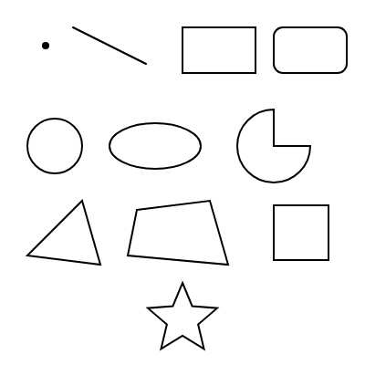

図形の描画
==========

この章では、p5.js で図形を描く関数を紹介します。

基本図形
--------

よく使う図形の関数を次の表に示します。引数はすべてピクセル単位です。

.. list-table::
   :header-rows: 1
   :widths: 35 65

   * - 関数
     - 描く図形と引数
   * - ``point(x, y)``
     - 点
   * - ``line(x1, y1, x2, y2)``
     - 始点 :math:`(x_1, y_1)` から終点 :math:`(x_2, y_2)` への線
   * - ``rect(x, y, w, h)``
     - 左上の角が :math:`(x, y)` で、幅 :math:`w`、高さ :math:`h` の長方形
   * - ``square(x, y, s)``
     - 左上の角が :math:`(x, y)` で、一辺が :math:`s` の正方形
   * - ``ellipse(x, y, w, h)``
     - 中心が :math:`(x, y)` で、幅 :math:`w`、高さ :math:`h` の楕円
   * - ``circle(x, y, d)``
     - 中心が :math:`(x, y)` で、直径 :math:`d` の円
   * - ``arc(x, y, w, h, start, stop)``
     - 楕円の一部（円弧）。``start`` から ``stop`` までの角度の部分を描く。
   * - ``triangle(x1, y1, x2, y2, x3, y3)``
     - 3 つの頂点を結ぶ三角形
   * - ``quad(x1, y1, ..., x4, y4)``
     - 4 つの頂点を結ぶ四角形

``rect()`` は左上の角を、``circle()`` と ``ellipse()`` は中心を基準に位置を指定する点に注意してください。基準は ``rectMode()`` と ``ellipseMode()`` で変更できます。たとえば ``rectMode(CENTER)`` とすると、``rect()`` の最初の 2 つの引数が長方形の中心を表すようになります。

``circle()`` の 3 番目の引数は半径ではなく直径です。

図形は、コードに書いた順に重ねて描かれます。後から描いた図形が、先に描いた図形の上に重なります。

角度の指定
----------

``arc()`` の角度は、既定では :term:`ラジアン` で指定します。角度 0 は右方向（x 軸の正の向き）で、y 軸が下向きであるため、角度が増えると時計回りに進みます。

よく使う角度は定数として用意されています。

.. list-table::
   :header-rows: 1
   :widths: 30 30 40

   * - 定数
     - 値
     - 度数法
   * - ``QUARTER_PI``
     - :math:`\pi / 4`
     - 45 度
   * - ``HALF_PI``
     - :math:`\pi / 2`
     - 90 度
   * - ``PI``
     - :math:`\pi`
     - 180 度
   * - ``TWO_PI``
     - :math:`2\pi`
     - 360 度

度数法で指定したいときは、``angleMode(DEGREES)`` を呼びます。度数法とラジアンの変換には ``radians()`` と ``degrees()`` も使えます。

自由な形
--------

``beginShape()`` と ``endShape()`` の間で ``vertex()`` を呼ぶと、頂点を自由に並べた多角形を描けます。``endShape(CLOSE)`` とすると、最後の頂点と最初の頂点が結ばれて、図形が閉じます。

.. code-block:: javascript
   :linenos:

   beginShape();
   vertex(100, 50);
   vertex(150, 150);
   vertex(50, 150);
   endShape(CLOSE);

ループの中で ``vertex()`` を呼べば、計算で求めた頂点を並べられます。半径 :math:`r`、中心 :math:`(c_x, c_y)` の円周上で角度 :math:`\theta` の位置にある点は、次の式で求められます。

.. math::

   x = c_x + r \cos\theta, \quad y = c_y + r \sin\theta

サンプル
--------

基本図形と、上の式を使って描いた星形を並べたサンプルです。星形は、外側の頂点と内側の頂点を交互に 10 個並べて描いています。

.. literalinclude:: ../examples/ch05_shapes/sketch.js
   :language: javascript
   :linenos:
   :caption: ch05_shapes/sketch.js

* `実行する <examples/ch05_shapes/index.html>`__
* ダウンロード：:download:`index.html <../examples/ch05_shapes/index.html>`、:download:`sketch.js <../examples/ch05_shapes/sketch.js>`

   サンプルの実行結果

29 行目の ``arc()`` は、角度 0 から :math:`3\pi/2`\ （270 度）までの円弧を描きます。最後の引数 ``PIE`` は、円弧の両端と中心を結んで扇形にする指定です。
