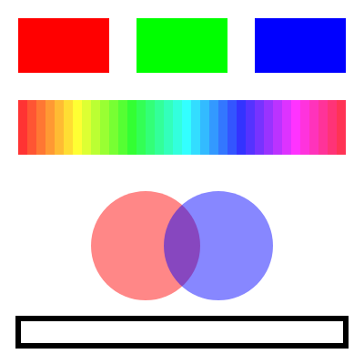

色とスタイル
============

この章では、図形の塗りと線の色、線の太さを指定する方法を説明します。

塗りと線
--------

p5.js の図形は、内側の「塗り」と輪郭の「線」から成り、それぞれ別の関数で色を指定します。

.. list-table::
   :header-rows: 1
   :widths: 35 65

   * - 関数
     - 動作
   * - ``background(色)``
     - キャンバス全体を指定した色で塗りつぶす。
   * - ``fill(色)``
     - 以降に描く図形の塗りの色を設定する。
   * - ``noFill()``
     - 以降に描く図形を塗らない。
   * - ``stroke(色)``
     - 以降に描く図形の線の色を設定する。
   * - ``noStroke()``
     - 以降に描く図形の線を描かない。
   * - ``strokeWeight(太さ)``
     - 以降に描く図形の線の太さをピクセル単位で設定する。

既定では、塗りは白、線は黒で太さ 1 ピクセルです。

これらの関数は「以降に描く図形」の設定を変えるもので、設定は次に変更するまで有効です。たとえば ``fill(255, 0, 0)`` を呼ぶと、その後に描く図形はすべて赤く塗られます。図形ごとに色を変えたいときは、図形を描く直前に毎回 ``fill()`` を呼びます。設定を一時的に変えて元に戻す方法は :doc:`09_transform` で説明します。

色の指定方法
------------

色を指定する関数は、引数の数によって解釈が変わります。

.. list-table::
   :header-rows: 1
   :widths: 35 65

   * - 書き方
     - 意味
   * - ``fill(128)``
     - グレースケール。0 が黒、255 が白。
   * - ``fill(128, 100)``
     - グレースケールと透明度
   * - ``fill(255, 0, 0)``
     - RGB。赤・緑・青の強さを 0〜255 で指定する。
   * - ``fill(255, 0, 0, 100)``
     - RGB と透明度
   * - ``fill('red')``
     - CSS の色名
   * - ``fill('#ff8800')``
     - 16 進数のカラーコード

透明度は :term:`アルファ値` とも呼ばれ、0 で完全に透明、255 で完全に不透明です。半透明の図形を重ねると、重なった部分の色が混ざって見えます。

色を変数に入れて使い回したいときは、``color()`` 関数で色のオブジェクトを作ります。

.. code-block:: javascript
   :linenos:

   const skyBlue = color(135, 206, 235);
   fill(skyBlue);
   circle(200, 200, 100);

``color()`` は p5.js の初期化が終わってから使える関数です。関数の外でグローバル変数を初期化するときには使えないため、``setup()`` の中で呼びます。

HSB による指定
--------------

RGB は画面の表示方式に合った指定方法ですが、「同じ明るさで色合いだけを変える」といった操作には向きません。そのような場合は、``colorMode(HSB)`` で :term:`HSB` に切り替えると便利です。

.. list-table::
   :header-rows: 1
   :widths: 20 30 50

   * - 要素
     - 意味
     - 既定の範囲
   * - H（Hue）
     - 色相。赤→黄→緑→青→紫と一周する色合い。
     - 0〜360
   * - S（Saturation）
     - 彩度。0 で灰色、最大で鮮やかな色。
     - 0〜100
   * - B（Brightness）
     - 明度。0 で黒、最大で最も明るい色。
     - 0〜100

``colorMode()`` の 2 番目以降の引数で、各要素の範囲を変更できます。たとえば ``colorMode(HSB, 360, 100, 100)`` とすると、色相を 0〜360、彩度と明度を 0〜100 で指定します。

``colorMode()`` も ``fill()`` と同様に、次に変更するまで有効です。RGB に戻すときは ``colorMode(RGB, 255)`` を呼びます。

サンプル
--------

RGB の 3 原色、HSB で色相だけを変えた色の帯、半透明の円の重なり、太い線の長方形を描くサンプルです。

.. literalinclude:: ../examples/ch06_color/sketch.js
   :language: javascript
   :linenos:
   :caption: ch06_color/sketch.js

* `実行する <examples/ch06_color/index.html>`__
* ダウンロード：:download:`index.html <../examples/ch06_color/index.html>`、:download:`sketch.js <../examples/ch06_color/sketch.js>`

   サンプルの実行結果

22〜25 行目では、色相を 10 ずつ変えながら細い長方形を 36 個並べています。彩度と明度を固定しているため、色合いだけが滑らかに変化します。
