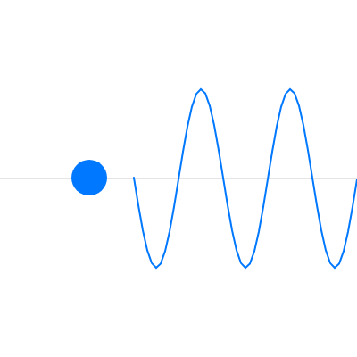

アニメーション
==============

:doc:`04_structure` で説明したように、``draw()`` は繰り返し呼ばれます。この章では、``draw()`` が呼ばれるたびに図形の位置を少しずつ変えて、アニメーションを作る方法を説明します。

位置と速度
----------

物体を動かす基本は、「位置」と「速度」を変数で持ち、フレームごとに位置へ速度を加えることです。フレーム番号を :math:`t` とすると、x 方向の位置 :math:`x` と速度 :math:`v_x` の関係は次のようになります。

.. math::

   x_{t+1} = x_t + v_x

速度 :math:`v_x` は「1 フレームあたりの移動量」を表します。y 方向も同様です。

壁での跳ね返りは、ボールが壁を越えたときに速度の符号を反転するだけで表現できます。

.. math::

   v_x \leftarrow -v_x

半径 :math:`r` のボールは、中心の x 座標が :math:`r` より小さくなるか、:math:`\mathrm{width} - r` より大きくなったときに、左右の壁に当たったと判定できます。

.. literalinclude:: ../examples/ch07_bounce/sketch.js
   :language: javascript
   :linenos:
   :caption: ch07_bounce/sketch.js

* `実行する <examples/ch07_bounce/index.html>`__
* ダウンロード：:download:`index.html <../examples/ch07_bounce/index.html>`、:download:`sketch.js <../examples/ch07_bounce/sketch.js>`

位置と速度は、``draw()`` が呼ばれるたびに前の値を引き継ぐ必要があります。そのため、3〜7 行目のように関数の外でグローバル変数として宣言します。``draw()`` の中で宣言すると、呼ばれるたびに初期値に戻ってしまい、ボールは動きません。

フレームレートに依存しない動き
------------------------------

上のサンプルでは、速度を「1 フレームあたりの移動量」としました。この方法では、処理が重くてフレームレートが下がると、ボールの動きも遅くなります。``frameRate()`` で目標のフレームレートを変えた場合も、動く速さが変わります。

環境によらず同じ速さで動かしたいときは、:term:`システム変数` の ``deltaTime`` を使います。``deltaTime`` は前のフレームからの経過時間（ミリ秒）です。速度を「1 秒あたりの移動量」で表し、経過時間を掛けて移動量を求めます。

.. code-block:: javascript
   :linenos:

   let x = 0;
   const SPEED = 120;  // 1 秒あたり 120 ピクセル

   function draw() {
     background(30);
     x += SPEED * (deltaTime / 1000);  // ミリ秒を秒に変換して掛ける
     circle(x, 200, 40);
   }

三角関数による周期運動
----------------------

振り子のように行ったり来たりする動きは、三角関数で表せます。経過時間を :math:`t` 秒、振幅を :math:`A`、周期を :math:`T` 秒、中心の位置を :math:`c` とすると、位置 :math:`y` は次の式で表せます。

.. math::

   y = c + A \sin\left(\frac{2\pi t}{T}\right)

:math:`\sin` の値は :math:`-1` から :math:`1` の範囲で変化するため、:math:`y` は :math:`c - A` から :math:`c + A` の範囲を往復します。

この式の :math:`t` から位置に応じた値を引くと、場所ごとにタイミングがずれて、波のような形になります。

.. literalinclude:: ../examples/ch07_wave/sketch.js
   :language: javascript
   :linenos:
   :caption: ch07_wave/sketch.js

* `実行する <examples/ch07_wave/index.html>`__
* ダウンロード：:download:`index.html <../examples/ch07_wave/index.html>`、:download:`sketch.js <../examples/ch07_wave/sketch.js>`

   サンプルの実行結果

12 行目の ``millis()`` は、スケッチを開始してからの経過時間をミリ秒で返す関数です。p5.js の ``sin()`` は、既定ではラジアンで角度を受け取ります。

31〜34 行目では、x 座標が 100 ピクセル増えるごとに位相を 1 周期分ずらしています。そのため、画面には波長 100 ピクセルの波が表示され、時間とともに右へ進みます。
