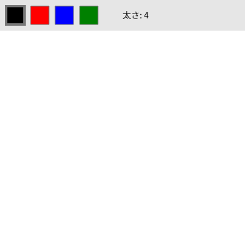

インタラクション
================

この章では、マウスやキーボードの操作に反応するスケッチの作り方を説明します。

状態を調べる方法とイベント関数
------------------------------

操作に反応する方法は 2 つあります。

.. list-table::
   :header-rows: 1
   :widths: 25 40 35

   * - 方法
     - 仕組み
     - 向いている処理
   * - システム変数を調べる
     - ``draw()`` の中で ``mouseIsPressed`` などの値を毎フレーム確認する。
     - 押している間ずっと続く処理
   * - イベント関数を定義する
     - ``mousePressed()`` などの関数を定義しておくと、操作が起きた瞬間に p5.js が呼び出す。
     - 1 回の操作に 1 回だけ反応する処理

たとえば、ボタンを押している間ずっと線を描くなら ``mouseIsPressed`` を、クリックするたびに色を切り替えるなら ``mousePressed()`` を使います。``draw()`` の中で ``mouseIsPressed`` を使って色を切り替えると、ボタンを押している間、毎フレーム切り替わってしまいます。

マウス
------

マウスに関するシステム変数とイベント関数を次の表に示します。

.. list-table::
   :header-rows: 1
   :widths: 35 65

   * - 名前
     - 内容
   * - ``mouseX``、``mouseY``
     - 現在のマウスの位置
   * - ``pmouseX``、``pmouseY``
     - 1 つ前のフレームでのマウスの位置
   * - ``mouseIsPressed``
     - マウスボタンが押されている間 ``true``
   * - ``mousePressed()``
     - マウスボタンが押された瞬間に呼ばれる。
   * - ``mouseReleased()``
     - マウスボタンが離された瞬間に呼ばれる。
   * - ``mouseDragged()``
     - ボタンを押したままマウスが動いたときに呼ばれる。
   * - ``mouseMoved()``
     - ボタンを押さずにマウスが動いたときに呼ばれる。

``line(pmouseX, pmouseY, mouseX, mouseY)`` のように前のフレームの位置と現在の位置を結ぶと、マウスを速く動かしても途切れない線を描けます。

当たり判定
----------

マウスが図形の上にあるかどうかを調べることを、:term:`当たり判定` と呼びます。

長方形の場合は、マウスの座標が長方形の範囲に入っているかを x と y のそれぞれで調べます。左上の角が :math:`(x, y)`、幅が :math:`w`、高さが :math:`h` の長方形では、次の条件を満たすときにマウスが長方形の上にあります。

.. math::

   x \le \mathrm{mouseX} \le x + w \quad \text{かつ} \quad y \le \mathrm{mouseY} \le y + h

円の場合は、マウスと円の中心との距離が半径以下かどうかで判定します。中心 :math:`(c_x, c_y)` とマウスとの距離 :math:`d` は次の式で求められ、p5.js では ``dist()`` 関数で計算できます。

.. math::

   d = \sqrt{(\mathrm{mouseX} - c_x)^2 + (\mathrm{mouseY} - c_y)^2}

.. code-block:: javascript
   :linenos:

   const d = dist(mouseX, mouseY, cx, cy);
   if (d <= diameter / 2) {
     fill(255, 0, 0);  // 円の上にマウスがあるときは赤く塗る
   } else {
     fill(255);
   }
   circle(cx, cy, diameter);

キーボード
----------

キーボードに関するシステム変数とイベント関数を次の表に示します。

.. list-table::
   :header-rows: 1
   :widths: 35 65

   * - 名前
     - 内容
   * - ``key``
     - 最後に押されたキーを表す文字列。英字は ``'a'``、矢印キーは ``'ArrowUp'`` のようになる。
   * - ``keyIsPressed``
     - いずれかのキーが押されている間 ``true``
   * - ``keyIsDown(キー)``
     - 指定したキーが押されているかどうかを返す。複数のキーの同時押しを調べるときに使う。
   * - ``keyPressed()``
     - キーが押された瞬間に呼ばれる。
   * - ``keyReleased()``
     - キーが離された瞬間に呼ばれる。

``key`` の値は、ブラウザーの ``KeyboardEvent.key`` と同じ文字列です。矢印キーは ``'ArrowUp'``、``'ArrowDown'``、``'ArrowLeft'``、``'ArrowRight'``、Enter キーは ``'Enter'``、スペースキーは ``' '``\ （半角空白 1 文字）になります。

ウィンドウの大きさに合わせる
----------------------------

キャンバスをブラウザーのウィンドウいっぱいに広げたいときは、システム変数 ``windowWidth`` と ``windowHeight`` を使います。ウィンドウの大きさが変わったときに呼ばれる ``windowResized()`` の中で ``resizeCanvas()`` を呼ぶと、キャンバスの大きさが追従します。

.. code-block:: javascript
   :linenos:

   function setup() {
     createCanvas(windowWidth, windowHeight);
   }

   function windowResized() {
     resizeCanvas(windowWidth, windowHeight);
   }

サンプル
--------

マウスで線を描くお絵かきツールです。上部のボタンで色を切り替え、キーボードで線の太さの変更、消去、保存ができます。

.. literalinclude:: ../examples/ch08_paint/sketch.js
   :language: javascript
   :linenos:
   :caption: ch08_paint/sketch.js

* `実行する <examples/ch08_paint/index.html>`__
* ダウンロード：:download:`index.html <../examples/ch08_paint/index.html>`、:download:`sketch.js <../examples/ch08_paint/sketch.js>`

   サンプルの実行結果（起動直後）

このスケッチは、2 つの方法を使い分けています。線を描く処理は押している間ずっと続くため、``draw()`` の中で ``mouseIsPressed`` を調べています（23 行目）。色の切り替えはクリック 1 回につき 1 回だけ行うため、``mousePressed()`` で処理しています（57〜67 行目）。

``draw()`` の中で ``background()`` を呼んでいない点にも注目してください。背景を毎フレーム塗りつぶさないため、描いた線がキャンバスに残ります。上部のボタンの領域だけは、選択中の色の枠を描き直すため、``drawPalette()`` で毎フレーム塗りつぶしています。
