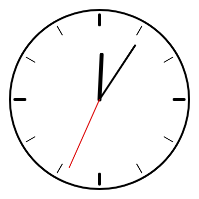

座標変換
========

この章では、座標系そのものを移動・回転・拡大縮小する :term:`座標変換` を説明します。座標変換を使うと、回転した図形や、同じ形を繰り返し配置した図形を簡単に描けます。

座標変換の関数
--------------

.. list-table::
   :header-rows: 1
   :widths: 30 70

   * - 関数
     - 動作
   * - ``translate(x, y)``
     - 原点を :math:`(x, y)` に移動する。
   * - ``rotate(角度)``
     - 原点を中心に座標系を回転する。
   * - ``scale(s)``
     - 原点を中心に座標系を :math:`s` 倍に拡大縮小する。``scale(sx, sy)`` とすると、x 方向と y 方向で別の倍率を指定できる。

これらの関数は、図形を動かすのではなく、図形を描く「方眼紙」のほうを動かすものと考えると分かりやすくなります。座標変換の後に描いた図形は、変換された座標系の上に描かれます。

.. code-block:: javascript
   :linenos:

   translate(200, 200);  // 原点をキャンバスの中心に移す
   rect(0, 0, 50, 50);   // キャンバス上では (200, 200) の位置に描かれる

座標変換は、呼び出すたびに積み重なります。たとえば ``translate(100, 0)`` を 2 回呼ぶと、原点は合計で 200 ピクセル右に移動します。積み重なった変換は、``draw()`` が呼ばれるたびに最初の状態に戻ります。

回転
----

``rotate()`` は常に原点を中心に回転します。そのため、図形をその場で回転させたいときは、先に ``translate()`` で原点を図形の中心に移してから ``rotate()`` を呼びます。

.. code-block:: javascript
   :linenos:

   translate(200, 200);   // 回転の中心に原点を移す
   rotate(frameCount * 0.02);
   rectMode(CENTER);
   rect(0, 0, 100, 100);  // 原点を中心に正方形を描く

座標系を角度 :math:`\theta` だけ回転すると、変換前の座標系での点 :math:`(x, y)` は、キャンバス上では次の点 :math:`(x', y')` に描かれます。

.. math::

   \begin{pmatrix} x' \\ y' \end{pmatrix}
   =
   \begin{pmatrix} \cos\theta & -\sin\theta \\ \sin\theta & \cos\theta \end{pmatrix}
   \begin{pmatrix} x \\ y \end{pmatrix}

これは数学でおなじみの回転行列です。ただし、キャンバスの y 軸は下向きであるため、:math:`\theta` が正のとき、図形は画面上で時計回りに回転します。

角度の単位は、:doc:`05_shapes` で説明したとおり、既定ではラジアンです。``angleMode(DEGREES)`` を呼ぶと、度数法で指定できます。

状態の保存と復元
----------------

複数の図形を、それぞれ別の位置や角度で描きたい場合があります。このとき、変換が積み重なったままだと、後の図形が前の図形の変換の影響を受けてしまいます。

``push()`` と ``pop()`` を使うと、この問題を避けられます。``push()`` は現在の状態を保存し、``pop()`` は最後に ``push()`` で保存した状態に戻します。

.. code-block:: javascript
   :linenos:

   push();
   translate(100, 100);
   rotate(QUARTER_PI);
   fill(255, 0, 0);
   rect(0, 0, 50, 50);  // 回転した赤い正方形
   pop();

   rect(0, 0, 50, 50);  // 変換も色も元に戻っている

保存されるのは座標変換だけではありません。``fill()``、``stroke()``、``strokeWeight()``、``colorMode()`` などのスタイルの設定も保存・復元されます。``push()`` と ``pop()`` は必ず対にして使います。

サンプル
--------

座標変換を使って描いたアナログ時計です。目盛りと針は、どれも「真上に向かう線」を回転させて描いています。

.. literalinclude:: ../examples/ch09_clock/sketch.js
   :language: javascript
   :linenos:
   :caption: ch09_clock/sketch.js

* `実行する <examples/ch09_clock/index.html>`__
* ダウンロード：:download:`index.html <../examples/ch09_clock/index.html>`、:download:`sketch.js <../examples/ch09_clock/sketch.js>`

   サンプルの実行結果

10 行目で原点をキャンバスの中心に移しているため、以降は時計の中心を :math:`(0, 0)` として描けます。目盛りを描く 19〜25 行目では、``push()`` と ``pop()`` で囲むことで、1 本ごとに回転を元に戻しています。囲まずに ``rotate(i * 30)`` を繰り返すと、回転が積み重なり、目盛りの間隔がずれてしまいます。

針の角度は、``hour()``、``minute()``、``second()`` で得た現在時刻から求めています。時針が 1 時間で 30 度、分針と秒針が 1 単位で 6 度進むことを利用しています。
