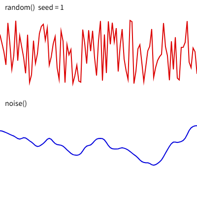

乱数とノイズ
============

この章では、``random()`` と ``noise()`` を使って、作品に偶然性や自然なゆらぎを加える方法を説明します。プログラムで作品を生成する :term:`ジェネラティブアート` では、この 2 つの関数が欠かせません。

乱数
----

``random()`` は、呼び出すたびに異なる値を返します。引数によって返す値が変わります。

.. list-table::
   :header-rows: 1
   :widths: 35 65

   * - 書き方
     - 返す値
   * - ``random()``
     - 0 以上 1 未満の数
   * - ``random(max)``
     - 0 以上 ``max`` 未満の数
   * - ``random(min, max)``
     - ``min`` 以上 ``max`` 未満の数
   * - ``random(配列)``
     - 配列からランダムに選んだ要素

返す値は整数ではなく小数です。整数が必要なときは、``floor(random(6)) + 1``\ （1〜6 の整数）のように ``floor()`` で切り捨てます。

``randomSeed()`` で乱数の :term:`種`\ （シード）を固定すると、実行するたびに同じ乱数の列が得られます。気に入った結果を再現したいときや、不具合を調べるときに使います。

ノイズ
------

``random()`` の値は、前に返した値と無関係に決まります。そのため、値を並べるとギザギザになり、雲の形や地形、ゆっくり漂う動きのような、自然で滑らかな変化は表現できません。

このような変化を表現するには ``noise()`` を使います。``noise()`` は :term:`パーリンノイズ` と呼ばれる値を返す関数で、次の性質があります。

* 返す値は 0 以上 1 以下である。
* 同じ引数に対しては、常に同じ値を返す。
* 引数が少し変わると、返す値も少しだけ変わる。

``noise()`` を使うときは、引数を少しずつ変えながら呼び出します。引数の変化量（刻み幅）によって、変化の細かさが決まります。

.. list-table::
   :header-rows: 1
   :widths: 30 70

   * - 刻み幅
     - 変化の様子
   * - 0.005 程度
     - 非常にゆっくり、なだらかに変化する。
   * - 0.01〜0.03 程度
     - 適度な起伏がある。
   * - 0.1 以上
     - 細かく変化し、乱数に近くなる。

``noise(x, y)`` のように 2 つの引数を渡すと、平面上で滑らかに変化する値が得られます。地形や雲の模様を描くときに使います。乱数と同様に、``noiseSeed()`` で種を固定できます。

ノイズで動かす
--------------

ノイズの引数に時間を使うと、ゆらゆらと漂うような動きを作れます。次のコードは、円を画面内でランダムに、しかし滑らかに動かします。

.. code-block:: javascript
   :linenos:

   function setup() {
     createCanvas(400, 400);
   }

   function draw() {
     background(255, 20);  // 半透明の背景で軌跡を少し残す
     const t = frameCount * 0.01;
     const x = noise(t) * width;
     const y = noise(t + 1000) * height;  // x とは離れた位置のノイズを使う
     circle(x, y, 20);
   }

8 行目と 9 行目で同じ ``t`` をそのまま使うと、x と y が同じ値になり、円は対角線上しか動きません。9 行目では引数に 1000 を加え、x とは無関係なノイズの値を使っています。

``map()`` を使うと、ノイズの値を任意の範囲に変換できます。``map(値, 元の最小値, 元の最大値, 新しい最小値, 新しい最大値)`` の形で使い、たとえば ``map(n, 0, 1, 100, 300)`` は 0〜1 の値 ``n`` を 100〜300 の範囲に変換します。

サンプル
--------

``random()`` と ``noise()`` の値を折れ線グラフにして比べるサンプルです。キャンバスをクリックすると、種を変えて描き直します。

.. literalinclude:: ../examples/ch10_noise/sketch.js
   :language: javascript
   :linenos:
   :caption: ch10_noise/sketch.js

* `実行する <examples/ch10_noise/index.html>`__
* ダウンロード：:download:`index.html <../examples/ch10_noise/index.html>`、:download:`sketch.js <../examples/ch10_noise/sketch.js>`

   サンプルの実行結果

上段の ``random()`` の折れ線は激しく上下しますが、下段の ``noise()`` の折れ線は滑らかにつながっています。``draw()`` の最初で種を設定しているため、同じ種であれば何度描き直しても同じ形になります。
