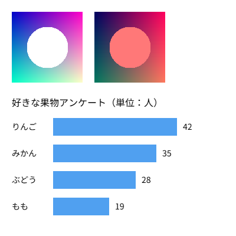

画像・テキスト・外部データ
==========================

この章では、画像や JSON などの外部ファイルを読み込む方法と、キャンバスに文字を表示する方法を説明します。

非同期の読み込み
----------------

外部ファイルの読み込みには時間がかかります。JavaScript では、時間のかかる処理が終わるのを待たずに次の処理に進む :term:`非同期処理` が基本です。読み込み関数は、ファイルの中身ではなく、「後で結果が届く」ことを表す :term:`Promise` を返します。

p5.js 2.x では、``setup()`` を ``async`` 関数として定義し、読み込み関数の前に ``await`` を付けて結果を待ちます。

.. code-block:: javascript
   :linenos:

   let img;

   async function setup() {
     createCanvas(400, 400);
     img = await loadImage('image.png');  // 読み込みが終わるまで待つ
   }

   function draw() {
     image(img, 0, 0);
   }

``await`` を付けると、読み込みが終わるまで次の行に進みません。p5.js は ``setup()`` の処理が終わるまで ``draw()`` を呼ばないため、``draw()`` の中では読み込み済みの画像を安全に使えます。

Python の ``asyncio`` を使ったことがあれば、``async`` と ``await`` の役割は同じだと考えてかまいません。

.. note::

   p5.js 1.x では、読み込み処理を ``preload()`` という関数の中に書いていました。``preload()`` は p5.js 2.0 で廃止されたため、1.x 向けの記事のコードはそのままでは動きません。詳しくは :doc:`appendix_a_versions` を参照してください。

主な読み込み関数を次の表に示します。

.. list-table::
   :header-rows: 1
   :widths: 30 70

   * - 関数
     - 読み込む内容
   * - ``loadImage(パス)``
     - PNG や JPEG などの画像
   * - ``loadJSON(パス)``
     - JSON ファイル。JavaScript のオブジェクトまたは配列として返す。
   * - ``loadStrings(パス)``
     - テキストファイル。1 行を 1 要素とする文字列の配列として返す。
   * - ``loadFont(パス)``
     - フォントファイル

外部ファイルを読み込むスケッチは、``file://`` で開くとブラウザーのセキュリティ制限によって読み込みに失敗します。:doc:`02_setup` で説明したローカルサーバーを使って開いてください。

画像の表示
----------

読み込んだ画像は ``image()`` で表示します。

.. list-table::
   :header-rows: 1
   :widths: 35 65

   * - 書き方
     - 動作
   * - ``image(img, x, y)``
     - 左上の角を :math:`(x, y)` として、元の大きさで表示する。
   * - ``image(img, x, y, w, h)``
     - 幅 :math:`w`、高さ :math:`h` に拡大縮小して表示する。
   * - ``tint(色)``
     - 以降に表示する画像に色をかける。透明度も指定できる。
   * - ``noTint()``
     - ``tint()`` の効果を解除する。

画像の幅と高さは ``img.width`` と ``img.height`` で取得できます。

テキストの表示
--------------

キャンバスに文字を表示するには ``text()`` を使います。文字の色は ``fill()`` で指定します。

.. list-table::
   :header-rows: 1
   :widths: 35 65

   * - 関数
     - 動作
   * - ``text(文字列, x, y)``
     - 指定した位置に文字列を表示する。
   * - ``textSize(大きさ)``
     - 文字の大きさをピクセル単位で設定する。
   * - ``textAlign(横, 縦)``
     - 文字の揃え方を設定する。横は ``LEFT``、``CENTER``、``RIGHT``、縦は ``TOP``、``CENTER``、``BOTTOM``、``BASELINE`` から選ぶ。
   * - ``textFont(フォント)``
     - フォントを設定する。``'serif'`` などのフォント名か、``loadFont()`` で読み込んだフォントを指定する。

既定では、``text()`` の y 座標は文字のベースライン（欧文の文字が乗る線）の位置を表します。

サンプル
--------

画像と JSON ファイルを読み込み、画像の表示と、JSON のデータから作った横棒グラフの表示を行うサンプルです。

.. literalinclude:: ../examples/ch12_media/sketch.js
   :language: javascript
   :linenos:
   :caption: ch12_media/sketch.js

読み込む JSON ファイルの内容は次のとおりです。

.. literalinclude:: ../examples/ch12_media/data.json
   :language: json
   :linenos:
   :caption: ch12_media/data.json

* `実行する <examples/ch12_media/index.html>`__\ （ローカルサーバーまたは Web サーバー上で開いた場合のみ動作します）
* ダウンロード：:download:`index.html <../examples/ch12_media/index.html>`、:download:`sketch.js <../examples/ch12_media/sketch.js>`、:download:`data.json <../examples/ch12_media/data.json>`、:download:`image.png <../examples/ch12_media/image.png>`

   サンプルの実行結果

``loadJSON()`` で読み込んだデータは、通常の JavaScript のオブジェクトとして扱えます。31 行目の ``data.title`` や、35 行目の ``data.items.forEach()`` のように、JSON の構造どおりにアクセスします。
