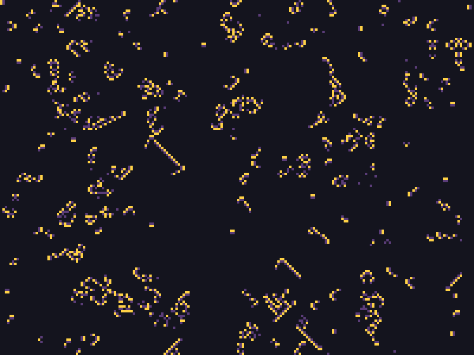
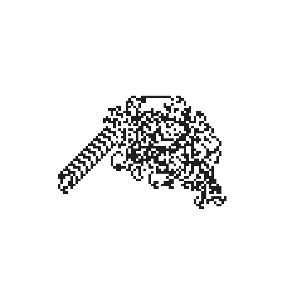
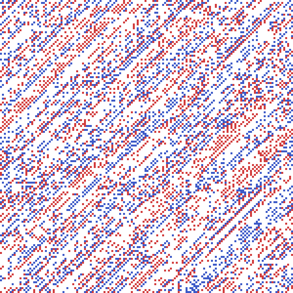
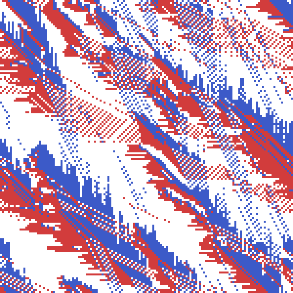

セルオートマトンと反応拡散系
==============================

1 次元セルオートマトン
------------------------

**セルオートマトン**\ （Cellular Automaton）は、格子状に並んだ「セル」がそれぞれ有限個の状態を持ち、次の世代の状態が自身と近傍セルの現在の状態だけから決まる、というモデルである。個々のルールは単純でも、格子全体では複雑な模様が生まれる点で、L-system や IFS と同じ「単純な規則の反復から複雑さが生まれる」というフラクタルの精神を共有している。

Stephen Wolfram が分類した\ **初等セルオートマトン**\ は、1 次元に並んだ 0/1 の 2 状態セルを対象とし、次の世代のあるセルの状態は、自分自身と両隣（合計 3 セル、8 通りの組み合わせ）だけから決まる。8 通りの組み合わせそれぞれについて次の状態を 0/1 で指定すると、8 ビット、つまり 0-255 の\ **ルール番号**\ で全ての規則を表現できる。

.. literalinclude:: ../examples/automata.py
   :linenos:
   :language: python
   :pyobject: elementary_ca
   :caption: examples/automata.py の elementary_ca 関数

世代を 1 行ずつ積み重ねて画像にすると、ルール 30 は一見ランダムに見える模様を、ルール 90 は\ :doc:`fractals`\ の IFS で見たシェルピンスキーの三角形と全く同じ模様を作る（ルール 30 が生む模様は、実際に Mathematica の乱数生成器の 1 つとしても使われている）。ルール 90 は「両隣の XOR（排他的論理和）」という規則にすぎないが、それだけで自己相似な三角形が現れるのは興味深い。

.. image:: _static/gallery/ca_rule30.png
   :alt: ルール 30 による 1 次元セルオートマトンの時空間図。カオス的な模様
   :width: 400px

.. image:: _static/gallery/ca_rule90.png
   :alt: ルール 90 による 1 次元セルオートマトンの時空間図。シェルピンスキーの三角形と同じ模様になる
   :width: 400px

2 次元セルオートマトン（ライフゲーム）
----------------------------------------

John Conway の\ **ライフゲーム**\ （Game of Life）は、2 次元格子上のセルオートマトンで、周囲 8 マスの生死数だけから次の世代が決まる。

- 死んでいるセルは、周囲にちょうど 3 つ生きたセルがあれば誕生する。
- 生きているセルは、周囲に 2 つか 3 つ生きたセルがあれば生存し、それ以外（過疎・過密）では死滅する。

.. literalinclude:: ../examples/automata.py
   :linenos:
   :language: python
   :pyobject: life_step
   :caption: examples/automata.py の life_step 関数

周囲 8 方向の生死を数える処理は、8 方向ぶんだけ ``np.roll`` でずらした格子を足し合わせるだけで実装できる。:doc:`fractals`\ のマンデルブロ集合と同じく、ループを回すのは固定回数（ここでは 8 方向）ぶんだけで、その中身は格子全体への NumPy 演算なので、格子が大きくなってもループの回数自体は変わらない。

本資料は静止画を中心とした資料であるため、ここでは各世代を薄れさせながら重ね合わせることで、動きの軌跡を 1 枚の静止画として捉える（同じ発想は、後の\ :doc:`particles`\ で扱うパーティクルの軌跡表現にも登場する）。世代の進行をそのままアニメーションとして書き出す方法は、:ref:`animation`\ で扱う。

.. literalinclude:: ../examples/automata.py
   :linenos:
   :language: python
   :pyobject: render_life_trail
   :caption: examples/automata.py の render_life_trail 関数

ランダムに撒いた初期状態から 150 世代進めた軌跡は、次のようになる。安定した図形（ブロックなど）や周期的に振動する図形はくっきりと残り、消えていった部分は淡い影として残る。

.. image:: _static/gallery/life_trail.png
   :alt: ライフゲームを 150 世代分、指数的に減衰させながら重ね合わせた軌跡の可視化
   :width: 400px

多様なセルオートマトン
--------------------------

ライフゲームは「周囲 8 マスの生死数」という近傍だけを見る規則の一例に過ぎず、状態の種類や近傍の解釈を変えるだけで、性質のまったく異なるセルオートマトンを数多く作れる。ここでは 3 つの代表例を見る。

**Brian's Brain** は、ライフゲームの 2 状態（死・生）を、死 (0)・発火 (1)・消えかけ (2) の 3 状態に増やしたセルオートマトンである。死んでいるセルは周囲 8 マスにちょうど 2 つ発火セルがあれば新たに発火するが、発火セルは近傍によらず必ず消えかけに移り、消えかけのセルは近傍によらず必ず死に戻る。ライフゲームの「生存」に相当する状態がなく、発火したセルは 1 世代後には必ず消えてしまうため、模様は決して静止せず走り続ける。

.. literalinclude:: ../examples/automata.py
   :linenos:
   :language: python
   :pyobject: brians_brain_step
   :caption: examples/automata.py の brians_brain_step 関数

ランダムな初期状態から 40 世代進めると、あちこちに小さな渦や、火花が尾を引くように移動する断片（グライダー）が同時多発的に生まれ、消えてはまた新しい発火が起こる、絶えず動き続ける模様になる。

**ラングトンの蟻**\ （Langton's ant）は、格子全体を一括更新するここまでの規則とは違い、盤面上を 1 匹の「蟻」が歩き回りながら盤面を書き換える。蟻は現在いるマスの色に応じて「白マスなら右に 90 度回頭し、マスを黒く塗ってから前進する」「黒マスなら左に 90 度回頭し、マスを白く塗ってから前進する」という規則にただ従うだけである。

.. literalinclude:: ../examples/automata.py
   :linenos:
   :language: python
   :pyobject: langtons_ant
   :caption: examples/automata.py の langtons_ant 関数

各ステップの結果が直前の盤面と蟻の位置・向きの両方に依存する逐次処理のため、ライフゲームのように盤面全体を NumPy 演算だけで一括更新することはできない。最初の 1 万歩ほどは無秩序な模様が広がるだけだが、ある時点を境に、それまでの無秩序さが嘘のように、盤面の外側へ向かって斜めに伸び続ける規則的な「ハイウェイ」模様に落ち着く。単純な局所規則から、無秩序な過渡状態を経て秩序だった構造が現れるという意味で、反応拡散系のパターン形成とも通じるものがある。

**BML 交通モデル**\ （Biham-Middleton-Levine model）は、格子上の車の流れを模した 2 状態ならぬ 3 状態（空・右へ進む赤い車・下へ進む青い車）のセルオートマトンである。1 世代を「赤い車だけが動く半ステップ」と「青い車だけが動く半ステップ」の 2 段階に分け、それぞれの半ステップでは、進行方向のマスが空いている車だけが 1 マス前進する。

.. literalinclude:: ../examples/automata.py
   :linenos:
   :language: python
   :pyobject: bml_traffic_step
   :caption: examples/automata.py の bml_traffic_step 関数

同じ半ステップで動く車はみな同じ方向へ 1 マスずれるだけなので、複数の車が同じ行き先を奪い合うことはなく、「1 マス先が空いているか」を ``np.roll`` で判定するだけで全車を同時に動かせる。車の密度を変えて同じステップ数だけ進めると、密度が低いうちは車どうしがほとんどぶつからずに流れ続ける一方、ある密度を境に、盤面のどこかで生じた渋滞が二度と解消されずに全体が完全に停止してしまう。この急激な変化は\ **ジャム相転移**\ と呼ばれ、水が氷になるような物理的な相転移と同じ枠組みで研究されている。

反応拡散系
------------

セルオートマトンが「離散的な状態を持つ格子」を扱うのに対し、**反応拡散系**\ （reaction-diffusion system）は「連続的な濃度を持つ格子」を扱う、いわば連続版のセルオートマトンである。2 種類の化学物質 U・V が格子上を拡散しながら反応する様子をシミュレートすると、条件次第でヒョウ柄・サンゴ状・迷路状といった、生物の模様によく似た模様が自己組織化的に現れる（**Turing パターン**\ とも呼ばれ、実際の生物の体表模様の形成理論としても知られる）。

**Gray-Scott モデル**\ は、次の反応拡散方程式で表される。U はどこでも一定の割合 ``feed`` で補充され、V は ``feed + kill`` の割合で常に取り除かれる。U と V が同じ場所にあると、V が U を消費して自分を複製する（``u v^2`` の反応項）。

.. math::

   \frac{\partial u}{\partial t} = D_u \nabla^2 u - u v^2 + f (1 - u)

.. math::

   \frac{\partial v}{\partial t} = D_v \nabla^2 v + u v^2 - (f + k) v

離散化した格子上では、ラプラシアン :math:`\nabla^2` は上下左右の隣接セルとの差の合計（5 点ステンシル）として計算できる。

.. literalinclude:: ../examples/reaction_diffusion.py
   :linenos:
   :language: python
   :pyobject: laplacian
   :caption: examples/reaction_diffusion.py の laplacian 関数

.. literalinclude:: ../examples/reaction_diffusion.py
   :linenos:
   :language: python
   :pyobject: gray_scott_step
   :caption: examples/reaction_diffusion.py の gray_scott_step 関数

``feed`` と ``kill`` の組み合わせだけで、模様の種類ががらりと変わる。種を 1 箇所だけに置くと模様が完全に対称なまま成長が止まってしまうことがあるため、ランダムな位置に複数の種を撒いて対称性を崩している。

.. literalinclude:: ../examples/reaction_diffusion.py
   :linenos:
   :language: python
   :pyobject: simulate_gray_scott
   :caption: examples/reaction_diffusion.py の simulate_gray_scott 関数

.. image:: _static/gallery/reaction_diffusion_coral.png
   :alt: Gray-Scott モデルによるサンゴ状（迷路状）のパターン
   :width: 300px

.. image:: _static/gallery/reaction_diffusion_mitosis.png
   :alt: Gray-Scott モデルによる水玉状のパターン
   :width: 300px

.. image:: _static/gallery/reaction_diffusion_worms.png
   :alt: Gray-Scott モデルによるミミズ状のパターン
   :width: 300px

セルオートマトンが 1 ステップごとに 0/1 が確定する離散的な更新なのに対し、反応拡散系は微小時間ごとに連続的に値が変化していく点が対照的である。しかし、どちらも「近傍だけを見る単純な更新規則を格子全体に適用し続ける」という共通の骨格を持ち、その繰り返しから複雑で有機的な模様が自己組織化してくるという性質は変わらない。

自己組織化によって縞状・波状の模様が現れる現象は、化学反応に限らない。**飛砂**\ （aeolian sand transport）、つまり風が地表の砂粒を巻き上げて運ぶ現象でも、風上側の斜面を転がり上がった砂粒が風下側の斜面から滑り落ちる（**アバランチ**）という局所的なやり取りだけから、風紋や砂丘といった周期的な模様が自己組織化的に生まれることが知られている。ただし、この現象を素直にモデル化するには、Gray-Scott モデルのように「その場に留まったまま濃度が拡散する」規則だけでは不十分で、砂粒が風下側へ実際に移動する（輸送される）過程や、斜面の傾きが急になりすぎると崩れるアバランチの規則を別途組み込む必要があり、反応拡散系よりも一段複雑なモデルになる。本資料では実装を割愛するが、「近傍だけを見る単純な規則の反復から、縞や波のような秩序だった模様が自己組織化的に現れる」という反応拡散系の本質は、化学反応にも砂粒の輸送にも共通して見られる普遍的な現象である。
