ギャラリー
==========

本資料中で生成した画像と、その生成コードへのリンクを一覧にする。NumPy・Pillow・matplotlib がインストールされた環境であれば、各画像の生成コードは ``python examples/<ファイル名>`` として直接実行できる。

基礎編
------

詳しい解説は\ :doc:`../basics`\ を参照。

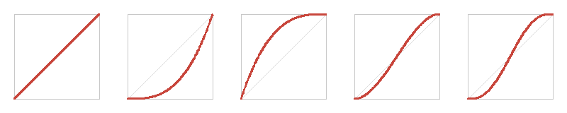

代表的なイージング関数のグラフ。:download:`examples/easing.py <../../examples/easing.py>` の ``render_easing_curves`` 関数。

同じ 2 色の間をイージング関数ごとに補間したグラデーション。:download:`examples/easing.py <../../examples/easing.py>` の ``render_eased_gradient`` 関数。

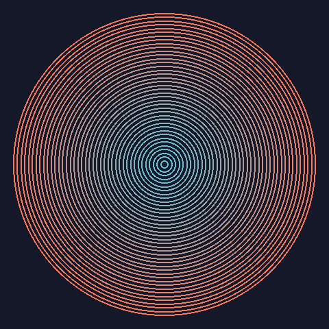

半径を等間隔に取った同心円。:download:`examples/easing.py <../../examples/easing.py>` の ``render_eased_rings`` 関数。

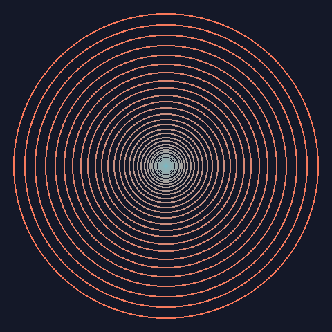

半径を ease-in で決めた同心円。:download:`examples/easing.py <../../examples/easing.py>` の ``render_eased_rings`` 関数。

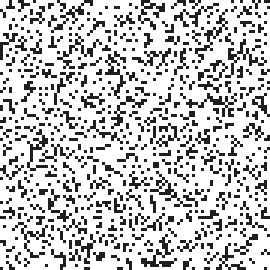

ライフゲームの世代の進行を書き出したアニメーション GIF。:download:`examples/animation.py <../../examples/animation.py>` の ``life_frames`` 関数。

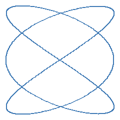

リサージュ曲線の位相を動かしたループアニメーション GIF。:download:`examples/animation.py <../../examples/animation.py>` の ``lissajous_loop_frames`` 関数。

色彩設計
----------

詳しい解説は\ :doc:`../color`\ を参照。

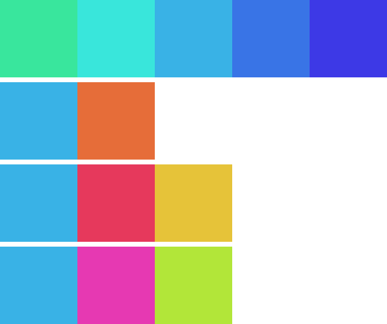

HSB の色相オフセットから機械的に生成した 4 種類の配色パターン。:download:`examples/palette.py <../../examples/palette.py>`

同じ色相のまま PCCS の 12 トーン（彩度・明度の組み合わせ）を変化させたトーンオントーン配色。:download:`examples/palette.py <../../examples/palette.py>`

トーンを 1 つに固定し、色相だけを変化させたトーンイントーン配色。:download:`examples/palette.py <../../examples/palette.py>`

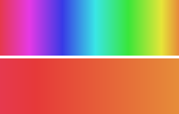

色相環を単純に線形補間した場合と、短い弧を通るように補間した場合のグラデーション比較。:download:`examples/palette.py <../../examples/palette.py>`

既存の生成画像（ジュリア集合）から ``Image.quantize`` で抽出した配色パレット。:download:`examples/palette.py <../../examples/palette.py>`

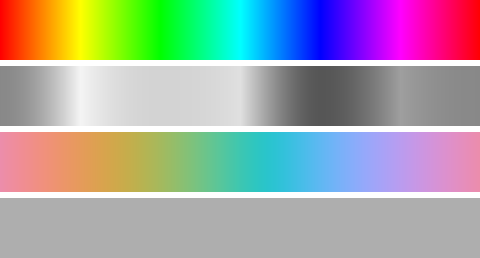

HSB と OKLCH で色相を 1 周させた帯と、それぞれの知覚的な明るさの比較。:download:`examples/oklab.py <../../examples/oklab.py>` の ``oklch_to_srgb`` 関数。

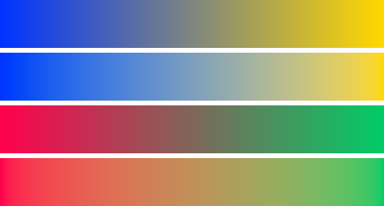

同じ 2 色の間を sRGB と OKLab で補間したグラデーションの比較。:download:`examples/oklab.py <../../examples/oklab.py>` の ``mix_oklab`` 関数。

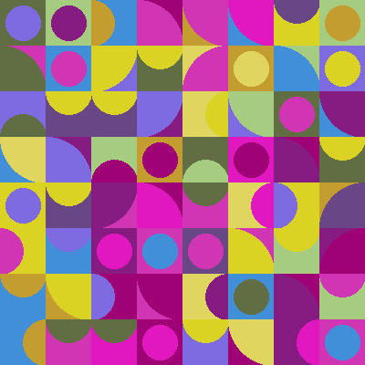

RGB の一様乱数で選んだ色で塗った模様。:download:`examples/color_pattern.py <../../examples/color_pattern.py>`

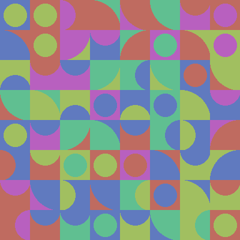

同じ模様をトーンイントーンの配色で塗ったもの。:download:`examples/color_pattern.py <../../examples/color_pattern.py>`

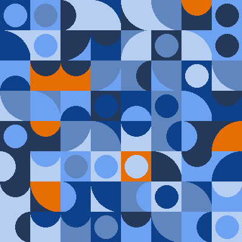

同じ模様を、青のトーンオントーンと橙の差し色で塗ったもの。:download:`examples/color_pattern.py <../../examples/color_pattern.py>` の ``render_pattern`` 関数。

タイリングパターン
--------------------

詳しい解説は\ :doc:`../tiling`\ を参照。

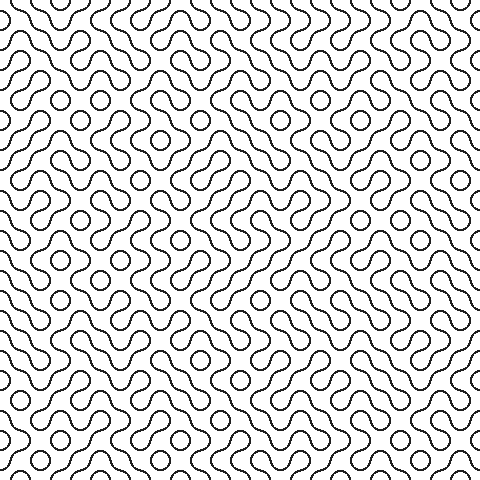

弧タイルをランダムな向きで敷き詰めたトルシェ・タイル。:download:`examples/truchet.py <../../examples/truchet.py>`

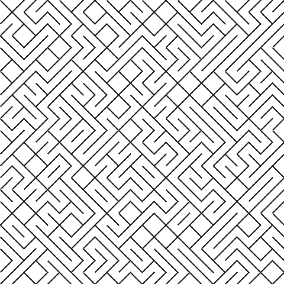

タイルの中身を対角線に変えたパターン。:download:`examples/truchet.py <../../examples/truchet.py>` の ``draw_diagonal_tile`` 関数。

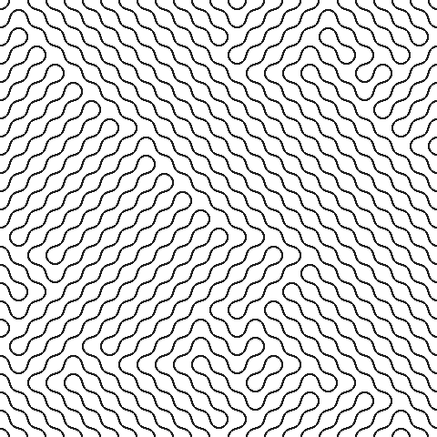

タイルの向きをパーリンノイズの符号で決めた、流れるような模様。:download:`examples/truchet.py <../../examples/truchet.py>` の ``render_noise_tiling`` 関数。

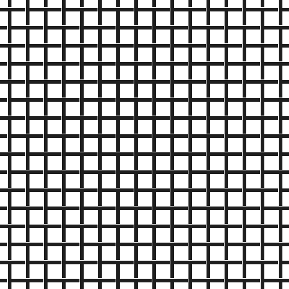

市松模様で上下を切り替えた編み込みパターン。:download:`examples/truchet.py <../../examples/truchet.py>` の ``draw_weave_tile`` 関数。

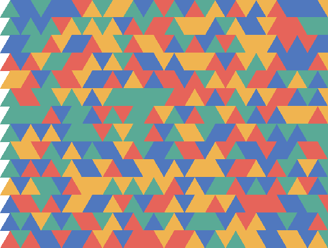

正三角形格子のモザイク。:download:`examples/polygon_tiling.py <../../examples/polygon_tiling.py>`

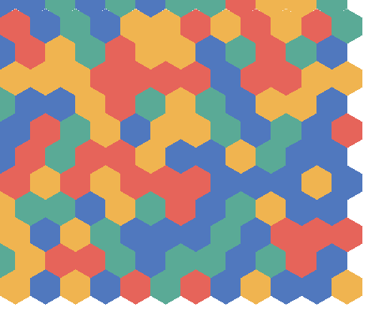

正六角形格子のモザイク。:download:`examples/polygon_tiling.py <../../examples/polygon_tiling.py>`

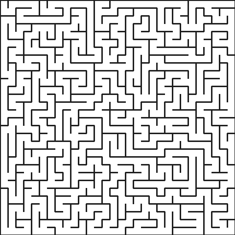

再帰的バックトラッキング法で生成した迷路。:download:`examples/maze.py <../../examples/maze.py>`

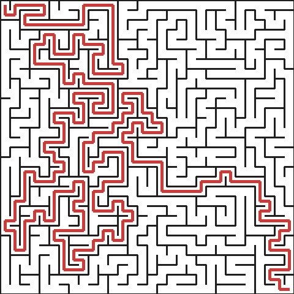

幅優先探索で求めた迷路の唯一の経路。:download:`examples/maze.py <../../examples/maze.py>` の ``solve_maze`` 関数。

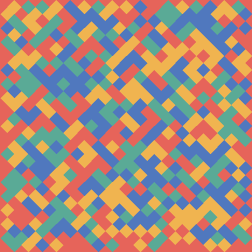

辺の制約を満たすように配置したワン・タイル。:download:`examples/wang_tiles.py <../../examples/wang_tiles.py>`

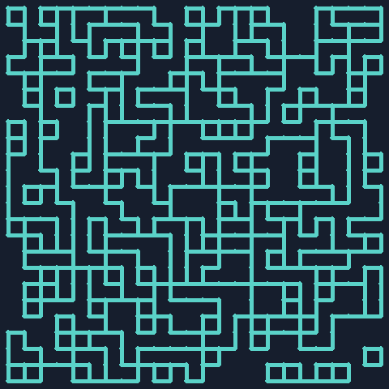

全てのタイルを同じ重みで選び、Wave Function Collapse で配置した配管。:download:`examples/wfc.py <../../examples/wfc.py>` の ``wave_function_collapse`` 関数。

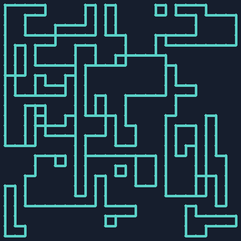

空白と直線のタイルを選びやすくして配置した配管。:download:`examples/wfc.py <../../examples/wfc.py>`

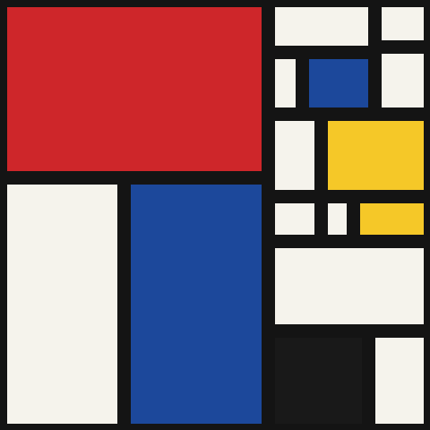

矩形の再帰的分割によるモンドリアン風の構成。:download:`examples/subdivision.py <../../examples/subdivision.py>` の ``split_rect`` 関数。

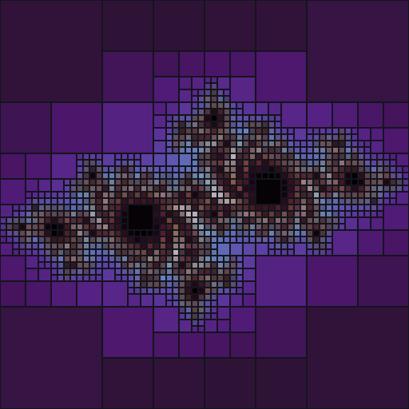

ジュリア集合の画像を四分木で分割したモザイク。:download:`examples/subdivision.py <../../examples/subdivision.py>` の ``quadtree`` 関数。

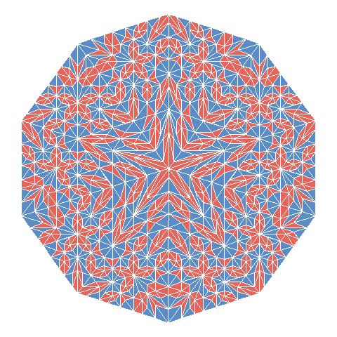

Robinson 三角形の細分割で構成した非周期のペンローズ・タイリング。:download:`examples/penrose.py <../../examples/penrose.py>`

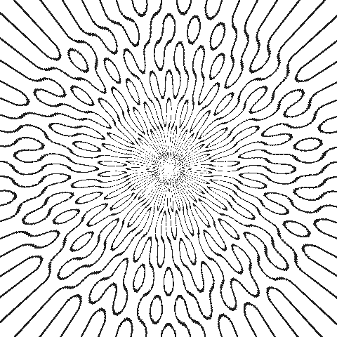

トルシェ・タイルの帯を極座標に読み替えた放射状パターン。:download:`examples/polar_remap.py <../../examples/polar_remap.py>`

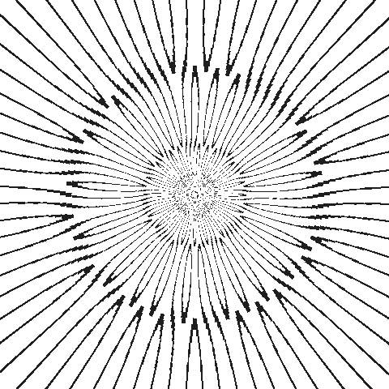

同じ帯を対数極座標に読み替えた画像。:download:`examples/polar_remap.py <../../examples/polar_remap.py>`

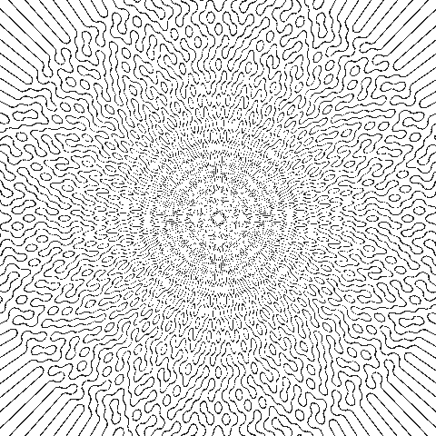

角度を 8 分割して回転方向に繰り返した模様。:download:`examples/symmetry.py <../../examples/symmetry.py>`

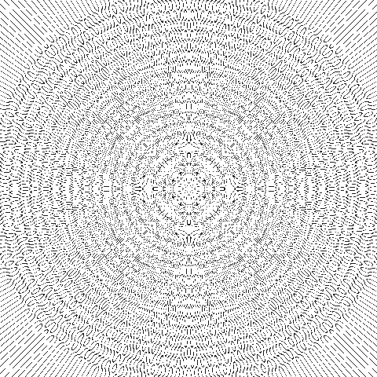

扇形の中点で鏡映してつないだ万華鏡模様。:download:`examples/symmetry.py <../../examples/symmetry.py>` の ``kaleidoscope_remap`` 関数（``mirror=True``）。

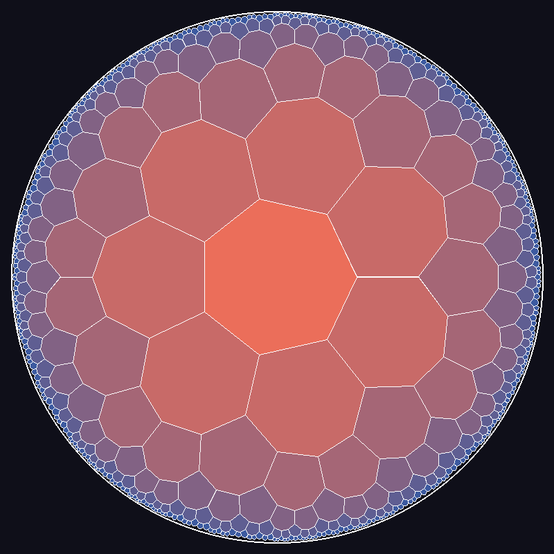

ポアンカレディスク模型による {7,3} 双曲タイリング。:download:`examples/hyperbolic_tiling.py <../../examples/hyperbolic_tiling.py>`

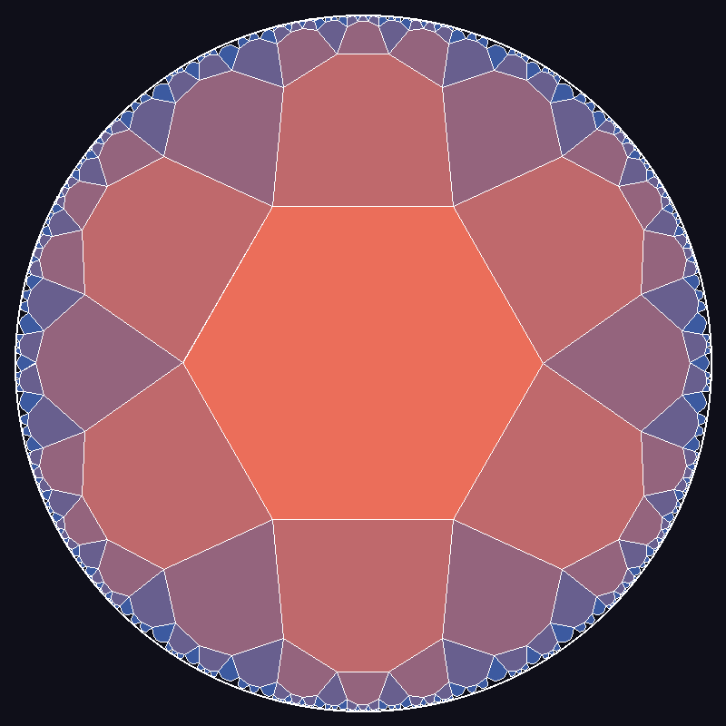

同じ仕組みで {6,4} に変えた双曲タイリング。:download:`examples/hyperbolic_tiling.py <../../examples/hyperbolic_tiling.py>`

螺旋と曲線
------------

詳しい解説は\ :doc:`../spirals`\ を参照。

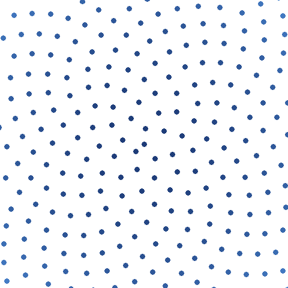

黄金角によるフィロタキシス配置。:download:`examples/phyllotaxis.py <../../examples/phyllotaxis.py>`

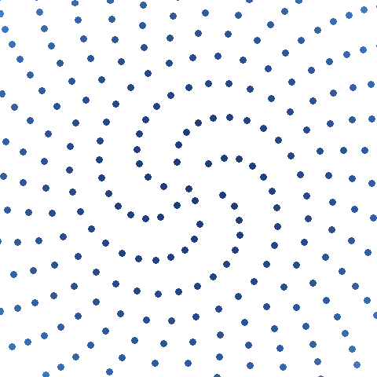

白銀比による回転角のフィロタキシス。渦状の腕が見える。:download:`examples/phyllotaxis.py <../../examples/phyllotaxis.py>`

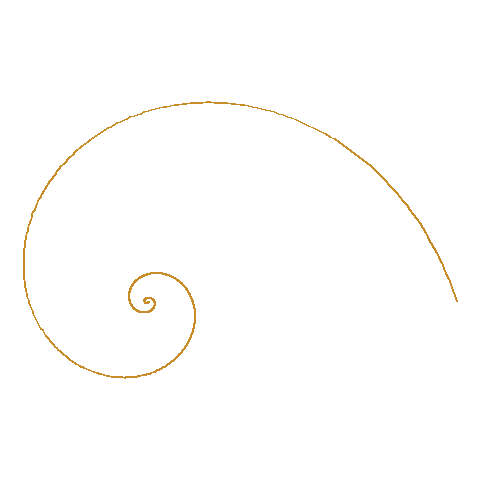

黄金比を成長率とした対数螺旋（黄金螺旋）。:download:`examples/polar_curves.py <../../examples/polar_curves.py>`

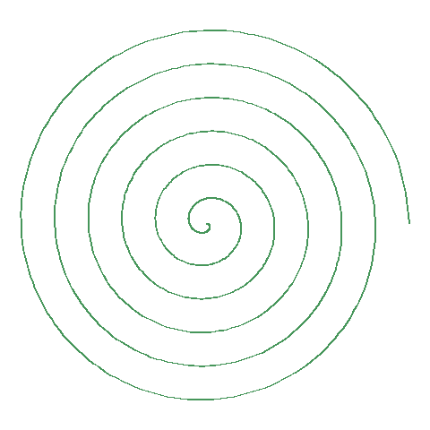

腕の間隔が一定なアルキメデスの螺旋。:download:`examples/polar_curves.py <../../examples/polar_curves.py>` の ``archimedean_spiral_points`` 関数。

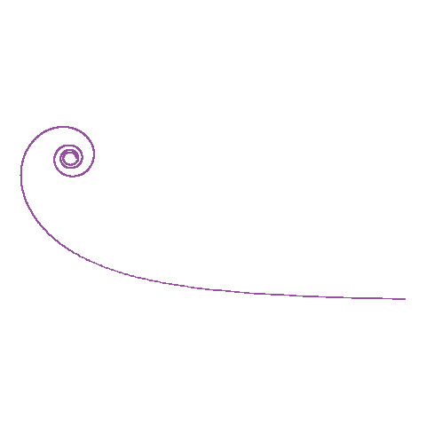

外側で直線に近づいていく双曲螺旋。:download:`examples/polar_curves.py <../../examples/polar_curves.py>` の ``hyperbolic_spiral_points`` 関数。

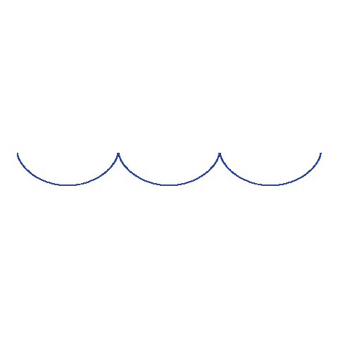

直線上を転がる円の軌跡、サイクロイド。:download:`examples/spirograph.py <../../examples/spirograph.py>`

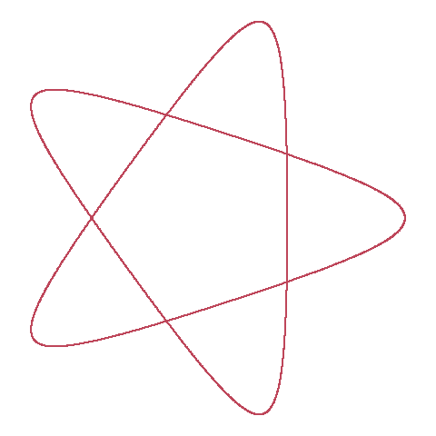

固定円の内側を転がる円によるハイポトロコイド。:download:`examples/spirograph.py <../../examples/spirograph.py>`

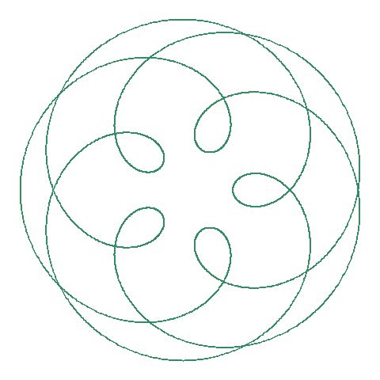

固定円の外側を転がる円によるエピトロコイド。:download:`examples/spirograph.py <../../examples/spirograph.py>`

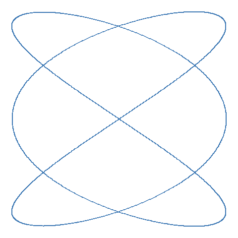

周波数比 3:2 のリサージュ曲線。:download:`examples/lissajous.py <../../examples/lissajous.py>`

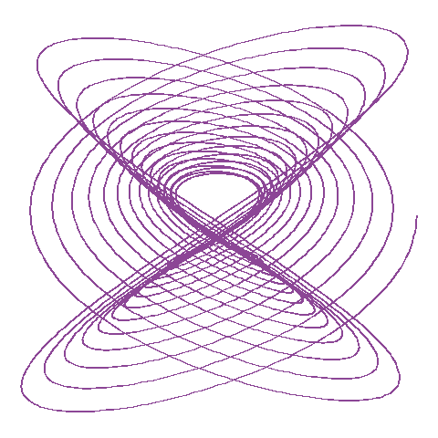

振幅を減衰させたハーモノグラフの軌跡。:download:`examples/lissajous.py <../../examples/lissajous.py>` の ``harmonograph_points`` 関数。

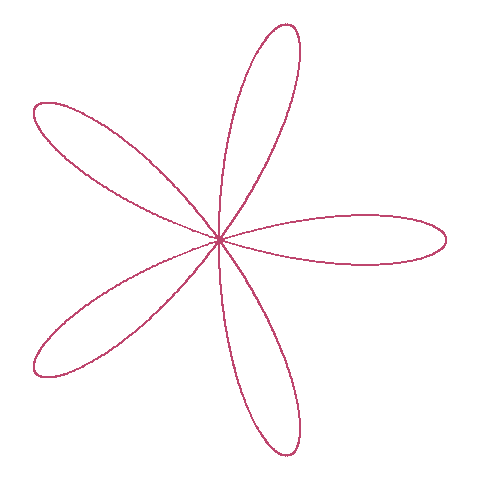

k=5 のバラ曲線（5 枚花びら）。:download:`examples/polar_curves.py <../../examples/polar_curves.py>` の ``rose_curve_points`` 関数。

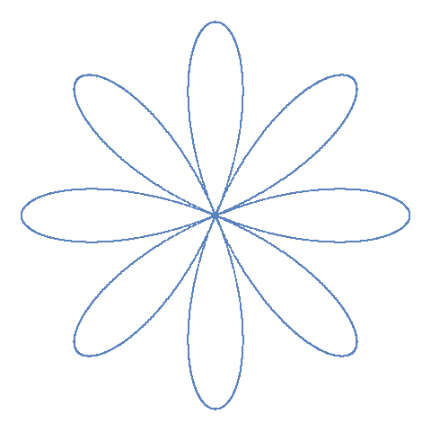

k=4 のバラ曲線（8 枚花びら）。:download:`examples/polar_curves.py <../../examples/polar_curves.py>` の ``rose_curve_points`` 関数。

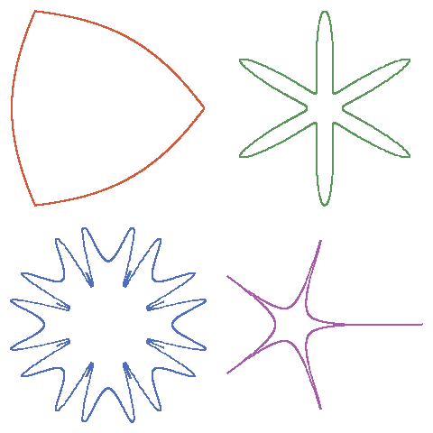

スーパーフォーミュラのパラメータ違いによる 4 種類の輪郭。:download:`examples/polar_curves.py <../../examples/polar_curves.py>` の ``superformula_points`` 関数。

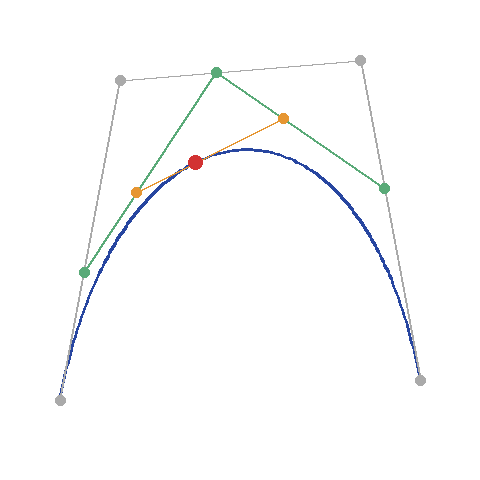

3 次ベジェ曲線と de Casteljau のアルゴリズムの作図。:download:`examples/bezier.py <../../examples/bezier.py>` の ``render_construction`` 関数。

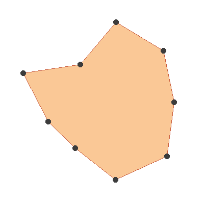

ランダムな 9 点を直線で結んだ多角形。:download:`examples/bezier.py <../../examples/bezier.py>` の ``render_blob`` 関数。

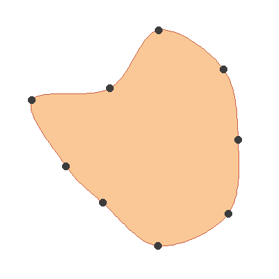

同じ 9 点を Catmull-Rom スプラインで結んだブロブ。:download:`examples/bezier.py <../../examples/bezier.py>` の ``render_blob`` 関数。

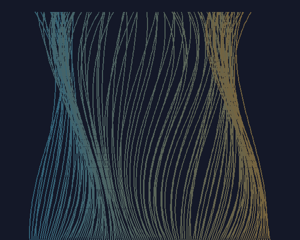

3 次ベジェ曲線を重ねた、波打つ線の束。:download:`examples/bezier.py <../../examples/bezier.py>` の ``render_strands`` 関数。

ノイズ
--------

詳しい解説は\ :doc:`../noise`\ を参照。

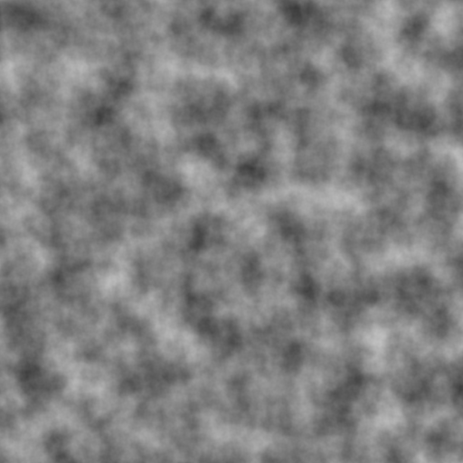

fBm（複数オクターブを重ねたパーリンノイズ）。:download:`examples/perlin_noise.py <../../examples/perlin_noise.py>` の ``fbm2d`` 関数。

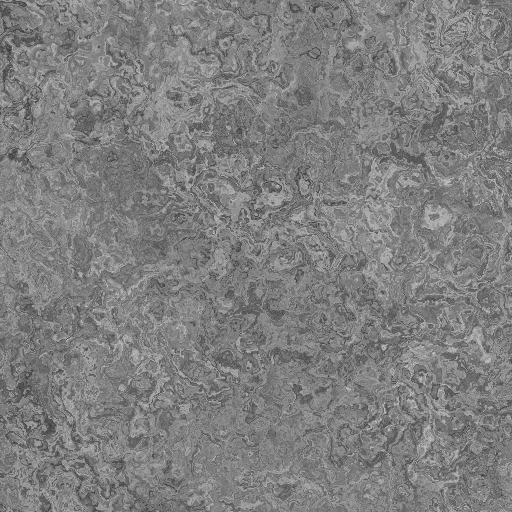

ドメインワーピングによる大理石調の渦模様。:download:`examples/perlin_noise.py <../../examples/perlin_noise.py>` の ``domain_warp2d`` 関数。

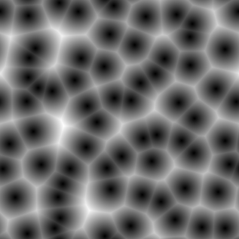

Worley ノイズの :math:`F_1`。:download:`examples/worley.py <../../examples/worley.py>` の ``worley2d`` 関数。

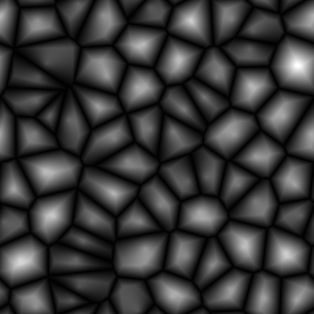

Worley ノイズの :math:`F_2 - F_1` による網目模様。:download:`examples/worley.py <../../examples/worley.py>`

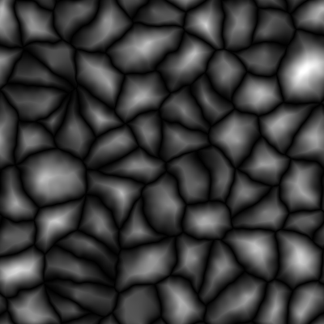

ドメインワーピングと組み合わせた Worley ノイズ。:download:`examples/worley.py <../../examples/worley.py>`

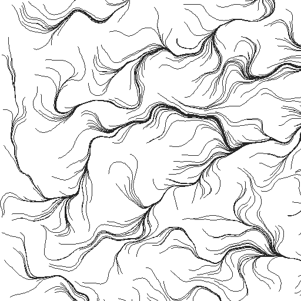

ノイズから作ったフローフィールドに沿って流れるパーティクルの軌跡。:download:`examples/flow_field.py <../../examples/flow_field.py>`

距離関数
----------

詳しい解説は\ :doc:`../shapes`\ を参照。

.. image:: ../_static/gallery/sdf_boolean_sharp.png
   :alt: 円と矩形を単純な union(min) で合成した図形。継ぎ目が尖っている
   :width: 250px

円と矩形を単純な union(min) で合成した図形。:download:`examples/sdf.py <../../examples/sdf.py>` の ``union`` 関数。

.. image:: ../_static/gallery/sdf_boolean_smooth.png
   :alt: 同じ円と矩形を smooth_union で合成した図形。継ぎ目がなだらかにつながっている
   :width: 250px

同じ円と矩形を smooth_union でなだらかに合成した図形。:download:`examples/sdf.py <../../examples/sdf.py>` の ``smooth_union`` 関数。

.. image:: ../_static/gallery/sdf_isolines.png
   :alt: 円と矩形を smooth union で合成した図形の距離場を等高線として可視化した画像
   :width: 250px

距離場を等高線として可視化した画像。:download:`examples/sdf.py <../../examples/sdf.py>` の ``render_isolines`` 関数。

.. image:: ../_static/gallery/sdf_organic_blob.png
   :alt: 座標をパーリンノイズで歪めてから円の SDF を評価した、輪郭が波打つ有機的なブロブ形状
   :width: 250px

座標をノイズで歪めてから円の SDF を評価した、有機的なブロブ形状。:download:`examples/sdf.py <../../examples/sdf.py>`

.. image:: ../_static/gallery/circle_packing.png
   :alt: 大小さまざまな円を、互いに重ならないようにキャンバス全体へ敷き詰めた円充填。大きな円の隙間を小さな円が埋めている
   :width: 250px

距離関数の和集合で空き距離を求めながら円を詰めた円充填。:download:`examples/circle_packing.py <../../examples/circle_packing.py>` の ``pack_circles`` 関数。

.. image:: ../_static/gallery/circle_packing_shape.png
   :alt: 円と矩形を合わせた図形の内側に暖色の円を、外側に灰色の円を詰めた画像。円の色の違いだけで図形が浮かび上がる
   :width: 250px

図形の距離関数で内側と外側を分けて円を詰めた画像。:download:`examples/circle_packing.py <../../examples/circle_packing.py>`

.. image:: ../_static/gallery/uniform_random.png
   :alt: 一様乱数で配置した点群。粒が密集する場所と隙間ができる場所が混在している
   :width: 250px

一様乱数で配置した点群。粒の密集と隙間が目立つ。:download:`examples/poisson_disk.py <../../examples/poisson_disk.py>`

.. image:: ../_static/gallery/poisson_disk.png
   :alt: ポアソン円盤サンプリングで配置した同数の点群。間隔がそろい、隙間なく均一に並んでいる
   :width: 250px

ポアソン円盤サンプリングで配置した同数の点群。:download:`examples/poisson_disk.py <../../examples/poisson_disk.py>` の ``poisson_disk_sampling`` 関数。

.. image:: ../_static/gallery/voronoi_mosaic.png
   :alt: 40 個の種点によるボロノイ図。各領域を種点ごとにランダムな色で塗り分けたモザイク画像
   :width: 250px

種点ごとにランダムな色で塗り分けたボロノイ図。:download:`examples/voronoi.py <../../examples/voronoi.py>`

.. image:: ../_static/gallery/voronoi_edges.png
   :alt: 同じボロノイ図の領域境界線だけを描いた配線図のような画像
   :width: 250px

同じボロノイ図の境界線だけを描いた配線図。:download:`examples/voronoi.py <../../examples/voronoi.py>`

.. image:: ../_static/gallery/delaunay.png
   :alt: 同じ種点から求めたドロネー三角形分割。種点どうしが三角形状に結ばれている
   :width: 250px

同じ種点から求めたドロネー三角形分割。:download:`examples/voronoi.py <../../examples/voronoi.py>`

.. image:: ../_static/gallery/voronoi_poisson.png
   :alt: ポアソン円盤サンプリングの種点から作ったボロノイ図。領域の大きさがそろっている
   :width: 250px

種点をポアソン円盤サンプリングに差し替えたボロノイ図。領域の大きさがそろう。:download:`examples/poisson_disk.py <../../examples/poisson_disk.py>`

.. image:: ../_static/gallery/voronoi_manhattan.png
   :alt: マンハッタン距離（p=1）によるボロノイ図。境界が軸方向と斜め 45 度の線だけで構成される
   :width: 250px

マンハッタン距離によるボロノイ図。:download:`examples/voronoi.py <../../examples/voronoi.py>` の ``minkowski_distance`` 関数。

.. image:: ../_static/gallery/voronoi_euclidean.png
   :alt: ユークリッド距離（p=2）によるボロノイ図。見慣れた多角形の領域になる
   :width: 250px

同じ種点をユークリッド距離で塗り分けたボロノイ図。:download:`examples/voronoi.py <../../examples/voronoi.py>`

.. image:: ../_static/gallery/voronoi_chebyshev.png
   :alt: チェビシェフ距離（p=無限大）によるボロノイ図。境界が軸方向と斜め 45 度の線だけで構成される
   :width: 250px

同じ種点をチェビシェフ距離で塗り分けたボロノイ図。:download:`examples/voronoi.py <../../examples/voronoi.py>`

.. image:: ../_static/gallery/lloyd_before.png
   :alt: 一様乱数で置いた 60 個の種点によるボロノイ図。領域の大きさと形がばらばら
   :width: 250px

一様乱数で置いた種点によるボロノイ図。:download:`examples/lloyd.py <../../examples/lloyd.py>`

.. image:: ../_static/gallery/lloyd_after.png
   :alt: 同じ種点にロイド緩和を 30 回適用したボロノイ図。領域の大きさがそろい、六角形に近い形になっている
   :width: 250px

ロイド緩和を 30 回適用したボロノイ図。:download:`examples/lloyd.py <../../examples/lloyd.py>` の ``lloyd_relaxation`` 関数。

フラクタル
-----------

詳しい解説は\ :doc:`../fractals`\ を参照。

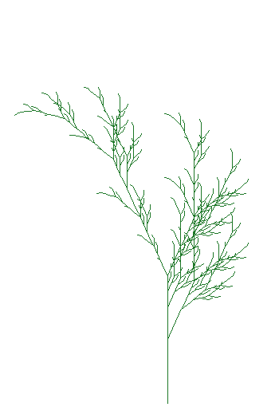

L-system の書き換え規則から生成した樹木状の分岐構造。:download:`examples/l_system.py <../../examples/l_system.py>`

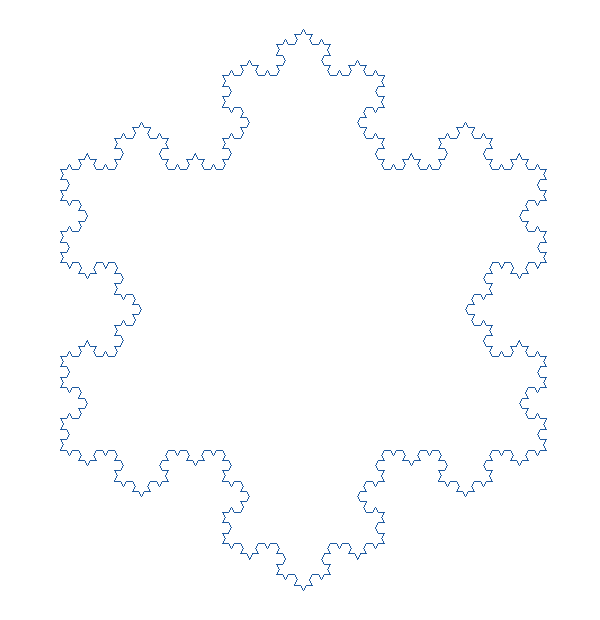

同じ L-system の仕組みで規則だけを変えて生成したコッホ雪片。:download:`examples/l_system.py <../../examples/l_system.py>`

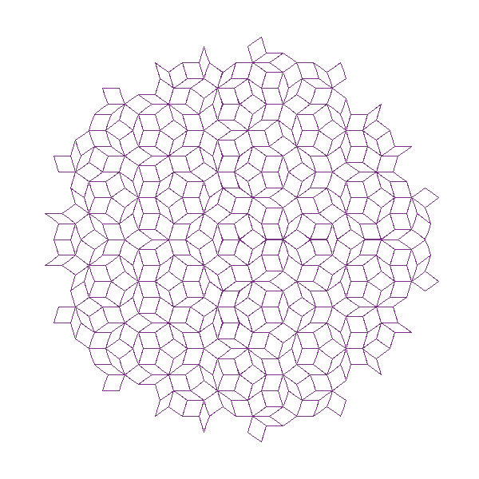

同じ L-system の仕組みで生成したペンローズタイル。:download:`examples/l_system.py <../../examples/l_system.py>`

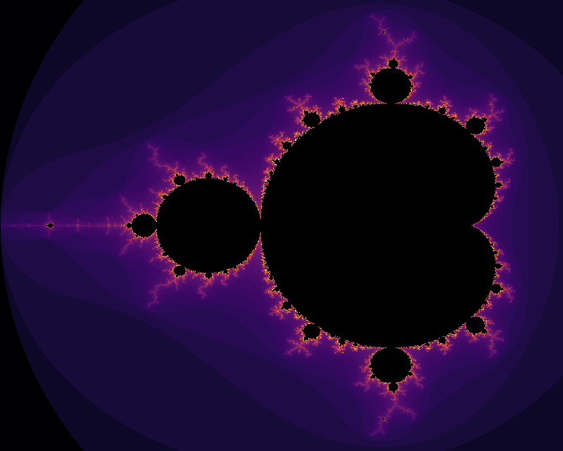

脱出時間アルゴリズムで描画したマンデルブロ集合。:download:`examples/mandelbrot.py <../../examples/mandelbrot.py>`

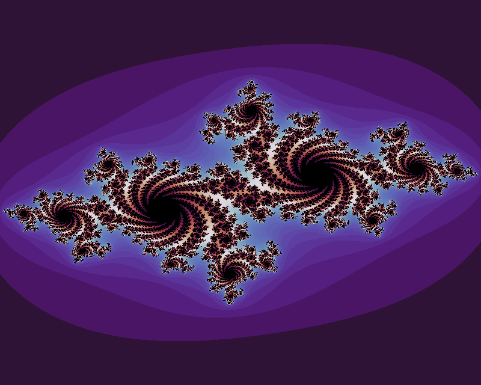

同じ漸化式で :math:`c` を固定し、初期値側を画素座標にしたジュリア集合。:download:`examples/mandelbrot.py <../../examples/mandelbrot.py>`

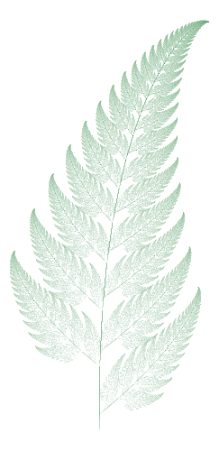

カオスゲーム（IFS）で描いたバーンズリーのシダ。:download:`examples/ifs.py <../../examples/ifs.py>`

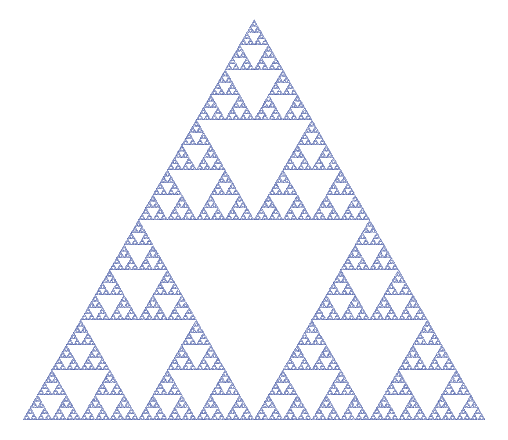

同じくカオスゲームで描いたシェルピンスキーの三角形。:download:`examples/ifs.py <../../examples/ifs.py>`

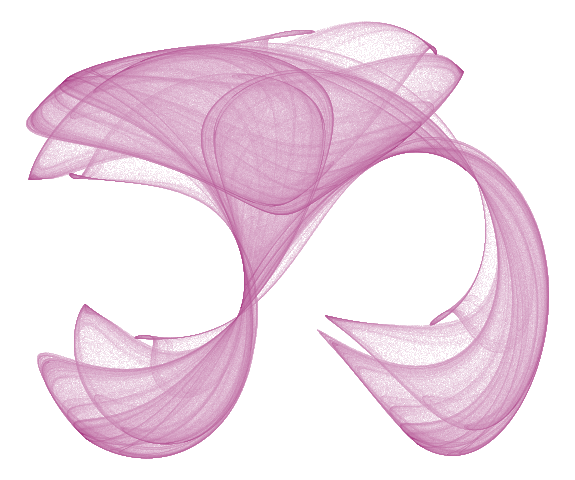

単一の非線形写像を反復する Clifford attractor。:download:`examples/attractors.py <../../examples/attractors.py>`

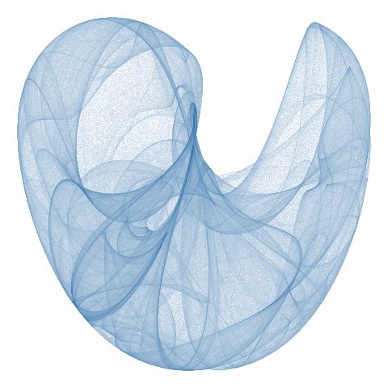

同じ形式の De Jong attractor。パラメータだけで模様が大きく変わる。:download:`examples/attractors.py <../../examples/attractors.py>`

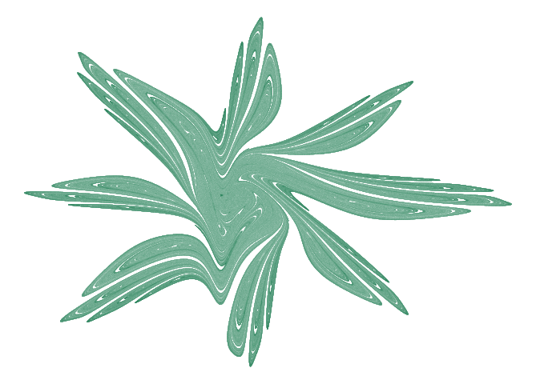

補助関数を介した Gumowski-Mira map。:download:`examples/attractors.py <../../examples/attractors.py>`

セルオートマトンと反応拡散系
------------------------------

詳しい解説は\ :doc:`../automata`\ を参照。

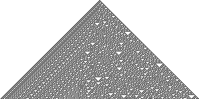

ルール 30 による 1 次元セルオートマトンの時空間図。:download:`examples/automata.py <../../examples/automata.py>`

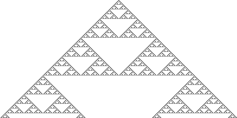

ルール 90 による 1 次元セルオートマトン。シェルピンスキーの三角形と同じ模様になる。:download:`examples/automata.py <../../examples/automata.py>`

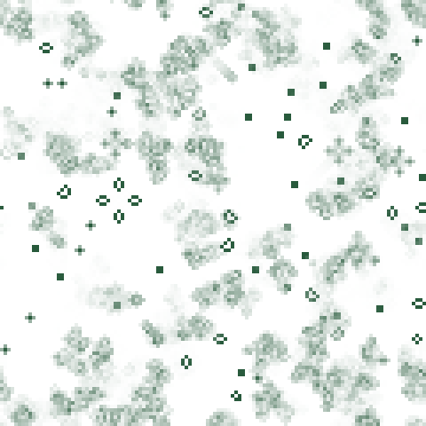

ライフゲームの軌跡を減衰させながら重ね合わせた可視化。:download:`examples/automata.py <../../examples/automata.py>`

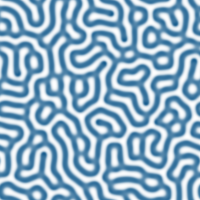

Gray-Scott モデルによるサンゴ状（迷路状）のパターン。:download:`examples/reaction_diffusion.py <../../examples/reaction_diffusion.py>`

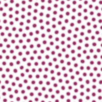

同じ Gray-Scott モデルで、パラメータ違いによる水玉状のパターン。:download:`examples/reaction_diffusion.py <../../examples/reaction_diffusion.py>`

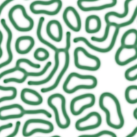

同じくパラメータ違いによるミミズ状のパターン。:download:`examples/reaction_diffusion.py <../../examples/reaction_diffusion.py>`

パーティクルシステム
----------------------

詳しい解説は\ :doc:`../particles`\ を参照。

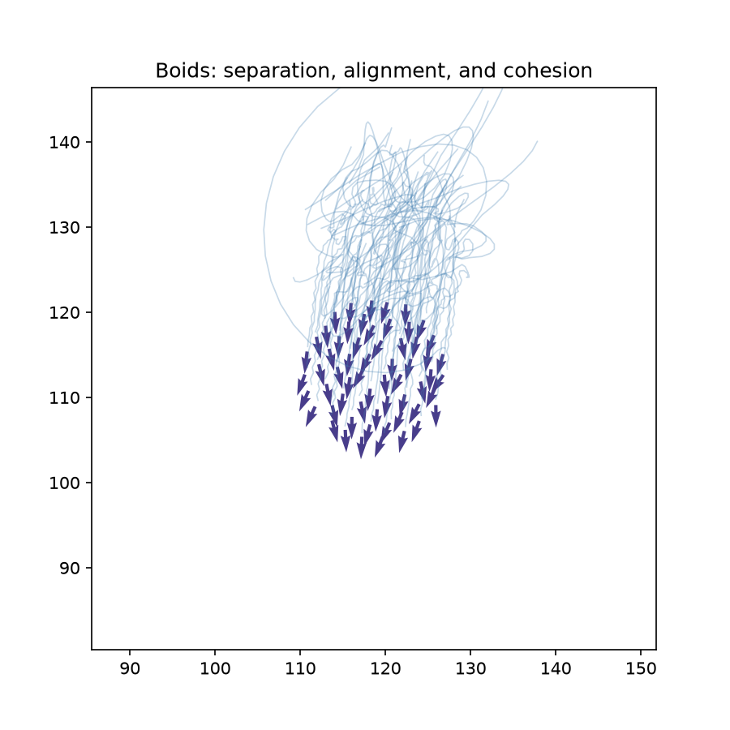

分離・整列・結合の 3 ルールによる群れ行動（Boids）。:download:`examples/boids.py <../../examples/boids.py>`

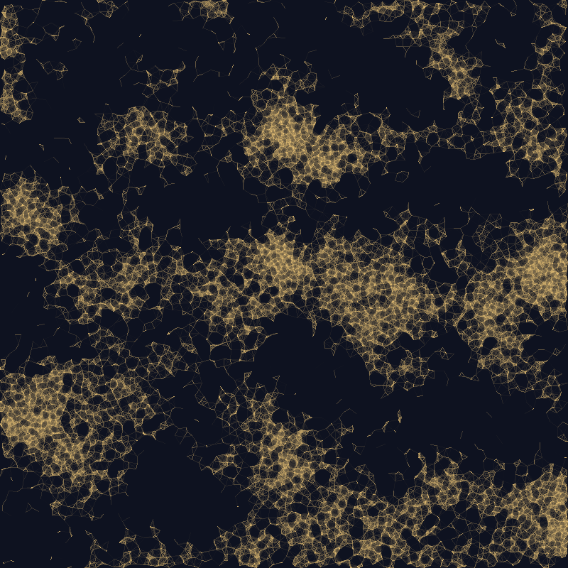

格子による近傍探索で求めた、近い点どうしを線で結んだ網目。:download:`examples/neighbor_search.py <../../examples/neighbor_search.py>` の ``grid_pairs`` 関数。

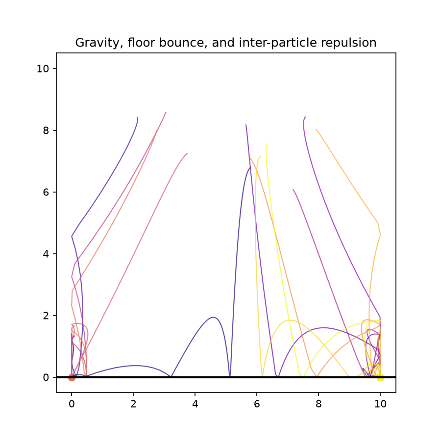

重力・粒子間反発・床との衝突を組み込んだパーティクルの軌跡。:download:`examples/particle.py <../../examples/particle.py>`

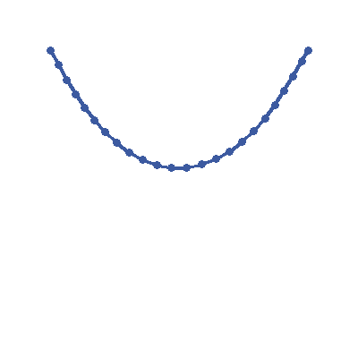

Verlet 積分と距離拘束による、懸垂線状に垂れたロープ。:download:`examples/particle.py <../../examples/particle.py>` の ``simulate_rope`` 関数。

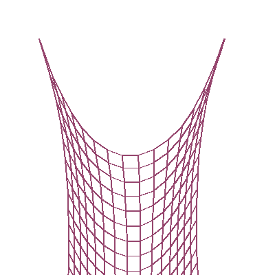

同じ拘束を格子状に適用した、上端だけを固定したクロス。:download:`examples/particle.py <../../examples/particle.py>` の ``simulate_cloth`` 関数。

進化的アルゴリズム
--------------------

詳しい解説は\ :doc:`../evolution`\ を参照。

半透明三角形で近似する目標画像。:download:`examples/evolution.py <../../examples/evolution.py>` の ``make_target`` 関数。

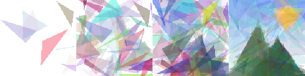

世代が進むにつれて目標画像に近づいていく様子。:download:`examples/evolution.py <../../examples/evolution.py>` の ``evolve`` 関数。

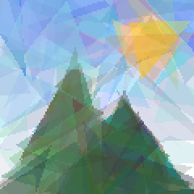

6000 世代の (1+1) 進化戦略を経た最終結果。:download:`examples/evolution.py <../../examples/evolution.py>`

画像を素材にした生成技法
--------------------------

詳しい解説は\ :doc:`../image_effects`\ を参照。

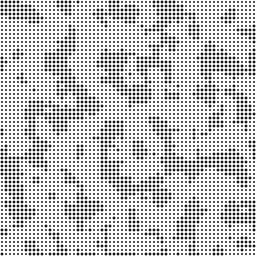

パーリンノイズの画像に適用したハーフトーン（網点）表現。:download:`examples/image_effects.py <../../examples/image_effects.py>` の ``halftone`` 関数。

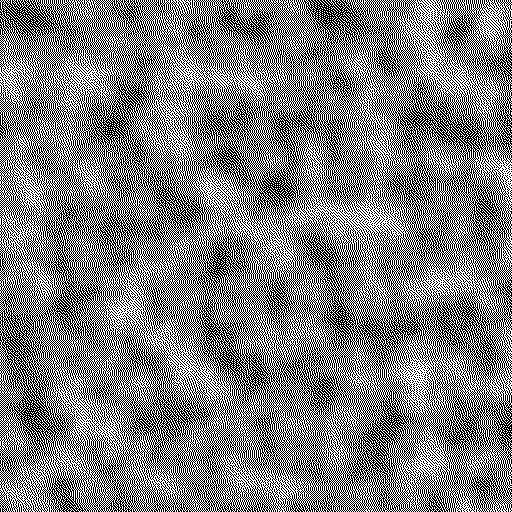

Floyd-Steinberg 法で白黒 2 階調に減色した誤差拡散ディザリング。:download:`examples/image_effects.py <../../examples/image_effects.py>` の ``floyd_steinberg_dither`` 関数。

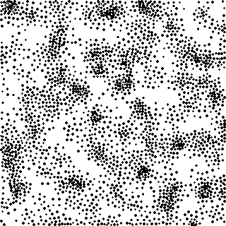

重み付きボロノイ図による点描。:download:`examples/stippling.py <../../examples/stippling.py>`

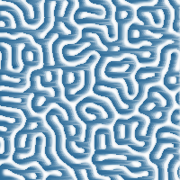

サンゴ状のパターンに適用したピクセルソート。:download:`examples/image_effects.py <../../examples/image_effects.py>` の ``pixel_sort`` 関数。
