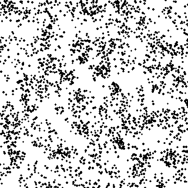

画像を素材にした生成技法
==========================

:doc:`color`\ の ``extract_palette`` は、既存の画像から配色を抜き出して別の作品の材料にする、という発想の例だった。本章では一歩進んで、既存の画像そのものを直接加工して新しい見た目を作る 4 つの技法を扱う。いずれも、ゼロから座標や乱数で生成するこれまでの章とは異なり、入力画像の明るさや色を単純な規則で変換するだけで、元の画像には無かった質感が生まれる点が共通している。

ハーフトーン
--------------

新聞や雑誌の印刷では、インクの濃淡を直接表現できない代わりに、規則正しく並んだ点の大きさを変えることで濃淡を表現する\ **ハーフトーン**\ （網点）という技法が使われてきた。画像を格子状のセルに分割し、セルごとの平均輝度を求め、暗いセルほど大きな円を、明るいセルほど小さな円を中心に描くだけで、遠目には元の濃淡が、近づくと規則正しい点の並びが見える表現になる。

.. literalinclude:: ../examples/image_effects.py
   :linenos:
   :language: python
   :pyobject: halftone
   :caption: examples/image_effects.py の halftone 関数

:doc:`noise`\ で生成したパーリンノイズの画像にハーフトーンを適用すると、なめらかな濃淡が、点の大小のパターンへと変換される。

.. image:: _static/gallery/halftone.png
   :alt: パーリンノイズの画像にハーフトーンを適用した結果。暗い部分ほど大きな点が並ぶ
   :width: 320px

誤差拡散法によるディザリング
-------------------------------

画像の階調数を減らす（例えば白と黒の 2 値だけにする）ときに、各画素を単純に一番近い階調へ丸めるだけでは、なめらかだった濃淡が縞状のバンドとして目立ってしまう。**誤差拡散法**\ （error diffusion dithering）は、丸めによって生じた誤差を捨てずに周囲の未処理画素へ配ることで、この問題を避ける。Floyd-Steinberg 法では、誤差を右・左下・下・右下の画素へ ``7/16, 3/16, 5/16, 1/16`` の比率で配る。

.. literalinclude:: ../examples/image_effects.py
   :linenos:
   :language: python
   :pyobject: floyd_steinberg_dither
   :caption: examples/image_effects.py の floyd_steinberg_dither 関数

行ごとに左から右へ処理し、まだ処理していない画素にしか誤差を渡せない逐次的なアルゴリズムであるため、他の章のように NumPy でベクトル化はせず、素直に Python のループで実装している。同じパーリンノイズの画像を 2 階調（白と黒のみ）に減色すると、誤差が近傍のドット密度の変化として表れ、階調が 2 つしかないにもかかわらず元の濃淡が保たれて見える。

.. image:: _static/gallery/dither_2level.png
   :alt: パーリンノイズの画像を Floyd-Steinberg 法で白黒 2 階調にディザリングした結果。点の密度で元の濃淡が表現されている
   :width: 320px

.. _stippling:

重み付きボロノイ図による点描
------------------------------

**点描**\ （stippling）は、大きさのそろった点を打つ密度で濃淡を表す技法である。ハーフトーンが格子上に並べた点の大きさで、ディザリングが画素ごとの白黒で濃淡を表したのに対し、点描は点の配置そのもので濃淡を表す。暗い場所ほど点を密に、明るい場所ほど疎にすればよいが、単に暗さに比例した確率で点を打つだけでは、偶然できた点の固まりや隙間がむらとして目立ってしまう。

Adrian Secord が 2002 年に提案した\ **重み付きボロノイ点描**\ （weighted Voronoi stippling）は、:ref:`lloyd`\ の重み付き版でこの問題を解決する。画像の暗さを重みとして重心を求めると、各点は自分の領域の中で暗い側へ引き寄せられる。その結果、暗い場所ほど点が密に集まる一方で、近くの点どうしの間隔はそろうため、むらの少ない点描になる。手順は次の通り。

1. 画像を縮小してグレースケールにし、画素ごとの暗さを求める。
2. 暗さに比例した確率で画素を選び、点の初期配置にする。
3. 暗さを重みとして、ロイド緩和を繰り返す。

暗さを求める際には、元の画像の明るさの幅が狭くても濃淡が点の密度に表れるように、明るさの範囲を 0〜1 に引き伸ばしてから、べき乗で濃淡の差を強調している。

.. literalinclude:: ../examples/stippling.py
   :linenos:
   :language: python
   :pyobject: darkness
   :caption: examples/stippling.py の darkness 関数

.. literalinclude:: ../examples/stippling.py
   :linenos:
   :language: python
   :pyobject: initial_points
   :caption: examples/stippling.py の initial_points 関数

ロイド緩和の 1 回ごとに、全ての画素と全ての点の距離を求める必要がある。本実装では、計算量を抑えるために画像を 160 × 160 画素に縮小して点の位置を求め、描画だけを 2 倍の大きさで行っている。ハーフトーン・ディザリングと同じパーリンノイズの画像に 2500 個の点で適用し、暗さに比例した確率で打っただけの初期配置（左）と、ロイド緩和を 40 回適用した結果（右）を比べると、次のようになる。初期配置では点の固まりと隙間が目立つのに対し、ロイド緩和の後は、点の密度が元の濃淡に沿って変化しながらも、近くの点どうしの間隔がそろっている。

.. image:: _static/gallery/stipple.png
   :alt: 同じ初期配置に、暗さを重みとしたロイド緩和を 40 回適用した点描。点の間隔がそろい、濃淡が点の密度で表されている
   :width: 320px

ピクセルソート
----------------

**ピクセルソート**\ （pixel sorting）は、画像の行（または列）ごとに、一定の条件を満たす画素だけを明るさの順に並べ替えるグリッチアートの技法である。各行について、輝度が指定した範囲に収まる連続した区間を見つけ、その区間の中だけを輝度順にソートする。範囲外の画素はソートの境界として手つかずのまま残る。

.. literalinclude:: ../examples/image_effects.py
   :linenos:
   :language: python
   :pyobject: pixel_sort
   :caption: examples/image_effects.py の pixel_sort 関数

輝度の範囲を画像全体に広げてしまうと、全ての行が単純な明暗のグラデーションに均されてしまい、元の模様の情報が失われる。範囲を絞り、もっとも明るい部分だけをソートの境界として残すと、:doc:`automata`\ の Gray-Scott モデルで生成したサンゴ状のパターンが、横方向に流れるように引き伸ばされた質感に変わる。

.. image:: _static/gallery/pixel_sort.png
   :alt: Gray-Scott モデルによるサンゴ状のパターンにピクセルソートを適用した結果。模様が横方向に引き伸ばされたような質感になる
   :width: 320px

本章の 4 つの技法は、いずれも「画素をどういう単位でまとめ、どういう規則で並べ替えるか」という着眼点の違いに過ぎない。ハーフトーンはセル単位で面積に変換し、ディザリングは画素単位で誤差を隣に押し出し、点描は画像全体の濃淡を点の密度に置き換え、ピクセルソートは行単位で並べ替える。本資料の他の章がゼロから座標を計算して画像を組み立てていたのに対し、本章の技法はすでにある画像の画素配列を材料として扱う。生成技法によって作った画像を、さらにこれらの技法で加工するという組み合わせも試す価値がある。
