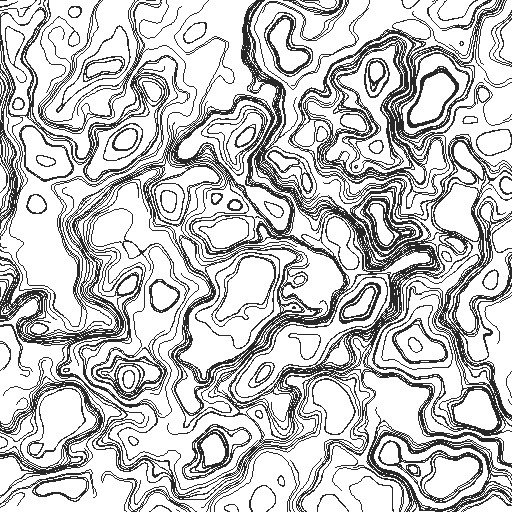
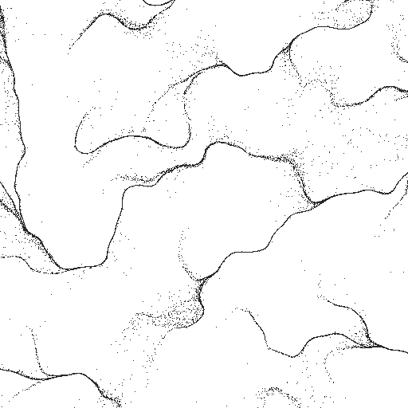
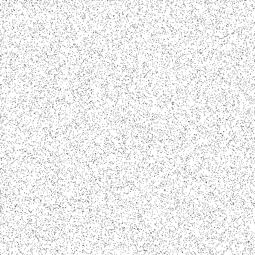

ノイズを使った表現
==================

パーリンノイズを自作する
--------------------------

``noise`` や ``perlin-noise`` といった専用ライブラリを使わず、NumPy だけを使ってパーリンノイズを実装する。仕組みを理解しておくと、1 次元・3 次元への拡張や、独自の変種（ドメインワーピングなど）を作るときに応用が利く。

アルゴリズムの概要は次の通り。

1. 平面を整数格子に区切り、各格子点にランダムな勾配ベクトルを割り当てる。
2. 評価したい点が属する格子セルの 4 隅について、格子点から評価点までの変位ベクトルと、その格子点の勾配ベクトルとの内積を取る。
3. 内積を、5 次のイージング関数（fade 関数）で重み付けしたバイリニア補間で合成し、1 点のノイズ値を得る。

fade 関数には次式を用いる。これは\ :ref:`easing`\ で扱う smootherstep と同じ式で、単純な線形補間と違い、両端で 1 階・2 階微分が 0 になるため、格子の継ぎ目にムラが出ない。

.. math::

   \mathrm{fade}(t) = 6t^5 - 15t^4 + 10t^3

実装（NumPy でベクトル化）
---------------------------

.. literalinclude:: ../examples/perlin_noise.py
   :linenos:
   :language: python
   :caption: examples/perlin_noise.py

生成される画像はこのようになる。

.. image:: _static/gallery/perlin_noise.png
   :alt: 自前実装のパーリンノイズ（fBm）によるグレースケール画像
   :width: 400px

基本の ``perlin2d`` に加えて、周波数と振幅を変えながら重ね合わせる ``fbm2d``\ （fractal Brownian motion）も実装している。オクターブ数を増やすほど、大きなうねりの上に細かいディテールが乗った複雑な模様になる。

.. code-block:: python
   :linenos:

   import numpy as np
   from perlin_noise import fbm2d, make_permutation

   perm: np.ndarray = make_permutation(seed=1)
   xs: np.ndarray
   ys: np.ndarray
   xs, ys = np.meshgrid(
       np.arange(400, dtype=float), np.arange(400, dtype=float)
   )
   values: np.ndarray = fbm2d(
       xs * 0.02, ys * 0.02, perm, octaves=5, persistence=0.5
   )

ドメインワーピング
--------------------

fBm をそのまま画像にすると、雲やまだら模様のようにはなるものの、どうしても「格子の上にノイズを乗せた」ような単調さが残る。**ドメインワーピング**\ （domain warping）は、ノイズを評価する座標そのものを、別のノイズから作ったベクトル場でずらしてから評価する手法で、渦を巻いたような有機的な模様を作れる（Inigo Quilez, "Domain Warping"）。

考え方はシンプルで、まず座標をずらす量（ワープベクトル）を、入力座標にオフセットを加えた位置で評価した fBm から作る。

.. math::

   q(p) = \bigl(\,\mathrm{fbm}(p + o_0),\ \mathrm{fbm}(p + o_1)\,\bigr)

.. math::

   f_{\mathrm{warp}}(p) = \mathrm{fbm}\bigl(p + k \cdot q(p)\bigr)

ここで :math:`o_0, o_1` は互いに離れた適当な定数オフセット（同じノイズ場を使い回しても座標が違えば無相関に近い値になる）、:math:`k` はワープの強さを決める係数である。これを複数回繰り返し適用する（歪めた座標でさらに次のワープ用ベクトル場を作る）ことで、より複雑な渦模様が得られる。

.. literalinclude:: ../examples/perlin_noise.py
   :linenos:
   :language: python
   :pyobject: domain_warp2d
   :caption: examples/perlin_noise.py の domain_warp2d 関数

同じ ``perm``・同じスケールで ``fbm2d`` と ``domain_warp2d`` を比べると、後者は等高線のような縞が渦を巻き、大理石調の模様になる。

.. image:: _static/gallery/domain_warp.png
   :alt: ドメインワーピングを適用したノイズ画像。大理石のような渦模様になる
   :width: 400px

``warp_strength`` を大きくするほど渦が強く歪み、``iterations`` を増やすほど渦の中にさらに渦が入れ子になった、より複雑な模様になる。両方とも大きくしすぎると、元の座標との対応が失われてノイズ状のざらつきに戻ってしまう点には注意する。

.. _worley:

Worley ノイズ（セルラーノイズ）
--------------------------------

パーリンノイズは、格子点に割り当てた勾配をなめらかに補間するノイズだった。これとは異なる発想のノイズとして、Steven Worley が 1996 年に提案した **Worley ノイズ**\ （セルラーノイズとも呼ぶ）がある。平面に散らした\ **特徴点**\ までの距離をノイズの値として使うもので、細胞・泡・石畳・ひび割れのような、境界で区切られた模様を作るのに向く。

特徴点は、平面を正方形のマスに区切り、各マスに 1 つずつランダムな位置に置く。評価する点について、もっとも近い特徴点までの距離を :math:`F_1`、2 番目に近い特徴点までの距離を :math:`F_2` とし、これらの値やその組み合わせをノイズとして使う。

特徴点をマスごとに 1 つずつ置いておくと、近い特徴点を探すときに、全ての特徴点を調べる必要がなくなる。本実装では、評価点が属するマスとその周囲 8 マスにある計 9 個の特徴点だけを調べている。厳密には、この 9 個より外側の特徴点のほうが近い場合もあるが、まれであり、模様への影響は目立たない（作例では、:math:`F_1` は全ての画素で厳密な値と一致し、:math:`F_2` がずれた画素は全体の 0.02% 未満だった）。また、特徴点の配列を端で折り返して参照しているため、模様は上下左右に継ぎ目なくつながる。

.. literalinclude:: ../examples/worley.py
   :linenos:
   :language: python
   :pyobject: make_feature_points
   :caption: examples/worley.py の make_feature_points 関数

.. literalinclude:: ../examples/worley.py
   :linenos:
   :language: python
   :pyobject: worley2d
   :caption: examples/worley.py の worley2d 関数

:math:`F_1` をそのまま画像にすると、特徴点の位置が暗く、そこから離れるほど明るくなる、泡や細胞が並んだような模様になる（左）。:math:`F_1` を与える特徴点ごとに平面を塗り分けると、:doc:`shapes`\ で扱うボロノイ図そのものになる。一方 :math:`F_2 - F_1` は、2 つの特徴点から等しい距離にある点、つまりボロノイ図の境界で 0 になるため、境界が暗い線として浮かび上がる網目模様になる（右）。

.. image:: _static/gallery/worley_f1.png
   :alt: Worley ノイズの F1 を明るさにした画像。特徴点の位置が暗く、泡が並んだような模様になっている
   :width: 300px

.. image:: _static/gallery/worley_edges.png
   :alt: Worley ノイズの F2 - F1 を明るさにした画像。ボロノイ図の境界が暗い線になった網目模様
   :width: 300px

Worley ノイズもパーリンノイズと同じく「座標を受け取って値を返す関数」なので、前節のドメインワーピングと組み合わせられる。評価する座標を ``fbm2d`` でずらしてから :math:`F_2 - F_1` を求めると、直線だった境界が波打ち、生物の細胞や乾いた地面のひび割れのような有機的な模様になる。

.. image:: _static/gallery/worley_warped.png
   :alt: 評価座標をパーリンノイズでずらしてから求めた Worley ノイズの F2 - F1。境界が波打ち、有機的な細胞の模様になっている
   :width: 300px

フローフィールド
----------------

ノイズ値をそのまま画像にする以外に、座標ごとの角度に変換して\ **ベクトル場**\ （フローフィールド）として使う方法がある。各点に「その場所での風向き」のような方向を割り当て、多数のパーティクルをその方向に少しずつ動かして軌跡を残すと、水の流れや風になびく髪の毛のような、有機的な曲線群が得られる。

.. math::

   \theta(p) = \mathrm{fbm}(p) \cdot n \pi

``fbm`` の値はおおよそ :math:`-1`〜:math:`1` の範囲なので、:math:`n` 回転分の角度 :math:`\theta` にスケールする。:math:`n` を大きくするほど、近くのパーティクルでも進行方向が大きく変わる、渦の細かいフィールドになる。

各パーティクルの位置更新は、その位置での角度方向に一定の歩幅 ``step_length`` だけ進む単純なオイラー法である。

.. math::

   p_{t+1} = p_t + \mathrm{step\_length} \cdot
   \bigl(\cos\theta(p_t),\ \sin\theta(p_t)\bigr)

.. literalinclude:: ../examples/flow_field.py
   :linenos:
   :language: python
   :caption: examples/flow_field.py

パーティクルの初期位置はキャンバス内に一様乱数で配置し、各ステップで現在位置におけるフィールドの角度を ``fbm2d`` で求めて進む。全パーティクル分の位置をまとめて ``(num_particles, 2)`` の配列として扱うことで、ステップごとの更新を Python のループではなく NumPy のベクトル演算で行っている。

.. image:: _static/gallery/flow_field.png
   :alt: パーリンノイズのフローフィールドに沿って流れるパーティクルの軌跡
   :width: 400px

パーティクルの初期位置は一様乱数で決めているが、軌跡は何本かの太い筋に寄り集まっている。フィールドの向きが周りから 1 か所へ向かって集まる場所（吸い込み口）があると、その周りのパーティクルが同じ筋に合流し、以後は同じ道をたどるためである。筋が枝分かれしながら合流する模様は、川の流れのような表現には向くが、画面全体を均一な流れで満たしたい場合には不向きである。これを解決するのが次節のカールノイズである。

.. _curl-noise:

カールノイズ
------------

**カールノイズ**\ （curl noise）は、Robert Bridson らが 2007 年に提案した、流体のような流れをノイズから作る手法である。前節のフローフィールドとは違い、流れの中にパーティクルが集まる場所も散っていく場所もできない。

考え方
^^^^^^

ノイズの値 :math:`\psi(x, y)` を高さとみなすと、平面は山と谷のある地形になる。カールノイズでは、この地形の\ **等高線に沿う向き**\ を流れの向きとし、等高線が密な（傾きが急な）場所ほど速く流れるようにする。この向きと速さは、:math:`\psi` の勾配（最も急に登る向き）を 90 度回すことで得られる。

.. math::

   \mathbf{v}(x, y) = \left(\frac{\partial \psi}{\partial y},\ -\frac{\partial \psi}{\partial x}\right)

この操作を\ **回転**\ （curl）と呼び、:math:`\psi` を\ **流れ関数**\ と呼ぶ。こうして作った速度場 :math:`\mathbf{v}` は、次の 2 つの性質を持つ。

- **発散が 0 になる。** 発散は、ある点の周りで流れが湧き出す量（負ならば吸い込まれる量）を表す。偏微分の順序は入れ替えられるので、次式の通り、どの点でも発散は 0 になる。そのため、流れの中に吸い込み口も湧き出し口もできず、パーティクルの密度は流しても変わらない。

  .. math::

     \frac{\partial v_x}{\partial x} + \frac{\partial v_y}{\partial y} = \frac{\partial^2 \psi}{\partial x \partial y} - \frac{\partial^2 \psi}{\partial y \partial x} = 0

- **パーティクルは等高線の上を動く。** :math:`\mathbf{v}` は :math:`\psi` の勾配と直交するので、パーティクルが動いても :math:`\psi` の値は変わらない。つまり、各パーティクルの軌跡は :math:`\psi` の等高線そのものになる。

前節のフローフィールドは、ノイズの値を角度に変えたもので、発散が 0 になる保証がない。これが、パーティクルが筋に寄り集まる原因である。

実装
^^^^

偏微分は、微小な幅 :math:`h` だけ前後にずらした 2 点での値の差から求める（中心差分）。

.. math::

   \frac{\partial \psi}{\partial x} \approx \frac{\psi(x + h, y) - \psi(x - h, y)}{2h}

流れ関数には、本章の前半で作った ``fbm2d`` をそのまま使う。

.. literalinclude:: ../examples/curl_noise.py
   :linenos:
   :language: python
   :pyobject: curl_velocity
   :caption: examples/curl_noise.py の curl_velocity 関数

パーティクルは、各ステップで現在位置の速度に ``speed`` を掛けた分だけ進める。前節のように速度の向きだけを取り出して歩幅を揃えると、発散が 0 の性質が失われるため、速度の大きさはそのまま使う。

また、位置の更新にはオイラー法ではなく\ **中点法**\ を使う。まず半歩だけ進んだ位置（中点）を求め、その中点での速度を使って元の位置から 1 歩進める方法である。オイラー法では、渦の周りを回るパーティクルが 1 ステップごとに少しずつ外側へずれていくため、長く流すと渦の中心に点のない穴ができる。

.. literalinclude:: ../examples/curl_noise.py
   :linenos:
   :language: python
   :pyobject: simulate_curl_particles
   :caption: examples/curl_noise.py の simulate_curl_particles 関数

次の画像は、前節の ``flow_field.png`` と同じシード・同じスケールのノイズを流れ関数とし、400 個のパーティクルを 200 ステップ流した軌跡である。軌跡は筋に寄り集まらず、流れ関数の等高線に沿って閉じた曲線を描く。等高線が密な場所では軌跡の間隔が狭くなるため、全体として、地形図や大理石の模様のような濃淡が現れる。

密度が保たれることの確認
^^^^^^^^^^^^^^^^^^^^^^^^

発散が 0 であることの効果は、多数の点を一様に散らしてから流すと分かりやすい。次の 2 枚は、同じ位置に散らした点を、前節の角度によるフローフィールド（1 枚目）とカールノイズ（2 枚目）で 60 ステップ流したあとの位置である。キャンバスの外からも点が流れ込むよう、キャンバスの周囲 200 ピクセルにも点を散らしている。

角度によるフローフィールドでは、点の大半が細い筋に集まり、ほかの場所はほとんど空白になる。一方、カールノイズでは、点は流れても画面全体にほぼ一様に分布したままである。煙・液体・星雲のように、画面を均一に満たしたまま渦を巻く表現にはカールノイズが向き、川の流れや毛並みのように筋がまとまる表現には角度によるフローフィールドが向く。

なお、本節の流れ関数は時間によって変わらないため、パーティクルは同じ等高線の上を回り続ける。より複雑な流れにしたい場合は、流れ関数を時間とともに変化させる（ノイズの座標に時刻に比例したずれを加える、3 次元のノイズの 3 つ目の座標に時刻を使う、など）とよい。流れ関数が時間で変わっても、各時刻の速度場の発散は 0 のままである。

.. _other-noises:

その他のノイズ
--------------

本章ではパーリンノイズと Worley ノイズを実装したが、ジェネラティブアートやコンピュータグラフィックスでは、ほかにも多くのノイズが使われる。代表的なものと、本資料での扱いを次の表にまとめる。いずれも、本章の実装を少し変えるか、他の章の手法で代用できるため、本資料では個別には実装しない。

.. list-table::
   :header-rows: 1
   :widths: 20 45 35

   * - 名前
     - 特徴
     - 本資料での扱い
   * - バリューノイズ
     - 格子点に乱数の値そのものを置き、それを補間する。パーリンノイズより単純だが、格子に沿ったブロック状のむらが目立ちやすい。
     - ``perlin2d`` の内積を、格子点ごとの乱数の値に置き換えれば作れる。
   * - シンプレックスノイズ
     - Ken Perlin が 2001 年に提案した。正方形の格子の代わりに三角形（高次元では単体）の格子を使う。高次元でも計算量が少なく、格子の向きによる偏りも小さい。
     - 2 次元の静止画ではパーリンノイズとの差が小さいため、扱わない。
   * - タービュランス・リッジノイズ
     - fBm の変種で、オクターブごとにノイズの絶対値 :math:`|n|` を重ねたもの（タービュランス）や、:math:`1 - |n|` を重ねたもの（リッジノイズ）を指す。値が 0 になる場所が鋭い谷や尾根になり、炎・煙や山脈の稜線のような模様になる。
     - ``fbm2d`` の中の ``perlin2d`` の値を、絶対値などに変換してから足し合わせれば作れる。
   * - ホワイトノイズ
     - 点ごとに独立な一様乱数。空間的なまとまりがなく、ざらついた砂嵐のようになる。
     - :doc:`shapes` のポアソン円盤サンプリングで、一様乱数による点の配置と比べている。
   * - ブルーノイズ
     - 近い点どうしが似た値や位置になりにくい、偏りの少ないばらつき。点の配置やディザリングに使う。
     - :doc:`shapes` のポアソン円盤サンプリングと、:ref:`stippling` で扱う。

まとめ
------

本章で作った ``perlin2d`` は、それ単体では格子点にランダムな勾配を割り当てただけの 1 つの関数に過ぎない。しかし、``fbm2d`` で重ね合わせ、``domain_warp2d`` で座標そのものを歪め、角度に変換してフローフィールドとして使い、さらに回転を取ってカールノイズとして使う、というように積み重ねるほど表現の幅が広がっていく。この「ノイズ値をどう解釈するか」という発想は本資料の随所で使い回されており、:doc:`tiling`\ ではタイルの向きの決定に、:doc:`shapes`\ では図形の輪郭を歪めるのに、それぞれ同じ ``fbm2d`` が形を変えて登場する。:doc:`particles`\ でも、フローフィールドを粒子に加える力として使う応用に触れる。
