距離関数による形状表現
========================

距離関数（SDF）とは
--------------------

**符号付き距離関数**\ （SDF: Signed Distance Function）とは、平面上の点 :math:`p` を受け取り、その点から図形の境界までの距離を、内側なら負・外側なら正・境界上ならちょうど 0 になるように返す関数 :math:`d(p)` のことである。例えば中心 :math:`c`、半径 :math:`r` の円は次のように書ける。

.. math::

   d_{\mathrm{circle}}(p) = \lVert p - c \rVert - r

この関数の値の符号を見るだけで、任意の点がその図形の内側にあるか外側にあるかを判定できる。座標ごとの if 文で図形を判定するのではなく、「距離」という 1 つの連続値に落とし込んでおくことで、複数の図形の合成や、境界のなめらかな表現が驚くほど単純な演算に帰着する、というのが SDF の考え方である。

基本図形の距離関数
--------------------

円のほかに、矩形と線分についても同様に距離関数を定義できる。矩形は、中心からの相対座標を各軸ごとに矩形の半径（半幅・半高さ）だけ縮めた上で、はみ出した分の長さ（外側にいる場合）と、はみ出していない分のうちもっとも浅い軸の距離（内側にいる場合）を組み合わせて求める。

.. literalinclude:: ../examples/sdf.py
   :language: python
   :pyobject: sdf_circle
   :caption: examples/sdf.py の sdf_circle 関数

.. literalinclude:: ../examples/sdf.py
   :language: python
   :pyobject: sdf_box
   :caption: examples/sdf.py の sdf_box 関数

線分までの距離は、点から線分への垂線の足が線分の範囲に収まるように、内積を使ってパラメータ ``h`` を ``[0, 1]`` にクランプしてから求める。距離の値から ``thickness`` の分だけ引いて図形を外側に太らせる（オフセットする）と、線分の周囲 ``thickness`` 分までが「内側」として扱われるようになり、線分に太さを持たせたカプセル形状としても使える。

.. literalinclude:: ../examples/sdf.py
   :language: python
   :pyobject: sdf_segment
   :caption: examples/sdf.py の sdf_segment 関数

ブール演算による形状の合成
----------------------------

距離関数どうしを ``min`` / ``max`` で組み合わせるだけで、図形の和集合・積集合・差集合が求められる。

.. math::

   d_{\mathrm{union}}(p) = \min(d_1(p), d_2(p))

.. math::

   d_{\mathrm{intersection}}(p) = \max(d_1(p), d_2(p))

.. math::

   d_{\mathrm{subtraction}}(p) = \max(d_1(p), -d_2(p))

.. literalinclude:: ../examples/sdf.py
   :language: python
   :pyobject: union
   :caption: examples/sdf.py の union 関数

.. literalinclude:: ../examples/sdf.py
   :language: python
   :pyobject: intersection
   :caption: examples/sdf.py の intersection 関数

.. literalinclude:: ../examples/sdf.py
   :language: python
   :pyobject: subtraction
   :caption: examples/sdf.py の subtraction 関数

単純な ``min`` による和集合は、2 つの図形の境界がそのまま尖った継ぎ目として残ってしまう。継ぎ目をなめらかにつなぎたい場合は、``min`` の代わりに、2 つの距離値の差に応じてなめらかに補間する **smooth union** を使う。

.. math::

   h = \mathrm{clip}\left(0.5 + 0.5\,\frac{d_2 - d_1}{k},\ 0,\ 1\right)

.. math::

   d_{\mathrm{smooth}}(p) = (1 - h)\,d_2(p) + h\,d_1(p) - k\,h\,(1 - h)

ここで :math:`k` はなめらかさの半径で、大きくするほど継ぎ目が広い範囲でなだらかにつながる。

.. literalinclude:: ../examples/sdf.py
   :language: python
   :pyobject: smooth_union
   :caption: examples/sdf.py の smooth_union 関数

同じ円と矩形の組み合わせを、単純な ``union`` と ``smooth_union`` それぞれで合成すると、継ぎ目の違いがはっきり分かる。

距離場の可視化：等高線とアンチエイリアス
-------------------------------------------

距離関数の値そのものを画像にすると、図形の輪郭だけでなく、輪郭からの距離の分布まで可視化できる。境界付近の狭い帯の中だけ内側色と外側色をなめらかに混ぜれば、画素を増やさずに輪郭をアンチエイリアス処理できる。

.. literalinclude:: ../examples/sdf.py
   :language: python
   :pyobject: render_fill
   :caption: examples/sdf.py の render_fill 関数

一定間隔ごとに線を引けば、地図の等高線のような表現になる。距離を ``spacing`` で割った余りが 0 に近い場所ほど線を濃くすることで実現している。

.. literalinclude:: ../examples/sdf.py
   :language: python
   :pyobject: render_isolines
   :caption: examples/sdf.py の render_isolines 関数

先ほどの smooth union した図形を等高線表示すると、内側では図形の中心に向かって、外側では図形から離れるにつれて、輪（わ）が同心円状・同心矩形状に広がっていく様子が見える。

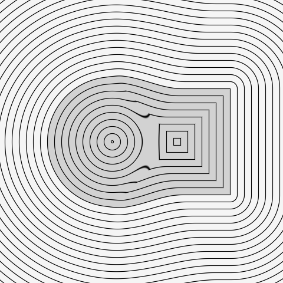

ノイズによる形状の歪み（応用）
--------------------------------

SDF は「座標を受け取って値を返す関数」であるため、:doc:`noise`\ で扱ったドメインワーピングと同じ要領で、評価する座標そのものをノイズで歪めてから距離関数に渡すことができる。円の SDF に、``fbm2d`` で作った歪みベクトルを加えた座標を渡すだけで、輪郭が波打った有機的なブロブ（水滴状の塊）になる。

正確な円のまま拡大縮小したい場合や、輪郭を保ったまま太らせたり細らせたりしたい場合には、歪める前に距離関数の値へ定数を足し引きするだけでよい（半径を変えるのと同じ効果になる）。座標を歪めるか、距離の値を直接いじるかで、図形の変形のしかたが変わる点は覚えておく価値がある。

.. _circle-packing:

円充填（サークルパッキング）
------------------------------

距離関数は、図形を描くだけでなく、平面の上にどれだけの隙間が残っているかを測る道具にもなる。その代表的な応用が、大きさの異なる円を互いに重ならないように敷き詰める\ **円充填**\ （circle packing）である。円を 1 つずつ置いていくとき、ある点を中心として置ける円の最大半径は、その点からもっとも近い既存の円の縁、またはキャンバスの端までの距離に等しい。既存の円までの距離は、全ての円の距離関数を ``union`` で合わせた和集合の距離関数そのものである。キャンバスの端までの距離は、キャンバスを表す矩形の距離関数の符号を反転したもの（内側で正になる）である。本節では、この 2 つのうち小さいほうを\ **空き距離** :math:`f(p)` と呼ぶ。

.. math::

   f(p) = \min\Bigl(-d_{\mathrm{canvas}}(p),\ \min_i d_{\mathrm{circle}, i}(p)\Bigr)

円を置く手順は次の通り。

1. キャンバスの端までの距離で、空き距離の場を初期化する。
2. 空き距離が最小半径以上の画素の中から、円の中心をランダムに 1 つ選ぶ。
3. 半径を、その画素の空き距離から円どうしの隙間の分を引いた値と、最大半径のうち小さいほうに決めて、円を置く。
4. 置いた円の距離関数を ``union`` で空き距離の場に重ねる。
5. 最小半径の円を置ける画素がなくなるか、指定した個数に達するまで、2-4 を繰り返す。

.. literalinclude:: ../examples/circle_packing.py
   :language: python
   :pyobject: pack_circles
   :caption: examples/circle_packing.py の pack_circles 関数

.. literalinclude:: ../examples/circle_packing.py
   :language: python
   :pyobject: canvas_distance
   :caption: examples/circle_packing.py の canvas_distance 関数

空き距離の場は画素ごとの配列として持ち、円を 1 つ置くたびに、画像全体に対して ``sdf_circle`` と ``union`` を 1 回ずつ計算する。候補の円を試しては既存の全ての円と重なりを調べる方法と違い、円を置ける場所の判定も半径の決定も、配列を見るだけで済む。

キャンバス全体に、置ける場所がなくなるまで円を詰めると次のようになる。空き距離は円を置くたびに小さくなるため、大きな円の隙間を中くらいの円が埋め、その隙間をさらに小さな円が埋める、という入れ子状の大きさの分布が自然に生まれる。

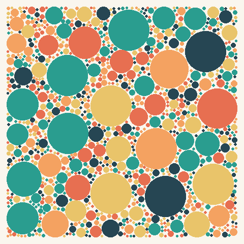

空き距離の場の初期値を変えれば、円を置ける領域も自由に決められる。前述の円と矩形の和集合の距離関数 :math:`d` について、図形の内側では符号を反転した :math:`-d` を、外側では :math:`d` をそのまま空き距離の初期値にする（どちらもキャンバスの端までの距離と ``union`` で合わせる）。内側と外側に別々の色で円を詰めると、色覚検査の図版のように、円の集まりだけで図形が浮かび上がる。空き距離は図形の境界までの実際の距離を超えないため、円が境界をまたぐことはない。

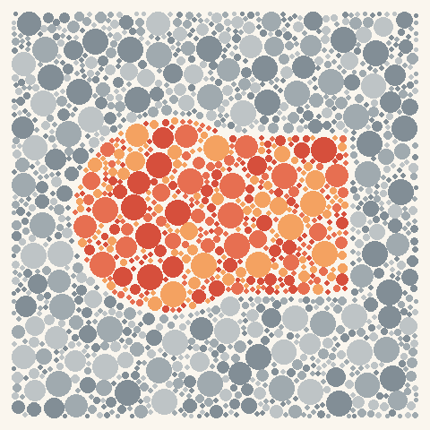

なお、半径を全て同じ値に固定して円をランダムに置いていく方法は、ダーツ投げ法（dart throwing）と呼ばれる素朴なポアソン円盤サンプリングにあたる。次節では、同じ性質の点配置をより効率よく作る方法を扱う。

ポアソン円盤サンプリング
--------------------------

次節のボロノイ図は、平面に散らした複数の種点から作られる。種点をどう配置するかによって、ボロノイ図の見た目は大きく変わる。フィロタキシスのように規則正しく並べれば整然としすぎる印象になり、単純な一様乱数で散らせば、粒が偏って固まる場所と大きな隙間ができる場所が混在してしまう。**ポアソン円盤サンプリング**\ は、この両極端の中間にあたる、「どの 2 点も最小距離以上離れているが、全体としては隙間なく埋め尽くされている」という\ **ブルーノイズ**\ 特性を持つ点配置を作る手法である。網膜の視細胞の並びなど、自然界の「均一だがランダムに見える」配置の多くがこの性質を持つ。

Bridson (2007) のアルゴリズムは、次の手順で点を追加していく。

1. 最初の点を 1 つランダムに置き、「アクティブリスト」に入れる。
2. アクティブリストから点を 1 つ選び、その周囲の環状領域（最小距離〜最小距離の 2 倍）から候補点を何度か試す。既存のどの点とも最小距離以上離れている候補が見つかれば採用し、アクティブリストへ加える。
3. 一定回数試しても候補が見つからなければ、その点をアクティブリストから外す。
4. アクティブリストが空になるまで 2-3 を繰り返す。

全ての既存点との距離を毎回総当たりで調べる方法は点数が :math:`n` のとき計算量が :math:`O(n^2)` になり点数が増えるにつれて遅くなるため、実装では「1 マスに点は高々 1 つしか入らない」大きさ（最小距離を :math:`\sqrt{2}` で割った値を 1 辺とする正方形）の格子に点を登録しておき、候補点の周囲 5×5 マス程度だけを調べることで高速化している。

.. literalinclude:: ../examples/poisson_disk.py
   :language: python
   :pyobject: poisson_disk_sampling
   :caption: examples/poisson_disk.py の poisson_disk_sampling 関数

同じ点数を一様乱数とポアソン円盤サンプリングで配置して比べると、一様乱数は粒の密集と隙間が目立つのに対し、ポアソン円盤サンプリングは間隔がそろっているのが分かる。

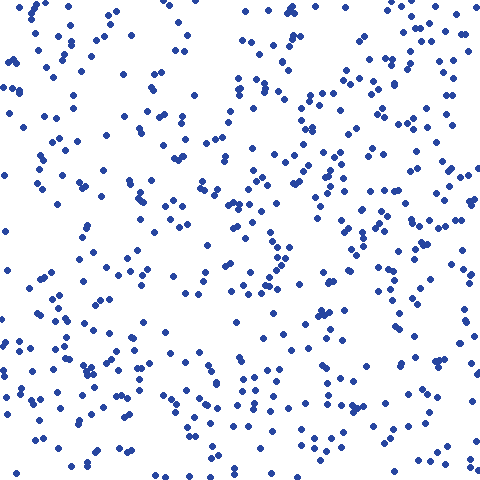

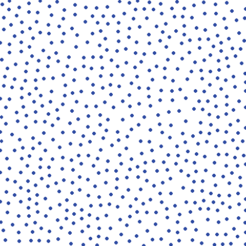

ボロノイ図とドロネー三角形分割
--------------------------------

ここまでは「1 つの図形までの距離」を扱ってきたが、同じ考え方は「複数の点のうちどれが一番近いか」にも一般化できる。平面上に散らした複数の\ **種点**\ のそれぞれについて、その点がもっとも近い種点となる領域で塗り分けたものを\ **ボロノイ図**\ （Voronoi diagram）と呼ぶ。実装は単純で、各画素から全ての種点までの距離を求め、最小値を与えた種点の番号を採用するだけである。

.. literalinclude:: ../examples/voronoi.py
   :language: python
   :pyobject: voronoi_regions
   :caption: examples/voronoi.py の voronoi_regions 関数

各領域に種点ごとの色を割り当てるとモザイク状の画像に、領域の境界線だけを描くと配線図のような画像になる。

.. literalinclude:: ../examples/voronoi.py
   :language: python
   :pyobject: render_edges
   :caption: examples/voronoi.py の render_edges 関数

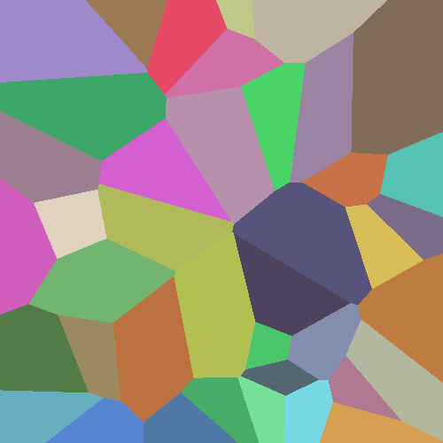

.. image:: _static/gallery/voronoi_edges.png
   :alt: 同じボロノイ図の領域境界線だけを描いた配線図のような画像
   :width: 300px

ボロノイ図で隣り合う（境界線を共有する）2 つの領域の種点どうしを線で結ぶと、その双対グラフである\ **ドロネー三角形分割**\ （Delaunay triangulation）が得られる。正式なドロネー三角形分割のアルゴリズムを実装する代わりに、ラスタ画像上で「隣接する画素の領域番号が異なる箇所」を総当たりで探すことで、隣接している種点のペアを求めている。

.. literalinclude:: ../examples/voronoi.py
   :language: python
   :pyobject: adjacent_pairs
   :caption: examples/voronoi.py の adjacent_pairs 関数

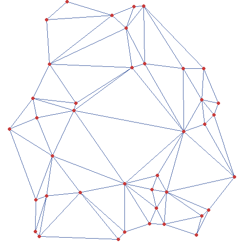

種点の配置を前節のポアソン円盤サンプリングに差し替えると、``voronoi_regions`` や ``render_mosaic`` のコードは一切変えずに、領域の大きさがそろった、より均質なモザイクが得られる。距離関数の評価対象を変えるだけで結果が大きく変わるという点は、SDF の節で座標を歪めたのと同じ構図である。

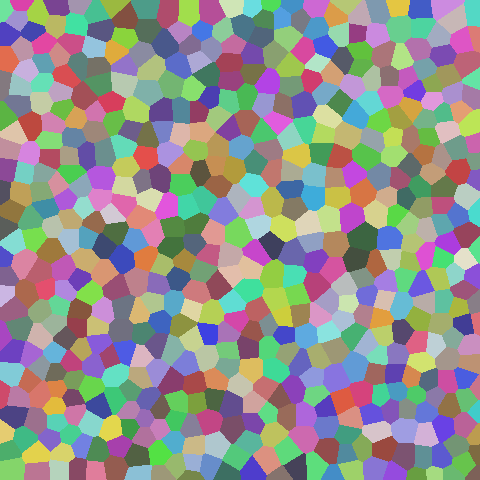

距離の測り方を変える
~~~~~~~~~~~~~~~~~~~~~~

これまでの距離関数は、全て普段馴染みのある\ **ユークリッド距離**\ （直線距離）を前提としていた。しかし「距離」の定義はこれだけではない。座標のずれ ``(dx, dy)`` から距離を計算する式を一般化した\ **ミンコフスキー距離** ``(|dx|^p + |dy|^p)^(1/p)`` を使うと、指数 ``p`` を変えるだけで異なる距離の測り方を統一的に表現できる。

.. math::

   \lVert (dx, dy) \rVert_p = \bigl(|dx|^p + |dy|^p\bigr)^{1/p}

- ``p = 1``: **マンハッタン距離**。斜めには進めず、東西方向・南北方向にしか移動できない場合の距離（碁盤の目状の街路を歩く距離）。
- ``p = 2``: **ユークリッド距離**。これまで使ってきた通常の直線距離。
- :math:`p = \infty`: **チェビシェフ距離**。``dx``・``dy`` のうち絶対値が大きい方だけで決まる距離（将棋の王が 1 手で到達できる範囲のイメージ）。

.. literalinclude:: ../examples/voronoi.py
   :language: python
   :pyobject: minkowski_distance
   :caption: examples/voronoi.py の minkowski_distance 関数

``voronoi_regions`` の距離計算をこの関数に差し替えるだけで、同じ種点の配置から全く違う印象のボロノイ図が得られる。ユークリッド距離では見慣れた凸多角形の領域になるのに対し、マンハッタン距離とチェビシェフ距離では、境界が軸方向と斜め 45 度の線分だけで構成された、角ばった領域になる。チェビシェフ距離はマンハッタン距離を 45 度回転させて縮尺を変えたものに相当するため、両者では軸方向の線分と斜めの線分の現れ方が入れ替わる。

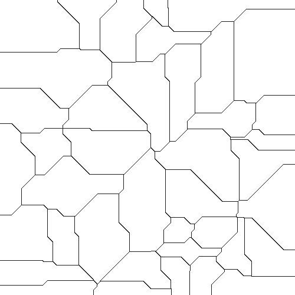

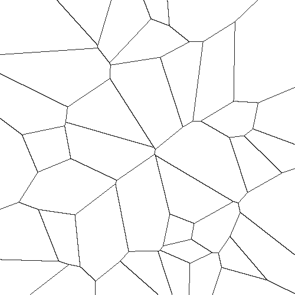

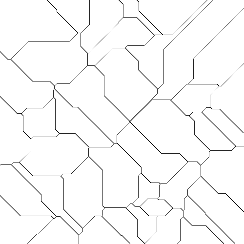

ボロノイ図・ドロネー三角形分割はどちらも、種点の配置さえ変えれば見た目が大きく変わる。種点を格子状に配置してから位置をわずかにランダムにずらす、あるいは\ :doc:`noise`\ のフローフィールドに沿って散らす、といった工夫をすることで、有機的な区画模様や、方向性を持ったひび割れ模様のような表現にもつなげられる。距離の測り方（本節）と種点の配置（前段落）は独立に組み合わせられるため、両方を変えるとさらに表現の幅が広がる。

.. _lloyd:

ロイド緩和（重心ボロノイ分割）
--------------------------------

ポアソン円盤サンプリングは、点どうしが近づきすぎないように、点を 1 つずつ加えていく手法だった。これとは別に、既にある点の配置を少しずつ動かして均等に近づける方法として、**ロイド緩和**\ （Lloyd relaxation）がある。手順は、次の 2 つを繰り返すだけである。

1. 現在の種点からボロノイ図を作る。
2. 各種点を、自分のボロノイ領域の重心へ移動させる。

周りに隙間の多い種点は、領域が大きく、重心が種点から離れているため、大きく動く。逆に、密集した種点は領域が小さく、ほとんど動かない。これを繰り返すと、全ての種点が自分の領域の重心とほぼ一致する\ **重心ボロノイ分割**\ （centroidal Voronoi tessellation）に近づき、領域の大きさと形がそろっていく。この手順は、Stuart Lloyd が信号の量子化のために考案したもので、k-means 法の標準的な計算手順と同じである。

前節の ``voronoi_regions`` は、全ての種点と全ての画素の組み合わせについての距離を一度に配列として持つため、種点が数千個になるとメモリが足りなくなる。そこで本節の実装では、画素を数行ずつに分けて、もっとも近い種点を求めている。重心は、領域番号ごとに座標の合計を求める ``np.bincount`` で計算する。

.. literalinclude:: ../examples/lloyd.py
   :language: python
   :pyobject: nearest_seed
   :caption: examples/lloyd.py の nearest_seed 関数

.. literalinclude:: ../examples/lloyd.py
   :language: python
   :pyobject: weighted_centroids
   :caption: examples/lloyd.py の weighted_centroids 関数

.. literalinclude:: ../examples/lloyd.py
   :language: python
   :pyobject: lloyd_relaxation
   :caption: examples/lloyd.py の lloyd_relaxation 関数

一様乱数で置いた 60 個の種点によるボロノイ図（左）に、ロイド緩和を 30 回適用すると、次のようになる（右）。大小ばらばらだった領域が、大きさのそろった、六角形に近い形の領域に変わる。

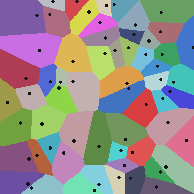

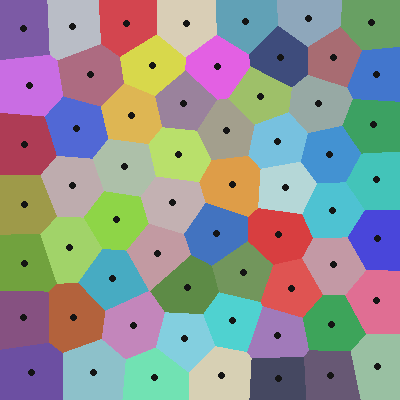

重心を求めるときに、画素ごとの重み（密度）を掛けると、各種点は領域の中で重みの大きい側へ引き寄せられ、重みの大きい場所に種点が集まる配置になる。この重み付きのロイド緩和は、:ref:`stippling`\ で画像の濃淡を点の密度で表すのに使う。
