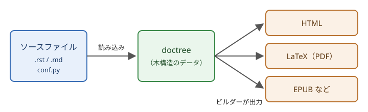

.. _ch-introduction:

===========
Sphinx とは
===========

この章では、Sphinx の概要と特徴、ドキュメントが生成されるまでの流れを説明します。

Sphinx の概要
=============

Sphinx は、テキスト形式で書いたソースファイルから、HTML や PDF などの形式のドキュメントを生成するツールです。もともとは Python の公式ドキュメントを作成するために開発されたもので、現在も Python の公式ドキュメントは Sphinx で作られています。Python 以外の言語のプロジェクトや、ソフトウェアとは関係のない技術ドキュメントにも広く使われています。

ソースファイルは、主に :term:`reStructuredText`\ （以下 reST）という軽量マークアップ言語で書きます。拡張機能を追加すれば、Markdown で書くこともできます。

Sphinx の主な特徴
=================

Sphinx には、次のような特徴があります。

複数の出力形式
   1 つのソースファイルから、HTML、PDF（LaTeX 経由）、EPUB、man ページなど、さまざまな形式のドキュメントを出力できます。

ドキュメントの構造の管理
   :term:`toctree` という仕組みで複数のソースファイルを 1 つのドキュメントにまとめ、目次や前後のページへのリンクを自動で作ります。

相互参照
   章や図表、用語、Python のクラスや関数などに\ :term:`ラベル`\ を付け、ドキュメント内のどこからでも参照できます。参照先の見出しや番号は自動で埋め込まれ、リンク切れはビルド時に警告されます。

API ドキュメントの自動生成
   :term:`autodoc` 拡張機能を使うと、Python のコードに書いた :term:`docstring` から API ドキュメントを生成できます。

拡張性
   多くの拡張機能が標準で付属しており、サードパーティの拡張機能やテーマも豊富です。Python で独自の拡張機能を書くこともできます。

他のツールとの比較
==================

ドキュメント生成ツールには、Sphinx のほかにも、C や C++ のライブラリでよく使われる Doxygen などがあります。Sphinx と Doxygen の特徴を\ :numref:`table-tool-comparison` に示します。

.. _table-tool-comparison:

.. list-table:: Sphinx と Doxygen の比較
   :header-rows: 1
   :stub-columns: 1
   :widths: 20 40 40

   * - 項目
     - Sphinx
     - Doxygen
   * - 主な入力形式
     - reST、Markdown（拡張機能）
     - ソースコード中のコメント
   * - 主な出力形式
     - HTML、PDF、EPUB など
     - HTML、LaTeX など
   * - API ドキュメントの生成
     - autodoc で Python に対応
     - C++ などのソースコードを解析
   * - 向いている用途
     - 章立てのある技術ドキュメント、Python のライブラリ
     - C や C++ のライブラリのリファレンス

Doxygen はソースコードのコメントからリファレンスを作ることが中心のツールです。これに対して Sphinx は、章立てのある技術ドキュメントを書くことが中心で、Python の API ドキュメントもその一部として組み込めます。PDF などの複数の形式で配布したいドキュメントにも Sphinx が向いています。Markdown で書きたい場合も、MyST-Parser という拡張機能を使えば Sphinx で扱えます（:ref:`sec-myst`）。

ドキュメントが生成されるまでの流れ
==================================

Sphinx は、ソースファイルを読み込んでから出力するまでを、大きく 2 つの段階に分けて処理します（:numref:`fig-build-flow`）。

.. _fig-build-flow:

   Sphinx がドキュメントを生成する流れ

1. 読み込み：:term:`ソースディレクトリ`\ にあるソースファイルと ``conf.py`` を読み込み、ソースファイルごとに :term:`doctree` という木構造のデータに変換します。このとき、ラベルや目次などの情報も収集します。
2. 書き出し：:term:`ビルダー`\ が doctree の相互参照を解決し、HTML や LaTeX などの形式に変換して\ :term:`ビルドディレクトリ`\ に書き出します。

読み込んだ doctree はビルドディレクトリに保存されます。2 回目以降のビルドでは、変更のあったソースファイルだけが読み込み直されるため、ビルドにかかる時間が短くなります。

出力形式ごとにビルダーが用意されているため、同じソースファイルから別の形式のドキュメントを作るときは、ビルダーを切り替えるだけで済みます。ビルダーの種類は\ :ref:`sec-builders`\ で説明します。
