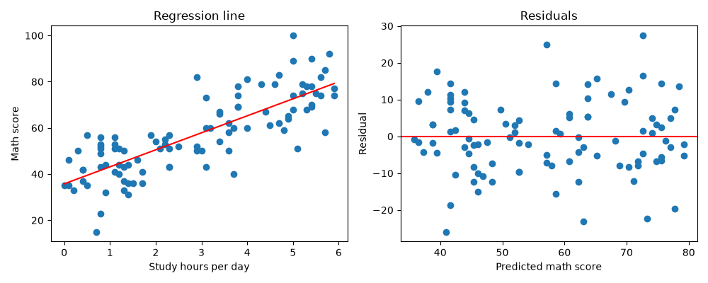

相関と回帰
==========

:doc:`visualization`\ の散布図では、学習時間が長い生徒ほど数学の点数が高い傾向が見られました。この章では、2 つの量的変数の関係の強さを相関係数で表し、一方の変数から他方の変数を予測する単回帰分析を学びます。

以下では、:math:`n` 組のデータを :math:`(x_1, y_1), (x_2, y_2), \ldots, (x_n, y_n)` と表し、:math:`x` と :math:`y` の標本平均を :math:`\bar{x}, \bar{y}`、標準偏差を :math:`s_x, s_y` と表します。

共分散
------

2 つの変数の偏差の積の平均値を\ **共分散**\ といいます。

.. math::

   s_{xy} = \frac{1}{n} \sum_{i=1}^{n} (x_i - \bar{x})(y_i - \bar{y})

:math:`x` が平均値より大きいときに :math:`y` も平均値より大きくなりやすい場合、偏差の積は正になりやすく、共分散は正になります。逆の傾向がある場合、共分散は負になります。ただし、共分散の大きさは変数の単位によって変わるため（たとえば、学習時間を「時間」から「分」に変えると 60 倍になります）、関係の強さを比べる指標には向きません。

ピアソンの相関係数
------------------

共分散を 2 つの変数の標準偏差で割った値を\ **ピアソンの相関係数**、または単に\ **相関係数**\ といいます。

.. math::

   r = \frac{s_{xy}}{s_x s_y}

相関係数は単位に依存せず、:math:`-1 \le r \le 1` の値をとります。:math:`r` が 1 に近いほど強い正の相関（右上がりの直線的な関係）、:math:`-1` に近いほど強い負の相関（右下がりの直線的な関係）があり、0 に近いときは直線的な関係がほとんどないことを表します。なお、:math:`s_{xy}, s_x, s_y` をすべて :math:`n - 1` で割った値で計算しても、分母と分子で打ち消し合うため、相関係数の値は変わりません。

相関係数は、直線的な関係の強さだけを表す指標です。たとえば、:math:`y = x^2` のような U 字型の関係がある場合でも、相関係数は 0 に近くなることがあります。また、少数の外れ値によって値が大きく変わることもあります。相関係数を計算するときは、必ず散布図も確認してください。

スピアマンの順位相関係数
------------------------

各変数の値を順位（小さいほうから 1, 2, 3, ……）に置き換えてから、ピアソンの相関係数を計算した値を\ **スピアマンの順位相関係数**\ といいます。一方が増えると他方も増える（または減る）という単調な関係の強さを表します。直線的な関係でなくてもよく、順位を使うため外れ値の影響を受けにくいという特徴があります。順序尺度の変数にも使えます。

無相関の検定
------------

標本から計算した相関係数が 0 でなくても、偶然によるものかもしれません。母集団の相関係数 :math:`\rho` が 0 であるかを調べる検定を\ **無相関の検定**\ といいます。帰無仮説は :math:`H_0: \rho = 0` です。SciPy の ``stats.pearsonr`` は、相関係数と無相関の検定の p 値を同時に計算します。

相関と因果
----------

相関があることは、一方が他方の原因であること（**因果関係**）を意味しません。たとえば、アイスクリームの売上と水難事故の件数には正の相関がありますが、アイスクリームが水難事故の原因ではありません。どちらも気温が高いと増えるためです。このように、2 つの変数の両方に影響する別の変数によって生じる見かけの相関を\ **疑似相関**\ といいます。

サンプルデータの学習時間と数学の点数の相関も、それだけでは「学習時間を増やせば点数が上がる」ことの根拠にはなりません。因果関係を調べるには、実験を計画するなどの別の方法が必要です。

単回帰分析
----------

一方の変数 :math:`x` から他方の変数 :math:`y` を予測する直線

.. math::

   \hat{y} = a + b x

を求めることを\ **単回帰分析**\ といい、この直線を\ **回帰直線**\ といいます。:math:`x` を\ **説明変数**、:math:`y` を\ **目的変数**、:math:`a` を\ **切片**、:math:`b` を\ **傾き**\ （回帰係数）といいます。:math:`\hat{y}` は「ワイハット」と読み、予測値を表します。

最小二乗法
^^^^^^^^^^

実測値と予測値の差 :math:`e_i = y_i - \hat{y}_i` を\ **残差**\ といいます。残差の 2 乗和が最小になるように :math:`a` と :math:`b` を決める方法を\ **最小二乗法**\ といいます。

.. math::

   \sum_{i=1}^{n} e_i^2 = \sum_{i=1}^{n} \left( y_i - (a + b x_i) \right)^2

この式を最小にする :math:`a` と :math:`b` は、次のようになります。

.. math::

   b = \frac{s_{xy}}{s_x^2}, \quad a = \bar{y} - b \bar{x}

2 つ目の式から、回帰直線は必ず点 :math:`(\bar{x}, \bar{y})` を通ることがわかります。

決定係数
^^^^^^^^

回帰直線がデータにどの程度当てはまっているかを表す指標が\ **決定係数** :math:`R^2` です。

.. math::

   R^2 = 1 - \frac{\sum_{i=1}^{n} (y_i - \hat{y}_i)^2}{\sum_{i=1}^{n} (y_i - \bar{y})^2}

分母は :math:`y` の全体のばらつき、分子は回帰直線で説明できずに残ったばらつきを表します。したがって、:math:`R^2` は、:math:`y` のばらつきのうち回帰直線で説明できる割合を表し、0 から 1 の値をとります。単回帰分析では、決定係数は相関係数の 2 乗 :math:`r^2` に等しくなります。

残差の確認
^^^^^^^^^^

回帰直線を求めたら、横軸に予測値、縦軸に残差をとったグラフ（**残差プロット**）を確認します。残差が 0 の周りに特定のパターンなく散らばっていれば、直線による当てはめは妥当と考えられます。残差が曲線状に並んでいる場合は、2 つの変数の関係が直線ではない可能性があります。

Python で計算する
-----------------

次のプログラムは、学習時間（説明変数）と数学の点数（目的変数）について、共分散と相関係数を計算し、単回帰分析を行います。定義どおりに計算した値と、NumPy や SciPy の関数で計算した値を比べています。

:download:`ch10_correlation_regression.py をダウンロードする <../examples/ch10_correlation_regression.py>`

.. literalinclude:: ../examples/ch10_correlation_regression.py
   :language: python
   :linenos:

実行結果は次のとおりです。

.. code-block:: text

   --- 相関 ---
   共分散: 24.479
   ピアソンの相関係数（定義どおり）: 0.803
   ピアソンの相関係数（NumPy）: 0.803
   無相関の検定の p 値: 8.93e-24
   スピアマンの順位相関係数: 0.802

   --- 単回帰分析 ---
   切片（定義どおり）: 35.771、傾き（定義どおり）: 7.364
   切片（scipy）: 35.771、傾き（scipy）: 7.364
   決定係数: 0.645
   相関係数の 2 乗: 0.645
   学習時間 4 時間の予測値: 65.2 点

保存されるグラフは次のとおりです。左は散布図と回帰直線、右は残差プロットです。

結果の読み方
------------

* 相関係数は 0.803 で、学習時間と数学の点数には強い正の相関があります。無相関の検定の p 値は非常に小さく、母集団の相関係数が 0 であるという帰無仮説は棄却されます。
* スピアマンの順位相関係数（0.802）もピアソンの相関係数とほぼ同じ値です。散布図にも極端な外れ値や曲線的な関係は見られません。
* 回帰直線は :math:`\hat{y} = 35.771 + 7.364 x` です。傾き 7.364 は、学習時間が 1 時間長い生徒は、数学の点数が平均的に約 7.4 点高いことを表しています。前述のとおり、これは因果関係を示すものではありません。
* 決定係数は 0.645 で、数学の点数のばらつきの約 65 % が学習時間によって説明できることを表しています。決定係数が相関係数の 2 乗に一致することも確認できます。
* 残差プロットでは、残差が 0 の周りに特定のパターンなく散らばっており、直線による当てはめは妥当と考えられます。
* 学習時間 4 時間の生徒の数学の点数の予測値は 65.2 点です。ただし、回帰直線による予測は、データの範囲（学習時間 0 ～ 5.9 時間）の中で行うべきです。データの範囲の外の予測（たとえば学習時間 10 時間の予測値は約 109 点で、満点を超えます）は信頼できません。
