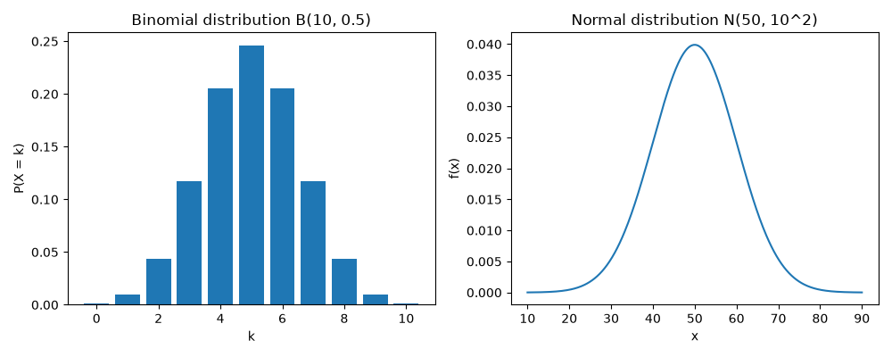

確率と確率分布
==============

標本から母集団を推測するには、データが偶然によってどのようにばらつくかを確率で表す必要があります。この章では、確率変数と確率分布の考え方を学び、代表的な確率分布を SciPy で計算します。

確率変数と確率分布
------------------

サイコロの出る目のように、とる値が確率的に決まる変数を\ **確率変数**\ といいます。確率変数は大文字の :math:`X` などで表し、実際に観測された値は小文字の :math:`x` などで表します。確率変数がとる値と、その値をとる確率との対応を\ **確率分布**\ といいます。

確率変数は、とる値の種類によって次の 2 つに分けられます。

.. list-table::
   :header-rows: 1
   :widths: 20 40 40

   * - 種類
     - 確率分布の表し方
     - 例
   * - 離散型確率変数
     - **確率質量関数** :math:`P(X = k)` で、各値をとる確率を表す。
     - サイコロの目、コインの表が出る回数
   * - 連続型確率変数
     - **確率密度関数** :math:`f(x)` で表す。値が区間 :math:`a \le X \le b` に入る確率は、:math:`f(x)` のグラフと横軸で挟まれた部分のうち、その区間の面積になる。
     - 身長、測定の誤差

連続型確率変数が、ある 1 つの値にちょうど一致する確率は 0 です。そのため、連続型確率変数では「区間に入る確率」を考えます。

どちらの種類でも、確率変数が :math:`x` 以下の値をとる確率 :math:`F(x) = P(X \le x)` を\ **累積分布関数**\ といいます。

期待値と分散
------------

確率変数がとる値を確率で重み付けした平均値を\ **期待値**\ といい、:math:`E[X]` または :math:`\mu` で表します。離散型確率変数の期待値は次の式で定義します。

.. math::

   E[X] = \sum_{k} k \, P(X = k)

確率変数のばらつきを表す\ **分散** :math:`V[X]` は、期待値からの差の 2 乗の期待値です。

.. math::

   V[X] = E\left[(X - \mu)^2\right]

分散の正の平方根 :math:`\sigma = \sqrt{V[X]}` を\ **標準偏差**\ といいます。これらは、:doc:`descriptive_statistics`\ で学んだデータの平均値・分散・標準偏差を、確率分布に対して定義したものです。連続型確率変数では、総和の代わりに確率密度関数を使った積分で定義します。

代表的な確率分布
----------------

二項分布
^^^^^^^^

成功する確率が :math:`p` の試行を、互いに影響しない状態で :math:`n` 回繰り返したときの成功回数 :math:`X` は、**二項分布** :math:`B(n, p)` に従います。たとえば、コインを 10 回投げたときに表が出る回数は :math:`B(10, 0.5)` に従います。

.. math::

   P(X = k) = {}_n \mathrm{C}_k \, p^k (1 - p)^{n - k} \quad (k = 0, 1, \ldots, n)

ここで、:math:`{}_n \mathrm{C}_k` は :math:`n` 個から :math:`k` 個を選ぶ組合せの数です。期待値は :math:`E[X] = np`、分散は :math:`V[X] = np(1 - p)` です。

ポアソン分布
^^^^^^^^^^^^

一定の時間や範囲の中で、まれな出来事が起こる回数は\ **ポアソン分布** :math:`Po(\lambda)` で表されることが多くあります。たとえば、1 時間あたりの問い合わせの件数や、1 ページあたりの誤字の数です。:math:`\lambda` は出来事が起こる平均回数です。

.. math::

   P(X = k) = \frac{\lambda^k e^{-\lambda}}{k!} \quad (k = 0, 1, 2, \ldots)

ポアソン分布の期待値と分散は、どちらも :math:`\lambda` です。

正規分布
^^^^^^^^

**正規分布** :math:`N(\mu, \sigma^2)` は、平均値 :math:`\mu` を中心とした左右対称の釣り鐘型の分布で、統計学で最もよく使われる連続型の確率分布です。測定の誤差や、多数の小さな要因が積み重なって決まる量は、正規分布で近似できることが多くあります。確率密度関数は次の式で表されます。

.. math::

   f(x) = \frac{1}{\sqrt{2 \pi} \, \sigma} \exp\left( -\frac{(x - \mu)^2}{2 \sigma^2} \right)

期待値は :math:`\mu`、分散は :math:`\sigma^2` です。平均値 0、分散 1 の正規分布 :math:`N(0, 1)` を\ **標準正規分布**\ といいます。:math:`X` が :math:`N(\mu, \sigma^2)` に従うとき、標準化した値 :math:`Z = (X - \mu) / \sigma` は標準正規分布に従います。

正規分布では、値が平均値 ± 1 標準偏差の範囲に入る確率は約 68 %、± 2 標準偏差の範囲では約 95 %、± 3 標準偏差の範囲では約 99.7 % です。

scipy.stats の使い方
--------------------

SciPy の ``scipy.stats`` モジュールには、多くの確率分布が用意されています。たとえば、``stats.binom(10, 0.5)`` で二項分布 :math:`B(10, 0.5)` を、``stats.norm(loc=50, scale=10)`` で正規分布 :math:`N(50, 10^2)` を表すオブジェクトを作れます。``scale`` には分散ではなく標準偏差を指定することに注意してください。作成したオブジェクトには、次のメソッドがあります。

.. list-table::
   :header-rows: 1
   :widths: 25 75

   * - メソッド
     - 計算する値
   * - ``pmf(k)``
     - 確率質量関数 :math:`P(X = k)`\ （離散型のみ）
   * - ``pdf(x)``
     - 確率密度関数 :math:`f(x)`\ （連続型のみ）
   * - ``cdf(x)``
     - 累積分布関数 :math:`P(X \le x)`
   * - ``sf(x)``
     - :math:`P(X > x) = 1 - P(X \le x)`
   * - ``ppf(q)``
     - 累積分布関数の値が :math:`q` になる :math:`x`\ （累積分布関数の逆関数）
   * - ``rvs(size)``
     - 確率分布に従う乱数
   * - ``mean()``、``var()``
     - 期待値、分散

Python で計算する
-----------------

次のプログラムは、3 つの確率分布の確率を計算し、二項分布と正規分布のグラフを保存します。

:download:`ch05_probability_distribution.py をダウンロードする <../examples/ch05_probability_distribution.py>`

.. literalinclude:: ../examples/ch05_probability_distribution.py
   :language: python
   :linenos:

実行結果は次のとおりです。

.. code-block:: text

   --- 二項分布 B(10, 0.5) ---
   表がちょうど 5 回出る確率: 0.2461
   表が 3 回以下になる確率: 0.1719
   期待値: 5.00、分散: 2.50

   --- ポアソン分布 Po(3) ---
   0 件の確率: 0.0498
   1 件の確率: 0.1494
   2 件の確率: 0.2240
   3 件の確率: 0.2240
   4 件の確率: 0.1680
   5 件の確率: 0.1008
   6 件以上の確率: 0.0839
   期待値: 3.00、分散: 3.00

   --- 正規分布 N(50, 10^2) ---
   60 以下になる確率: 0.8413
   40 以上 60 以下になる確率: 0.6827
   下側の確率が 0.975 になる値: 69.60
   平均値 ± 1 標準偏差の範囲に入る確率: 0.6827
   平均値 ± 2 標準偏差の範囲に入る確率: 0.9545
   平均値 ± 3 標準偏差の範囲に入る確率: 0.9973

保存されるグラフは次のとおりです。左が二項分布 :math:`B(10, 0.5)` の確率質量関数、右が正規分布 :math:`N(50, 10^2)` の確率密度関数です。

結果の読み方
------------

* コインを 10 回投げたとき、表がちょうど 5 回出る確率は約 25 % しかありません。期待値は :math:`np = 10 \times 0.5 = 5`、分散は :math:`np(1 - p) = 2.5` で、式で求めた値と一致します。
* 1 時間に平均 3 件の問い合わせがあるとき、6 件以上になる確率は約 8 % です。``sf(5)`` は :math:`P(X > 5)`、つまり :math:`P(X \ge 6)` を計算します。
* :math:`N(50, 10^2)` で下側の確率が 0.975 になる値は 69.60 です。これは :math:`50 + 1.96 \times 10` であり、標準正規分布では下側の確率が 0.975 になる値が約 1.96 であることを表しています。この 1.96 という値は、:doc:`estimation`\ で信頼区間を求めるときに使います。
* ± 1、± 2、± 3 標準偏差の範囲に入る確率は、それぞれ約 68 %、約 95 %、約 99.7 % で、前述の性質と一致します。
