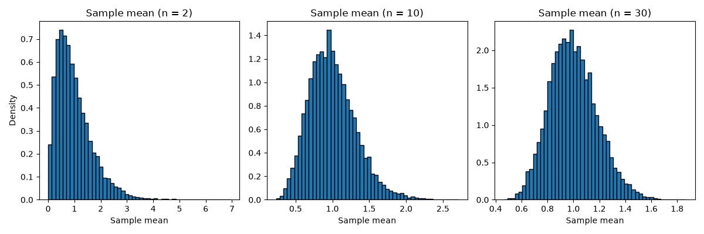

標本分布と中心極限定理
======================

標本から計算した平均値は、どの標本を取り出すかによって値が変わります。この章では、標本平均がどのようにばらつくかを調べ、推定と検定の土台となる中心極限定理を、乱数を使ったシミュレーションで確かめます。

統計量と標本分布
----------------

標本平均や不偏分散のように、標本から計算する値を\ **統計量**\ といいます。母集団から標本を無作為に取り出す場合、どの標本が得られるかは確率的に決まるため、統計量も確率変数です。統計量が従う確率分布を\ **標本分布**\ といいます。

以下では、平均値 :math:`\mu`、分散 :math:`\sigma^2` の母集団から、大きさ :math:`n` の標本 :math:`X_1, X_2, \ldots, X_n` を互いに独立に取り出すとします。標本平均を次のように表します。

.. math::

   \bar{X} = \frac{1}{n} \sum_{i=1}^{n} X_i

標本平均の期待値と分散
----------------------

標本平均の期待値と分散は、次のようになります。

.. math::

   E[\bar{X}] = \mu, \quad V[\bar{X}] = \frac{\sigma^2}{n}

1 つ目の式は、標本平均は平均的に見て母平均に一致することを表しています。2 つ目の式は、標本の大きさ :math:`n` が大きいほど、標本平均のばらつきが小さくなることを表しています。

標本平均の標準偏差 :math:`\sigma / \sqrt{n}` を\ **標準誤差**\ といいます。標準誤差は :math:`\sqrt{n}` に反比例するため、標準誤差を半分にするには、標本の大きさを 4 倍にする必要があります。

大数の法則
----------

標本の大きさ :math:`n` を大きくすると、標本平均 :math:`\bar{X}` は母平均 :math:`\mu` に近づきます。これを\ **大数の法則**\ といいます。たとえば、サイコロを振る回数を増やすと、出た目の平均値は期待値 :math:`(1 + 2 + \cdots + 6) / 6 = 3.5` に近づきます。

中心極限定理
------------

母集団がどのような分布であっても（分散が有限であれば）、標本の大きさ :math:`n` が大きいとき、標本平均 :math:`\bar{X}` の分布は正規分布 :math:`N(\mu, \sigma^2 / n)` で近似できます。これを\ **中心極限定理**\ といいます。

中心極限定理により、母集団の分布がわからなくても、標本平均については正規分布を使って確率を計算できます。これが、:doc:`estimation`\ と\ :doc:`hypothesis_testing`\ で正規分布や t 分布を使う理由です。

Python でシミュレーションする
-----------------------------

次のプログラムは、2 つのシミュレーションを行います。

* 大数の法則: サイコロを 100,000 回振り、最初の 10 回、100 回、……までの出た目の平均値を表示します。
* 中心極限定理: 平均値 1、標準偏差 1 の\ **指数分布**\ から、大きさ :math:`n` の標本を取り出して標本平均を計算します。これを 10,000 回繰り返し、標本平均の分布を調べます。指数分布は左右対称ではなく、右に長い裾を持つ分布です。

:download:`ch06_sampling_distribution.py をダウンロードする <../examples/ch06_sampling_distribution.py>`

.. literalinclude:: ../examples/ch06_sampling_distribution.py
   :language: python
   :linenos:

実行結果は次のとおりです。

.. code-block:: text

   --- 大数の法則（サイコロの目の平均値） ---
        10 回: 3.5000
       100 回: 3.5100
      1000 回: 3.4930
     10000 回: 3.5012
    100000 回: 3.4974

   --- 標本平均の平均値と標準偏差 ---
   n =  2: 平均値 0.9875、標準偏差 0.6910（理論値 0.7071）
   n = 10: 平均値 0.9960、標準偏差 0.3174（理論値 0.3162）
   n = 30: 平均値 0.9984、標準偏差 0.1836（理論値 0.1826）

保存されるグラフは次のとおりです。左から順に、:math:`n = 2, 10, 30` のときの標本平均のヒストグラムです。

結果の読み方
------------

* サイコロの目の平均値は、振る回数が増えるにつれて 3.5 の近くで安定します。最初の 10 回でちょうど 3.5 になっているのは偶然です。回数が少ないうちは、平均値は大きく変動します。
* どの :math:`n` でも、標本平均の平均値は母平均 1 にほぼ一致しています。これは :math:`E[\bar{X}] = \mu` を表しています。
* 標本平均の標準偏差は、理論値 :math:`\sigma / \sqrt{n} = 1 / \sqrt{n}` にほぼ一致しています。
* :math:`n = 2` のヒストグラムは、元の指数分布と同じように右に長い裾を持っています。:math:`n` が大きくなるにつれて左右対称に近づき、:math:`n = 30` では正規分布に近い釣り鐘型になっています。これが中心極限定理です。

「:math:`n` が 30 以上あれば正規分布で近似してよい」という目安がよく使われますが、これはあくまで目安です。母集団の分布の偏りが大きいほど、正規分布で近似するにはより大きな :math:`n` が必要になります。
