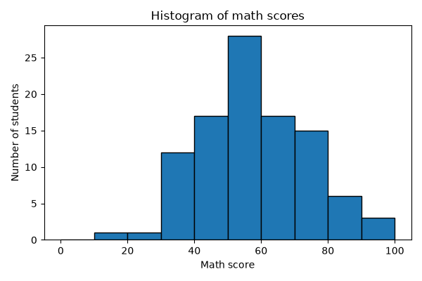
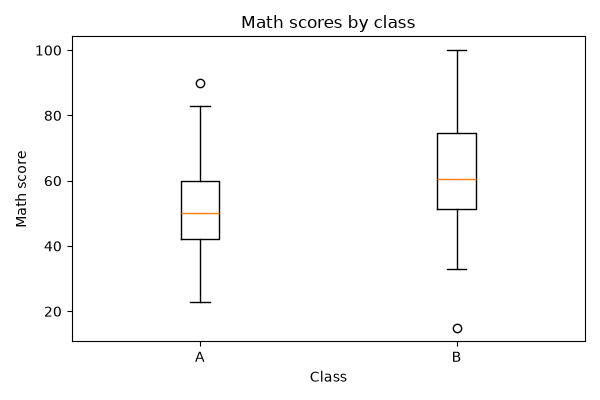
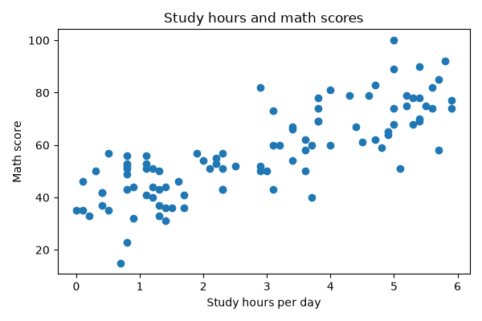
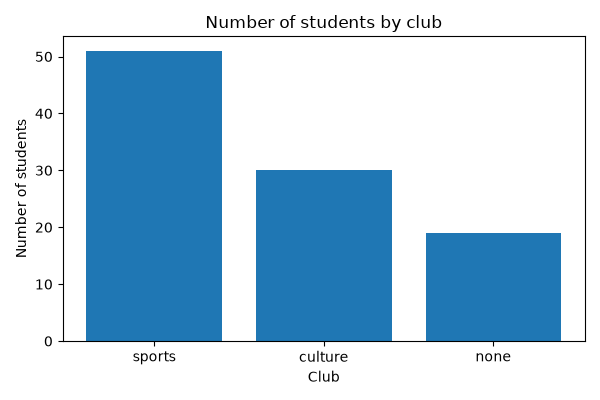

データの可視化
==============

数値による要約だけでは、データの分布の形や外れ値に気付けないことがあります。この章では、matplotlib を使って代表的なグラフを作成し、それぞれのグラフから何が読み取れるかを学びます。

グラフの選び方
--------------

目的と変数の種類に応じて、次のようにグラフを選びます。

.. list-table::
   :header-rows: 1
   :widths: 35 25 40

   * - 目的
     - グラフ
     - 使う変数
   * - 1 つの量的変数の分布の形を見る。
     - ヒストグラム
     - 量的変数 1 つ
   * - 複数のグループの分布を比べる。
     - 箱ひげ図
     - 量的変数 1 つと質的変数 1 つ
   * - 2 つの量的変数の関係を見る。
     - 散布図
     - 量的変数 2 つ
   * - 質的変数の度数を比べる。
     - 棒グラフ
     - 質的変数 1 つ

グラフを作成するプログラム
--------------------------

次のプログラムは、この章で説明する 4 種類のグラフを作成し、PNG ファイルとして保存します。

:download:`ch04_visualization.py をダウンロードする <../examples/ch04_visualization.py>`

.. literalinclude:: ../examples/ch04_visualization.py
   :language: python
   :linenos:

プログラムの要点は次のとおりです。

* ``matplotlib.use("Agg")`` は、グラフを画面に表示せず、ファイルへの保存だけを行う設定です。画面に表示したい場合は、この行を削除し、``fig.savefig(path)`` の代わりに ``plt.show()`` を呼び出してください。
* ``plt.subplots`` で図（``fig``）と描画領域（``ax``）を作成し、``ax`` のメソッドでグラフを描きます。
* グラフの軸ラベルとタイトルは英語にしています。matplotlib で日本語を表示するには日本語フォントの設定が必要になるためです。

ヒストグラム
------------

**ヒストグラム**\ は、データの範囲をいくつかの区間（**階級**）に分け、各区間に入るデータの個数（**度数**）を棒の高さで表したグラフです。次の図は、数学の点数を 10 点刻みの階級に分けたヒストグラムです。

ヒストグラムからは、分布の山の位置、山の数、左右の対称性、外れ値の有無がわかります。この図では、50 点台に山が 1 つあり、山の右側（高得点の側）のほうが左側よりゆるやかに減っています。つまり、高得点の側に少し裾が長い分布です。これは、:doc:`descriptive_statistics`\ で平均値が中央値よりやや大きかったことと一致しています。

階級の幅によってヒストグラムの見た目は大きく変わります。幅が広すぎると分布の細かな形がわからなくなり、狭すぎると各階級の度数が少なくなって形が読み取りにくくなります。いくつかの幅で描いて比べるとよいでしょう。

箱ひげ図
--------

**箱ひげ図**\ は、四分位数を使って分布を要約したグラフです。次の図は、クラス別の数学の点数の箱ひげ図です。

箱ひげ図の各部分は、次の値を表します（matplotlib の既定の設定の場合）。

.. list-table::
   :header-rows: 1
   :widths: 30 70

   * - 部分
     - 表す値
   * - 箱の下端と上端
     - 第 1 四分位数 :math:`Q_1` と第 3 四分位数 :math:`Q_3`
   * - 箱の中の線
     - 中央値
   * - ひげ
     - 箱の端から四分位範囲の 1.5 倍以内にあるデータのうち、最も外側のデータまで
   * - 丸印
     - ひげの外側にあるデータ（外れ値の候補）

この図から、B クラスは A クラスより中央値が高く、全体的に点数が高い傾向があることがわかります。このような差が偶然によるものかどうかは、:doc:`statistical_tests`\ で検定します。

散布図
------

**散布図**\ は、2 つの量的変数の値の組を平面上の点として表したグラフです。次の図は、1 日あたりの学習時間と数学の点数の散布図です。

点が右上がりに分布しており、学習時間が長い生徒ほど数学の点数が高い傾向があることがわかります。このような関係の強さを数値で表す方法は、:doc:`correlation_regression`\ で説明します。

棒グラフ
--------

**棒グラフ**\ は、質的変数の値ごとの度数などを棒の高さで表したグラフです。次の図は、部活動ごとの人数の棒グラフです。

ヒストグラムと棒グラフは見た目が似ていますが、ヒストグラムは量的変数の分布を、棒グラフは質的変数の値ごとの度数を表します。ヒストグラムの横軸は数値の区間であるため、棒の並び順には意味があり、棒の間は空けずに描きます。一方、名義尺度の変数の棒グラフでは、棒の並び順に意味はありません。そのため、度数の多い順に並べると比較しやすくなります（``value_counts`` は度数の多い順に結果を返します）。
