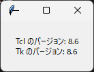

1. tkinter の概要
=================

1.1 tkinter とは
----------------

tkinter は、Python に標準で付属している GUI ライブラリです。名前は「Tk interface」に由来します。python.org で配布されている Windows 版と macOS 版のインストーラーには tkinter が含まれているため、追加のインストールは不要です。Linux では、ディストリビューションによっては別のパッケージ（Debian や Ubuntu の ``python3-tk`` など）をインストールする必要があります。

tkinter の主な長所と短所は次のとおりです。

.. list-table::
   :header-rows: 1
   :widths: 20 80

   * - 区分
     - 内容
   * - 長所
     - 標準ライブラリなので、追加のインストールなしで使えます。Windows、macOS、Linux で同じコードが動作します。仕組みが単純で、少ないコードで GUI を作成できます。
   * - 短所
     - 標準のウィジェットの見た目は、最近のアプリケーションと比べると簡素です。動画の再生や Web ページの表示など、高度な機能は用意されていません。

小規模なツールや社内向けのアプリケーション、GUI プログラミングの学習には tkinter が適しています。より高度な機能が必要な場合は、PySide6 などのライブラリを検討してください。

.. _tcl-tk:

1.2 Tcl/Tk との関係
-------------------

Tk は、Tcl というスクリプト言語のために作られた GUI ツールキットです。tkinter は、Python の中で Tcl のインタープリターを動かし、そのインタープリターを通して Tk を操作します。Python で ``tk.Tk()`` を呼び出すと、内部で Tcl のインタープリターが 1 つ作成されます。

Tk の公式リファレンスは Tcl の書式で書かれているため、Python の書式に読み替える必要があります。対応の例を次に示します。

.. list-table::
   :header-rows: 1
   :widths: 30 35 35

   * - 操作
     - Tcl の書式
     - Python の書式
   * - ボタンの作成
     - ``ttk::button .b -text Hello``
     - ``b = ttk.Button(root, text="Hello")``
   * - オプションの変更
     - ``.b configure -text Bye``
     - ``b.configure(text="Bye")``
   * - 配置
     - ``pack .b -side left``
     - ``b.pack(side="left")``

Tcl ではオプション名の前に ``-`` を付けますが、Python ではキーワード引数として指定します。

.. _tk-ttk:

1.3 tk と ttk
-------------

tkinter には、昔からある ``tkinter`` モジュールのウィジェットと、Tk 8.5 で追加された ``tkinter.ttk`` モジュールのウィジェットがあります。ttk は「themed Tk」の略で、OS に合わせたテーマで描画されるため、見た目が OS 標準のアプリケーションに近くなります。

.. list-table::
   :header-rows: 1
   :widths: 30 70

   * - 分類
     - ウィジェットの例
   * - 両方のモジュールにあるもの
     - Button、Label、Entry、Frame、Checkbutton、Radiobutton、Scale、Scrollbar、Spinbox
   * - ttk だけにあるもの
     - Combobox、Notebook、Progressbar、Treeview、Separator
   * - tk だけにあるもの
     - Text、Canvas、Listbox、Menu、Toplevel

同じ名前のウィジェットでも、tk と ttk では指定できるオプションが異なります。たとえば、tk のウィジェットは ``bg`` オプションで背景色を指定できますが、ttk のウィジェットでは色やフォントを\ :doc:`スタイル <09_style>`\ で指定します。

本資料では、ttk にあるウィジェットは ttk のものを使い、ttk にないウィジェットだけ tk のものを使います。

1.4 動作確認
------------

tkinter が使えるかどうかは、次のコマンドで確認できます。

.. code-block:: console

   python -m tkinter

Tcl/Tk のバージョンが書かれた小さなウィンドウが表示されれば、tkinter を使う準備はできています。``ModuleNotFoundError`` が表示される場合は、:doc:`付録 A <appendix_a_troubleshooting>` を参照してください。

次のサンプルコードは、Tcl と Tk のバージョンをコンソールとウィンドウに表示します。``tk.TclVersion`` と ``tk.TkVersion`` は、``8.6`` のような浮動小数点数です。

.. literalinclude:: ../examples/ch01_check_version.py
   :language: python
   :caption: ch01_check_version.py
   :linenos:

:download:`ch01_check_version.py をダウンロード <../examples/ch01_check_version.py>`

   実行結果
