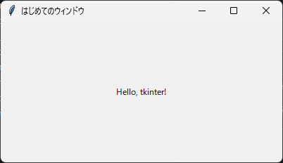

2. 最初のウィンドウ
===================

.. _main-window:

2.1 ウィンドウを表示する
------------------------

tkinter で空のウィンドウを表示するには、次の 3 行を書くだけで十分です。

.. code-block:: python

   import tkinter as tk

   root = tk.Tk()
   root.mainloop()

``tk.Tk()`` は、アプリケーションのメインウィンドウを作成します。このウィンドウは、すべてのウィジェットの親（根）になるため、変数名には ``root`` がよく使われます。``tk.Tk()`` は 1 つのアプリケーションで 1 回だけ呼び出します。2 つ目以降のウィンドウが必要な場合は、:doc:`第 7 章 <07_menu_dialog>`\ で説明する ``tk.Toplevel`` を使います。

.. _event-loop:

2.2 mainloop の役割
-------------------

``mainloop`` メソッドは、イベントループを開始します。イベントループは、マウスのクリックやキー入力、ウィンドウの再描画といったイベントが発生するのを待ち、イベントに対応する処理を呼び出す処理を繰り返します。

``mainloop`` はウィンドウが閉じられるまで戻りません。したがって、``mainloop`` の後に書いた処理は、ウィンドウを閉じた後に実行されます。反対に、``mainloop`` を呼び出さずにスクリプトが終了すると、ウィンドウは表示されてもすぐに消えてしまいます。

2.3 ウィンドウの設定
--------------------

``Tk`` オブジェクトのメソッドを使うと、ウィンドウのタイトルや大きさを設定できます。主なメソッドを次に示します。

.. list-table::
   :header-rows: 1
   :widths: 40 60

   * - メソッド
     - 説明
   * - ``title("文字列")``
     - タイトルバーに表示する文字列を設定します。
   * - ``geometry("幅x高さ+X+Y")``
     - ウィンドウの大きさと位置をピクセル単位で設定します。``"400x200"`` のように大きさだけ、``"+100+100"`` のように位置だけを指定することもできます。
   * - ``minsize(幅, 高さ)``
     - ユーザーが縮められる最小の大きさを設定します。
   * - ``maxsize(幅, 高さ)``
     - ユーザーが広げられる最大の大きさを設定します。
   * - ``resizable(横, 縦)``
     - 横方向と縦方向のそれぞれについて、大きさの変更を許可するかどうかを ``True`` または ``False`` で設定します。
   * - ``attributes("-topmost", True)``
     - ウィンドウを常に最前面に表示します。

``geometry`` の文字列に含まれる ``x`` は、小文字のアルファベットのエックスです。

これらの設定を加えたサンプルコードを次に示します。

.. literalinclude:: ../examples/ch02_hello_window.py
   :language: python
   :caption: ch02_hello_window.py
   :linenos:

:download:`ch02_hello_window.py をダウンロード <../examples/ch02_hello_window.py>`

   実行結果

``ttk.Label`` は文字列を表示するウィジェットで、``pack`` はウィジェットをウィンドウに配置するメソッドです。どちらも次の章以降で詳しく説明します。

.. _event-driven:

2.4 イベント駆動プログラミング
------------------------------

上から順に処理を実行して終了する通常のスクリプトと異なり、GUI アプリケーションは、ユーザーの操作をきっかけに処理を実行します。このような書き方をイベント駆動プログラミングと呼びます。

tkinter のプログラムは、一般に次の流れで動作します。

#. ``tk.Tk()`` でメインウィンドウを作成します。
#. ウィジェットを作成して配置します。
#. ボタンが押されたときなどに呼び出す関数（コールバック関数）を登録します。
#. ``mainloop`` でイベントループを開始します。
#. イベントが発生するたびに、登録したコールバック関数が呼び出されます。

コールバック関数を実行している間、イベントループは次のイベントを処理できません。そのため、コールバック関数の中で時間のかかる処理を実行すると、画面が反応しなくなります。この問題への対処方法は\ :doc:`第 10 章 <10_long_task>`\ で説明します。
