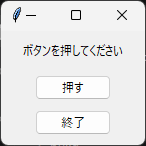
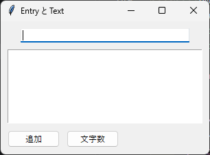

3. 基本ウィジェット
===================

ウィンドウに配置するボタンや入力欄などの部品を、ウィジェットと呼びます。この章では、よく使う基本的なウィジェットとして、Label、Button、Entry、Text を説明します。

.. _widget-common:

3.1 ウィジェットの共通事項
--------------------------

作成と親ウィジェット
^^^^^^^^^^^^^^^^^^^^

ウィジェットを作成するときは、最初の引数に親ウィジェットを指定します。親ウィジェットには、メインウィンドウや、ウィジェットをまとめる Frame などを指定します。

.. code-block:: python

   label = ttk.Label(root, text="こんにちは")

配置
^^^^

作成しただけのウィジェットは画面に表示されません。``pack``、``grid``、``place`` のいずれかのメソッドで配置して、はじめて表示されます。この章のサンプルコードでは ``pack`` を使います。配置の方法は\ :doc:`第 4 章 <04_layout>`\ で詳しく説明します。

オプションの設定と取得
^^^^^^^^^^^^^^^^^^^^^^

ウィジェットの表示内容や動作は、オプションで指定します。オプションは、作成時にキーワード引数で指定するほか、作成後に ``configure`` メソッドで変更できます。現在の値は ``cget`` メソッドで取得します。

.. code-block:: python

   label = ttk.Label(root, text="こんにちは")  # 作成時に指定
   label.configure(text="さようなら")          # 作成後に変更
   print(label.cget("text"))                   # 現在の値を取得

``label["text"] = "さようなら"`` のように、辞書と同じ書き方でオプションを読み書きすることもできます。

多くのウィジェットに共通する主なオプションを次に示します。

.. list-table::
   :header-rows: 1
   :widths: 25 75

   * - オプション
     - 説明
   * - ``text``
     - 表示する文字列です。
   * - ``width``
     - ウィジェットの幅です。文字列を表示するウィジェットでは、文字数で指定します。
   * - ``state``
     - ``"normal"`` で操作可能、``"disabled"`` で操作不可になります。
   * - ``command``
     - ボタンなどが操作されたときに呼び出す関数です。
   * - ``textvariable``
     - 表示内容と連動させる変数です。:doc:`第 5 章 <05_variables>`\ で説明します。

ウィジェットが不要になったら ``destroy`` メソッドで破棄します。メインウィンドウの ``destroy`` を呼び出すと、ウィンドウが閉じてアプリケーションが終了します。

3.2 Label
---------

Label は、文字列や画像を表示するウィジェットです。ユーザーは Label の内容を編集できません。主なオプションを次に示します。

.. list-table::
   :header-rows: 1
   :widths: 25 75

   * - オプション
     - 説明
   * - ``text``
     - 表示する文字列です。``\n`` で改行できます。
   * - ``image``
     - 表示する画像（``tk.PhotoImage`` など）です。
   * - ``anchor``
     - ウィジェット内での文字列の位置です。``"w"``\ （左）、``"center"``\ （中央）、``"e"``\ （右）などを指定します。
   * - ``wraplength``
     - 指定した長さ（ピクセル）を超えると、文字列を折り返します。
   * - ``padding``
     - 文字列の周りの余白です（ttk のみ）。

3.3 Button
----------

Button は、クリックされたときに処理を実行するウィジェットです。実行する処理は ``command`` オプションに関数として指定します。

次のサンプルコードは、ボタンが押された回数を Label に表示します。

.. literalinclude:: ../examples/ch03_label_button.py
   :language: python
   :caption: ch03_label_button.py
   :linenos:

:download:`ch03_label_button.py をダウンロード <../examples/ch03_label_button.py>`

   実行結果

``on_click`` は ``main`` 関数の中で定義した関数（入れ子の関数）です。``main`` 関数のローカル変数 ``count`` を書き換えるため、``nonlocal`` 宣言をしています。

.. warning::

   ``command`` には関数そのものを指定します。``command=on_click()`` と書くと、ウィジェットの作成時に ``on_click`` が 1 回だけ実行され、その戻り値の ``None`` が ``command`` に設定されてしまいます。引数を渡したい場合の書き方は\ :doc:`第 6 章 <06_events>`\ で説明します。

「終了」ボタンの ``command`` には ``root.destroy`` を指定しています。ボタンを押すとメインウィンドウが破棄され、``mainloop`` から処理が戻ってアプリケーションが終了します。

.. _entry:

3.4 Entry
---------

Entry は、1 行の文字列を入力するウィジェットです。主なメソッドを次に示します。

.. list-table::
   :header-rows: 1
   :widths: 35 65

   * - メソッド
     - 説明
   * - ``get()``
     - 入力されている文字列を返します。
   * - ``insert(位置, 文字列)``
     - 指定した位置に文字列を挿入します。
   * - ``delete(開始, 終了)``
     - 開始位置から終了位置の手前までの文字列を削除します。
   * - ``focus_set()``
     - キーボードからの入力を受け付ける状態（フォーカスがある状態）にします。

位置は、先頭を ``0`` とする整数で指定します。末尾は ``"end"`` で表します。したがって、``entry.delete(0, "end")`` で入力内容をすべて削除できます。

パスワードの入力欄のように入力内容を隠したい場合は、``show="*"`` オプションを指定します。

.. _text-widget:

3.5 Text
--------

Text は、複数行の文字列を入力・表示するウィジェットです。ttk には Text がないため、tk の ``tk.Text`` を使います。

Text では、文字の位置を ``"行.列"`` の形式の文字列（インデックス）で表します。行は 1 から、列は 0 から数えます。よく使うインデックスを次に示します。

.. list-table::
   :header-rows: 1
   :widths: 30 70

   * - インデックス
     - 意味
   * - ``"1.0"``
     - 1 行目の先頭（文書の先頭）です。
   * - ``"end"``
     - 文書の末尾です。Text は末尾に改行を 1 つ自動で付けるため、その改行の後ろを指します。
   * - ``"end-1c"``
     - ``"end"`` の 1 文字手前です。自動で付く改行を除いた末尾を指します。
   * - ``"insert"``
     - 入力カーソルの位置です。

文字列の取得、挿入、削除には、次のメソッドを使います。

.. code-block:: python

   content = text.get("1.0", "end-1c")  # すべての文字列を取得
   text.insert("end", "追加する文字列\n")  # 末尾に挿入
   text.delete("1.0", "end")  # すべて削除

次のサンプルコードは、Entry に入力した文字列を、ボタンを押したときに Text の末尾に追加します。

.. literalinclude:: ../examples/ch03_entry_text.py
   :language: python
   :caption: ch03_entry_text.py
   :linenos:

:download:`ch03_entry_text.py をダウンロード <../examples/ch03_entry_text.py>`

   実行結果

Text の主なオプションには、行の折り返し方を指定する ``wrap``\ （``"none"``、``"char"``、``"word"``）と、「元に戻す」機能を有効にする ``undo`` があります。どちらも\ :doc:`第 12 章 <12_practice_memo_app>`\ で使います。
