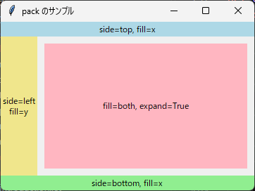
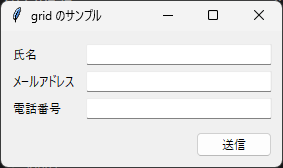
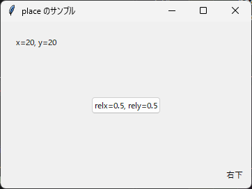
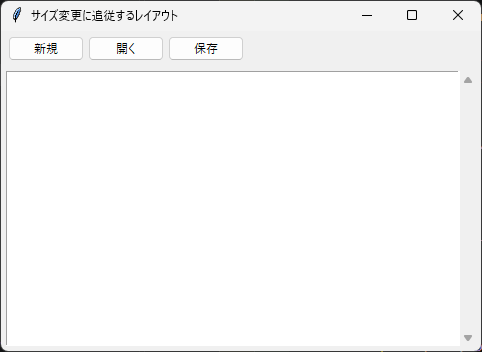

4. レイアウト管理
=================

.. _geometry-manager:

4.1 ジオメトリマネージャーとは
------------------------------

ウィジェットの位置と大きさを決める仕組みを、ジオメトリマネージャーと呼びます。tkinter には次の 3 種類のジオメトリマネージャーがあり、ウィジェットのメソッドとして呼び出します。

.. list-table::
   :header-rows: 1
   :widths: 15 45 40

   * - メソッド
     - 特徴
     - 向いている用途
   * - ``pack``
     - ウィジェットを上下左右の端から順に詰めて配置します。
     - ボタンを 1 列に並べる、領域を上下や左右に分ける
   * - ``grid``
     - ウィジェットを行と列からなる表のセルに配置します。
     - 入力フォームなど、縦横をそろえて並べる画面
   * - ``place``
     - 座標を指定して配置します。
     - ほかのウィジェットの上に重ねる場合など、特殊な配置

4.2 pack
--------

``pack`` は、親ウィジェットの空いている領域の端から、ウィジェットを順に詰めて配置します。主なオプションを次に示します。

.. list-table::
   :header-rows: 1
   :widths: 20 80

   * - オプション
     - 説明
   * - ``side``
     - 詰める方向です。``"top"``\ （既定値）、``"bottom"``、``"left"``、``"right"`` のいずれかを指定します。
   * - ``fill``
     - 割り当てられた領域いっぱいにウィジェットを広げる方向です。``"x"``、``"y"``、``"both"``、``"none"``\ （既定値）のいずれかを指定します。
   * - ``expand``
     - ``True`` を指定すると、親ウィジェットの余った領域をこのウィジェットにも割り当てます。
   * - ``padx``、``pady``
     - ウィジェットの外側の余白（ピクセル）です。``(左, 右)`` のようにタプルで指定すると、両側に異なる余白を設定できます。
   * - ``ipadx``、``ipady``
     - ウィジェットの内側の余白（ピクセル）です。
   * - ``anchor``
     - 割り当てられた領域の中での位置です。``"n"``\ （上）、``"w"``\ （左）、``"center"`` などを指定します。

``fill`` と ``expand`` は混同しやすいオプションです。``expand`` は「ウィジェットに割り当てる領域を広げるかどうか」を、``fill`` は「割り当てられた領域の中でウィジェット自体を広げるかどうか」を指定します。

.. literalinclude:: ../examples/ch04_pack.py
   :language: python
   :caption: ch04_pack.py
   :linenos:

:download:`ch04_pack.py をダウンロード <../examples/ch04_pack.py>`

   実行結果

``pack`` は、呼び出した順に空いている領域を割り当てます。このサンプルコードでは上端と下端のラベルを先に配置したため、左端のラベルは上下のラベルに挟まれた高さになります。配置する順序を変えると、結果も変わります。

4.3 grid
--------

``grid`` は、ウィジェットを行（row）と列（column）で指定したセルに配置します。行と列の番号は 0 から数えます。主なオプションを次に示します。

.. list-table::
   :header-rows: 1
   :widths: 25 75

   * - オプション
     - 説明
   * - ``row``、``column``
     - 配置するセルの行番号と列番号です。
   * - ``rowspan``、``columnspan``
     - ウィジェットがまたがる行数と列数です。
   * - ``sticky``
     - セルの中でウィジェットを寄せる方向です。``"n"``\ （上）、``"s"``\ （下）、``"e"``\ （右）、``"w"``\ （左）を組み合わせて指定します。``"ew"`` で横方向、``"nsew"`` で縦横両方向にセルいっぱいまで広がります。
   * - ``padx``、``pady``
     - ウィジェットの外側の余白（ピクセル）です。``pack`` と同じく、タプルで両側に異なる余白を設定できます。

次のサンプルコードでは、ウィジェットをまとめる Frame（:ref:`4.5 <frame-nest>` 参照）の中に、入力フォームを作っています。

.. literalinclude:: ../examples/ch04_grid.py
   :language: python
   :caption: ch04_grid.py
   :linenos:

:download:`ch04_grid.py をダウンロード <../examples/ch04_grid.py>`

   実行結果

``columnconfigure`` と ``rowconfigure`` の ``weight`` については、:ref:`resize`\ で説明します。

4.4 place
---------

``place`` は、座標を指定してウィジェットを配置します。主なオプションを次に示します。

.. list-table::
   :header-rows: 1
   :widths: 30 70

   * - オプション
     - 説明
   * - ``x``、``y``
     - 親ウィジェットの左上を原点とする座標（ピクセル）です。
   * - ``relx``、``rely``
     - 親ウィジェットの幅と高さに対する相対位置です。``0.0`` が左端（上端）、``1.0`` が右端（下端）です。
   * - ``relwidth``、``relheight``
     - 親ウィジェットに対する相対的な幅と高さです。
   * - ``anchor``
     - ウィジェットのどの点を指定した座標に合わせるかを指定します。``"nw"``\ （左上、既定値）、``"center"``、``"se"``\ （右下）などがあります。

``x`` と ``relx`` のように絶対指定と相対指定を同時に指定すると、両者を足した位置になります。

.. literalinclude:: ../examples/ch04_place.py
   :language: python
   :caption: ch04_place.py
   :linenos:

:download:`ch04_place.py をダウンロード <../examples/ch04_place.py>`

   実行結果

``place`` は自由に配置できる反面、フォントの大きさや OS が変わるとウィジェットが重なったりはみ出したりしやすくなります。通常の画面は ``pack`` と ``grid`` で作成してください。

.. _frame-nest:

4.5 Frame による入れ子構造
--------------------------

Frame は、ほかのウィジェットをまとめるための入れ物となるウィジェットです。画面を Frame でいくつかの領域に分け、それぞれの Frame の中にウィジェットを配置すると、複雑な画面も整理して作成できます。

ジオメトリマネージャーは親ウィジェットごとに選べます。たとえば、ウィンドウの中で Frame を ``pack`` で上下に並べ、ある Frame の中では ``grid`` を使う、という組み合わせができます。

.. _resize:

4.6 ウィンドウサイズの変更への対応
----------------------------------

``grid`` で配置した画面は、既定ではウィンドウを広げても各セルの大きさが変わらず、余った領域は空白になります。余った領域をどの行や列に割り当てるかは、親ウィジェットの ``rowconfigure`` と ``columnconfigure`` で指定します。

.. code-block:: python

   frame.columnconfigure(0, weight=1)  # 0 列目に余った幅を割り当てる
   frame.rowconfigure(0, weight=1)     # 0 行目に余った高さを割り当てる

``weight`` の値は、余った領域を分配する比率です。既定値は 0 で、0 の行や列には余った領域が割り当てられません。セルが広がったときにウィジェットも広げるには、``sticky`` もあわせて指定します。

次のサンプルコードは、上部のツールバーを ``pack`` で、下部の編集領域を ``grid`` で配置します。ウィンドウの大きさを変えると、Text だけが伸び縮みします。

.. literalinclude:: ../examples/ch04_resize.py
   :language: python
   :caption: ch04_resize.py
   :linenos:

:download:`ch04_resize.py をダウンロード <../examples/ch04_resize.py>`

   実行結果

Text と Scrollbar は、互いのメソッドをオプションに指定して連携させています。この仕組みは\ :doc:`第 8 章 <08_advanced_widgets>`\ で説明します。

4.7 使い分けの指針
------------------

.. warning::

   同じ親ウィジェットの中で ``pack`` と ``grid`` を混在させることはできません。混在させると ``_tkinter.TclError`` が発生します。異なる方法で配置したい場合は、Frame で親ウィジェットを分けてください。

ジオメトリマネージャーは、次の指針で使い分けるとよいでしょう。

* ウィジェットを 1 列に並べる場合や、画面を上下左右の領域に分ける場合は ``pack`` を使います。
* 縦と横の位置をそろえたい場合は ``grid`` を使います。
* 複雑な画面は Frame で領域に分け、領域ごとに ``pack`` か ``grid`` を選びます。
* ``place`` は、ほかの方法では実現できない配置に限って使います。
