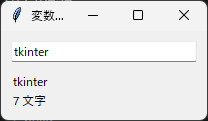
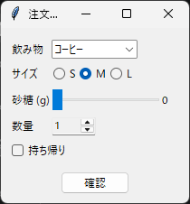

5. 変数クラスと選択ウィジェット
===============================

.. _variable-class:

5.1 変数クラスとは
------------------

tkinter には、ウィジェットの表示内容と連動する特別な変数（変数クラス）が用意されています。変数クラスの値を変更すると、その変数を指定したウィジェットの表示が自動で更新されます。反対に、ユーザーがウィジェットを操作すると、変数クラスの値が更新されます。

.. list-table::
   :header-rows: 1
   :widths: 30 30 40

   * - クラス
     - 値の型
     - 主な用途
   * - ``tk.StringVar``
     - ``str``
     - Entry や Label の文字列
   * - ``tk.IntVar``
     - ``int``
     - Spinbox や Scale の整数値
   * - ``tk.DoubleVar``
     - ``float``
     - Scale の小数値
   * - ``tk.BooleanVar``
     - ``bool``
     - Checkbutton のオンとオフ

値は ``get`` メソッドで取得し、``set`` メソッドで設定します。初期値は ``value`` 引数で指定できます。

.. code-block:: python

   name = tk.StringVar(value="tkinter")
   print(name.get())  # tkinter
   name.set("Python")

.. note::

   変数クラスは、内部で Tcl の変数を使っています。そのため、``tk.Tk()`` でメインウィンドウを作成する前に変数クラスを作成すると、``RuntimeError`` が発生します。

   また、Python 側の変数クラスのオブジェクトがどこからも参照されなくなると、Tcl の変数も削除され、ウィジェットとの連動が失われます。変数クラスのオブジェクトは、ウィンドウを表示している間、参照を保持してください。本資料のサンプルコードでは、``mainloop`` を呼び出す ``main`` 関数のローカル変数や、クラスの属性として保持しています。

5.2 ウィジェットとの連携
------------------------

変数クラスをウィジェットに結び付けるには、ウィジェットの種類に応じて次のオプションを使います。

.. list-table::
   :header-rows: 1
   :widths: 30 70

   * - オプション
     - 使用するウィジェット
   * - ``textvariable``
     - Label、Entry、Combobox、Spinbox、Button など、文字列を表示・入力するウィジェット
   * - ``variable``
     - Checkbutton、Radiobutton、Scale、Progressbar など、値を選択・表示するウィジェット

次のサンプルコードでは、Entry と Label に同じ ``StringVar`` を指定しています。Entry に入力すると、同じ文字列が Label にも表示されます。

.. literalinclude:: ../examples/ch05_variables.py
   :language: python
   :caption: ch05_variables.py
   :linenos:

:download:`ch05_variables.py をダウンロード <../examples/ch05_variables.py>`

   実行結果

5.3 値の変更を監視する
----------------------

変数クラスの ``trace_add`` メソッドを使うと、値が変わったときに関数を呼び出せます。前節のサンプルコードでは、この機能を使って文字数の表示を更新しています。

.. code-block:: python

   name.trace_add("write", update_length)

最初の引数には、監視する操作を指定します。``"write"``\ （値の書き込み）のほか、``"read"``\ （値の読み込み）と ``"unset"``\ （変数の削除）を指定できます。呼び出される関数には、変数名、インデックス、操作の種類の 3 つの引数が渡されます。これらを使わない場合は、サンプルコードのように ``*args`` でまとめて受け取ると簡潔に書けます。

``trace_add`` は監視の ID を返します。監視をやめるときは、``trace_remove(操作, ID)`` を呼び出します。

5.4 選択ウィジェットの例
------------------------

ここからは、決められた選択肢から値を選ぶためのウィジェットを説明します。まず、それらを組み合わせた注文フォームのサンプルコードを示します。確認ボタンで使っている ``messagebox`` は、:doc:`第 7 章 <07_menu_dialog>`\ で説明します。

.. literalinclude:: ../examples/ch05_selection_widgets.py
   :language: python
   :caption: ch05_selection_widgets.py
   :linenos:

:download:`ch05_selection_widgets.py をダウンロード <../examples/ch05_selection_widgets.py>`

   実行結果

5.5 Checkbutton
---------------

Checkbutton は、オンとオフを切り替えるウィジェットです。``variable`` に ``BooleanVar`` を指定すると、オンのときに ``True``、オフのときに ``False`` が設定されます。``onvalue`` と ``offvalue`` オプションで、設定する値を変更することもできます。

5.6 Radiobutton
---------------

Radiobutton は、複数の選択肢から 1 つを選ぶウィジェットです。同じ変数を ``variable`` に指定した Radiobutton が 1 つのグループになり、グループの中で 1 つだけが選択されます。選択されると、その Radiobutton の ``value`` オプションの値が変数に設定されます。

5.7 Combobox
------------

Combobox は、ドロップダウンリストから値を選ぶウィジェットです。選択肢は ``values`` オプションにリストで指定します。

``state="readonly"`` を指定すると、選択肢以外の文字列を入力できなくなります。指定しない場合は、Entry と同じように自由に文字列を入力できます。選択肢が選ばれたときに処理を実行するには、``<<ComboboxSelected>>`` イベントを ``bind`` します（:doc:`第 6 章 <06_events>`\ 参照）。

5.8 Scale と Spinbox
--------------------

Scale はスライダーで、Spinbox は矢印ボタンで数値を選ぶウィジェットです。範囲は ``from_`` と ``to`` オプションで指定します。``from`` は Python の予約語のため、オプション名の末尾に ``_`` が付いています。

``ttk.Scale`` の値は小数になります。整数として扱いたい場合は、サンプルコードの ``round_sugar`` 関数のように、``command`` オプションで指定した関数の中で丸めます。この関数には、Scale の現在の値が文字列で渡されます。

Spinbox は、``increment`` オプションで増減の幅を指定できます。また、``values`` オプションに選択肢を指定すると、数値以外の値も選べます。
