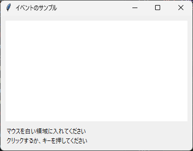
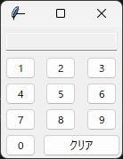

6. イベント処理
===============

ユーザーの操作に応じて処理を実行するには、``command`` オプションを使う方法と、``bind`` メソッドを使う方法があります。

6.1 command による処理
----------------------

Button や Checkbutton などのウィジェットは、``command`` オプションに指定した関数を、ウィジェットが操作されたときに呼び出します。

.. list-table::
   :header-rows: 1
   :widths: 40 60

   * - ウィジェット
     - 関数が呼び出される操作
   * - Button
     - クリックされたとき
   * - Checkbutton、Radiobutton
     - 選択状態が変わったとき
   * - Scale
     - 値が変わったとき（現在の値が引数として渡されます）
   * - Spinbox
     - 矢印ボタンで値が変わったとき
   * - Menu の項目
     - 項目が選ばれたとき

Scale 以外では、関数は引数なしで呼び出されます。``command`` は手軽ですが、ウィジェットごとに決められた操作にしか対応できません。それ以外の操作に対応するには、次節の ``bind`` を使います。

6.2 bind による処理
-------------------

``bind`` メソッドを使うと、マウスの移動やキー入力など、さまざまなイベントに関数を結び付けられます。

.. code-block:: python

   widget.bind("<Button-1>", on_click)

最初の引数はイベントの種類を表す文字列（イベントシーケンス）で、2 番目の引数はイベントが発生したときに呼び出す関数です。この関数には、イベントの情報を持つ ``tk.Event`` オブジェクトが 1 つ渡されます。

次のサンプルコードは、マウスの座標、クリック、キー入力の情報を画面に表示します。

.. literalinclude:: ../examples/ch06_bind_events.py
   :language: python
   :caption: ch06_bind_events.py
   :linenos:

:download:`ch06_bind_events.py をダウンロード <../examples/ch06_bind_events.py>`

   実行結果

キーボードのイベントは、フォーカスを持つウィジェットに送られます。このサンプルコードでは、ウィンドウのどこにフォーカスがあってもキー入力を受け取れるように、メインウィンドウ ``root`` に ``bind`` しています。その理由は :ref:`bindtags` で説明します。

.. note::

   ``tk.Event[tk.Misc]`` は、イベントの型ヒントです。``tk.Misc`` はすべてのウィジェットの基底クラスで、「どのウィジェットで発生したイベントでもよい」ことを表します。ファイルの先頭の ``from __future__ import annotations`` は、Python 3.10 でもこの型ヒントを問題なく書けるようにするためのものです。

.. _event-sequence:

6.3 イベントシーケンスの書式
----------------------------

イベントシーケンスは、``<修飾キー-種類-詳細>`` の形式で書きます。修飾キーと詳細は省略できます。よく使うイベントシーケンスを次に示します。

.. list-table::
   :header-rows: 1
   :widths: 35 65

   * - イベントシーケンス
     - 発生するタイミング
   * - ``<Button-1>``
     - マウスの左ボタンが押されたとき（``<ButtonPress-1>`` と同じ）。ボタン番号を省略した ``<ButtonPress>`` は、どのボタンでも発生します。
   * - ``<Button-3>``
     - マウスの右ボタンが押されたとき（Windows と Linux の場合）
   * - ``<ButtonRelease-1>``
     - マウスの左ボタンが離されたとき
   * - ``<Double-Button-1>``
     - 左ボタンがダブルクリックされたとき
   * - ``<B1-Motion>``
     - 左ボタンを押したままマウスが動いたとき（ドラッグ）
   * - ``<Motion>``
     - マウスが動いたとき
   * - ``<Enter>``、``<Leave>``
     - マウスがウィジェットに入ったとき、出たとき
   * - ``<MouseWheel>``
     - マウスのホイールが回されたとき（Windows と macOS の場合。Linux では、上方向が ``<Button-4>``、下方向が ``<Button-5>`` として発生します）
   * - ``<Key>``
     - いずれかのキーが押されたとき
   * - ``<Return>``、``<Escape>``
     - Enter キー、Esc キーが押されたとき
   * - ``<Control-s>``
     - Ctrl キーを押しながら S キーが押されたとき
   * - ``<FocusIn>``、``<FocusOut>``
     - ウィジェットがフォーカスを得たとき、失ったとき
   * - ``<Configure>``
     - ウィジェットの大きさや位置が変わったとき
   * - ``<<ListboxSelect>>`` など
     - ウィジェットが独自に発生させるイベント（仮想イベント）。二重の山かっこで囲みます。

キーの名前は大文字と小文字を区別します。``<Control-s>`` は小文字の s を表すため、Shift キーを押しているときや Caps Lock が有効なときには発生しません。大文字の S には ``<Control-S>`` を使います。

1 つのウィジェットに複数のイベントシーケンスを ``bind`` した場合、1 つのイベントに対しては、条件が最も詳しいイベントシーケンスの関数だけが呼び出されます。サンプルコードでは、Ctrl + S を押すと ``<Key>`` よりも詳しい ``<Control-s>`` の関数だけが呼び出されます。

6.4 Event オブジェクトの属性
----------------------------

``bind`` で呼び出される関数に渡される ``tk.Event`` オブジェクトには、次のような属性があります。イベントの種類によっては意味を持たない属性もあります。

.. list-table::
   :header-rows: 1
   :widths: 25 75

   * - 属性
     - 内容
   * - ``widget``
     - イベントが発生したウィジェット
   * - ``x``、``y``
     - ウィジェットの左上を原点とするマウスの座標
   * - ``x_root``、``y_root``
     - 画面の左上を原点とするマウスの座標
   * - ``num``
     - 押されたマウスのボタンの番号（1 が左、2 が中央、3 が右。macOS では 2 と 3 が逆）
   * - ``delta``
     - ホイールの回転量（``<MouseWheel>`` の場合）
   * - ``keysym``
     - キーの名前（``"a"``、``"Return"``、``"Shift_L"`` など）
   * - ``char``
     - 入力された文字。文字を入力しないキーでは空文字列
   * - ``width``、``height``
     - ウィジェットの新しい大きさ（``<Configure>`` の場合）

.. _bindtags:

6.5 バインドタグと "break"
--------------------------

1 つのイベントは、複数の場所に ``bind`` された関数を順に呼び出します。どこに ``bind`` された関数を、どの順番で呼び出すかは、ウィジェットのバインドタグで決まります。既定のバインドタグは、次の順番に並んでいます。

#. ウィジェット自身
#. ウィジェットのクラス（``Text`` や ``TEntry`` など）。Tk が標準の動作を ``bind`` しています。
#. ウィジェットを含むウィンドウ（メインウィンドウでは ``root``）
#. ``all``\ （アプリケーション全体。``bind_all`` メソッドで ``bind`` します）

メインウィンドウに ``bind`` した関数が、ウィンドウの中のどのウィジェットで発生したイベントでも呼び出されるのは、3 番目のバインドタグがあるためです。

``bind`` した関数が文字列 ``"break"`` を返すと、それ以降のバインドタグの関数は呼び出されません。ウィジェット自身に ``bind`` した関数で ``"break"`` を返せば、クラスに ``bind`` されている標準の動作を止められます。たとえば、Text で Ctrl + O を押すと、標準の動作では改行が挿入されます。この動作を止めて別の処理を実行する方法を\ :doc:`第 12 章 <12_practice_memo_app>`\ で使います。

6.6 コールバック関数に引数を渡す
--------------------------------

``command`` に指定した関数は引数なしで呼び出されます。そのため、複数のボタンで 1 つの関数を共有し、ボタンごとに異なる値を渡したい場合は、工夫が必要です。方法は 2 つあります。

* ``functools.partial`` で、引数を固定した新しい関数を作ります。
* ``lambda`` 式で、引数付きの呼び出しを包みます。

次のサンプルコードは、両方の方法で数字をコールバック関数に渡します。

.. literalinclude:: ../examples/ch06_callback_args.py
   :language: python
   :caption: ch06_callback_args.py
   :linenos:

:download:`ch06_callback_args.py をダウンロード <../examples/ch06_callback_args.py>`

   実行結果

.. warning::

   ループの中で ``lambda`` 式を使う場合は注意が必要です。次のように書くと、どのボタンを押しても ``9`` が渡されます。

   .. code-block:: python

      for digit in range(1, 10):
          ttk.Button(root, command=lambda: append_digit(digit))  # 誤り

   ``lambda`` 式の中の ``digit`` は、ボタンが押された時点の値を参照するためです。ループが終わった後の ``digit`` は ``9`` です。ループの中では ``partial`` を使うか、``lambda d=digit: append_digit(d)`` のように既定値を使って、その時点の値を固定してください。
