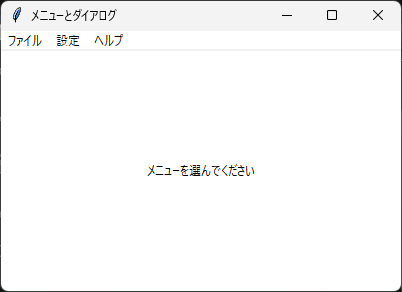
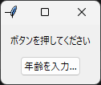

7. メニューとダイアログ
=======================

7.1 メニューバー
----------------

メニューバーは ``tk.Menu`` で作成します。ttk には Menu がないため、tk のものを使います。メニューバーを作る手順は次のとおりです。

#. ``tk.Menu(root)`` でメニューバーを作成し、``root.configure(menu=メニューバー)`` でウィンドウに設定します。
#. ``tk.Menu(メニューバー)`` で「ファイル」などのメニューを作成し、``add_cascade`` でメニューバーに追加します。
#. 各メニューに ``add_command`` などで項目を追加します。

メニューに項目を追加する主なメソッドを次に示します。

.. list-table::
   :header-rows: 1
   :widths: 35 65

   * - メソッド
     - 説明
   * - ``add_command``
     - 選ぶと ``command`` の関数を呼び出す項目を追加します。
   * - ``add_cascade``
     - ``menu`` に指定したメニューを開く項目（サブメニュー）を追加します。
   * - ``add_separator``
     - 項目を区切る線を追加します。
   * - ``add_checkbutton``
     - オンとオフを切り替える項目を追加します。``variable`` に変数クラスを指定します。
   * - ``add_radiobutton``
     - 複数の項目から 1 つを選ぶ項目を追加します。

項目の ``label`` には表示する文字列を、``accelerator`` にはショートカットキーの表記（``"Ctrl+S"`` など）を指定します。``accelerator`` は表示するだけなので、キーを押したときに処理を実行するには、別に ``bind`` が必要です。

Tk のメニューには、既定で先頭に点線の項目があり、これを選ぶとメニューを独立したウィンドウとして切り離せます。この機能は現在のアプリケーションではほとんど使われないため、``root.option_add("*tearOff", False)`` で無効にするのが一般的です。この設定は、メニューを作成する前に行います。

.. _context-menu:

7.2 コンテキストメニュー
------------------------

右クリックで表示するメニュー（コンテキストメニュー）も ``tk.Menu`` で作成します。メニューを表示するには、``tk_popup`` メソッドに画面上の座標を渡します。

.. code-block:: python

   def show_context_menu(event: tk.Event[tk.Misc]) -> None:
       context_menu.tk_popup(event.x_root, event.y_root)

   label.bind("<Button-3>", show_context_menu)

右クリックのイベントは、Windows と Linux では ``<Button-3>``、macOS では ``<Button-2>`` です。

7.3 messagebox
--------------

``tkinter.messagebox`` モジュールには、メッセージを表示したり、ユーザーに確認を求めたりするダイアログが用意されています。どの関数も、最初の引数にタイトル、2 番目の引数にメッセージを指定します。

.. list-table::
   :header-rows: 1
   :widths: 35 30 35

   * - 関数
     - 用途
     - 戻り値
   * - ``showinfo``
     - 情報の表示
     - ``"ok"``
   * - ``showwarning``
     - 警告の表示
     - ``"ok"``
   * - ``showerror``
     - エラーの表示
     - ``"ok"``
   * - ``askyesno``
     - 「はい」「いいえ」の確認
     - ``True`` または ``False``
   * - ``askokcancel``
     - 「OK」「キャンセル」の確認
     - ``True`` または ``False``
   * - ``askyesnocancel``
     - 「はい」「いいえ」「キャンセル」の確認
     - ``True``、``False``、``None``\ （キャンセル）
   * - ``askretrycancel``
     - 「再試行」「キャンセル」の確認
     - ``True`` または ``False``

7.4 filedialog
--------------

``tkinter.filedialog`` モジュールには、ファイルやフォルダーを選ぶダイアログが用意されています。

.. list-table::
   :header-rows: 1
   :widths: 35 30 35

   * - 関数
     - 用途
     - 戻り値
   * - ``askopenfilename``
     - 開くファイルを 1 つ選ぶ
     - パスの文字列
   * - ``askopenfilenames``
     - 開くファイルを複数選ぶ
     - パスの文字列のタプル
   * - ``asksaveasfilename``
     - 保存先のファイル名を指定する
     - パスの文字列
   * - ``askdirectory``
     - フォルダーを選ぶ
     - パスの文字列

キャンセルされた場合は、空文字列などの空の値が返ります（``askopenfilenames`` も、Windows では空のタプルではなく空文字列を返します）。そのため、``if not path:`` のように、値が空かどうかで判定してください。主な引数を次に示します。

.. list-table::
   :header-rows: 1
   :widths: 30 70

   * - 引数
     - 説明
   * - ``title``
     - ダイアログのタイトルです。
   * - ``filetypes``
     - 選択できるファイルの種類です。``[("テキストファイル", "*.txt"), ("すべてのファイル", "*.*")]`` のように、説明とパターンの組のリストで指定します。
   * - ``initialdir``
     - 最初に表示するフォルダーです。
   * - ``defaultextension``
     - ``asksaveasfilename`` で拡張子が省略されたときに付ける拡張子です（``".txt"`` など）。
   * - ``parent``
     - ダイアログの親ウィンドウです。

7.5 simpledialog と colorchooser
--------------------------------

``tkinter.simpledialog`` モジュールの ``askstring``、``askinteger``、``askfloat`` 関数は、1 つの値を入力するダイアログを表示し、入力された値を返します。キャンセルされた場合は ``None`` を返します。

``tkinter.colorchooser`` モジュールの ``askcolor`` 関数は、色を選ぶダイアログを表示します。戻り値は ``((赤, 緑, 青), "#rrggbb")`` の形式のタプルで、キャンセルされた場合は ``(None, None)`` です。

ここまでに説明したメニューとダイアログを使ったサンプルコードを次に示します。

.. literalinclude:: ../examples/ch07_menu_dialog.py
   :language: python
   :caption: ch07_menu_dialog.py
   :linenos:

:download:`ch07_menu_dialog.py をダウンロード <../examples/ch07_menu_dialog.py>`

   実行結果

``root.protocol("WM_DELETE_WINDOW", quit_app)`` は、タイトルバーの閉じるボタンが押されたときに呼び出す関数を設定します。これにより、閉じるボタンでもメニューの「終了」と同じ確認ダイアログが表示されます。

.. _modal-dialog:

7.6 Toplevel による独自ダイアログ
---------------------------------

標準のダイアログにない入力画面が必要な場合は、``tk.Toplevel`` で新しいウィンドウを作成し、独自のダイアログを作ります。ダイアログを閉じるまで元のウィンドウを操作できないようにしたダイアログを、モーダルダイアログと呼びます。モーダルダイアログは、次のメソッドを組み合わせて作ります。

.. list-table::
   :header-rows: 1
   :widths: 30 70

   * - メソッド
     - 説明
   * - ``transient(親ウィンドウ)``
     - ダイアログを親ウィンドウに従属させます。ダイアログは親ウィンドウの手前に表示され、タスクバーには表示されなくなります。
   * - ``grab_set()``
     - アプリケーションのマウスとキーボードの操作を、このウィンドウだけが受け付けるようにします。
   * - ``wait_window()``
     - ウィンドウが破棄されるまで待ちます。待っている間もイベントは処理されます。

.. literalinclude:: ../examples/ch07_custom_dialog.py
   :language: python
   :caption: ch07_custom_dialog.py
   :linenos:

:download:`ch07_custom_dialog.py をダウンロード <../examples/ch07_custom_dialog.py>`

   実行結果（メインウィンドウ）

``ask_age`` 関数は、``wait_window`` でダイアログが閉じられるまで待ってから、入力された値を返します。そのため、呼び出し側は標準のダイアログと同じように、戻り値を受け取るだけで結果を利用できます。
