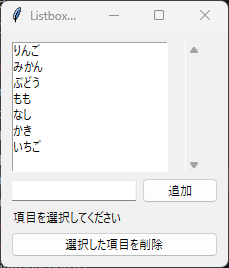
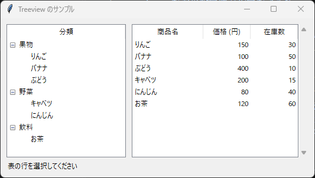
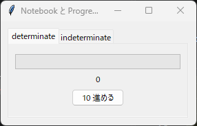
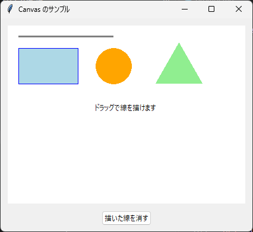

8. 応用ウィジェット
===================

8.1 Listbox と Scrollbar
------------------------

Listbox は、文字列の一覧を表示し、その中から項目を選ぶウィジェットです。ttk には Listbox がないため、tk のものを使います。主なメソッドを次に示します。

.. list-table::
   :header-rows: 1
   :widths: 35 65

   * - メソッド
     - 説明
   * - ``insert(位置, 項目)``
     - 指定した位置に項目を追加します。位置は 0 から数える整数か ``"end"`` で指定します。
   * - ``delete(開始, 終了)``
     - 項目を削除します。終了を省略すると 1 項目だけを削除します。Entry と異なり、終了位置の項目も削除されます。
   * - ``get(位置)``
     - 指定した位置の項目を返します。
   * - ``curselection()``
     - 選択されている項目の位置をタプルで返します。
   * - ``see(位置)``
     - 指定した項目が見えるようにスクロールします。

``selectmode`` オプションで選択の方法を指定できます。``"browse"``\ （既定値）と ``"single"`` は 1 項目だけ、``"multiple"`` はクリックした項目をすべて、``"extended"`` は Shift キーや Ctrl キーを使って複数の項目を選択できます。選択が変わると ``<<ListboxSelect>>`` イベントが発生します。

Scrollbar は、Listbox や Text の内容をスクロールするウィジェットです。Scrollbar と対象のウィジェットは、次のように互いを設定して連携させます。

.. code-block:: python

   scrollbar = ttk.Scrollbar(frame, orient="vertical", command=listbox.yview)
   listbox.configure(yscrollcommand=scrollbar.set)

``command=listbox.yview`` は、Scrollbar が操作されたときに Listbox をスクロールさせます。``yscrollcommand=scrollbar.set`` は、Listbox がスクロールしたときに Scrollbar のつまみの位置を更新します。横方向の場合は、``orient="horizontal"``、``xview``、``xscrollcommand`` を使います。

.. literalinclude:: ../examples/ch08_listbox.py
   :language: python
   :caption: ch08_listbox.py
   :linenos:

:download:`ch08_listbox.py をダウンロード <../examples/ch08_listbox.py>`

   実行結果

8.2 Treeview
------------

Treeview は、項目を木構造または表形式で表示するウィジェットです。Treeview の各行には、先頭の木構造の列（列名 ``"#0"``）と、``columns`` オプションで定義した列があります。主なメソッドを次に示します。

.. list-table::
   :header-rows: 1
   :widths: 40 60

   * - メソッド
     - 説明
   * - ``insert(親, 位置, text=..., values=...)``
     - 行を追加し、行の ID を返します。最上位の行を追加する場合、親には ``""`` を指定します。``text`` は ``"#0"`` 列の文字列、``values`` はそれ以外の列の値です。
   * - ``heading(列, text=...)``
     - 列の見出しを設定します。
   * - ``column(列, width=..., anchor=...)``
     - 列の幅や文字列の位置を設定します。
   * - ``selection()``
     - 選択されている行の ID をタプルで返します。
   * - ``set(行, 列)``
     - 指定した行と列の値を返します。
   * - ``item(行)``
     - 行の情報を辞書で返します。
   * - ``delete(行)``
     - 行を削除します。
   * - ``get_children(親)``
     - 子の行の ID をタプルで返します。

``show="headings"`` を指定すると ``"#0"`` 列が非表示になり、表として使えます。選択が変わると ``<<TreeviewSelect>>`` イベントが発生します。

.. literalinclude:: ../examples/ch08_treeview.py
   :language: python
   :caption: ch08_treeview.py
   :linenos:

:download:`ch08_treeview.py をダウンロード <../examples/ch08_treeview.py>`

   実行結果

8.3 Notebook
------------

Notebook は、タブで画面を切り替えるウィジェットです。各タブの内容は Frame などのウィジェットとして作成し、``add(ウィジェット, text="タブ名")`` で追加します。引数なしの ``select()`` は選択中のタブのウィジェット名（文字列）を返し、``index("current")`` は選択中のタブの番号を返します。タブが切り替わると ``<<NotebookTabChanged>>`` イベントが発生します。

8.4 Progressbar
---------------

Progressbar は、処理の進み具合を表示するウィジェットです。``mode`` オプションで次の 2 種類を選びます。

.. list-table::
   :header-rows: 1
   :widths: 25 75

   * - モード
     - 説明
   * - ``"determinate"``
     - 進み具合を 0 から ``maximum`` までの値で表示します（既定値）。値は ``value`` オプションか ``variable`` オプションの変数クラスで設定します。
   * - ``"indeterminate"``
     - 終わりが分からない処理の実行中であることを、往復するバーで表示します。``start(間隔)`` で動かし始め、``stop()`` で止めます。

次のサンプルコードは、Notebook の 2 つのタブに、それぞれのモードの Progressbar を配置します。

.. literalinclude:: ../examples/ch08_notebook_progressbar.py
   :language: python
   :caption: ch08_notebook_progressbar.py
   :linenos:

:download:`ch08_notebook_progressbar.py をダウンロード <../examples/ch08_notebook_progressbar.py>`

   実行結果

8.5 Canvas
----------

Canvas は、線や図形、文字列、画像を自由に描画するウィジェットです。座標は Canvas の左上を原点とし、x 座標は右方向、y 座標は下方向に増えます。図形を描画する主なメソッドを次に示します。

.. list-table::
   :header-rows: 1
   :widths: 45 55

   * - メソッド
     - 描画する図形
   * - ``create_line(x1, y1, x2, y2, ...)``
     - 指定した点を結ぶ線
   * - ``create_rectangle(x1, y1, x2, y2)``
     - 左上 (x1, y1) と右下 (x2, y2) を指定した四角形
   * - ``create_oval(x1, y1, x2, y2)``
     - 指定した四角形に内接する楕円
   * - ``create_polygon(x1, y1, x2, y2, ...)``
     - 指定した点を頂点とする多角形
   * - ``create_text(x, y, text=...)``
     - 指定した位置を中心とする文字列
   * - ``create_image(x, y, image=...)``
     - 指定した位置を中心とする画像

``create_oval`` で中心 :math:`(c_x, c_y)`、半径 :math:`r` の円を描くには、外接する正方形の左上と右下の座標を次のように計算して指定します。

.. math::

   (x_1, y_1) = (c_x - r,\ c_y - r), \qquad (x_2, y_2) = (c_x + r,\ c_y + r)

描画メソッドは、描画した図形の ID（整数）を返します。また、``tags`` オプションで図形に任意の名前（タグ）を付けられます。ID やタグを指定して、描画した後の図形を操作できます。

.. list-table::
   :header-rows: 1
   :widths: 40 60

   * - メソッド
     - 説明
   * - ``move(ID またはタグ, dx, dy)``
     - 図形を移動します。
   * - ``coords(ID, x1, y1, ...)``
     - 図形の座標を変更します。
   * - ``itemconfigure(ID またはタグ, ...)``
     - 色などのオプションを変更します。
   * - ``delete(ID またはタグ)``
     - 図形を削除します。``"all"`` を指定するとすべての図形を削除します。

次のサンプルコードは、基本的な図形を描画し、マウスのドラッグで線を描けるようにします。マウスで描いた線にはタグ ``"drawing"`` を付けているため、最初に描画した図形を残したまま、マウスで描いた線だけを削除できます。

.. literalinclude:: ../examples/ch08_canvas.py
   :language: python
   :caption: ch08_canvas.py
   :linenos:

:download:`ch08_canvas.py をダウンロード <../examples/ch08_canvas.py>`

   実行結果
