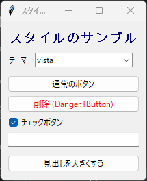

9. スタイルと外観
=================

.. _style-basics:

9.1 ttk.Style の基本
--------------------

ttk のウィジェットの色やフォントは、原則としてウィジェットごとのオプションではなく、``ttk.Style`` で定義するスタイルで指定します。ただし、``ttk.Label`` には例外的に ``font``、``foreground``、``background`` オプションがあり、直接指定することもできます。スタイルには名前があり、ウィジェットの種類ごとに既定のスタイル名が決まっています。

.. list-table::
   :header-rows: 1
   :widths: 40 60

   * - ウィジェット
     - 既定のスタイル名
   * - ``ttk.Button``
     - ``TButton``
   * - ``ttk.Label``
     - ``TLabel``
   * - ``ttk.Entry``
     - ``TEntry``
   * - ``ttk.Checkbutton``
     - ``TCheckbutton``
   * - ``ttk.Frame``
     - ``TFrame``
   * - ``ttk.Treeview``
     - ``Treeview``

ほかのウィジェットのスタイル名は、``widget.winfo_class()`` で確認できます。

スタイルの設定は ``configure`` メソッドで変更します。既定のスタイル名を指定すると、その種類のウィジェットすべての外観が変わります。

.. code-block:: python

   style = ttk.Style(root)
   style.configure("TButton", padding=6)  # すべての ttk.Button に適用

一部のウィジェットだけ外観を変えたい場合は、``"任意の名前.既定のスタイル名"`` の形式で独自のスタイルを定義し、ウィジェットの ``style`` オプションに指定します。独自のスタイルは、ドットの右側のスタイルの設定を引き継ぎます。

.. code-block:: python

   style.configure("Danger.TButton", foreground="red")
   ttk.Button(root, text="削除", style="Danger.TButton")

9.2 状態に応じた外観
--------------------

ttk のウィジェットは、``"active"``\ （マウスが乗っている）、``"pressed"``\ （押されている）、``"disabled"``\ （操作不可）、``"focus"``\ （フォーカスがある）などの状態を持ちます。状態に応じて外観を変えるには、``map`` メソッドを使います。

.. code-block:: python

   style.map("Danger.TButton", foreground=[("active", "darkred")])

オプションの値は、``(状態, 値)`` の組のリストで指定します。リストの先頭から順に調べ、最初に一致した組の値が使われます。状態の前に ``!`` を付けると、「その状態ではない」ことを表します。

ウィジェットの状態は、``state`` メソッドで変更できます。たとえば、``button.state(["disabled"])`` でボタンを操作不可にし、``button.state(["!disabled"])`` で操作可能に戻します。

.. _theme:

9.3 テーマの一覧と切り替え
--------------------------

ttk のウィジェットは、テーマに従って描画されます。利用できるテーマの一覧は ``theme_names()`` で取得し、``theme_use(テーマ名)`` で切り替えます。引数なしで ``theme_use()`` を呼び出すと、現在のテーマ名を返します。

.. list-table::
   :header-rows: 1
   :widths: 25 75

   * - OS
     - 主なテーマ
   * - Windows
     - ``vista``\ （既定値）、``xpnative``、``winnative``、``clam``、``alt``、``default``、``classic``
   * - macOS
     - ``aqua``\ （既定値）、``clam``、``alt``、``default``、``classic``
   * - Linux
     - ``default``\ （既定値）、``clam``、``alt``、``classic``

.. note::

   スタイルの設定は、そのとき使用しているテーマに対して行われます。テーマを切り替えると、``configure`` や ``map`` で設定した内容は反映されなくなるため、切り替えた後にもう一度設定してください。サンプルコードでは、``define_styles`` 関数をテーマの切り替えのたびに呼び出しています。

   ``vista`` や ``aqua`` などの OS 標準のテーマは、OS の機能でウィジェットを描画します。そのため、ボタンの背景色など、指定しても反映されないオプションがあります。色を自由に変えたい場合は、``clam`` テーマの使用を検討してください。

.. _font-color:

9.4 フォントと色
----------------

フォントは、``("ファミリー名", 大きさ, "スタイル")`` の形式のタプルで指定します。大きさはポイント単位で、スタイルには ``"bold"``、``"italic"``、``"underline"`` などを指定します。

.. code-block:: python

   ttk.Label(root, text="見出し", font=("Helvetica", 14, "bold"))

利用できるフォントのファミリー名は、``tkinter.font.families()`` で確認できます。ファミリー名のうち ``Courier``、``Times``、``Helvetica`` の 3 つは、どの OS でも Tk が適切なフォントに対応付けるため、OS に依存しないコードを書くときに便利です。

``tkinter.font.Font`` クラスを使うと、名前付きフォントを作成できます。名前付きフォントの設定を ``configure`` で変更すると、そのフォントを使っているすべてのウィジェットの表示が更新されます。また、Tk にはあらかじめ ``TkDefaultFont``\ （ウィジェットの標準）、``TkTextFont``\ （入力欄）、``TkFixedFont``\ （等幅）などの名前付きフォントが定義されています。

色は、``"red"`` や ``"navy"`` のような色の名前か、``"#rrggbb"`` の形式の 16 進数で指定します。

次のサンプルコードは、テーマの切り替え、独自スタイル、名前付きフォントを試します。

.. literalinclude:: ../examples/ch09_style.py
   :language: python
   :caption: ch09_style.py
   :linenos:

:download:`ch09_style.py をダウンロード <../examples/ch09_style.py>`

   実行結果
