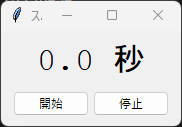
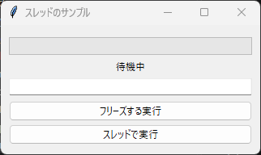

10. 時間のかかる処理
====================

10.1 GUI がフリーズする理由
---------------------------

:doc:`第 2 章 <02_first_window>`\ で説明したとおり、コールバック関数はイベントループの中で呼び出されます。コールバック関数の実行中、イベントループは画面の再描画やクリックなどのイベントを処理できません。そのため、コールバック関数の中で数秒かかる処理を実行すると、その間は画面が固まって操作を受け付けなくなります。Windows では、タイトルバーに「応答なし」と表示されることもあります。

この問題には、次の 2 つの方法で対処します。

* 処理を短い単位に分け、``after`` メソッドで少しずつ実行します。
* 処理を別のスレッドで実行します。

10.2 after による定期処理
-------------------------

``after(ミリ秒, 関数, *引数)`` は、指定した時間が経過した後に関数を 1 回呼び出すように予約します。予約した関数はイベントループの中で呼び出されるため、待っている間も画面は操作できます。

``after`` は予約の ID を返します。この ID を ``after_cancel`` に渡すと、予約を取り消せます。

関数の中で自分自身を再び ``after`` で予約すると、処理を一定間隔で繰り返せます。次のサンプルコードは、この方法で 0.1 秒ごとに表示を更新するストップウォッチです。

.. literalinclude:: ../examples/ch10_after.py
   :language: python
   :caption: ch10_after.py
   :linenos:

:download:`ch10_after.py をダウンロード <../examples/ch10_after.py>`

   実行結果

``after`` で指定した時間は、関数を呼び出すまでの最短の時間です。ほかの処理が実行中であれば、呼び出しは遅れます。そのため、このサンプルコードでは呼び出しの回数を数えるのではなく、``time.perf_counter`` で計測した実際の経過時間を表示しています。

.. _threading:

10.3 threading との併用
-----------------------

ファイルのダウンロードのように、短い単位に分けにくい処理は、``threading`` モジュールで別のスレッドを作成して実行します。このとき、次の規則を守る必要があります。

.. warning::

   ウィジェットや変数クラスの操作は、メインスレッド（``tk.Tk()`` を作成したスレッド）だけで行ってください。別のスレッドからウィジェットを操作すると、エラーが発生したり、アプリケーションが不安定になったりすることがあります。

別のスレッドの処理結果を画面に反映するには、次の手順を使います。

#. 別のスレッドは、結果や進捗を ``queue.Queue`` に入れます。
#. メインスレッドは、``after`` で定期的にキューを確認し、届いた値を画面に反映します。

次のサンプルコードでは、「フリーズする実行」ボタンと「スレッドで実行」ボタンで、同じ処理（合計 5 秒の待機）を実行します。前者では処理中に入力欄へ入力できず、画面の表示も更新されませんが、後者では処理中も操作でき、進捗も表示されます。

.. literalinclude:: ../examples/ch10_thread.py
   :language: python
   :caption: ch10_thread.py
   :linenos:

:download:`ch10_thread.py をダウンロード <../examples/ch10_thread.py>`

   実行結果

サンプルコードのポイントは次のとおりです。

* ``heavy_task`` 関数はウィジェットを操作せず、進捗をキューに入れるだけです。
* ``check_queue`` 関数は ``after`` から呼び出されるため、メインスレッドで実行されます。キューに届いた値をすべて取り出して Progressbar に反映し、スレッドが動いている間は自分自身を再び予約します。スレッドの生存確認をキューの取り出しより先に行うのは、最後の進捗を取りこぼさないためです。
* スレッドを ``daemon=True`` で作成しているため、処理の途中でウィンドウを閉じても、スレッドの終了を待たずにアプリケーションが終了します。
* 処理中は 2 つの実行ボタンを ``state(["disabled"])`` で操作不可にし、同じ処理が重複して実行されないようにしています。
* ``run_blocking`` 関数の ``update_idletasks`` は、保留中の再描画を実行するメソッドです。これを呼び出さないと、処理が終わるまで「実行中」という表示が画面に反映されません。

.. note::

   Python の標準的な実装（CPython）の通常のビルドでは、GIL（グローバルインタープリターロック）により、Python のコードを同時に実行できるスレッドは 1 つだけです。サンプルコードの ``time.sleep`` や、ファイルやネットワークの入出力を待つ処理はスレッドで効果を発揮します。一方、CPU で計算を続ける処理をスレッドで実行すると、画面の反応が遅くなることがあります。その場合は、``concurrent.futures.ProcessPoolExecutor`` などを使って、別のプロセスで計算を実行することを検討してください。
